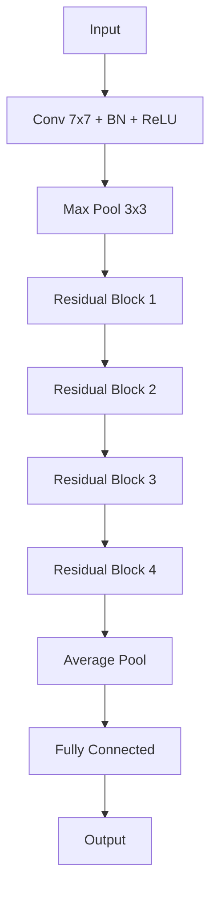

# ResNet原理与代码实例讲解

## 1. 背景介绍

### 1.1 深度学习的发展历程

深度学习作为人工智能的一个重要分支,在图像识别、自然语言处理等领域取得了突破性的进展。从早期的感知机,到 Yann LeCun 提出的卷积神经网络(CNN),再到 Hinton 等人提出的深度信念网络(DBN),深度学习的发展可谓是日新月异。

### 1.2 深度神经网络面临的挑战

然而,随着网络层数的加深,深度神经网络面临着一些严峻的挑战:

- 梯度消失/爆炸问题:当网络层数过深时,反向传播过程中的梯度容易出现指数级衰减或爆炸,导致网络难以训练。

- 退化问题:理论上,网络层数越深,模型的表达能力越强。但实践中发现,当层数超过一定程度后,网络性能反而会下降。

为了解决这些问题,何恺明等人在2015年提出了深度残差网络(Deep Residual Network,ResNet)。ResNet 通过引入"短路连接"(shortcut connection)的思想,极大地加深了网络的深度,并在 ImageNet 大规模图像识别比赛中取得了冠军,引发了学术界和工业界的广泛关注。

## 2. 核心概念与联系

### 2.1 残差学习(Residual Learning)

ResNet 的核心思想是引入残差学习。对于某一层网络,不再直接学习到底层特征的映射,而是学习残差函数:
$$F(x) := H(x) - x$$

其中 $x$ 是该层的输入, $H(x)$ 是期望学习到的底层特征映射。通过学习残差函数 $F(x)$,再加上输入 $x$,即可得到期望的特征。

### 2.2 恒等映射(Identity Mapping)

对于两个相邻的残差块,如果它们的维度一致,可以直接用恒等映射连接:
$$y = F(x) + x$$

恒等映射不引入额外的参数,也不增加计算复杂度,却能有效地传递梯度,缓解梯度消失问题。

### 2.3 Bottleneck 设计

对于维度不一致的残差块,ResNet 引入了 Bottleneck 设计:先用 $1\times 1$ 卷积核降维,再用 $3\times 3$ 卷积进行特征提取,最后再用 $1\times 1$ 卷积升维。这种设计可以减少参数量和计算量,同时提高网络的表示能力。

下图展示了 ResNet 的基本结构:



## 3. 核心算法原理具体操作步骤

### 3.1 前向传播

对于一个残差块,前向传播过程可以表示为:
$$y_l = h(x_l) + \mathcal{F}(x_l, \mathcal{W}_l)$$

其中 $x_l$ 和 $y_l$ 分别是第 $l$ 个残差块的输入和输出, $\mathcal{F}$ 是残差函数, $\mathcal{W}_l$ 是该残差块的权重参数, $h(x_l)$ 是恒等映射(如果输入输出维度一致)或线性投影(如果维度不一致)。

前向传播时,数据依次通过所有残差块,最后经过全局平均池化和全连接层,得到输出。

### 3.2 反向传播

反向传播时,梯度可以直接通过恒等映射(或线性投影)传递到上一层,避免了梯度消失问题。对于第 $l$ 个残差块,反向传播公式为:
$$\frac{\partial \mathcal{L}}{\partial x_l} = \frac{\partial \mathcal{L}}{\partial y_l} \cdot (1 + \frac{\partial}{\partial x_l}\mathcal{F}(x_l, \mathcal{W}_l))$$

其中 $\mathcal{L}$ 是损失函数。可以看到,即使 $\frac{\partial}{\partial x_l}\mathcal{F}(x_l, \mathcal{W}_l)$ 非常小,也能通过恒等映射将梯度传递下去。

## 4. 数学模型和公式详细讲解举例说明

### 4.1 残差函数的数学表示

对于第 $l$ 个残差块,残差函数 $\mathcal{F}$ 可以表示为:
$$\mathcal{F}(x_l, \mathcal{W}_l) = W_{l,2} \sigma(W_{l,1} x_l)$$

其中 $\sigma$ 是 ReLU 激活函数, $W_{l,1}$ 和 $W_{l,2}$ 是该残差块的两个权重矩阵。

以一个两层的残差块为例,输入为 $x$,经过两个 $3\times 3$ 卷积层(带 BN 和 ReLU)后的输出为 $\mathcal{F}(x)$,再加上输入 $x$,得到残差块的输出 $y$:

$$\mathcal{F}(x) = W_2 \sigma(BN(W_1 \sigma(BN(x))))$$
$$y = \mathcal{F}(x) + x$$

其中 $BN$ 表示批量归一化(Batch Normalization)。

### 4.2 恒等映射与线性投影

当残差块的输入输出维度一致时,可以直接用恒等映射:
$$y = \mathcal{F}(x) + x$$

当维度不一致时(例如通道数发生变化),需要引入一个线性投影矩阵 $W_s$ 进行维度匹配:
$$y = \mathcal{F}(x) + W_s x$$

$W_s$ 通常是一个 $1\times 1$ 卷积层。

## 5. 项目实践:代码实例和详细解释说明

下面是用 PyTorch 实现 ResNet-18 的示例代码:

```python
import torch
import torch.nn as nn

class BasicBlock(nn.Module):
    def __init__(self, in_channels, out_channels, stride=1):
        super(BasicBlock, self).__init__()
        self.conv1 = nn.Conv2d(in_channels, out_channels, kernel_size=3, stride=stride, padding=1, bias=False)
        self.bn1 = nn.BatchNorm2d(out_channels)
        self.relu = nn.ReLU(inplace=True)
        self.conv2 = nn.Conv2d(out_channels, out_channels, kernel_size=3, stride=1, padding=1, bias=False)
        self.bn2 = nn.BatchNorm2d(out_channels)
        
        # 当输入输出维度不一致时,引入线性投影
        if stride != 1 or in_channels != out_channels:
            self.shortcut = nn.Sequential(
                nn.Conv2d(in_channels, out_channels, kernel_size=1, stride=stride, bias=False),
                nn.BatchNorm2d(out_channels)
            )
        else:
            self.shortcut = nn.Identity()

    def forward(self, x):
        out = self.relu(self.bn1(self.conv1(x)))
        out = self.bn2(self.conv2(out))
        out += self.shortcut(x)
        out = self.relu(out)
        return out

class ResNet18(nn.Module):
    def __init__(self, num_classes=10):
        super(ResNet18, self).__init__()
        self.in_channels = 64
        
        self.conv1 = nn.Conv2d(3, 64, kernel_size=7, stride=2, padding=3, bias=False)
        self.bn1 = nn.BatchNorm2d(64)
        self.relu = nn.ReLU(inplace=True)
        self.maxpool = nn.MaxPool2d(kernel_size=3, stride=2, padding=1)

        self.layer1 = self._make_layer(BasicBlock, 64, 2, stride=1)
        self.layer2 = self._make_layer(BasicBlock, 128, 2, stride=2)
        self.layer3 = self._make_layer(BasicBlock, 256, 2, stride=2)
        self.layer4 = self._make_layer(BasicBlock, 512, 2, stride=2)

        self.avgpool = nn.AdaptiveAvgPool2d((1, 1))
        self.fc = nn.Linear(512, num_classes)

    def _make_layer(self, block, out_channels, num_blocks, stride):
        strides = [stride] + [1] * (num_blocks - 1)
        layers = []
        for stride in strides:
            layers.append(block(self.in_channels, out_channels, stride))
            self.in_channels = out_channels
        return nn.Sequential(*layers)

    def forward(self, x):
        out = self.conv1(x)
        out = self.bn1(out)
        out = self.relu(out)
        out = self.maxpool(out)

        out = self.layer1(out)
        out = self.layer2(out)
        out = self.layer3(out)
        out = self.layer4(out)

        out = self.avgpool(out)
        out = torch.flatten(out, 1)
        out = self.fc(out)

        return out
```

这段代码定义了两个类: `BasicBlock` 和 `ResNet18`。

`BasicBlock` 实现了一个两层的残差块,包括两个 $3\times 3$ 卷积层(带 BN 和 ReLU)。当输入输出维度不一致时,引入一个 $1\times 1$ 卷积层进行线性投影。`forward` 函数定义了前向传播过程。

`ResNet18` 实现了完整的 18 层残差网络。它包含一个 $7\times 7$ 卷积层,一个最大池化层,然后是 4 个残差块(每个包含两个 BasicBlock)。网络的最后是一个全局平均池化层和一个全连接层。`_make_layer` 函数用于创建指定数量的残差块。

可以看到,代码结构简洁明了,完整地实现了 ResNet 的核心思想。

## 6. 实际应用场景

ResNet 及其变体在计算机视觉领域有广泛的应用,例如:

- 图像分类:ResNet 系列模型是图像分类任务的常用 backbone 网络,在 ImageNet、CIFAR 等数据集上取得了 SOTA 的结果。

- 目标检测:以 ResNet 为 backbone,结合 FPN、Faster R-CNN 等检测头,可以构建高精度的目标检测模型,如 Mask R-CNN。

- 语义分割:ResNet 也常用于语义分割任务,与 FCN、U-Net 等分割头结合,可以实现像素级别的分类。

- 人脸识别:DeepFace、FaceNet 等著名的人脸识别模型都采用了 ResNet 作为特征提取器。

除了视觉领域,ResNet 还被用于语音识别、自然语言处理等领域,展现出了卓越的特征提取能力和泛化能力。

## 7. 工具和资源推荐

- PyTorch:一个流行的深度学习框架,提供了 ResNet 的官方实现和预训练模型。官网:https://pytorch.org/

- TensorFlow:另一个主流的深度学习框架,也提供了 ResNet 的实现和预训练模型。官网:https://www.tensorflow.org/

- Keras:一个高层次的神经网络 API,内置了 ResNet 等常用模型。官网:https://keras.io/

- 论文原文:《Deep Residual Learning for Image Recognition》,可在 arXiv 上免费获取。链接:https://arxiv.org/abs/1512.03385

- GitHub 仓库:何恺明在 GitHub 上公开了 ResNet 的官方实现,包括论文中的所有模型。仓库地址:https://github.com/KaimingHe/deep-residual-networks

这些资源可以帮助读者更深入地理解 ResNet,并在实践中应用这一强大的网络架构。

## 8. 总结:未来发展趋势与挑战

ResNet 的提出开启了"更深的网络"的新纪元,极大地推动了深度学习的发展。此后,研究者们在 ResNet 的基础上提出了许多改进和变体,如 Wide-ResNet、ResNeXt、DenseNet 等,进一步提升了网络性能。

然而,超深网络也面临着一些挑战:

- 计算效率:更深的网络意味着更大的计算量和内存消耗,如何在保证性能的同时提高效率,是一个值得研究的问题。

- 小样本学习:当训练数据有限时,超深网络容易过拟合。如何利用深度网络在小样本场景下学习,是另一个挑战。

- 可解释性:深度网络是一个"黑盒子",其决策过程难以解释。提高网络的可解释性,对于一些关键领域(如医疗诊断