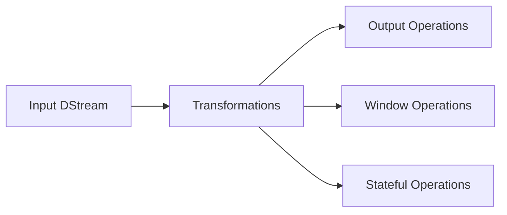

# Spark Streaming实时流处理原理与代码实例讲解

## 1. 背景介绍
### 1.1 实时流处理的重要性
在当今大数据时代,海量数据以流的形式不断产生,如何对这些实时数据进行有效处理和分析,已成为企业面临的重大挑战。实时流处理技术应运而生,它能够对源源不断的数据流进行实时计算,并及时生成结果,为企业提供实时的数据洞察和决策支持。

### 1.2 Spark Streaming概述
Spark Streaming是Apache Spark生态系统中的一个重要组件,是一个可扩展、高吞吐、高容错的实时流处理框架。它基于Spark Core构建,继承了Spark的优秀特性,如RDD(弹性分布式数据集)、DAG(有向无环图)等,同时针对流处理场景做了特定优化。Spark Streaming支持多种数据源,如Kafka、Flume、HDFS等,能够实现毫秒级的流处理延迟。

### 1.3 Spark Streaming的优势
相比Storm、Flink等其他流处理框架,Spark Streaming具有如下优势:

1. 易用性:Spark Streaming API简洁易懂,开发者可以快速上手;
2. 通用性:Spark生态系统完善,Streaming可与其他Spark组件(如SQL、MLlib等)无缝集成;
3. 容错性:基于RDD的数据不变性和Lineage机制,Streaming具有高容错性;
4. 扩展性:得益于Spark优秀的分布式计算能力,Streaming可实现水平扩展。

## 2. 核心概念与联系
### 2.1 DStream
DStream(Discretized Stream)是Spark Streaming的核心抽象,代表一个连续的数据流。在内部实现上,DStream是一系列连续的RDD,每个RDD包含一个时间间隔内的数据。DStream上的操作转化为对底层RDD的操作。

### 2.2 输入DStream与Receiver
输入DStream代表从数据源(如Kafka)接收的输入数据流。系统会创建一个Receiver(接收器)对象,运行在Executor上,负责不断接收数据并封装成DStream。

### 2.3 转换操作
DStream支持多种转换操作,如map、flatMap、filter、reduceByKey等,用于对DStream中的数据进行处理。这些操作生成新的DStream。转换操作是lazy的,只有遇到输出操作才会触发真正的计算。

### 2.4 输出操作  
输出操作定义了对转换后的数据的处理方式,如foreachRDD把结果数据写入外部存储系统。输出操作触发作业的提交和执行。

### 2.5 窗口操作
窗口操作允许在一个滑动窗口上应用转换操作。窗口由两个参数定义:窗口时长(window length)和滑动步长(sliding interval)。窗口操作让我们能够在数据流上执行一些全局的聚合操作。

### 2.6 状态管理
Spark Streaming支持带状态的计算,即当前计算依赖之前批次的结果。updateStateByKey和mapWithState算子允许在DStream上进行状态维护。

下图展示了Spark Streaming的核心概念及其关系:



## 3. 核心算法原理具体操作步骤
### 3.1 DStream生成
1. 从数据源接收数据,封装成RDD;
2. 设定批次间隔,将RDD划分到不同批次;
3. 由一系列时间连续的RDD组成DStream。

### 3.2 DStream转换
1. DStream上调用转换算子(如map);
2. 对DStream中的每个RDD应用转换逻辑;
3. 转换后的RDD构成新的DStream。

### 3.3 输出操作执行
1. DStream上调用输出算子(如foreachRDD);
2. 输出逻辑应用到每个RDD上;
3. 触发作业的提交和执行。

### 3.4 窗口操作处理
1. 定义窗口长度和滑动步长;
2. 根据窗口参数,将多个RDD合并处理;
3. 窗口滑动,生成新的RDD和DStream。

### 3.5 状态更新
1. 定义状态更新函数;
2. 在DStream上应用updateStateByKey或mapWithState;
3. 结合当前批次数据和历史状态,生成新的状态。

## 4. 数学模型和公式详细讲解举例说明
### 4.1 滑动窗口模型
Spark Streaming的滑动窗口可用数学公式表示如下:

设窗口长度为$L$,滑动步长为$S$,当前时间为$T$,则当前窗口$W$包含的时间区间为:

$$W = [T-L, T)$$

即当前窗口包含$[T-L, T)$内的所有RDD。

举例说明:假设DStream的批次间隔为1秒,设置窗口长度为3秒,滑动步长为2秒,则每个窗口包含3个RDD,每2秒滑动一次,生成新的窗口。

```
|-----|-----|-----|-----|-----|-----|
0     1     2     3     4     5     6 (seconds)
|  Window 1   |
        |  Window 2   |
                |  Window 3   |
```

### 4.2 状态更新模型
状态更新可抽象为如下数学模型:

设当前批次的RDD为$R_t$,历史状态为$S_{t-1}$,状态更新函数为$f$,则新的状态$S_t$为:

$$S_t = f(R_t, S_{t-1})$$

即新状态由当前数据和历史状态经过更新函数计算得到。

举例说明:假设要统计每个单词的累积出现次数,状态更新函数$f$可定义为:

$$f(R_t, S_{t-1}) = S_{t-1} + \sum_{word \in R_t} count(word)$$

即将当前批次每个单词的出现次数累加到历史状态上,得到新的状态。

## 5. 项目实践:代码实例和详细解释说明
下面通过一个实际的代码示例,演示如何使用Spark Streaming处理Kafka数据流,并进行词频统计。

```scala
import org.apache.spark._
import org.apache.spark.streaming._
import org.apache.spark.streaming.kafka010._
import org.apache.kafka.common.serialization.StringDeserializer

object KafkaWordCount {
  def main(args: Array[String]): Unit = {
    // 创建SparkConf和StreamingContext
    val sparkConf = new SparkConf().setAppName("KafkaWordCount")
    val ssc = new StreamingContext(sparkConf, Seconds(5))
    
    // Kafka配置参数
    val kafkaParams = Map[String, Object](
      "bootstrap.servers" -> "localhost:9092",
      "key.deserializer" -> classOf[StringDeserializer],
      "value.deserializer" -> classOf[StringDeserializer],
      "group.id" -> "wordcount-group",
      "auto.offset.reset" -> "latest",
      "enable.auto.commit" -> (false: java.lang.Boolean)
    )
    
    // 订阅Kafka主题
    val topics = Array("wordcount-topic")
    val stream = KafkaUtils.createDirectStream[String, String](
      ssc,
      LocationStrategies.PreferConsistent,
      ConsumerStrategies.Subscribe[String, String](topics, kafkaParams)
    )
    
    // 处理数据流
    val wordCounts = stream.map(record => (record.value, 1))
                           .reduceByKey(_ + _)
    
    // 打印结果
    wordCounts.print()
    
    // 启动流计算
    ssc.start()
    ssc.awaitTermination()
  }
}
```

代码说明:

1. 首先创建SparkConf和StreamingContext,设置批次间隔为5秒。
2. 配置Kafka参数,包括broker地址、key和value的反序列化器、消费者组id等。
3. 使用KafkaUtils.createDirectStream创建输入DStream,订阅Kafka主题。
4. 对DStream进行词频统计,先map成(word, 1)的形式,再按单词reduceByKey。
5. 使用print()输出结果。
6. 启动StreamingContext,开始流计算。

运行该程序,可实时统计Kafka主题中数据的单词频率。

## 6. 实际应用场景
Spark Streaming在多个领域有广泛应用,例如:

1. 实时日志分析:对服务器日志、点击流日志等进行实时分析,监控异常行为、统计访问指标等。
2. 实时推荐系统:根据用户的实时行为数据,动态调整推荐结果。
3. 实时欺诈检测:对交易数据流进行实时分析,识别异常交易模式,防范欺诈行为。
4. 物联网数据处理:对传感器产生的海量数据进行实时处理,实现设备监控和预警。

## 7. 工具和资源推荐
1. 官方文档:Spark Streaming Programming Guide是学习和使用Spark Streaming的权威指南。
2. 书籍:《Spark: The Definitive Guide》、《Learning Spark, 2nd Edition》等经典书籍对Spark Streaming有深入讲解。
3. 视频教程:Coursera上的Spark专项课程包含Spark Streaming内容,生动直观。
4. GitHub项目:Spark官方Examples中包含多个Streaming示例,可作为学习参考。

## 8. 总结:未来发展趋势与挑战
Spark Streaming作为流处理领域的重要框架,未来仍有较大发展空间:

1. 与Structured Streaming的融合将进一步加强,API和性能会持续优化。
2. 基于Kubernetes的部署将成为主流,原生支持云环境。
3. 状态管理的易用性和扩展性将不断提升,支持更复杂的有状态计算。

同时,Spark Streaming也面临一些挑战:

1. 流批一体化:如何实现流处理与批处理的无缝统一,简化开发和运维。
2. 低延迟优化:在保证吞吐量的同时,如何进一步降低处理延迟。
3. SQL支持:如何引入更完善的SQL支持,提升使用便捷性。

## 9. 附录:常见问题与解答
Q:Spark Streaming与Structured Streaming的区别是什么?
A:Structured Streaming是Spark新的流处理引擎,基于DataFrame/Dataset API构建,与Spark SQL深度集成。相比Streaming,它支持事件时间、端到端exactly-once保证等,API更加友好,是未来的发展方向。但Streaming仍有其稳定性和生态优势。

Q:Spark Streaming可以实现毫秒级延迟吗?
A:Spark Streaming的延迟与批次间隔有关,若要实现毫秒级延迟,需设置很小的批次间隔,可能影响吞吐量。Spark提供了Continuous Processing模式,可实现毫秒级延迟,但仍在实验阶段。低延迟流处理可考虑Flink等专门的流处理引擎。

Q:Spark Streaming如何保证exactly-once语义?
A:Spark Streaming与WAL(预写日志)集成,可实现端到端exactly-once。数据从源头开始被多次复制持久化,Streaming只有在处理成功后才更新偏移量,保证数据不丢不重。但引入WAL会带来一定性能开销。

作者:禅与计算机程序设计艺术 / Zen and the Art of Computer Programming