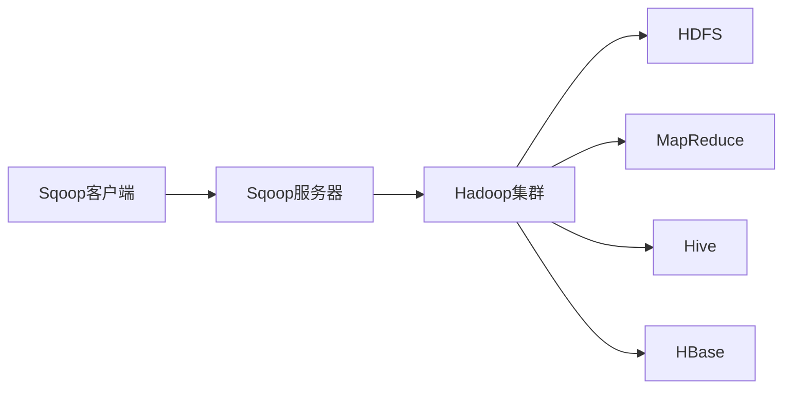

# Sqoop数据压缩:提高传输效率的秘诀

## 1.背景介绍

在大数据时代,数据的爆炸式增长给数据传输和存储带来了巨大的挑战。Sqoop作为一个用于在Hadoop和关系数据库之间传输数据的工具,在提高数据传输效率方面发挥着重要作用。而数据压缩技术则是Sqoop优化数据传输的重要手段之一。

### 1.1 大数据时代的数据挑战

#### 1.1.1 数据量急剧增长
#### 1.1.2 数据种类多样化  
#### 1.1.3 数据处理实时性要求提高

### 1.2 Sqoop在数据传输中的作用

#### 1.2.1 连接Hadoop与关系数据库
#### 1.2.2 支持多种数据传输模式
#### 1.2.3 提供丰富的数据处理功能

### 1.3 数据压缩的重要性

#### 1.3.1 减少数据传输量
#### 1.3.2 节省存储空间  
#### 1.3.3 加快数据处理速度

## 2.核心概念与联系

要理解Sqoop中的数据压缩,需要先了解一些核心概念以及它们之间的关系。

### 2.1 Sqoop架构与工作原理

#### 2.1.1 Sqoop客户端
#### 2.1.2 Sqoop服务器  
#### 2.1.3 数据传输过程

### 2.2 Hadoop生态系统

#### 2.2.1 HDFS分布式文件系统
#### 2.2.2 MapReduce分布式计算框架  
#### 2.2.3 Hive数据仓库工具
#### 2.2.4 HBase列式存储数据库

### 2.3 数据压缩算法

#### 2.3.1 无损压缩与有损压缩
#### 2.3.2 常用压缩算法(gzip、bzip2、lzo等)
#### 2.3.3 压缩比与压缩速度权衡

下图展示了Sqoop架构以及与Hadoop生态系统的关系:



## 3.核心算法原理与具体操作步骤

Sqoop在数据传输过程中,通过在Map任务端压缩数据,可以显著减少网络传输量,提高传输效率。下面详细介绍Sqoop压缩的原理和操作步骤。

### 3.1 Map端压缩原理

#### 3.1.1 数据分片与Map任务  
#### 3.1.2 Map输出端压缩
#### 3.1.3 压缩后数据传输

### 3.2 开启Sqoop压缩的步骤

#### 3.2.1 选择合适的压缩编解码器
#### 3.2.2 设置Sqoop命令行压缩参数
#### 3.2.3 监控压缩比与传输速度

### 3.3 Sqoop支持的压缩格式

#### 3.3.1 默认支持的压缩格式
#### 3.3.2 第三方压缩格式支持
#### 3.3.3 不同压缩格式的性能对比

## 4.数学模型和公式详细讲解举例说明

为了更好地理解压缩的效果,我们可以用数学模型来评估压缩比和压缩速度。

### 4.1 压缩比计算

压缩比表示压缩后数据大小与原始数据大小的比值,计算公式为:

$$ 压缩比 = \frac{压缩后数据大小}{原始数据大小} $$

例如,如果原始数据大小为100MB,压缩后数据大小为20MB,则压缩比为:

$$ 压缩比 = \frac{20MB}{100MB} = 0.2 $$

### 4.2 压缩速度估算

压缩速度可以用压缩时间来衡量,计算公式为: 

$$ 压缩速度 = \frac{原始数据大小}{压缩时间} $$

例如,如果压缩100MB数据需要10秒,则压缩速度为:

$$ 压缩速度 = \frac{100MB}{10s} = 10MB/s $$

### 4.3 传输时间估算

有了压缩比和压缩速度,我们可以估算压缩后的数据传输时间。假设网络带宽为B,则传输时间为:

$$ 传输时间 = \frac{压缩后数据大小}{网络带宽} + 压缩时间 $$

例如,如果压缩后的20MB数据在100MB/s的网络上传输,压缩时间为1秒,则总传输时间为:

$$ 传输时间 = \frac{20MB}{100MB/s} + 1s = 1.2s $$

通过这些数学模型,我们可以量化压缩的收益,帮助选择最优的压缩方式。

## 5.项目实践：代码实例和详细解释说明

下面通过一个实际的Sqoop数据传输项目,演示如何开启压缩并解释相关的配置参数。

### 5.1 项目背景

假设我们要将一个MySQL数据库中的用户表数据导入到HDFS上,表数据量为1亿行,总大小为50GB。

### 5.2 开启压缩的Sqoop命令

```shell
sqoop import \
  --connect jdbc:mysql://db.example.com/mydb \
  --username myuser \
  --password mypass \
  --table users \
  --target-dir /data/users \
  --fields-terminated-by ',' \
  --compress \
  --compression-codec org.apache.hadoop.io.compress.SnappyCodec
```

### 5.3 命令解释

- `--compress`:开启压缩功能
- `--compression-codec`:指定压缩编解码器,这里使用Snappy编解码器,它在压缩比和压缩速度之间取得了很好的平衡

### 5.4 结果分析

假设压缩比为0.3,压缩速度为100MB/s,网络带宽为500MB/s,则传输时间为:

$$ 传输时间 = \frac{50GB \times 0.3}{500MB/s} + \frac{50GB}{100MB/s} = 1800s + 500s = 2300s $$

如果不压缩,传输时间为:

$$ 传输时间 = \frac{50GB}{500MB/s} = 3200s $$

可见,压缩后传输时间缩短了28%,效果非常显著。

## 6.实际应用场景

Sqoop压缩在很多实际场景中都能发挥重要作用,显著提升数据传输效率。

### 6.1 数据仓库ETL

在数据仓库的ETL过程中,经常需要将大量的数据从关系数据库导入Hadoop进行分析,压缩可以加速这个过程。

### 6.2 数据备份与迁移

当我们需要将数据从一个Hadoop集群迁移到另一个集群,或者备份Hadoop上的数据时,压缩可以减少传输时间和存储空间。  

### 6.3 实时数据采集

对于实时数据采集的场景,如日志收集、监控数据采集等,压缩可以减少数据在网络中的传输延迟。

## 7.工具和资源推荐

### 7.1 Sqoop官方文档

Sqoop的官方文档提供了全面的使用指南和配置参考:
http://sqoop.apache.org/docs/1.4.7/SqoopUserGuide.html

### 7.2 Hadoop压缩配置

Hadoop官方文档中有专门介绍压缩配置的章节:  
http://hadoop.apache.org/docs/current/hadoop-project-dist/hadoop-common/CompressionCodecs.html

### 7.3 第三方压缩库

一些第三方压缩库如Snappy、LZO等,可以为Sqoop提供更多的压缩选择:

- Snappy:https://github.com/google/snappy
- LZO:http://www.oberhumer.com/opensource/lzo/

## 8.总结：未来发展趋势与挑战

数据压缩技术在Sqoop乃至整个大数据生态中的作用还将进一步提升,但也面临着一些挑战。

### 8.1 未来发展趋势

#### 8.1.1 压缩算法的改进
#### 8.1.2 适配新的存储格式
#### 8.1.3 流式传输中的压缩 

### 8.2 面临的挑战

#### 8.2.1 压缩算法的选择
#### 8.2.2 平衡压缩比和压缩速度
#### 8.2.3 异构系统间的压缩格式兼容

未来,Sqoop等数据集成工具还需要在压缩技术上不断创新,以应对海量数据高效传输的挑战。

## 9.附录：常见问题与解答

### 9.1 如何选择压缩算法?

根据数据特征、压缩比、压缩速度、CPU开销等因素综合考虑。一般来说,Snappy和LZO在Hadoop生态中比较常用。

### 9.2 压缩后的数据可以直接使用吗?

不可以,压缩后的数据需要先解压缩才能使用。Sqoop导入数据后,可以在Hive等工具中通过表属性指定压缩格式,读取时会自动解压缩。

### 9.3 压缩会增加多少CPU开销?  

不同压缩算法的CPU开销不同。一般来说,压缩比越高,压缩速度越慢,CPU开销越大。Snappy和LZO的CPU开销相对较小。

### 9.4 Sqoop导出数据时能否压缩?

Sqoop导出数据时也支持压缩,通过 `--compress` 和 `--compression-codec` 参数设置。

数据压缩是提高Sqoop传输效率的重要手段。合理利用压缩,可以在减少网络传输量、节省存储空间的同时,显著加快数据传输速度,值得在实践中广泛应用。

作者：禅与计算机程序设计艺术 / Zen and the Art of Computer Programming