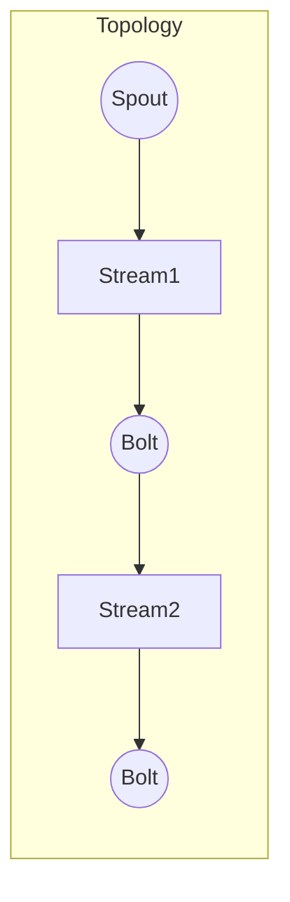

# Storm原理与代码实例讲解

## 1.背景介绍

### 1.1 什么是Storm

Storm是一个免费开源的分布式实时计算系统,最初由Nathan Marz和团队在Backtype公司开发,后被Twitter收购并开源。Storm可以实时处理大量的数据流,广泛应用于实时分析、在线机器学习、持续计算、分布式RPC、ETL等领域。

### 1.2 Storm的设计目标

Storm的设计目标是作为一个分布式的、高容错的实时计算系统,具有以下特点:

- 高吞吐量
- 低延迟
- 可水平扩展
- 高容错性
- 容易操作和编程

### 1.3 Storm与Hadoop对比

Storm与Hadoop都是大数据处理框架,但有明显区别:

- Hadoop是批处理系统,Storm是流式处理系统
- Hadoop面向离线数据分析,Storm面向实时数据分析
- Hadoop任务周期较长,Storm任务持续运行
- Hadoop擅长处理TB级以上海量数据,Storm擅长处理高速数据流

## 2.核心概念与联系

### 2.1 核心概念

Storm中有几个核心概念:

#### 2.1.1 Topology

Topology是Storm中最基本的概念,代表了一个完整的计算流程。一个Topology包含Spout和Bolt两种组件,组织成有向无环图(DAG)的拓扑结构。

#### 2.1.2 Spout

Spout是数据源,从外部系统(如Kafka、HDFS等)读取数据流,并发射给下游的Bolt。Spout是实时计算的起点。

#### 2.1.3 Bolt

Bolt用于数据处理,接收Spout或上游Bolt发射的数据流,执行计算操作(过滤、函数操作、联结查询等),并将结果发射给下游的Bolt。Bolt是实时计算的核心。

#### 2.1.4 Task

Task是Spout或Bolt的实例,是实际执行计算的工作单元。一个Spout/Bolt可以有多个Task实例运行在集群的不同工作节点上。

#### 2.1.5 Worker

Worker是Storm中的工作进程,执行一部分Task任务。一个Worker进程会启动一些Executor线程,每个Executor线程又会启动一些Task线程。

#### 2.1.6 Stream

Stream是Spout或Bolt发射出的数据流,由无穷无尽的Tuple组成。一个Stream可以根据分组策略(如Fields分组)分发给下游的多个Task。

#### 2.1.7 Tuple

Tuple是Storm中数据的基本传输单元,类似于数据库中的一行记录。Tuple由多个Key-Value对组成,可以是对象或原始值。

### 2.2 核心组件关系

Storm核心组件的关系如下Mermaid流程图所示:



- Topology包含Spout和Bolt
- Spout生成Stream1
- Stream1被Bolt1消费并处理
- Bolt1生成Stream2 
- Stream2被Bolt2消费并处理

## 3.核心算法原理具体操作步骤  

### 3.1 数据流分组策略

Storm支持多种数据流分组策略,用于将一个Stream分发给下游多个Task:

1. **Shuffle分组**: 随机分发Tuple到下游Task
2. **Fields分组**: 根据Tuple中的某些Field值分发到相同Task
3. **All分组**: 广播,将每个Tuple复制分发给所有下游Task
4. **Global分组**: 将同一个Stream中的所有Tuple分发给同一个Task
5. **Direct分组**: 根据直接编码将Tuple分发给任意Task
6. **Local或Shuffle分组**: 优先分发给同一个Worker进程内的任务,如果没有则随机分发

### 3.2 可靠性机制

Storm采用至少一次处理语义,保证数据不会丢失,具体做法:

1. **消息跟踪**: 给每个Tuple分配唯一的ID,跟踪其处理情况
2. **主动确认**: Spout会重发未被Bolt确认的Tuple
3. **工作进程主备**: 每个Worker都有一个备份进程,确保失败时快速恢复
4. **重放缓冲区**: 在Spout和Bolt内部维护一个重放缓冲区,用于失败重启时重播数据

### 3.3 故障恢复机制

当发生故障(如Worker进程崩溃)时,Storm会自动完成故障恢复:

1. **Worker进程监控**: Supervisor进程会监控每个Worker,一旦发现失败会重启
2. **重新调度**: Nimbus会重新为失败的Worker分配新的工作节点执行
3. **消息重放**: 从Spout和Bolt的重放缓冲区重新读取未完成的Tuple
4. **状态恢复**: 如果使用状态持久化,会从持久化存储中恢复状态

### 3.4 反压力机制

Storm采用基于批处理和加入延迟的反压力机制,防止下游过载:

1. **批处理**: Spout和Bolt以批处理方式发送和处理Tuple
2. **加入延迟**: 如果下游过载,会增加延迟时间,减缓发送速率
3. **反压监控**: 通过监控队列长度和处理延迟来检测下游负载情况

## 4.数学模型和公式详细讲解举例说明

### 4.1 Storm集群调度算法

Storm使用基于优化的调度算法为Topology分配资源,目标是最大化集群资源利用率,同时满足各个Topology的资源需求。

调度过程可以建模为一个优化问题:

$$
\begin{aligned}
\max \quad & \sum_{i=1}^{N} x_i \\
\text{s.t.} \quad & \sum_{i=1}^{N} r_i x_i \leq C \\
& x_i \in \{0, 1\}, \quad i = 1, \ldots, N
\end{aligned}
$$

其中:
- $N$是Topology的总数
- $x_i$是一个二值变量,表示是否调度第$i$个Topology
- $r_i$是第$i$个Topology所需的资源量
- $C$是集群的总资源容量

这是一个经典的0-1背包问题,可以使用动态规划或贪心算法等方法求解。

### 4.2 Task并行度计算

Storm需要确定每个Bolt的Task并行度,即有多少个Task实例同时运行。这涉及到如何在提高吞吐量和控制时延之间做权衡。

假设一个Bolt的QPS(每秒查询数)服从泊松分布,则其等待时延$W$可以用Pollaczek-Khinchin公式计算:

$$
W = \frac{\lambda}{C(C-\lambda)}
$$

其中:
- $\lambda$是Bolt的平均QPS
- $C$是Bolt的最大吞吐量,等于Task并行度$n$乘以单个Task的处理能力$\mu$,即$C=n\mu$

要使等待时延$W$保持在一个阈值以下,就需要根据实际QPS和单Task处理能力,计算出合适的Task并行度$n$。

### 4.3 Storm流量控制模型

为了防止下游过载,Storm采用基于令牌桶算法的流量控制模型。

假设一个Bolt的处理能力为$r$,则其令牌桶的注入速率为$r$个令牌/秒。当有Tuple到达时:

- 如果令牌桶中有足够令牌,则处理该Tuple,并从桶中移除相应数量的令牌
- 如果令牌桶中没有足够令牌,则将Tuple暂存入等待队列

通过控制令牌桶大小和注入速率,可以平滑Tuple的到达速率,避免下游过载。

## 5.项目实践：代码实例和详细解释说明

这里给出一个简单的WordCount示例,演示如何用Storm实现实时单词计数:

### 5.1 定义Topology结构

```java
TopologyBuilder builder = new TopologyBuilder();

// 设置Spout(数据源)
builder.setSpout("word-reader",new WordSpout());

// 设置第一个Bolt,执行词拆分
builder.setBolt("word-normalizer", new WordNormalizer())
        .shuffleGrouping("word-reader");
        
// 设置第二个Bolt,执行单词计数
builder.setBolt("word-counter", new WordCounter(), 2)
        .fieldsGrouping("word-normalizer", new Fields("word"));

// 创建Topology并提交给集群
StormTopology topology = builder.createTopology();
StormSubmitter.submitTopology("word-count", conf, topology);
```

这里定义了一个拓扑,包含:

1. `WordSpout` : 从外部源(如Kafka)读取文本数据
2. `WordNormalizer` : 对每个句子做词拆分,输出单词流
3. `WordCounter` : 遍历单词流,统计每个单词出现次数

### 5.2 WordSpout实现

```java
public class WordSpout extends BaseRichSpout {
    // Spout输出源,这里从Kafka读取
    private KafkaSpoutConfig<String, String> kafkaConfig; 
    private KafkaSpout<String, String> kafkaSpout;

    public void open(...) {
        // 创建KafkaSpout
        kafkaSpout = new KafkaSpout<>(kafkaConfig);
    }
    
    public void nextTuple() {
        // 从Kafka获取一个文本消息
        String msg = kafkaSpout.poll().getValue(); 
        // 将消息作为Tuple发射出去
        collector.emit(new Values(msg));
    }
    ...
}
```

`WordSpout`继承自`BaseRichSpout`,作为数据源从Kafka读取文本消息,并将每个消息作为一个Tuple发射给下游。

### 5.3 WordNormalizer实现  

```java
public class WordNormalizer extends BaseBasicBolt {
    public void execute(Tuple tuple, BasicOutputCollector collector) {
        // 获取输入Tuple中的文本
        String sentence = tuple.getString(0); 
        // 拆分成单词
        String[] words = sentence.split("\\W+");
        
        // 发射处理后的单词流
        for (String word : words) {
            collector.emit(new Values(word.trim().toLowerCase()));
        }
    }
    ...
}
```

`WordNormalizer`继承自`BaseBasicBolt`,接收上游的文本Tuple,对其进行词拆分处理,输出单词流。

### 5.4 WordCounter实现

```java
public class WordCounter extends BaseBasicBolt {
    Map<String, Integer> counters;

    public void prepare(...) {
        counters = new HashMap<>();
    }
    
    public void execute(Tuple tuple, BasicOutputCollector collector) {
        // 获取输入单词
        String word = tuple.getString(0);
        // 计数
        Integer count = counters.getOrDefault(word, 0);
        counters.put(word, count + 1);
        // 输出当前计数结果
        collector.emit(new Values(word, count + 1));
    }
    ...
}
```

`WordCounter`继承自`BaseBasicBolt`,接收上游的单词流,对每个单词进行计数统计,实时输出单词及其出现次数。

通过这个示例,我们可以看到如何在Storm中定义数据流、组装Topology、编写Spout和Bolt等核心组件,从而实现实时的分布式数据处理应用。

## 6.实际应用场景

Storm由于其实时分布式计算的特性,可以广泛应用于以下场景:

### 6.1 实时数据分析

利用Storm可以对大量实时数据流(如网络日志、用户行为等)进行实时处理和分析,获取实时的业务智能。如实时用户行为分析、实时流量统计等。

### 6.2 在线机器学习

通过Storm可以持续训练机器学习模型,并将模型应用于实时数据流中。如实时个性化推荐、实时欺诈检测等。

### 6.3 实时数据集成(ETL)

Storm可以作为实时ETL工具,从各种数据源提取数据,并经过实时转换处理后加载到数据仓库或Hadoop等系统中。

### 6.4 实时监控和报警

利用Storm可以构建实时的系统监控和报警平台,对大量设备和系统的实时运行数据进行分析,及时发现异常并触发告警。

### 6.5 流式处理

Storm可以作为通用的流式处理引擎,对实时数据流执行各种复杂的查询、过滤、函数操作等处理,并产生新的数据流输出。

### 6.6 分布式RPC

Storm还可以用作分布式RPC(远程过程调用)的框架,通过Topology对RPC请求进行动态负载均衡和故障转移。

## 7.工具和资源推荐

开发和运维Storm应用时,可以使用以下工具和资源:

### 7.1 Storm UI

Storm自带的Web UI,可以监控Topology运