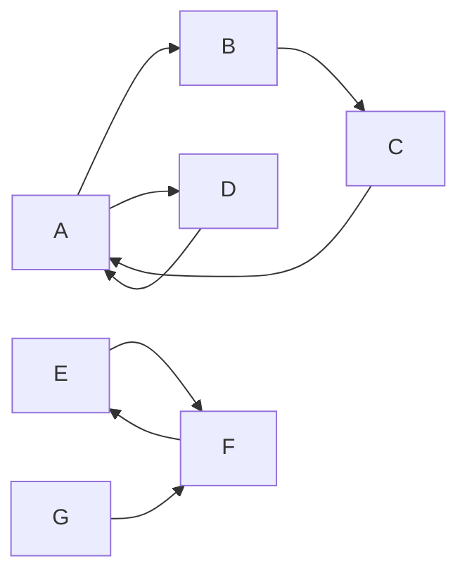
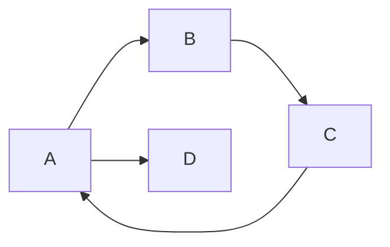

# Strongly Connected Components强连通分量算法原理与代码实例讲解

## 1.背景介绍
### 1.1 有向图与强连通分量
在计算机科学和图论中,有向图(Directed Graph)是一种由一组顶点(Vertex)和一组有向边(Directed Edge)组成的数学结构。有向边表示顶点之间的有向关系或连接。在现实世界中,有向图可以用来建模许多具有方向性的关系,如道路网络、社交网络、依赖关系等。

有向图中的一个重要概念是强连通分量(Strongly Connected Components, SCCs)。一个有向图的强连通分量是其中的一个最大子图,子图中任意两个顶点之间都存在一条有向路径。换句话说,如果从子图中的任意一个顶点出发,都能通过有向边到达子图中的任意其他顶点,那么这个子图就是一个强连通分量。一个有向图可以被分解为若干个不相交的强连通分量。

### 1.2 强连通分量的应用
强连通分量在许多领域都有重要应用,例如:

- 在社交网络分析中,找出紧密联系的社区
- 在软件工程中,分析代码的依赖关系,找出环形依赖
- 在生物信息学中,分析基因调控网络,发现调控子网络
- 在电路设计中,找出反馈回路,进行时序优化

因此,研究强连通分量的算法原理,对于解决实际问题具有重要意义。

## 2.核心概念与联系
### 2.1 有向图的基本概念
有向图 G=(V,E) 由顶点集 V 和有向边集 E 组成。每条有向边 e=(u,v)∈E 表示从顶点 u 到顶点 v 的有向连接。有向图中的一些重要概念包括:

- 出度:顶点的出度是以该顶点为起点的有向边的数量。 
- 入度:顶点的入度是以该顶点为终点的有向边的数量。
- 路径:路径是一个顶点序列,序列中每对相邻顶点之间都有一条有向边。
- 环:环是一个起点和终点相同的路径。
- 连通图:如果图中任意两个顶点之间都存在一条路径,则称该图是连通图。

### 2.2 强连通分量的形式化定义
有向图 G=(V,E) 的一个强连通分量是顶点集 V 的一个最大子集 C⊆V,对于 C 中任意两个顶点 u,v∈C,在子图 G[C] 中都存在一条从 u 到 v 的有向路径,也存在一条从 v 到 u 的有向路径。

### 2.3 强连通分量的性质
- 传递性:如果顶点 u 和 v 强连通,v 和 w 强连通,那么 u 和 w 也强连通。
- 极大性:如果把任何其他顶点加入到一个强连通分量,那么得到的集合不再是强连通分量。
- 唯一性:一个顶点只能属于一个强连通分量。不同的强连通分量之间不相交。

下图展示了一个有向图及其强连通分量的分解:



该图可以被分解为3个强连通分量:{A,B,C,D},{E,F},{G}。

## 3.核心算法原理与具体操作步骤
求解有向图的强连通分量,最经典的算法是Kosaraju算法和Tarjan算法。下面详细讲解Kosaraju算法的原理和步骤。

### 3.1 Kosaraju算法原理
Kosaraju算法基于两个关键点:

1. 如果能够从顶点 u 到达顶点 v,那么在反向图中一定能够从顶点 v 到达顶点 u。
2. 有向无环图(DAG)的逆后序(reverse postorder)是其拓扑排序的一种。

算法分为三个主要步骤:

1. 对原图 G 进行DFS遍历,并记录各个顶点的逆后序编号 f[u]。
2. 构造反向图 G^R,即把原图中所有边的方向反转。
3. 按照逆后序编号从大到小的顺序,对反向图 G^R 进行DFS遍历。每次DFS得到的顶点集合就是一个强连通分量。

直观来看,该算法的正确性在于:对原图逆后序编号靠前的顶点,在反向图中一定位于强连通分量的"出口",所以优先从它们开始DFS,就能正确得到所有的强连通分量。

### 3.2 Kosaraju算法步骤
下面是Kosaraju算法的具体步骤:

1. 对原图 G 进行DFS遍历:
   - 选择任一未访问的顶点作为起点,进行DFS。 
   - 递归访问所有可达的未访问顶点。
   - 在回溯时,将当前顶点加入到逆后序列表中。
   - 重复上述过程,直到所有顶点都被访问。

2. 构造反向图 G^R:
   - 创建反向图 G^R,复制原图的所有顶点。
   - 对于原图中的每条边 (u,v),在反向图中添加一条边 (v,u)。

3. 按逆后序编号对反向图 G^R 进行DFS遍历: 
   - 按照逆后序列表从后往前的顺序选择顶点。
   - 对于每个选出的未访问顶点,从它开始对反向图进行DFS。
   - 在DFS中访问到的所有顶点都属于同一个强连通分量。
   - 每次DFS完成后,就得到了一个强连通分量。

## 4.数学模型和公式详细讲解举例说明
### 4.1 有向图的数学表示
有向图 G=(V,E) 可以用邻接矩阵或邻接表来表示。设顶点数|V|=n,那么:

- 邻接矩阵 A 是一个 n×n 的方阵,其中:
$a_{ij} = \begin{cases}
1, & \text{if } (i,j) \in E \\ 
0, & \text{otherwise}
\end{cases}$

- 邻接表 Adj 是一个长度为 n 的数组,其中 Adj[i] 存储了所有从顶点 i 出发的有向边的终点顶点。

例如,对于下图所示的有向图:



其邻接矩阵为:

$$
A = \begin{bmatrix}
0 & 1 & 0 & 1\\ 
0 & 0 & 1 & 0\\
1 & 0 & 0 & 0\\
0 & 0 & 0 & 0
\end{bmatrix}
$$

其邻接表为:
```
Adj[A] = [B, D]
Adj[B] = [C]  
Adj[C] = [A]
Adj[D] = []
```

### 4.2 DFS遍历的数学描述
DFS遍历可以用递归的数学公式来描述。设 visited[u] 表示顶点 u 是否被访问过,f[u] 表示顶点 u 的逆后序编号,cnt 为全局编号计数器。那么:

$$
\begin{aligned}
&\text{DFS(u):}\\  
&\qquad visited[u] = true\\
&\qquad \text{for each } v \in Adj[u]:\\
&\qquad\qquad \text{if not } visited[v]:\\
&\qquad\qquad\qquad \text{DFS(v)}\\
&\qquad cnt = cnt + 1\\
&\qquad f[u] = cnt
\end{aligned}
$$

初始时,对任意顶点 u 有 visited[u]=false,cnt=0。

### 4.3 强连通分量的数学刻画
设 C 是有向图 G=(V,E) 的一个强连通分量,那么 C 满足:

$$
\forall u,v \in C, \exists \text{ a path from } u \text{ to } v \text{ in } G[C] \text{ and a path from } v \text{ to } u \text{ in } G[C]
$$

其中 G[C] 表示顶点集为 C 的导出子图,即原图中顶点集缩减为 C 后得到的子图。

## 5.项目实践:代码实例和详细解释说明
下面给出C++代码实现Kosaraju算法求强连通分量,并详细解释每一步:

```cpp
#include <bits/stdc++.h>
using namespace std;

const int MAXN = 1e5 + 5;

vector<int> G[MAXN], GR[MAXN];  // 原图和反向图的邻接表
bool visited[MAXN];  // 访问标记数组
int f[MAXN], cnt;  // 逆后序编号和编号计数器
vector<int> order;  // 顶点的逆后序列表
vector<vector<int>> SCCs;  // 存储所有的强连通分量

void dfs1(int u) {
    visited[u] = true;
    for (int v : G[u]) {
        if (!visited[v]) {
            dfs1(v);
        }
    }
    order.push_back(u);
}

void dfs2(int u) {
    visited[u] = true;
    SCCs.back().push_back(u);
    for (int v : GR[u]) {
        if (!visited[v]) {
            dfs2(v);
        }
    }
}

int main() {
    int n, m;
    cin >> n >> m;
    for (int i = 0; i < m; i++) {
        int u, v;
        cin >> u >> v;
        G[u].push_back(v);
        GR[v].push_back(u);
    }
    
    // Step 1: 对原图进行DFS,记录逆后序
    memset(visited, false, sizeof(visited));
    for (int u = 1; u <= n; u++) {
        if (!visited[u]) {
            dfs1(u);
        }
    }
    
    // Step 2: 对反向图按逆后序进行DFS 
    memset(visited, false, sizeof(visited));
    for (int i = n - 1; i >= 0; i--) {
        int u = order[i];
        if (!visited[u]) {
            SCCs.push_back(vector<int>());
            dfs2(u);
        }
    }
    
    // 输出所有的强连通分量
    cout << "Number of SCCs: " << SCCs.size() << endl;
    for (auto& scc : SCCs) {
        for (int u : scc) {
            cout << u << " ";
        }
        cout << endl;
    }
    
    return 0;
}
```

代码解释:

- 首先定义原图`G`和反向图`GR`的邻接表,访问标记数组`visited`,逆后序编号数组`f`,编号计数器`cnt`,顶点逆后序列表`order`,以及用于存储所有强连通分量的二维数组`SCCs`。

- `dfs1`函数对原图进行DFS遍历。当回溯时,将当前顶点加入到逆后序列表`order`中。

- `dfs2`函数对反向图进行DFS遍历。在每次DFS开始时,先在`SCCs`中添加一个新的空分量,然后将DFS访问到的所有顶点加入到这个分量中。

- 主函数`main`中,先输入有向图的顶点数`n`和边数`m`,并存储所有边以建立原图`G`和反向图`GR`的邻接表。

- 第一步,对原图`G`调用`dfs1`,得到所有顶点的逆后序列表`order`。注意要先将`visited`数组清零。

- 第二步,对反向图`GR`按照`order`的逆序依次调用`dfs2`,每次DFS得到一个强连通分量。同样要先将`visited`数组清零。

- 最后,输出强连通分量的个数以及每个分量包含的顶点。

该算法的时间复杂度为O(n+m),其中n为顶点数,m为边数。空间复杂度也是O(n+m)。

## 6.实际应用场景
强连通分量在许多实际问题中都有应用,下面列举几个具体场景:

### 6.1 社交网络中的社区发现
在社交网络中,如果把用户看作顶点,用户之间的关注关系看作有向边,那么一个强连通分量就对应于一个社区,其中的用户之间都有紧密的相互关注关系。发现社交网络的所有强连通分量,就可以自动划分出其中的社区结构,进而开展社区层面的分析。

### 6.2 软件工程中的循环依赖检测
在软件工程中,如果把代码单元(如类、函数)看作顶点,调用关系看作有向边,如