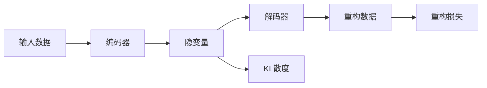

# TensorFlow实现VAE模型

## 1.背景介绍
变分自编码器(Variational Autoencoder, VAE)是一种强大的生成模型,它结合了深度学习和概率图模型的优点。VAE由Kingma和Welling在2013年首次提出,旨在学习数据的低维隐空间表示,并能够从这个隐空间生成新的数据样本。

VAE在许多领域都有广泛应用,如图像生成、语音合成、异常检测等。它不仅能够学习数据的压缩表示,还能捕捉数据的概率分布,从而实现数据的生成和插值。作为一个无监督学习模型,VAE为探索复杂数据提供了新的视角。

本文将详细介绍VAE的原理,并使用当前最流行的深度学习框架TensorFlow来实现VAE模型。通过理论与实践相结合,帮助读者深入理解VAE的内在机制,掌握使用TensorFlow构建VAE模型的方法。

### 1.1 VAE的起源与发展
### 1.2 VAE在各领域的应用现状
### 1.3 VAE的研究意义

## 2.核心概念与联系
要理解VAE的工作原理,首先需要了解几个核心概念:
- 编码器(Encoder):将输入数据映射到隐空间的网络
- 解码器(Decoder):将隐变量重构为输入数据的网络  
- 隐变量(Latent Variable):数据在隐空间中的低维表示
- 重构损失(Reconstruction Loss):衡量重构数据与原始数据的差异
- KL散度(Kullback–Leibler Divergence):衡量隐变量分布与先验分布的差异

下图展示了VAE的整体架构和各部分之间的关系:



### 2.1 编码器与解码器
### 2.2 隐变量的概率解释 
### 2.3 重构损失和KL散度的权衡

## 3.核心算法原理具体操作步骤
VAE的训练过程可以分为以下几个步骤:

1. 将输入数据 $x$ 通过编码器映射到隐空间,得到隐变量 $z$ 的均值 $\mu$ 和方差 $\sigma^2$ 
2. 从先验分布(通常是标准正态分布)中采样噪声 $\epsilon$
3. 将采样噪声 $\epsilon$ 与 $\mu$ 和 $\sigma$ 结合,得到隐变量 $z=\mu+\sigma \odot \epsilon$
4. 将隐变量 $z$ 通过解码器映射回原始数据空间,得到重构数据 $\hat{x}$  
5. 计算重构损失 $L_{rec}=\frac{1}{N}\sum_{i=1}^N(x_i-\hat{x}_i)^2$
6. 计算KL散度 $L_{KL}=\frac{1}{2}\sum_{i=1}^N(\mu_i^2+\sigma_i^2-\log\sigma_i^2-1)$
7. 计算总损失 $L=L_{rec}+\beta L_{KL}$,其中 $\beta$ 为平衡因子
8. 基于总损失 $L$ 优化编码器和解码器的参数

### 3.1 编码过程详解
### 3.2 重参数化技巧
### 3.3 解码过程详解

## 4.数学模型和公式详细讲解举例说明
VAE的数学模型可以用概率图模型来表示。设 $x$ 为观测变量, $z$ 为隐变量,我们希望最大化边缘似然 $p(x)$:

$$p(x)=\int p(x|z)p(z)dz$$

但是边缘似然的计算是不可解的,因此我们引入变分下界(Evidence Lower Bound, ELBO)来近似边缘似然:

$$\log p(x) \geq \mathbb{E}_{q(z|x)}[\log p(x|z)] - D_{KL}(q(z|x)||p(z)) \triangleq ELBO$$

其中 $q(z|x)$ 是近似后验分布,通常假设为各向同性的高斯分布:

$$q(z|x)=\mathcal{N}(z|\mu(x),\sigma^2(x)I)$$

$\mu(x)$ 和 $\sigma(x)$ 由编码器网络参数化。重构项 $\mathbb{E}_{q(z|x)}[\log p(x|z)]$ 可以用均方误差来近似:

$$\mathbb{E}_{q(z|x)}[\log p(x|z)] \approx -\frac{1}{N}\sum_{i=1}^N(x_i-\hat{x}_i)^2$$

而KL散度项 $D_{KL}(q(z|x)||p(z))$ 在假设先验分布 $p(z)$ 为标准正态分布 $\mathcal{N}(0,I)$ 时有解析解:

$$D_{KL}(q(z|x)||p(z))=\frac{1}{2}\sum_{i=1}^N(\mu_i^2+\sigma_i^2-\log\sigma_i^2-1)$$

综上所述,VAE的优化目标就是最大化ELBO,相当于最小化重构损失和KL散度之和:

$$\min_{\phi,\theta} \frac{1}{N}\sum_{i=1}^N(x_i-\hat{x}_i)^2 + \beta\frac{1}{2}\sum_{i=1}^N(\mu_i^2+\sigma_i^2-\log\sigma_i^2-1)$$

其中 $\phi$ 和 $\theta$ 分别为编码器和解码器的参数。

### 4.1 边缘似然与变分下界的关系
### 4.2 重构损失的推导与解释
### 4.3 KL散度的计算与作用

## 5.项目实践：代码实例和详细解释说明
下面我们使用TensorFlow来实现一个简单的VAE模型,用于生成手写数字图像。

首先导入所需的库:

```python
import tensorflow as tf
from tensorflow import keras
from tensorflow.keras import layers
import numpy as np
import matplotlib.pyplot as plt
```

然后加载MNIST数据集:

```python
(x_train, y_train), (x_test, y_test) = keras.datasets.mnist.load_data()
x_train = x_train.astype('float32') / 255.
x_test = x_test.astype('float32') / 255.
x_train = x_train.reshape((len(x_train), np.prod(x_train.shape[1:])))
x_test = x_test.reshape((len(x_test), np.prod(x_test.shape[1:])))
```

接下来定义编码器和解码器网络:

```python
latent_dim = 2

encoder_inputs = keras.Input(shape=(784,))
x = layers.Dense(512, activation='relu')(encoder_inputs)
z_mean = layers.Dense(latent_dim, name='z_mean')(x)
z_log_var = layers.Dense(latent_dim, name='z_log_var')(x)

encoder = keras.Model(encoder_inputs, [z_mean, z_log_var], name='encoder')

latent_inputs = keras.Input(shape=(latent_dim,))
x = layers.Dense(512, activation='relu')(latent_inputs)
decoder_outputs = layers.Dense(784, activation='sigmoid')(x)

decoder = keras.Model(latent_inputs, decoder_outputs, name='decoder')
```

定义采样函数和VAE模型:

```python
def sampling(args):
    z_mean, z_log_var = args
    batch = tf.shape(z_mean)[0]
    dim = tf.shape(z_mean)[1]
    epsilon = tf.keras.backend.random_normal(shape=(batch, dim))
    return z_mean + tf.exp(0.5 * z_log_var) * epsilon

z = layers.Lambda(sampling, name='z')([z_mean, z_log_var])

vae_outputs = decoder(z)
vae = keras.Model(encoder_inputs, vae_outputs, name='vae')
```

定义损失函数和优化器:

```python
reconstruction_loss = keras.losses.binary_crossentropy(encoder_inputs, vae_outputs)
reconstruction_loss *= 784
kl_loss = 1 + z_log_var - tf.square(z_mean) - tf.exp(z_log_var)
kl_loss = tf.reduce_sum(kl_loss, axis=-1)
kl_loss *= -0.5
vae_loss = tf.reduce_mean(reconstruction_loss + kl_loss)
vae.add_loss(vae_loss)

vae.compile(optimizer='adam')
```

训练VAE模型:

```python
vae.fit(x_train, epochs=50, batch_size=128)
```

最后,我们可以使用训练好的VAE模型来生成新的手写数字图像:

```python
n = 15  
digit_size = 28
figure = np.zeros((digit_size * n, digit_size * n))

grid_x = np.linspace(-4, 4, n)
grid_y = np.linspace(-4, 4, n)[::-1]

for i, yi in enumerate(grid_y):
    for j, xi in enumerate(grid_x):
        z_sample = np.array([[xi, yi]])
        x_decoded = decoder.predict(z_sample)
        digit = x_decoded[0].reshape(digit_size, digit_size)
        figure[i * digit_size: (i + 1) * digit_size,
               j * digit_size: (j + 1) * digit_size] = digit

plt.figure(figsize=(10, 10))
plt.imshow(figure, cmap='Greys_r')
plt.show()
```

### 5.1 编码器网络的构建
### 5.2 重参数化技巧的实现
### 5.3 解码器网络的构建
### 5.4 VAE模型的训练与生成

## 6.实际应用场景
VAE作为一种强大的生成模型,在许多领域都有广泛应用,例如:

- 图像生成:VAE可以学习图像数据的隐空间表示,并生成新的图像样本。这在数据增强、风格迁移、图像修复等任务中非常有用。

- 语音合成:将语音数据输入VAE,可以学习语音的压缩表示,并生成新的语音片段。这为个性化语音合成提供了新的思路。

- 异常检测:利用VAE学习正常数据的隐空间表示,当输入异常数据时,VAE的重构误差会显著增大,据此可以实现异常检测。

- 推荐系统:将用户行为数据输入VAE,可以学习用户的隐因子表示,基于隐因子的相似性实现个性化推荐。

- 分子设计:将分子结构数据输入VAE,可以在隐空间中优化分子结构,从而生成具有特定性质的新分子。

### 6.1 图像生成与编辑
### 6.2 语音合成与转换
### 6.3 异常检测与故障诊断

## 7.工具和资源推荐
为了方便读者进一步学习和实践VAE,这里推荐一些有用的工具和资源:

- TensorFlow:本文使用的深度学习框架,提供了完善的VAE模型构建和训练功能。官网:https://www.tensorflow.org/

- Keras:基于TensorFlow的高层API,使得构建VAE模型更加简单。官网:https://keras.io/

- PyTorch:另一个流行的深度学习框架,也支持VAE模型。官网:https://pytorch.org/

- Scikit-learn:经典的机器学习库,提供了多种概率模型和评估指标。官网:https://scikit-learn.org/

- "Auto-Encoding Variational Bayes"论文:VAE的原始论文,由Kingma和Welling于2013年发表。链接:https://arxiv.org/abs/1312.6114

- "Deep Learning with Python"书籍:Keras作者Francois Chollet所写的深度学习入门书,对VAE有详细介绍。

### 7.1 深度学习框架
### 7.2 相关论文与书籍
### 7.3 开源实现与案例

## 8.总结：未来发展趋势与挑战
VAE自2013年提出以来,经历了快速的发展,并在许多领域取得了令人瞩目的成果。展望未来,VAE还有许多值得研究的方向:

- 提高生成质量:如何生成更加清晰、多样、逼真的样本,是VAE面临的重要挑战。需要设计更加精巧的网络结构和损失函数。

- 加速推断速度:VAE的推断速度相对较慢,特别是在处理高维数据时。需要探索新的推断算法,如基于梯度的方法。

- 融合其他生成模型:VAE与GAN、Flow等其他生成模型各有优势,将它们融合起来,有望取得更好的效果。

- 应用于更多领域:目前VAE主要应用于图像、语音等领域,未来有望在文本、图网络、时间序列等更多领域发挥作用。

- 理论基础的完善:VAE虽然已经取得了不错的效果,但其理论基础还不够完善。需要从信息论、概率论等角度加以阐释。

总之,VA