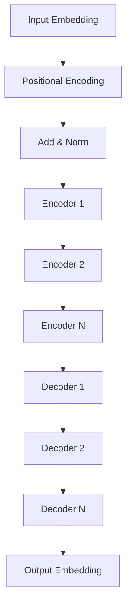

# Transformer 原理与代码实战案例讲解

## 1. 背景介绍
### 1.1 Transformer的诞生背景
#### 1.1.1 传统序列模型的局限性
#### 1.1.2 注意力机制的引入
#### 1.1.3 Transformer的提出

### 1.2 Transformer的意义与影响
#### 1.2.1 在自然语言处理领域的突破
#### 1.2.2 对其他领域的启发
#### 1.2.3 推动人工智能的发展

## 2. 核心概念与联系
### 2.1 注意力机制(Attention Mechanism)
#### 2.1.1 注意力机制的定义
#### 2.1.2 注意力机制的类型
#### 2.1.3 注意力机制在Transformer中的应用

### 2.2 自注意力机制(Self-Attention)
#### 2.2.1 自注意力机制的定义
#### 2.2.2 自注意力机制的计算过程
#### 2.2.3 自注意力机制的优势

### 2.3 位置编码(Positional Encoding)
#### 2.3.1 位置编码的必要性
#### 2.3.2 位置编码的实现方式
#### 2.3.3 位置编码在Transformer中的作用

### 2.4 残差连接(Residual Connection)与Layer Normalization
#### 2.4.1 残差连接的概念
#### 2.4.2 Layer Normalization的作用
#### 2.4.3 残差连接与Layer Normalization在Transformer中的应用

### 2.5 Transformer的整体架构


## 3. 核心算法原理具体操作步骤
### 3.1 编码器(Encoder)
#### 3.1.1 输入嵌入(Input Embedding)
#### 3.1.2 位置编码(Positional Encoding)
#### 3.1.3 自注意力层(Self-Attention Layer)
#### 3.1.4 前馈神经网络层(Feed Forward Layer)

### 3.2 解码器(Decoder) 
#### 3.2.1 输出嵌入(Output Embedding)
#### 3.2.2 遮挡的自注意力层(Masked Self-Attention Layer)
#### 3.2.3 编码-解码注意力层(Encoder-Decoder Attention Layer)
#### 3.2.4 前馈神经网络层(Feed Forward Layer)

### 3.3 Transformer的训练过程
#### 3.3.1 损失函数(Loss Function)
#### 3.3.2 优化器(Optimizer)
#### 3.3.3 学习率调度(Learning Rate Scheduling)

## 4. 数学模型和公式详细讲解举例说明
### 4.1 注意力机制的数学表示
#### 4.1.1 注意力分数(Attention Scores)的计算
$Attention(Q, K, V) = softmax(\frac{QK^T}{\sqrt{d_k}})V$

其中，$Q$表示查询(Query)，$K$表示键(Key)，$V$表示值(Value)，$d_k$表示键的维度。

#### 4.1.2 多头注意力(Multi-Head Attention)的计算
$$
\begin{aligned}
MultiHead(Q, K, V) &= Concat(head_1, ..., head_h)W^O \\
where\ head_i &= Attention(QW^Q_i, KW^K_i, VW^V_i)
\end{aligned}
$$

其中，$W^Q_i$, $W^K_i$, $W^V_i$和$W^O$是可学习的权重矩阵。

### 4.2 位置编码的数学表示
$$
\begin{aligned}
PE_{(pos, 2i)} &= sin(pos / 10000^{2i/d_{model}}) \\
PE_{(pos, 2i+1)} &= cos(pos / 10000^{2i/d_{model}})
\end{aligned}
$$

其中，$pos$表示位置，$i$表示维度，$d_{model}$表示模型的维度。

### 4.3 残差连接与Layer Normalization的数学表示
$$
\begin{aligned}
x &= LayerNorm(x + Sublayer(x)) \\
Sublayer(x) &= Activation(xW_1 + b_1)W_2 + b_2
\end{aligned}
$$

其中，$Sublayer(x)$可以是自注意力层或前馈神经网络层，$W_1$, $b_1$, $W_2$, $b_2$是可学习的参数。

## 5. 项目实践：代码实例和详细解释说明
### 5.1 数据准备
#### 5.1.1 数据集的选择
#### 5.1.2 数据预处理

### 5.2 模型构建
#### 5.2.1 编码器的实现
```python
class Encoder(nn.Module):
    def __init__(self, ...):
        ...
    
    def forward(self, x):
        ...
```

#### 5.2.2 解码器的实现
```python
class Decoder(nn.Module):
    def __init__(self, ...):
        ...
    
    def forward(self, x, enc_output):
        ...
```

#### 5.2.3 Transformer模型的实现
```python
class Transformer(nn.Module):
    def __init__(self, ...):
        ...
    
    def forward(self, src, tgt):
        ...
```

### 5.3 模型训练
#### 5.3.1 定义损失函数和优化器
#### 5.3.2 训练循环
#### 5.3.3 模型评估

### 5.4 模型推理
#### 5.4.1 生成式任务的推理
#### 5.4.2 分类任务的推理

## 6. 实际应用场景
### 6.1 机器翻译
#### 6.1.1 Transformer在机器翻译中的应用
#### 6.1.2 Transformer相比传统方法的优势

### 6.2 文本摘要
#### 6.2.1 Transformer在文本摘要中的应用
#### 6.2.2 Transformer生成摘要的效果

### 6.3 情感分析
#### 6.3.1 Transformer在情感分析中的应用
#### 6.3.2 Transformer提取情感特征的能力

### 6.4 问答系统
#### 6.4.1 Transformer在问答系统中的应用
#### 6.4.2 Transformer生成答案的效果

## 7. 工具和资源推荐
### 7.1 开源实现
#### 7.1.1 Hugging Face Transformers库
#### 7.1.2 OpenNMT
#### 7.1.3 Fairseq

### 7.2 预训练模型
#### 7.2.1 BERT
#### 7.2.2 GPT系列
#### 7.2.3 T5

### 7.3 数据集
#### 7.3.1 WMT翻译数据集
#### 7.3.2 SQuAD问答数据集
#### 7.3.3 SST情感分析数据集

## 8. 总结：未来发展趋势与挑战
### 8.1 Transformer的优势与局限
#### 8.1.1 Transformer的优势
#### 8.1.2 Transformer的局限

### 8.2 Transformer的发展方向
#### 8.2.1 模型效率的提升
#### 8.2.2 模型泛化能力的增强
#### 8.2.3 跨模态应用的拓展

### 8.3 Transformer面临的挑战
#### 8.3.1 计算资源的限制
#### 8.3.2 可解释性的问题
#### 8.3.3 数据隐私与安全

## 9. 附录：常见问题与解答
### 9.1 Transformer相比RNN/LSTM有什么优势？
### 9.2 如何理解自注意力机制？
### 9.3 位置编码的作用是什么？
### 9.4 残差连接和Layer Normalization的作用是什么？
### 9.5 如何选择Transformer的超参数？
### 9.6 Transformer能否应用于其他领域？

作者：禅与计算机程序设计艺术 / Zen and the Art of Computer Programming