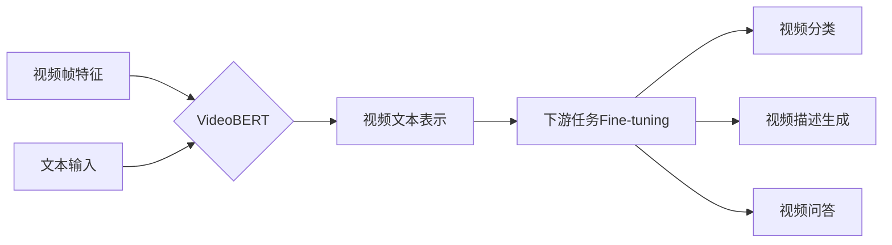
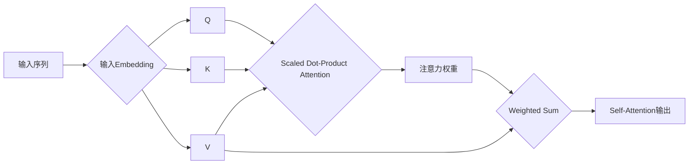

# Transformer大模型实战 VideoBERT模型和BART模型

## 1.背景介绍
### 1.1 Transformer模型的兴起
### 1.2 Transformer在NLP领域的应用
### 1.3 Transformer在多模态领域的拓展

## 2.核心概念与联系
### 2.1 Transformer的核心思想
#### 2.1.1 Self-Attention机制
#### 2.1.2 Multi-Head Attention
#### 2.1.3 位置编码
### 2.2 VideoBERT模型
#### 2.2.1 VideoBERT的网络结构
#### 2.2.2 VideoBERT的预训练任务
#### 2.2.3 VideoBERT的下游任务fine-tuning
### 2.3 BART模型 
#### 2.3.1 BART的Encoder-Decoder结构
#### 2.3.2 BART的预训练任务
#### 2.3.3 BART在文本摘要、问答等任务上的应用

## 3.核心算法原理具体操作步骤
### 3.1 Transformer的训练过程
#### 3.1.1 输入表示
#### 3.1.2 Encoder层计算
#### 3.1.3 Decoder层计算
#### 3.1.4 模型输出与损失函数
### 3.2 VideoBERT的训练过程
#### 3.2.1 视频帧特征提取
#### 3.2.2 文本输入表示
#### 3.2.3 视频-文本对比学习
#### 3.2.4 Masked Language Modeling
### 3.3 BART的训练过程
#### 3.3.1 输入噪声
#### 3.3.2 Encoder端的计算
#### 3.3.3 Decoder端的计算
#### 3.3.4 序列到序列的生成任务

## 4.数学模型和公式详细讲解举例说明
### 4.1 Scaled Dot-Product Attention
$$Attention(Q,K,V) = softmax(\frac{QK^T}{\sqrt{d_k}})V$$
其中，$Q$是查询矩阵，$K$是键矩阵，$V$是值矩阵，$d_k$是$K$的维度。这个公式体现了Self-Attention的计算过程。

### 4.2 Multi-Head Attention
$$MultiHead(Q,K,V) = Concat(head_1,...,head_h)W^O \\
head_i=Attention(QW^Q_i, KW^K_i, VW^V_i)$$

其中，$W^Q_i, W^K_i, W^V_i, W^O$是可学习的线性变换矩阵。Multi-Head Attention允许模型在不同的表示子空间里计算注意力。

### 4.3 BART的Encoder-Decoder交叉注意力
$$Attention(Q,K,V) = softmax(\frac{QK^T}{\sqrt{d_k}})V \\ 
Q=Decoder Hidden States \\
K=V=Encoder Outputs$$

BART的Decoder层会利用Encoder的输出作为键值对来计算交叉注意力，捕捉源端和目标端的依赖关系。

## 5.项目实践：代码实例和详细解释说明
下面我们用PyTorch来实现一个简化版的Transformer Encoder层：

```python
import torch
import torch.nn as nn

class SelfAttention(nn.Module):
    def __init__(self, embed_size, heads):
        super(SelfAttention, self).__init__()
        self.embed_size = embed_size
        self.heads = heads
        self.head_dim = embed_size // heads
        
        assert (self.head_dim * heads == embed_size), "Embedding size needs to be divisible by heads"
        
        self.values = nn.Linear(self.head_dim, self.head_dim, bias=False)
        self.keys = nn.Linear(self.head_dim, self.head_dim, bias=False)
        self.queries = nn.Linear(self.head_dim, self.head_dim, bias=False)
        self.fc_out = nn.Linear(heads * self.head_dim, embed_size)
    
    def forward(self, values, keys, query, mask):
        N = query.shape[0]
        value_len, key_len, query_len = values.shape[1], keys.shape[1], query.shape[1]
        
        # Split the embedding into self.heads different pieces
        values = values.reshape(N, value_len, self.heads, self.head_dim)
        keys = keys.reshape(N, key_len, self.heads, self.head_dim)
        query = query.reshape(N, query_len, self.heads, self.head_dim)
        
        values = self.values(values)  # (N, value_len, heads, head_dim)
        keys = self.keys(keys)  # (N, key_len, heads, head_dim)
        queries = self.queries(query)  # (N, query_len, heads, heads_dim)
        
        # Einsum does matrix mult. for query*keys for each training example
        # with every other training example, don't be confused by einsum
        # it's just how I like doing matrix multiplication & bmm
        energy = torch.einsum("nqhd,nkhd->nhqk", [queries, keys])  # (N, heads, query_len, key_len)
        
        # Mask padded indices so their weights become 0
        if mask is not None:
            energy = energy.masked_fill(mask == 0, float("-1e20"))
        
        # Normalize energy values similarly to seq2seq + attention
        # so that they sum to 1. Also divide by scaling factor for
        # better stability
        attention = torch.softmax(energy / (self.embed_size ** (1/2)), dim=3)  # (N, heads, query_len, key_len)
        
        out = torch.einsum("nhql,nlhd->nqhd", [attention, values]).reshape(
            N, query_len, self.heads * self.head_dim
        )  # (N, query_len, heads, head_dim) then flatten last two dimensions
        
        out = self.fc_out(out)
        return out

class TransformerBlock(nn.Module):
    def __init__(self, embed_size, heads, dropout, forward_expansion):
        super(TransformerBlock, self).__init__()
        self.attention = SelfAttention(embed_size, heads)
        self.norm1 = nn.LayerNorm(embed_size)
        self.norm2 = nn.LayerNorm(embed_size)
        
        self.feed_forward = nn.Sequential(
            nn.Linear(embed_size, forward_expansion * embed_size),
            nn.ReLU(),
            nn.Linear(forward_expansion * embed_size, embed_size),
        )
        
        self.dropout = nn.Dropout(dropout)
        
    def forward(self, value, key, query, mask):
        attention = self.attention(value, key, query, mask)
        
        # Add skip connection, run through normalization and finally dropout
        x = self.dropout(self.norm1(attention + query))
        forward = self.feed_forward(x)
        out = self.dropout(self.norm2(forward + x))
        return out
```

以上代码实现了Self-Attention和Transformer Block（包含Self-Attention和前馈神经网络）的计算过程。其中的关键步骤有：

1. 将输入的embedding划分为多个头，在每个头上分别计算Self-Attention。
2. 通过einsum操作实现了Q、K、V的矩阵乘法计算，得到每个位置的注意力权重分布。
3. 对注意力权重进行Softmax归一化，并通过掩码屏蔽掉padding位置的影响。
4. 将注意力权重与V相乘并连结多头的结果，经过线性变换得到Self-Attention的输出。
5. 在Transformer Block中，将Self-Attention的结果与原始输入相加（残差连接），并经过Layer Normalization和Dropout，然后通过前馈神经网络得到最终的输出。

这个简化版的Transformer Encoder展示了Transformer的核心计算过程，可以作为实现VideoBERT和BART等模型的基础。在实践中，我们还需要根据具体的任务对模型结构进行调整和扩展，并加入任务相关的输入表示和损失函数，以完成端到端的训练和应用。

## 6.实际应用场景
### 6.1 VideoBERT在视频理解任务中的应用
#### 6.1.1 视频分类
#### 6.1.2 视频描述生成
#### 6.1.3 视频问答
### 6.2 BART在文本生成任务中的应用
#### 6.2.1 文本摘要
#### 6.2.2 对话生成
#### 6.2.3 机器翻译

## 7.工具和资源推荐
### 7.1 VideoBERT的开源实现
- [官方实现](https://github.com/ammesatyajit/VideoBERT)
- [Hugging Face VideoBERT实现](https://huggingface.co/docs/transformers/model_doc/videobert) 
### 7.2 BART的开源实现
- [官方实现](https://github.com/pytorch/fairseq/tree/master/examples/bart)
- [Hugging Face BART实现](https://huggingface.co/docs/transformers/model_doc/bart)
### 7.3 相关论文与资源
- Devlin J, Chang M W, Lee K, et al. [Bert: Pre-training of deep bidirectional transformers for language understanding](https://arxiv.org/abs/1810.04805)[J]. arXiv preprint arXiv:1810.04805, 2018.
- Sun C, Myers A, Vondrick C, et al. [Videobert: A joint model for video and language representation learning](https://openaccess.thecvf.com/content_ICCV_2019/papers/Sun_VideoBERT_A_Joint_Model_for_Video_and_Language_Representation_Learning_ICCV_2019_paper.pdf)[C]//Proceedings of the IEEE/CVF International Conference on Computer Vision. 2019: 7464-7473.  
- Lewis M, Liu Y, Goyal N, et al. [BART: Denoising Sequence-to-Sequence Pre-training for Natural Language Generation, Translation, and Comprehension](https://arxiv.org/abs/1910.13461)[J]. arXiv preprint arXiv:1910.13461, 2019.

## 8.总结：未来发展趋势与挑战
### 8.1 多模态预训练模型的发展趋势
### 8.2 视频-语言预训练的技术挑战
### 8.3 生成式预训练在自然语言处理中的应用前景

## 9.附录：常见问题与解答
### 9.1 VideoBERT和BERT的区别是什么？
### 9.2 BART相比于其他Seq2Seq模型有什么优势？
### 9.3 VideoBERT和BART分别适用于哪些任务场景？

## 核心概念原理和架构的Mermaid流程图

VideoBERT的整体架构：


BART的Encoder-Decoder结构：


Transformer的Self-Attention计算过程：


以上是VideoBERT模型、BART模型以及Transformer的Self-Attention机制的核心架构流程图，直观地展示了它们的整体结构和计算过程。这些图示有助于我们理解这些模型的内部工作原理，并为进一步的研究和应用提供参考。

Transformer大模型在视频理解和文本生成任务中展现了巨大的潜力。VideoBERT和BART分别代表了多模态预训练和生成式预训练的重要里程碑。未来，随着计算能力的提升和训练数据的丰富，我们有望看到更加强大、高效、通用的视频-语言预训练模型和文本生成模型。同时，如何更好地融合不同模态的信息、缓解数据稀疏问题、提高模型的可解释性和可控性，也是值得关注的研究方向。相信Transformer大模型必将在人工智能的发展历程中书写更加精彩的篇章。

作者：禅与计算机程序设计艺术 / Zen and the Art of Computer Programming