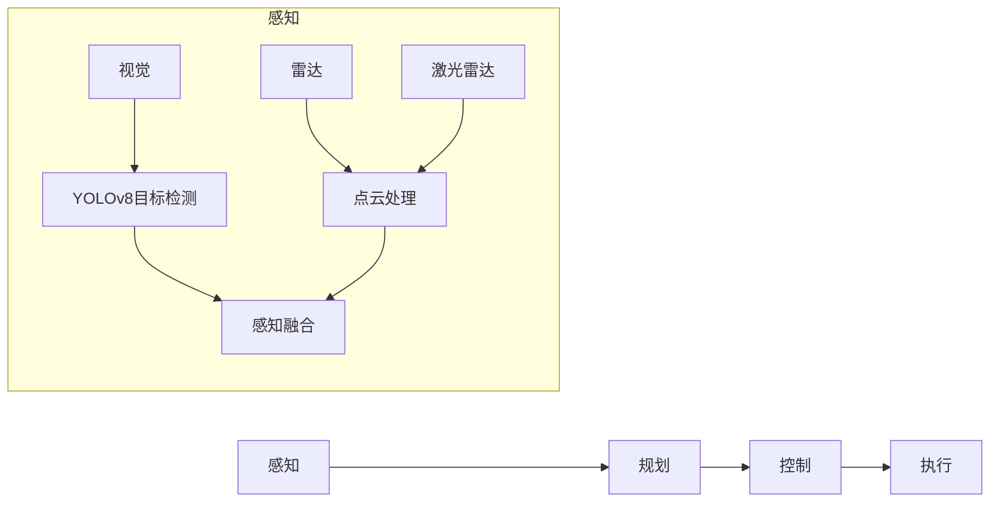

# YOLOv8与无人驾驶：赋能自动驾驶的未来

## 1. 背景介绍

### 1.1 无人驾驶技术概述
无人驾驶技术是指利用人工智能、计算机视觉、雷达、GPS等技术，使车辆能够在没有人类驾驶员操作的情况下自主行驶。这项技术有望彻底改变我们的出行方式，提高交通效率，减少事故发生。

### 1.2 计算机视觉在无人驾驶中的重要性
计算机视觉是无人驾驶技术的核心之一。它使车辆能够"看到"周围的环境，识别道路、车辆、行人等，从而做出正确的决策。目标检测作为计算机视觉的重要分支，在无人驾驶中扮演着关键角色。

### 1.3 YOLO算法家族简介
YOLO (You Only Look Once)是一种高效的实时目标检测算法。自2015年首次提出以来，YOLO经历了多次迭代升级，从YOLOv1到最新的YOLOv8，性能和速度都有了长足进步。YOLOv8作为其中的佼佼者，有望在无人驾驶领域大放异彩。

## 2. 核心概念与联系

### 2.1 目标检测
目标检测是指在图像或视频中定位和识别感兴趣的目标物体，通常会给出目标的类别和位置信息（通过边界框表示）。它在无人驾驶、安防监控、医学影像等领域有广泛应用。

### 2.2 YOLO算法
YOLO将目标检测问题转化为回归问题来解决。它将输入图像划分为S×S个网格，每个网格负责检测落在其中的目标。相比传统的基于区域建议的方法，YOLO只需对图像进行一次卷积神经网络的前向推理，因此速度更快。

### 2.3 无人驾驶系统架构
一个典型的无人驾驶系统包括感知、规划、控制等模块。其中感知模块负责收集和解释车辆周围的环境信息，目标检测正是其中的重要一环。YOLOv8可以作为感知模块的视觉检测组件，为上层的规划决策提供重要输入。



## 3. 核心算法原理具体操作步骤

### 3.1 YOLOv8网络结构

YOLOv8采用了一种名为 "Compound-scaled"的网络结构，可以在速度和精度之间实现更好的平衡。它主要由三个部分组成：

1. Backbone：用于特征提取，通常采用CSPDarknet53结构。
2. Neck：用于特征融合，通常采用PANet (Path Aggregation Network)结构。  
3. Head：用于预测目标边界框和类别，通常采用YOLOHead结构。

### 3.2 YOLOv8训练流程

1. 数据准备：收集和标注训练数据，将其转换为YOLO格式。
2. 模型配置：选择合适的YOLOv8模型配置文件，设置超参数。
3. 模型训练：利用准备好的数据对模型进行训练，直到满足一定的性能指标。
4. 模型评估：在验证集上评估模型性能，进行必要的调优。
5. 模型部署：将训练好的模型转换为适合部署的格式，如ONNX、TensorRT等。

### 3.3 YOLOv8推理过程

1. 图像预处理：将输入图像缩放到模型要求的尺寸，并进行归一化。
2. 模型前向传播：将预处理后的图像输入到YOLOv8模型，执行前向推理。
3. 后处理：对模型输出进行解码，得到目标边界框坐标和类别置信度。
4. 非极大值抑制（NMS）：去除冗余的检测框，得到最终的检测结果。

## 4. 数学模型和公式详细讲解举例说明

### 4.1 边界框回归

在YOLOv8中，每个网格负责预测B个边界框。对于每个边界框，模型会输出4个值：$t_x, t_y, t_w, t_h$，分别表示边界框中心点坐标和宽高的偏移量。设网格的左上角坐标为$(c_x, c_y)$，边界框的预测值为：

$$
\begin{aligned}
b_x &= \sigma(t_x) + c_x \\
b_y &= \sigma(t_y) + c_y \\
b_w &= p_w e^{t_w} \\
b_h &= p_h e^{t_h}
\end{aligned}
$$

其中$\sigma$是Sigmoid函数，$p_w$和$p_h$是先验框的宽和高。

### 4.2 目标置信度预测

除了边界框坐标，模型还会为每个边界框预测一个目标置信度$\hat{C}$，表示该边界框中包含目标的概率。它可以通过Sigmoid函数计算：

$$
\hat{C} = \sigma(t_o)
$$

其中$t_o$是模型输出的目标置信度的Logits值。

### 4.3 类别概率预测

对于每个边界框，模型还会预测其属于各个类别的条件概率。设模型输出的类别Logits值为$\mathbf{t_p} = (t_{p1}, t_{p2}, ..., t_{pK})$，其中K是类别数，则类别概率可以通过Softmax函数计算：

$$
\hat{p}(k|object) = \frac{e^{t_{pk}}}{\sum_{i=1}^K e^{t_{pi}}}
$$

最终的类别置信度等于目标置信度和类别条件概率的乘积：

$$
\hat{C}_k = \hat{C} \cdot \hat{p}(k|object)
$$

## 5. 项目实践：代码实例和详细解释说明

下面我们通过一个简单的Python代码示例，演示如何使用YOLOv8进行目标检测：

```python
from ultralytics import YOLO

# 加载预训练的YOLOv8模型
model = YOLO('yolov8n.pt') 

# 对单张图像进行推理
results = model('image.jpg')  

# 可视化检测结果
res_plotted = results[0].plot()
res_plotted.show()

# 对视频进行推理
results = model('video.mp4')

# 保存检测结果
results.save('output.mp4')
```

这个示例中，我们首先加载了一个预训练的YOLOv8模型`yolov8n.pt`。然后，我们可以直接将图像文件路径传递给模型对象，执行推理。`results`变量包含了检测结果，我们可以对其进行可视化显示或保存。

同样地，我们也可以对视频文件执行推理，得到一个带有目标检测结果的新视频文件。

YOLOv8的API设计非常简洁，用户无需关注太多细节，就可以轻松地完成目标检测任务。这对于想要将YOLOv8集成到自己项目中的开发者来说非常友好。

## 6. 实际应用场景

### 6.1 障碍物检测和避障
无人车需要实时检测道路上的障碍物，如行人、车辆、路障等，并及时做出决策以避免碰撞。YOLOv8可以快速准确地检测这些障碍物，为无人车的避障系统提供可靠的感知信息。

### 6.2 交通标志和信号灯识别
识别和遵守交通标志、信号灯是无人车安全行驶的基本要求。利用YOLOv8，无人车可以准确检测和识别各种交通标志和信号灯，从而做出正确的行为决策，如停车、减速、变道等。

### 6.3 车道线检测
车道线检测对于无人车保持在正确车道行驶至关重要。YOLOv8可以与传统的计算机视觉算法（如Hough变换）结合，实现鲁棒的车道线检测，为无人车的横向控制提供参考。

### 6.4 自动泊车
在自动泊车场景中，无人车需要检测停车位的位置和朝向。通过在YOLOv8中加入停车位这一特定类别的训练数据，无人车可以学会识别停车位，从而实现自主泊车。

## 7. 工具和资源推荐

- Roboflow: 用于准备和标注目标检测数据集的工具。
- CVAT: 另一个功能强大的数据标注工具，支持多种数据格式。
- Ultralytics YOLOv8: YOLOv8的官方实现，提供了预训练模型和示例代码。
- MMDetection: 一个基于PyTorch的目标检测工具箱，集成了多种SOTA算法。
- TensorRT: 用于优化和加速深度学习模型的SDK，可显著提高YOLOv8的推理速度。

## 8. 总结：未来发展趋势与挑战

YOLOv8在速度和精度方面的出色表现，使其在无人驾驶领域具有广阔的应用前景。未来，YOLOv8有望与其他传感器（如激光雷达、毫米波雷达）实现更紧密的融合，提供更全面和鲁棒的环境感知能力。

同时，轻量化和模型压缩技术的发展，将使YOLOv8能够在更多资源受限的嵌入式平台上实时运行，降低无人驾驶系统的成本。

然而，YOLOv8在无人驾驶中的应用也面临一些挑战。首先，无人驾驶场景下的目标检测任务通常需要极高的鲁棒性和可靠性，这对模型的泛化能力提出了更高要求。其次，如何在不同天气和光照条件下保持稳定的检测性能，也是一个亟待解决的问题。

尽管如此，以YOLOv8为代表的深度学习目标检测技术仍在不断进步，相信通过学术界和工业界的共同努力，这些挑战终将被逐一攻克，无人驾驶的美好愿景也必将成为现实。

## 9. 附录：常见问题与解答

### 9.1 Q: YOLOv8相比之前的版本有哪些改进？

A: YOLOv8在骨干网络、检测头、损失函数等方面都做了优化，使其在速度和精度上都有显著提升。同时，YOLOv8也提供了更丰富的预训练模型选择，以适应不同的应用场景。

### 9.2 Q: YOLOv8需要什么样的硬件配置？

A: 这取决于具体的应用需求。对于实时性要求较高的场景（如无人驾驶），建议使用GPU进行加速。在嵌入式平台上部署YOLOv8时，可以考虑使用NVIDIA Jetson系列模组，它集成了高性能的GPU和专用的AI加速器。

### 9.3 Q: 如何进一步提高YOLOv8在无人驾驶场景中的检测性能？

A: 可以考虑以下几个方面：

1. 数据增强：在训练数据中加入更多复杂场景下的样本，如雨天、夜晚、逆光等，提高模型的鲁棒性。
2. 模型集成：将多个YOLOv8模型的检测结果进行融合，可以减少漏检和误检。
3. 知识蒸馏：利用更大、更精确的教师模型来指导YOLOv8的训练，提高其性能。
4. 领域自适应：针对无人驾驶场景对YOLOv8进行微调，使其更适应目标领域的数据分布。

### 9.4 Q: YOLOv8是否支持多类别目标检测？

A: 是的，YOLOv8支持同时检测多个类别的目标。在训练时，只需要为每个目标标注对应的类别标签即可。推理时，YOLOv8会给出每个检测到的目标的类别和置信度。

### 9.5 Q: YOLOv8的训练需要多长时间？

A: 这取决于训练数据的规模、模型的大小、硬件配置等因素。在一个典型的数据集（如COCO）上，使用8块GPU训练YOLOv8n模型