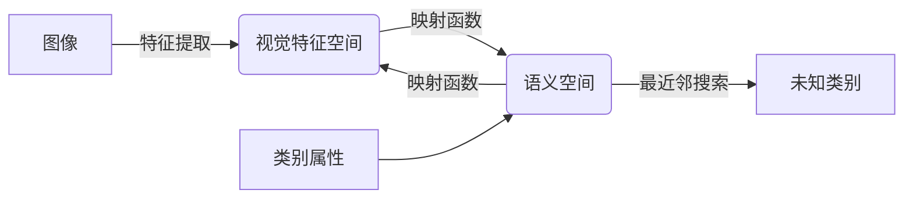

# Zero-shot Learning原理与代码实战案例讲解

## 1. 背景介绍
### 1.1 什么是Zero-shot Learning
Zero-shot Learning(ZSL),即零样本学习,是一种在训练集中没有见过某些类别样本、但测试时却要对这些类别进行识别的机器学习问题。与传统的有监督学习不同,ZSL要求模型能够识别那些在训练阶段没有见过的新类别。

### 1.2 ZSL的研究意义
ZSL的研究意义主要体现在以下几个方面:

1. 解决有监督学习的局限性。传统的有监督学习需要大量的标注数据,但现实世界中很多类别的样本难以获取或标注成本很高。ZSL可以利用已有类别的知识,扩展到未知类别的识别,突破了有监督学习的局限。

2. 提高模型的泛化能力。ZSL要求模型能够将已学习到的知识迁移到新的类别,这有助于提高模型的泛化能力,使其能够适应不断变化的现实环境。

3. 探索人类学习的奥秘。人类可以通过已有的知识和经验,快速理解和学习新事物。ZSL的研究有助于探索人类学习的机制,为构建类人智能系统提供思路。

### 1.3 ZSL的应用场景
ZSL可以应用于多个领域,例如:

1. 计算机视觉:物体识别、人脸识别、行为识别等。
2. 自然语言处理:文本分类、情感分析、语义理解等。
3. 语音识别:说话人识别、语音识别等。

## 2. 核心概念与联系
### 2.1 已知类别和未知类别
ZSL中将类别分为两类:

- 已知类别(Seen Classes):训练集中出现过的类别,模型可以直接学习它们的特征。
- 未知类别(Unseen Classes):训练集中没有出现,但测试时需要识别的新类别。

ZSL的目标就是利用已知类别的知识,对未知类别进行识别。

### 2.2 语义空间
语义空间是ZSL的核心概念之一。它是一个公共的特征空间,可以同时表示已知类别和未知类别。通常使用人工定义的属性(Attributes)或Word Embedding来构建语义空间。

- 属性(Attributes):人工定义的描述类别特征的词汇,如形状、颜色、纹理等。每个类别由一个属性向量表示。
- Word Embedding:将词映射到稠密向量的方法。可以使用预训练的词向量如Word2Vec或GloVe,将类别名映射为向量。

### 2.3 映射函数
映射函数是连接视觉特征空间和语义空间的桥梁。它可以将图像的特征表示映射到语义空间,或将语义向量映射回视觉特征空间。常见的映射函数有:

- 线性映射:如Ridge Regression、Linear Discriminant Analysis等。
- 非线性映射:如多层感知机(MLP)、核方法等。

### 2.4 概念之间的关系
下图展示了ZSL中各个概念之间的关系:



首先从图像中提取特征得到视觉特征表示,然后通过映射函数将其映射到语义空间。在语义空间中,已知类别和未知类别都有对应的向量表示。对于待识别的图像,将其映射到语义空间后,通过最近邻搜索找到与之最相似的类别向量,即可实现对未知类别的识别。

## 3. 核心算法原理具体操作步骤
ZSL的核心是学习一个映射函数,将视觉特征空间和语义空间关联起来。以下是一个典型的ZSL算法流程:

### 3.1 特征提取
对于每一张训练图像,使用预训练的CNN模型(如ResNet)提取其特征向量。将图像集表示为矩阵 $X \in \mathbb{R}^{d \times N}$,其中 $d$ 为特征维度, $N$ 为图像数量。

### 3.2 语义嵌入
对于每个类别,根据其属性或Word Embedding得到语义向量。将已知类别的语义向量表示为矩阵 $S \in \mathbb{R}^{k \times C}$,其中 $k$ 为语义空间维度, $C$ 为已知类别数量。

### 3.3 学习映射函数
学习一个映射函数 $f: \mathbb{R}^d \rightarrow \mathbb{R}^k$,将视觉特征映射到语义空间。常见的方法有:

- Ridge Regression:优化目标为最小化映射误差和正则化项:

$$\min_{W} \|S - WX\|_F^2 + \lambda\|W\|_F^2$$

其中 $W \in \mathbb{R}^{k \times d}$ 为映射矩阵。

- 多层感知机(MLP):使用多层神经网络学习非线性映射函数。

### 3.4 推理
对于测试图像,提取其特征向量 $x \in \mathbb{R}^d$,然后使用学习到的映射函数 $f$ 将其映射到语义空间:

$$\hat{s} = f(x)$$

接着,在语义空间中找到与 $\hat{s}$ 最相似的类别向量 $s_j$,即为预测的类别:

$$j = \arg\max_{i} \text{sim}(\hat{s}, s_i)$$

其中 $\text{sim}$ 为相似度度量,如余弦相似度。

## 4. 数学模型和公式详细讲解举例说明
### 4.1 问题定义
给定已知类别的训练集 $\mathcal{D} = \{(x_i, y_i)\}_{i=1}^N$,其中 $x_i \in \mathbb{R}^d$ 为第 $i$ 个样本的特征向量, $y_i \in \{1, 2, \dots, C\}$ 为其类别标签。另有未知类别的测试集 $\mathcal{D}_u = \{(x_i, y_i)\}_{i=1}^M$,其中 $y_i \in \{C+1, C+2, \dots, C+U\}$ 为未知类别的标签。ZSL的目标是学习一个分类器 $f: \mathbb{R}^d \rightarrow \{1, 2, \dots, C+U\}$,可以对未知类别进行识别。

### 4.2 语义嵌入
定义已知类别的语义矩阵 $S = [s_1, s_2, \dots, s_C] \in \mathbb{R}^{k \times C}$,其中 $s_i \in \mathbb{R}^k$ 为第 $i$ 个已知类别的语义向量。未知类别的语义矩阵定义为 $S_u = [s_{C+1}, s_{C+2}, \dots, s_{C+U}] \in \mathbb{R}^{k \times U}$。

例如,对于动物识别任务,可以定义一些属性如"有毛发"、"有爪子"、"会飞"等。已知类别"猫"的属性向量可以表示为 $[1, 1, 0]$(有毛发,有爪子,不会飞),未知类别"鹰"的属性向量可以表示为 $[1, 1, 1]$(有毛发,有爪子,会飞)。

### 4.3 映射函数学习
以Ridge Regression为例,目标是学习一个线性映射矩阵 $W \in \mathbb{R}^{k \times d}$,使得:

$$\min_{W} \sum_{i=1}^N \|s_{y_i} - Wx_i\|_2^2 + \lambda\|W\|_F^2$$

其中 $\lambda$ 为正则化系数。可以求得闭式解:

$$W = (S Y^T)(XX^T + \lambda I)^{-1}$$

其中 $Y \in \mathbb{R}^{C \times N}$ 为训练集的标签矩阵, $I$ 为单位矩阵。

### 4.4 推理
对于测试样本 $x \in \mathbb{R}^d$,首先计算其在语义空间的表示:

$$\hat{s} = Wx$$

然后在语义空间中找到与 $\hat{s}$ 最相似的类别向量:

$$y = \arg\max_{i \in \{1, 2, \dots, C+U\}} \frac{\hat{s}^T s_i}{\|\hat{s}\| \|s_i\|}$$

即为预测的类别标签。

## 5. 项目实践:代码实例和详细解释说明
下面以Python和PyTorch为例,实现一个简单的ZSL模型。

### 5.1 数据准备
首先准备训练集和测试集,分别包含图像特征和类别标签。这里假设已经提取好了图像特征,存储在 `train_features.npy` 和 `test_features.npy` 中,类别标签存储在 `train_labels.npy` 和 `test_labels.npy` 中。另外,已知类别和未知类别的语义向量分别存储在 `seen_semantics.npy` 和 `unseen_semantics.npy` 中。

```python
import numpy as np
import torch

# 加载数据
train_features = np.load('train_features.npy')
train_labels = np.load('train_labels.npy')
test_features = np.load('test_features.npy')
test_labels = np.load('test_labels.npy')
seen_semantics = np.load('seen_semantics.npy')
unseen_semantics = np.load('unseen_semantics.npy')

# 转换为PyTorch Tensor
train_features = torch.from_numpy(train_features).float()
train_labels = torch.from_numpy(train_labels).long()
test_features = torch.from_numpy(test_features).float()
test_labels = torch.from_numpy(test_labels).long()
seen_semantics = torch.from_numpy(seen_semantics).float()
unseen_semantics = torch.from_numpy(unseen_semantics).float()
```

### 5.2 定义模型
使用一个简单的线性层作为映射函数,将图像特征映射到语义空间。

```python
class ZSLModel(torch.nn.Module):
    def __init__(self, feature_dim, semantic_dim):
        super(ZSLModel, self).__init__()
        self.mapping = torch.nn.Linear(feature_dim, semantic_dim)
    
    def forward(self, features):
        return self.mapping(features)
```

### 5.3 训练模型
使用Ridge Regression的闭式解直接求解映射矩阵。

```python
def train(model, train_features, train_labels, seen_semantics, lambda_=1e-3):
    X = train_features
    Y = torch.zeros(seen_semantics.shape[0], train_features.shape[0]).scatter_(0, train_labels.unsqueeze(0), 1)
    W = torch.matmul(seen_semantics, Y) @ torch.inverse(X @ X.t() + lambda_ * torch.eye(X.shape[1]))
    model.mapping.weight.data = W.t()
```

### 5.4 测试模型
在测试集上评估模型的性能。

```python
def test(model, test_features, test_labels, seen_semantics, unseen_semantics):
    model.eval()
    with torch.no_grad():
        semantics = torch.cat([seen_semantics, unseen_semantics], dim=0)
        outputs = model(test_features)
        _, preds = torch.max(outputs @ semantics.t(), dim=1)
        acc = (preds == test_labels).float().mean()
    return acc

# 实例化模型
model = ZSLModel(train_features.shape[1], seen_semantics.shape[1])

# 训练模型
train(model, train_features, train_labels, seen_semantics)

# 测试模型
acc = test(model, test_features, test_labels, seen_semantics, unseen_semantics)
print(f'Test Accuracy: {acc:.4f}')
```

以上就是一个简单的ZSL模型的PyTorch实现。实际应用中,可以使用更加复杂的模型结构和训练技巧,如多层感知机、对抗训练等,来进一步提高性能。

## 6. 实际应用场景
ZSL可以应用于多个领域,下面列举几个具体的应用场景。

### 6.1 细粒度物体识别
在细粒度物体识别任务中,类别数量通常很多,且许多类别的训练样本难以获取。例如鸟类识别,不同种类的鸟类外观相似,需要专家进行标注。使用ZSL可以利用现有鸟类的知识,如鸟类的外观属性、生活习性等,来识别新的鸟类。

### 6.2 人脸识别
人脸识别在安防、支付等领域有广泛应用。但在实际场景中,可能会遇到未知人物的人脸图像。利用ZSL,