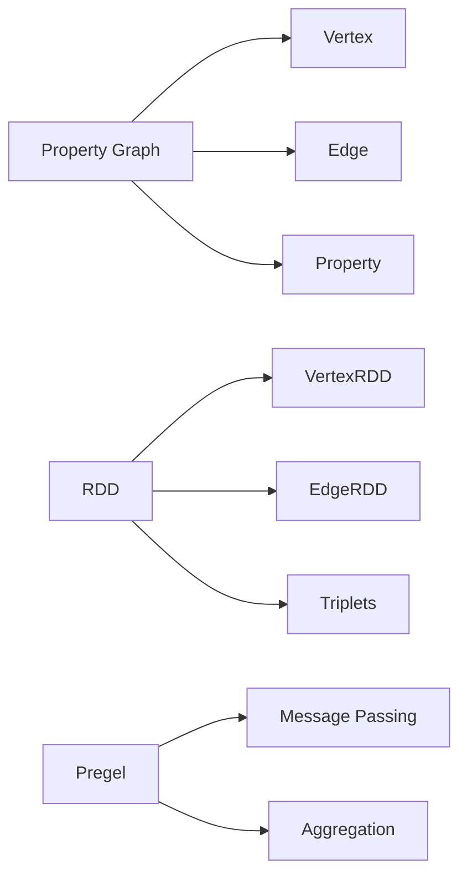

# 【AI大数据计算原理与代码实例讲解】GraphX

## 1.背景介绍

在大数据时代,图计算已成为数据处理和分析的重要手段。图计算通过将复杂的数据关系抽象为点和边,能够高效地分析和挖掘数据中蕴含的价值。Apache Spark作为当前最流行的大数据处理框架之一,其图计算组件GraphX为我们提供了强大的图计算能力。本文将深入探讨GraphX的核心概念、原理和应用,帮助读者掌握这一前沿技术。

### 1.1 大数据时代的图计算

#### 1.1.1 图数据无处不在
#### 1.1.2 图计算的优势  
#### 1.1.3 图计算的应用场景

### 1.2 Spark与GraphX概述

#### 1.2.1 Spark生态系统
#### 1.2.2 GraphX在Spark中的定位
#### 1.2.3 GraphX的特点和优势

## 2.核心概念与联系

要理解GraphX,首先需要掌握其核心概念。本章将介绍GraphX中的基本术语,以及它们之间的关系。

### 2.1 Property Graph

#### 2.1.1 点(Vertex)
#### 2.1.2 边(Edge) 
#### 2.1.3 属性(Property)

### 2.2 RDD

#### 2.2.1 RDD概念
#### 2.2.2 VertexRDD和EdgeRDD
#### 2.2.3 triplets

### 2.3 Pregel

#### 2.3.1 Pregel计算模型
#### 2.3.2 消息传递
#### 2.3.3 聚合

### 2.4 核心概念关系图



## 3.核心算法原理具体操作步骤

GraphX实现了多种经典图算法,本章将详细讲解其中几种算法的原理和实现步骤。

### 3.1 PageRank

#### 3.1.1 PageRank算法原理
#### 3.1.2 GraphX中PageRank的实现步骤
#### 3.1.3 收敛条件

### 3.2 Connected Components

#### 3.2.1 Connected Components问题定义
#### 3.2.2 GraphX中CC算法的实现步骤 
#### 3.2.3 结果解释

### 3.3 Triangle Counting

#### 3.3.1 Triangle的定义
#### 3.3.2 GraphX中Triangle Counting的实现步骤
#### 3.3.3 结果统计

## 4.数学模型和公式详细讲解举例说明

图算法往往基于严谨的数学模型,本章将通过具体的例子讲解GraphX中用到的数学公式。

### 4.1 图的数学表示

#### 4.1.1 邻接矩阵
$$
A = 
\begin{bmatrix}
0 & 1 & 0 \\
1 & 0 & 1 \\
0 & 1 & 0
\end{bmatrix}
$$

#### 4.1.2 邻接表

### 4.2 PageRank公式

$$
PR(u) = \frac{1-d}{N} + d \sum_{v \in B_u} \frac{PR(v)}{L(v)}
$$

其中:
- $PR(u)$ 是节点 $u$ 的PageRank值
- $B_u$ 是指向 $u$ 的节点集合
- $L(v)$ 是 $v$ 的出度
- $N$ 是图中节点总数
- $d$ 是阻尼系数,通常取0.85

### 4.3 Pregel中的聚合

假设每个节点的初始值为 $x_i^{(0)}$,第 $k$ 轮迭代后节点 $i$ 的值为:

$$
x_i^{(k)} = \sum_{j \in N(i)} f(x_j^{(k-1)})
$$

其中 $N(i)$ 是与节点 $i$ 相邻的节点集合,$f$ 是聚合函数。

## 5.项目实践：代码实例和详细解释说明

本章将通过完整的代码实例,演示如何使用GraphX进行图计算。

### 5.1 环境准备

#### 5.1.1 Spark安装
#### 5.1.2 GraphX依赖

### 5.2 创建Graph

```scala
val users = sc.textFile("users.txt").map(line => line.split(",")).map(parts => (parts(0).toLong, parts(1)))
val relationships = sc.textFile("relationships.txt").map(line => line.split(",")).map(parts => Edge(parts(0).toLong, parts(1).toLong, parts(2).toDouble))
val graph = Graph(users, relationships)
```

这段代码从文本文件中读取节点和边的数据,然后创建了一个Graph对象。

### 5.3 运行PageRank

```scala
val ranks = graph.pageRank(0.0001).vertices
ranks.join(users).map(t => (t._2._2, t._2._1)).sortBy(_._2, false).take(10).foreach(println)
```

这段代码在graph上运行PageRank算法,然后取出计算结果的top10。

### 5.4 计算Connected Components

```scala
val cc = graph.connectedComponents().vertices
cc.join(users).map(t => (t._2._2, t._2._1)).take(10).foreach(println)  
```

这段代码计算graph的连通分量,并打印出每个节点所属的连通分量ID。

## 6.实际应用场景

图计算在现实世界中有广泛的应用,本章介绍几个典型的应用场景。

### 6.1 社交网络分析

#### 6.1.1 影响力分析
#### 6.1.2 社区发现
#### 6.1.3 链路预测

### 6.2 推荐系统

#### 6.2.1 基于图的协同过滤
#### 6.2.2 随机游走算法

### 6.3 欺诈检测

#### 6.3.1 异常节点检测 
#### 6.3.2 异常边检测

## 7.工具和资源推荐

### 7.1 图形化工具

#### 7.1.1 Gephi
#### 7.1.2 Cytoscape

### 7.2 开源项目

#### 7.2.1 GraphFrames
#### 7.2.2 Neo4j

### 7.3 学习资源

#### 7.3.1 官方文档
#### 7.3.2 论文
#### 7.3.3 课程

## 8.总结：未来发展趋势与挑战

### 8.1 图神经网络

#### 8.1.1 GNN的兴起
#### 8.1.2 GNN与GraphX的结合

### 8.2 大规模图计算

#### 8.2.1 图的分布式存储
#### 8.2.2 增量计算

### 8.3 实时图计算

#### 8.3.1 流式图计算
#### 8.3.2 Spark Structured Streaming + GraphX

## 9.附录：常见问题与解答

### 9.1 GraphX与GraphFrames的区别？
### 9.2 GraphX能处理多大规模的图？
### 9.3 如何处理带权重的图？
### 9.4 如何实现自定义的图算法？

作者：禅与计算机程序设计艺术 / Zen and the Art of Computer Programming