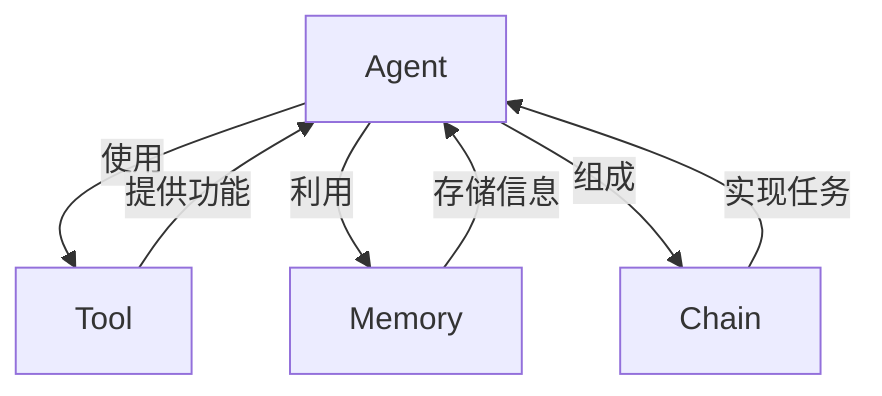
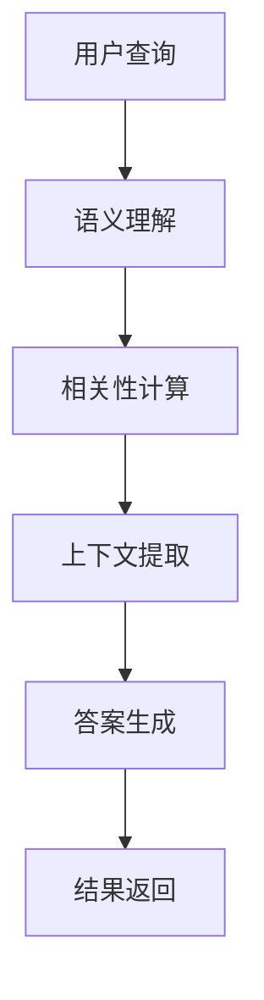

# 【LangChain编程：从入门到实践】基于文档问答场景

## 1. 背景介绍

在当今信息时代,海量的文本数据无处不在。无论是企业内部的知识库、客户支持文档,还是公开的新闻报道、产品手册等,这些文本数据蕴含着宝贵的信息。然而,有效地利用这些信息并从中获取有价值的见解,一直是一个巨大的挑战。

传统的信息检索方式,如基于关键词搜索,往往效率低下且不够精准。而最新的自然语言处理(NLP)技术为我们提供了一种全新的解决方案:基于文档的问答系统。这种系统能够理解用户的自然语言查询,并从给定的文档集合中找到最相关的答案片段。

LangChain是一个强大的Python库,旨在简化基于文档的问答系统的构建过程。它将最先进的NLP模型与传统的数据处理技术相结合,提供了一个统一的框架,使开发人员能够快速构建出高质量的问答应用。

在本文中,我们将深入探讨LangChain的核心概念、算法原理和实践应用,帮助读者从入门到实践,掌握利用LangChain构建基于文档的问答系统的技能。

## 2. 核心概念与联系

LangChain的核心概念包括Agent、Tool、Memory和Chain。这些概念相互关联,共同构建了一个灵活且可扩展的问答系统框架。



### 2.1 Agent

Agent是LangChain中的核心组件,它扮演着智能代理的角色。Agent能够理解用户的自然语言查询,并根据查询内容选择合适的Tool来执行相应的操作,最终返回查询结果。

Agent的行为由其内部的决策逻辑所驱动。LangChain提供了多种预定义的Agent,如ZeroShotAgent、ConversationAgent等,同时也支持自定义Agent的开发。

### 2.2 Tool

Tool是LangChain中的功能组件,它封装了各种数据处理和NLP任务,如文本摘要、语义搜索、问答等。Agent通过调用不同的Tool来完成特定的任务。

LangChain内置了多种常用的Tool,如Wikipedia搜索、Python REPL等。开发者也可以轻松地定义和集成自定义Tool。

### 2.3 Memory

Memory用于存储Agent在执行任务过程中的中间状态和上下文信息。它可以是短期的会话级内存,也可以是长期的持久化存储。通过利用Memory,Agent能够维持对话的连贯性,并基于之前的交互历史做出更加准确的决策。

### 2.4 Chain

Chain是将多个Agent、Tool和Memory组合在一起的高级抽象。它定义了一系列需要执行的步骤,以及每个步骤使用的组件。Chain使得复杂任务的实现变得简单,开发者只需关注整体流程,而不必过多关注底层细节。

LangChain提供了多种预定义的Chain,如SequentialChain、ConversationChain等,同时也支持自定义Chain的开发。

## 3. 核心算法原理具体操作步骤

LangChain的核心算法原理基于自然语言处理(NLP)和信息检索技术。在构建基于文档的问答系统时,LangChain会执行以下主要步骤:



### 3.1 语义理解

首先,LangChain会利用NLP模型对用户的自然语言查询进行语义理解。这一步骤的目标是捕获查询的意图和关键信息,为后续的相关性计算和答案生成奠定基础。

### 3.2 相关性计算

接下来,LangChain会计算查询与给定文档集合中每个文档的相关性得分。这一步骤通常基于向量空间模型(VSM)或更先进的语义相似度模型,如BERT等。相关性得分用于确定哪些文档最有可能包含查询的答案。

### 3.3 上下文提取

对于相关性较高的文档,LangChain会提取与查询最相关的文本片段,作为答案生成的上下文信息。这一步骤通常采用滑动窗口或其他分块算法来识别关键上下文。

### 3.4 答案生成

有了上下文信息,LangChain就可以利用NLP模型生成对用户查询的答案。这一步骤可能涉及问答模型、摘要模型或其他自然语言生成模型,以产生人性化、连贯的答案。

### 3.5 结果返回

最后,LangChain会将生成的答案返回给用户,完成整个问答过程。在某些情况下,系统可能会进一步与用户进行对话式交互,以获取更多上下文信息,从而提高答案的准确性和相关性。

## 4. 数学模型和公式详细讲解举例说明

在LangChain的核心算法中,数学模型和公式扮演着重要的角色,尤其是在相关性计算和语义理解方面。让我们深入探讨一些常见的数学模型和公式。

### 4.1 向量空间模型(VSM)

向量空间模型(VSM)是一种广泛应用于信息检索和自然语言处理的数学模型。在VSM中,每个文档或查询都被表示为一个向量,其中每个维度对应一个特征(通常是单词)的权重。

给定一个文档向量$\vec{d}$和查询向量$\vec{q}$,它们之间的相似度可以使用余弦相似度公式计算:

$$\text{sim}(\vec{d}, \vec{q}) = \frac{\vec{d} \cdot \vec{q}}{|\vec{d}||\vec{q}|}$$

其中$\vec{d} \cdot \vec{q}$表示向量点积,而$|\vec{d}|$和$|\vec{q}|$分别表示向量的范数。余弦相似度的取值范围在$[-1, 1]$之间,值越接近1,表示两个向量越相似。

在LangChain中,VSM通常用于计算查询与文档之间的初步相关性得分,为后续的语义相似度计算提供基础。

### 4.2 BERT语义相似度

BERT(Bidirectional Encoder Representations from Transformers)是一种先进的预训练语言模型,它能够捕捉单词之间的上下文关系,从而更准确地表示文本的语义信息。

在LangChain中,BERT可以用于计算查询和文档之间的语义相似度。具体来说,我们可以将查询和文档输入到BERT模型中,获取它们对应的向量表示$\vec{q}$和$\vec{d}$,然后计算它们之间的余弦相似度:

$$\text{sim}_{\text{BERT}}(\vec{q}, \vec{d}) = \frac{\vec{q} \cdot \vec{d}}{|\vec{q}||\vec{d}|}$$

与传统的VSM相比,BERT语义相似度能够更好地捕捉语义级别的相关性,从而提高问答系统的准确性。

### 4.3 TF-IDF权重

在VSM中,每个特征(单词)的权重通常使用TF-IDF(Term Frequency-Inverse Document Frequency)公式计算。TF-IDF旨在降低常见单词的权重,同时提高稀有单词的权重,从而提高文档表示的discriminative能力。

给定一个单词$w$、文档$d$和文档集合$D$,TF-IDF权重可以计算如下:

$$\text{tfidf}(w, d, D) = \text{tf}(w, d) \times \text{idf}(w, D)$$

其中,

- $\text{tf}(w, d)$表示单词$w$在文档$d$中出现的频率,可以使用原始计数或者对数缩放等方式计算。
- $\text{idf}(w, D) = \log \frac{|D|}{|\{d \in D : w \in d\}|}$表示单词$w$在文档集合$D$中的逆文档频率,用于降低常见单词的权重。

通过将TF-IDF权重应用于VSM,LangChain能够更好地表示文档和查询的关键信息,从而提高相关性计算的准确性。

## 5. 项目实践:代码实例和详细解释说明

为了更好地理解LangChain的使用方式,让我们通过一个实际项目来探索它的强大功能。在这个项目中,我们将构建一个基于文档的问答系统,用于回答有关Python编程的各种问题。

### 5.1 准备数据

首先,我们需要准备一些Python相关的文档作为知识库。在这个例子中,我们将使用Python官方文档的一部分。你可以从网上下载相关文件,或者使用LangChain提供的`load_dataset`函数从Hugging Face数据集中加载数据。

```python
from langchain.document_loaders import TextLoader
loader = TextLoader('path/to/python_docs.txt')
docs = loader.load()
```

### 5.2 创建向量存储

为了高效地检索相关文档,我们需要将文档向量化并存储在一个向量数据库中。LangChain支持多种向量存储后端,如Chroma、FAISS等。这里我们使用内存中的简单存储作为示例:

```python
from langchain.vectorstores import FAISS
from langchain.embeddings import OpenAIEmbeddings

embeddings = OpenAIEmbeddings()
vector_store = FAISS.from_documents(docs, embeddings)
```

### 5.3 创建检索器

接下来,我们创建一个检索器(Retriever),用于从向量存储中查找与查询最相关的文档片段:

```python
from langchain.retrievers import TimeWeightRetrievalQueryingRetrieve

retriever = TimeWeightRetrievalQueryingRetrieve(vector_store=vector_store)
```

### 5.4 创建问答链

现在,我们可以将检索器与一个问答链(Chain)结合起来,构建完整的问答系统:

```python
from langchain.chains import RetrievalQA

qa = RetrievalQA.from_chain_type(
    llm=OpenAI(),
    chain_type="stuff",
    retriever=retriever,
    return_source_documents=True
)
```

在这个例子中,我们使用了`RetrievalQA`链,它将检索器与一个语言模型(如OpenAI的GPT-3)结合在一起,用于生成答案。`return_source_documents=True`确保系统返回支持答案的原始文档片段。

### 5.5 提问并获取答案

现在,我们可以向问答系统提出各种Python相关的问题,并获取答案:

```python
query = "How do I open a file in Python?"
result = qa({"query": query})
print(result['result'])
```

输出结果可能如下所示:

```
To open a file in Python, you can use the built-in `open()` function. Here's an example:

```python
file = open('filename.txt', 'r')
# read contents of the file
contents = file.read()
# close the file
file.close()
```

The `open()` function takes two arguments: the file path and the mode ('r' for read, 'w' for write, 'a' for append, etc.). It returns a file object that you can use to read from or write to the file.

You should always remember to close the file after you're done with it to avoid resource leaks.

Source documents:
- File Objects (https://docs.python.org/3/tutorial/inputoutput.html#reading-and-writing-files)
```

正如你所看到的,LangChain能够从相关文档中提取答案,并以人性化的方式呈现给用户。你可以继续探索更多功能,如对话式问答、结果重构等,以满足不同的需求。

## 6. 实际应用场景

基于文档的问答系统在各个领域都有广泛的应用前景,包括但不限于:

### 6.1 企业知识管理

在企业内部,知识管理一直是一个巨大的挑战。员工需要快速获取所需的信息,以提高工作效率。基于文档的问答系统可以帮助员工轻松访问公司政策、产品手册、最佳实践等内容,从而提高知识共享和利用率。

### 6.2 客户服务和支持

客户服务是许多企业的重点领域。通过构建基于文档的问答系统,客户可以自助解决常见问题,而无需等待人工支持。这不仅能够提高客户满意度,还能够减轻客服人员的工作压力。

### 6.3 电子商务和产品信息