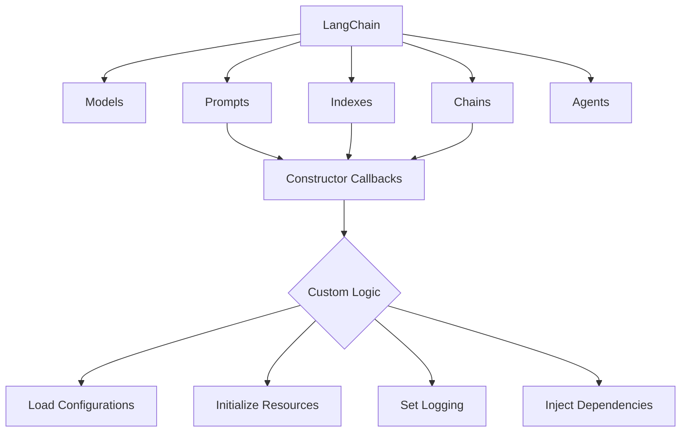

# 【LangChain编程：从入门到实践】构造器回调

## 1. 背景介绍
### 1.1 LangChain简介
LangChain是一个强大的开源框架，旨在简化和加速使用大型语言模型(LLMs)构建应用程序的过程。它提供了一组工具和组件，可以轻松地将LLMs集成到各种应用程序中，如聊天机器人、问答系统、文本摘要等。LangChain的目标是让开发人员能够快速构建基于LLMs的应用程序，而无需从头开始编写所有代码。

### 1.2 构造器回调的重要性
在使用LangChain构建应用程序时，构造器回调(Constructor Callbacks)是一个非常重要的概念。构造器回调允许开发人员在创建LangChain组件实例时执行自定义逻辑。这种机制使得开发人员能够灵活地控制组件的初始化过程，并根据特定需求进行定制。构造器回调在许多场景下都非常有用，例如加载自定义配置、初始化外部资源、设置日志记录等。

## 2. 核心概念与联系
### 2.1 LangChain的核心组件
LangChain由几个核心组件组成，包括：

- Models：语言模型，如OpenAI的GPT系列模型。
- Prompts：提示模板，用于格式化输入文本以供语言模型处理。
- Indexes：索引，用于存储和检索文档以供语言模型使用。
- Chains：链，将多个组件组合在一起以执行特定任务。
- Agents：代理，根据给定的输入自主执行任务。

这些组件相互协作，共同构建了LangChain的功能。

### 2.2 构造器回调在LangChain中的作用
构造器回调在LangChain的各个组件中都发挥着重要作用。它们允许开发人员在创建组件实例时注入自定义逻辑，从而实现更高级别的控制和定制。例如，在创建提示模板时，可以使用构造器回调来加载自定义模板文件；在创建索引时，可以使用构造器回调来配置索引的存储位置和参数；在创建链时，可以使用构造器回调来设置链的输入输出处理逻辑等。

## 3. 核心算法原理具体操作步骤
### 3.1 定义构造器回调函数
要使用构造器回调，首先需要定义一个回调函数。回调函数接受一个参数，即正在创建的组件实例。在回调函数中，可以访问和修改组件实例的属性和方法。

```python
def my_callback(instance):
    # 在此处编写自定义逻辑
    pass
```

### 3.2 注册构造器回调
定义回调函数后，需要将其注册到相应的组件类中。LangChain提供了一个装饰器`@classmethod`，用于注册构造器回调。

```python
from langchain.callbacks import ConstructorCallback

@classmethod
def register_callback(cls, callback):
    cls._constructor_callbacks.append(callback)
```

### 3.3 触发构造器回调
当创建组件实例时，LangChain会自动触发已注册的构造器回调函数。回调函数会按照注册的顺序依次执行。

```python
instance = SomeComponent()  # 创建组件实例时触发回调
```

## 4. 数学模型和公式详细讲解举例说明
在LangChain中，构造器回调的执行过程可以用以下数学模型来表示：

令 $C$ 表示一个组件类，$I$ 表示该组件类的实例，$F_1, F_2, ..., F_n$ 表示注册到该组件类的 $n$ 个构造器回调函数。

当创建组件实例 $I$ 时，LangChain会按照以下步骤执行构造器回调：

$$
\begin{aligned}
I &= C() \\
I &= F_1(I) \\
I &= F_2(I) \\
&\vdots \\
I &= F_n(I)
\end{aligned}
$$

其中，$C()$ 表示调用组件类的构造函数创建实例，$F_i(I)$ 表示将实例 $I$ 传递给第 $i$ 个构造器回调函数并返回修改后的实例。

例如，假设有一个名为 `MyComponent` 的组件类，并注册了两个构造器回调函数 `callback1` 和 `callback2`。创建 `MyComponent` 的实例时，执行过程如下：

$$
\begin{aligned}
I &= \text{MyComponent}() \\
I &= \text{callback1}(I) \\
I &= \text{callback2}(I)
\end{aligned}
$$

最终得到的实例 $I$ 就是经过所有构造器回调函数修改后的结果。

## 5. 项目实践：代码实例和详细解释说明
下面是一个使用构造器回调的完整代码示例：

```python
from langchain.prompts import PromptTemplate
from langchain.callbacks import ConstructorCallback

# 定义构造器回调函数
def my_callback(instance):
    instance.input_variables = ["name", "age"]
    instance.template = "你好 {name}，你今年 {age} 岁了。"

# 注册构造器回调
PromptTemplate.register_callback(my_callback)

# 创建 PromptTemplate 实例
prompt = PromptTemplate()

# 打印 PromptTemplate 实例的属性
print(prompt.input_variables)  # 输出: ["name", "age"]
print(prompt.template)  # 输出: 你好 {name}，你今年 {age} 岁了。
```

在这个示例中，我们定义了一个名为 `my_callback` 的构造器回调函数，它接受一个 `PromptTemplate` 实例作为参数。在回调函数内部，我们修改了实例的 `input_variables` 和 `template` 属性。

然后，我们使用 `PromptTemplate.register_callback()` 方法将 `my_callback` 函数注册为构造器回调。

当我们创建 `PromptTemplate` 实例时，LangChain 会自动触发已注册的构造器回调函数。在这个例子中，`my_callback` 函数会被调用，并修改实例的属性。

最后，我们打印了 `PromptTemplate` 实例的 `input_variables` 和 `template` 属性，可以看到它们已经被修改为回调函数中设置的值。

通过使用构造器回调，我们可以在创建 `PromptTemplate` 实例时动态地设置其属性，而无需显式地传递参数。这种方式使得代码更加简洁和可重用。

## 6. 实际应用场景
构造器回调在实际应用中有许多用途，下面是几个常见的场景：

### 6.1 加载自定义配置
在创建 LangChain 组件实例时，可以使用构造器回调来加载自定义配置文件。例如，可以从 JSON 或 YAML 文件中读取配置，并将其应用于组件实例。

### 6.2 初始化外部资源
某些 LangChain 组件可能依赖于外部资源，如数据库连接、API 客户端等。可以使用构造器回调在创建组件实例时初始化这些外部资源，并将其附加到实例上。

### 6.3 设置日志记录
构造器回调可以用于配置组件的日志记录行为。例如，可以在回调函数中设置日志级别、日志格式、日志处理程序等。

### 6.4 注入依赖项
在使用依赖注入的系统中，可以使用构造器回调来注入组件所需的依赖项。回调函数可以从容器中解析依赖项，并将其传递给组件实例。

## 7. 工具和资源推荐
以下是一些与 LangChain 和构造器回调相关的有用工具和资源：

- [LangChain 官方文档](https://langchain.readthedocs.io/)：LangChain 的官方文档，提供了详细的 API 参考和使用指南。
- [LangChain GitHub 仓库](https://github.com/hwchase17/langchain)：LangChain 的源代码仓库，可以了解框架的内部实现细节。
- [LangChain 社区论坛](https://community.langchain.com/)：LangChain 的官方社区论坛，可以与其他开发者交流和寻求帮助。
- [Python 装饰器教程](https://realpython.com/primer-on-python-decorators/)：一篇关于 Python 装饰器的详细教程，有助于理解 LangChain 中的回调注册机制。

## 8. 总结：未来发展趋势与挑战
构造器回调是 LangChain 框架中一个强大而灵活的特性，它允许开发人员在创建组件实例时注入自定义逻辑，从而实现更高级别的控制和定制。随着 LangChain 的不断发展和完善，构造器回调的应用场景也将越来越广泛。

未来，LangChain 可能会引入更多类型的回调，如方法调用回调、事件回调等，以满足不同的需求。同时，LangChain 也面临着一些挑战，例如如何平衡回调的灵活性和性能开销，如何确保回调函数的正确性和安全性等。

总的来说，构造器回调是 LangChain 框架中一个非常有用的特性，它为开发人员提供了更大的灵活性和可定制性。通过合理地使用构造器回调，可以显著提高基于 LangChain 构建的应用程序的可扩展性和可维护性。

## 9. 附录：常见问题与解答
### 9.1 什么是构造器回调？
构造器回调是一种机制，允许开发人员在创建 LangChain 组件实例时执行自定义逻辑。通过注册回调函数，可以在实例化组件时动态地修改组件的属性和行为。

### 9.2 如何定义和注册构造器回调函数？
要定义构造器回调函数，需要创建一个接受组件实例作为参数的函数。然后，使用 `@classmethod` 装饰器将回调函数注册到相应的组件类中。例如：

```python
def my_callback(instance):
    # 自定义逻辑
    pass

MyComponent.register_callback(my_callback)
```

### 9.3 构造器回调函数的执行顺序是什么？
构造器回调函数按照注册的顺序依次执行。如果多个回调函数被注册到同一个组件类中，它们将按照注册的先后顺序依次调用。

### 9.4 构造器回调函数可以访问和修改哪些属性？
构造器回调函数可以访问和修改组件实例的任何公共属性和方法。但是，为了维护代码的可读性和可维护性，建议只修改与回调函数相关的属性，而不要对组件的核心逻辑进行修改。

### 9.5 使用构造器回调有哪些注意事项？
使用构造器回调时，需要注意以下几点：

- 回调函数应该尽可能简单和专注，避免引入复杂的逻辑或副作用。
- 回调函数应该是幂等的，即多次调用应该产生相同的结果。
- 回调函数应该考虑线程安全性，特别是在多线程环境下使用时。
- 过度使用回调函数可能会导致代码难以理解和维护，因此应该适度使用。

以上是关于 LangChain 构造器回调的详细介绍。通过理解和应用构造器回调，开发人员可以更好地利用 LangChain 框架的灵活性和可扩展性，从而构建出功能强大、可定制的应用程序。

作者：禅与计算机程序设计艺术 / Zen and the Art of Computer Programming

