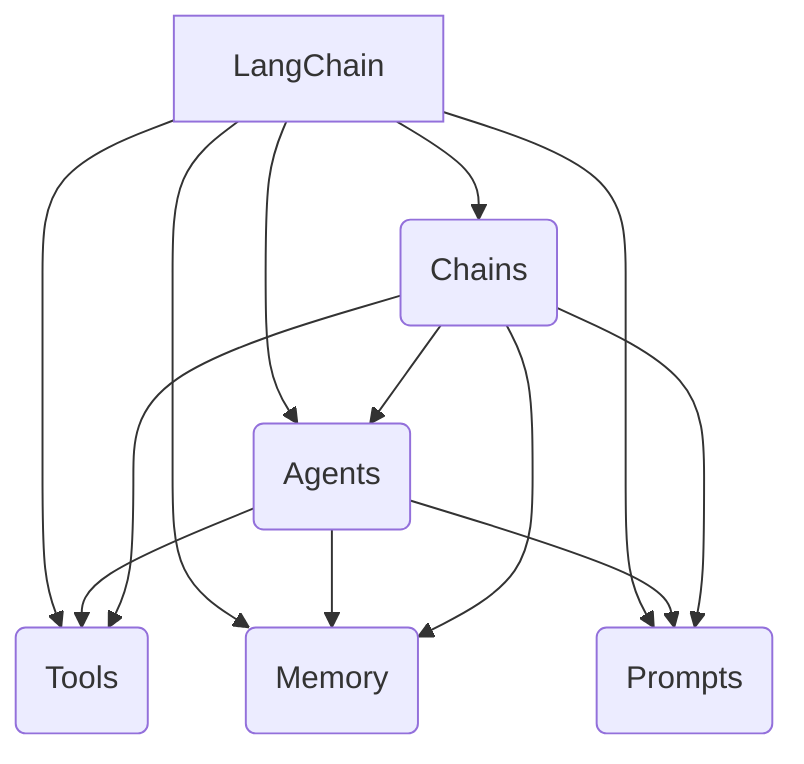
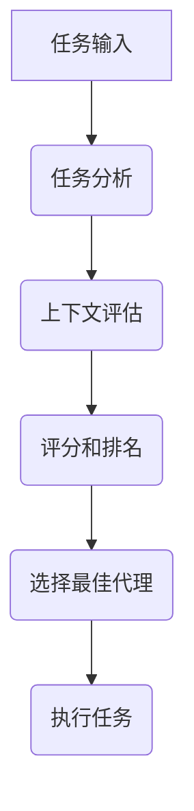
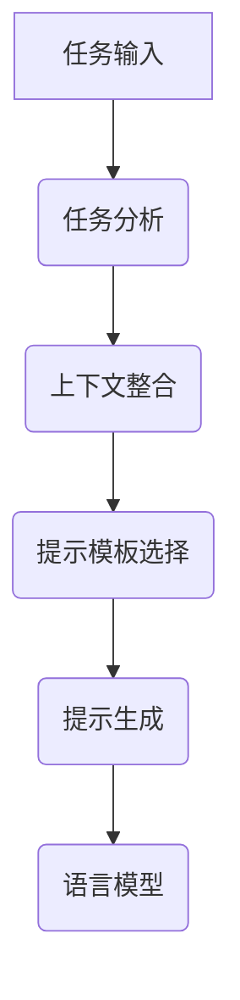
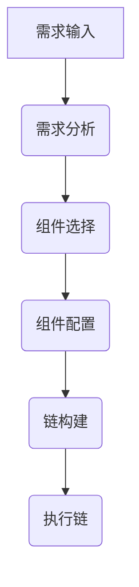

# 【LangChain编程：从入门到实践】消息处理框架

## 1. 背景介绍

### 1.1 人工智能时代的到来

在当今时代，人工智能(AI)已经渗透到我们生活的方方面面。从语音助手到自动驾驶汽车，AI正在彻底改变我们与技术的交互方式。随着数据量的激增和计算能力的提高,AI系统变得越来越强大,能够处理复杂的任务,并提供智能化的解决方案。

### 1.2 消息处理的重要性

在这个数字化时代,消息处理已经成为各种应用程序和系统的核心组成部分。无论是聊天机器人、客户服务系统还是企业协作平台,它们都需要高效地处理来自不同渠道的大量消息。有效的消息处理可以提高系统的响应速度、改善用户体验,并为企业带来竞争优势。

### 1.3 LangChain的崛起

LangChain是一个新兴的Python库,旨在简化构建消息处理应用程序的过程。它提供了一种统一的方式来构建、组合和部署语言模型,使开发人员能够快速构建智能对话系统、问答系统和任务自动化工具。LangChain的灵活性和可扩展性使其成为构建复杂AI应用程序的理想选择。

## 2. 核心概念与联系

### 2.1 LangChain的核心概念

LangChain的核心概念包括:

1. **Agents**: 代理是LangChain中的核心概念,它们是具有特定功能的自治实体,可以执行各种任务,如问答、分析和生成内容。

2. **Tools**: 工具是代理可以利用的外部资源,例如搜索引擎、数据库或API。代理可以根据需要选择和组合不同的工具来完成任务。

3. **Memory**: 内存用于存储代理在执行任务过程中的中间状态和上下文信息,以保持对话的连贯性和一致性。

4. **Prompts**: 提示是用于指导语言模型生成所需输出的指令或示例。LangChain提供了一种简单的方式来构建和管理提示。

5. **Chains**: 链是将多个组件(如代理、工具和内存)组合在一起的方式,以构建复杂的工作流程。

这些概念相互关联,共同构建了LangChain的核心框架。开发人员可以灵活地组合和扩展这些概念,以满足各种消息处理需求。



### 2.2 LangChain与其他框架的关系

LangChain旨在与现有的语言模型框架(如Hugging Face的Transformers和OpenAI的GPT)无缝集成。它提供了一种统一的方式来利用这些模型的强大功能,同时抽象出底层的复杂性。

此外,LangChain还可以与其他数据处理和任务管理框架(如Pandas、Spark和Prefect)集成,从而构建端到端的AI解决方案。

## 3. 核心算法原理具体操作步骤

### 3.1 代理选择算法

LangChain的代理选择算法是其核心功能之一。它决定了在给定任务和上下文下,应该选择哪个代理来执行操作。该算法基于以下几个关键步骤:

1. **任务分析**: 首先,算法会分析输入的任务,并将其与代理的功能进行匹配。

2. **上下文评估**: 接下来,算法会评估当前的上下文信息,包括代理的历史记录、可用工具和内存状态。

3. **评分和排名**: 对于每个潜在的代理,算法会根据其与任务的匹配程度和上下文相关性进行评分和排名。

4. **选择最佳代理**: 最后,算法会选择得分最高的代理来执行任务。



### 3.2 提示工程

提示工程是LangChain中另一个关键的算法。它负责生成高质量的提示,以指导语言模型生成所需的输出。提示工程算法包括以下步骤:

1. **任务分析**: 首先,算法会分析输入的任务,以确定所需的输出类型和格式。

2. **上下文整合**: 接下来,算法会整合相关的上下文信息,如任务描述、示例输入/输出和约束条件。

3. **提示模板选择**: 根据任务类型和上下文,算法会选择合适的提示模板。

4. **提示生成**: 最后,算法会将上下文信息插入到提示模板中,生成最终的提示。



### 3.3 链构建算法

LangChain的链构建算法用于组合多个组件(如代理、工具和内存),以构建复杂的工作流程。该算法遵循以下步骤:

1. **需求分析**: 首先,算法会分析输入的需求,确定所需的功能和约束条件。

2. **组件选择**: 接下来,算法会从可用的组件库中选择合适的代理、工具和内存。

3. **组件配置**: 选择好组件后,算法会根据需求和约束条件对它们进行配置。

4. **链构建**: 最后,算法会将配置好的组件按照特定的顺序和逻辑连接起来,形成一个完整的链。



## 4. 数学模型和公式详细讲解举例说明

### 4.1 语言模型的数学表示

语言模型是LangChain中核心的组成部分,它们用于生成自然语言输出。许多语言模型都基于神经网络,特别是transformer模型。

transformer模型的核心是自注意力机制,它可以捕捉输入序列中任意两个位置之间的依赖关系。给定一个输入序列 $X = (x_1, x_2, \dots, x_n)$,自注意力机制计算每个位置的表示 $h_i$ 如下:

$$h_i = \sum_{j=1}^n \alpha_{ij}(x_jW^V)$$

其中 $\alpha_{ij}$ 是注意力权重,表示位置 $i$ 对位置 $j$ 的注意力程度。注意力权重通过以下公式计算:

$$\alpha_{ij} = \frac{e^{s_{ij}}}{\sum_{k=1}^n e^{s_{ik}}}$$

$$s_{ij} = (x_iW^Q)(x_jW^K)^T$$

$W^Q$、$W^K$ 和 $W^V$ 是可学习的权重矩阵,用于将输入转换为查询(Query)、键(Key)和值(Value)向量。

通过堆叠多个自注意力层和前馈神经网络层,transformer模型可以学习复杂的语言模式,并生成高质量的自然语言输出。

### 4.2 提示工程的数学建模

提示工程是指设计高质量的提示,以指导语言模型生成所需的输出。一种常见的提示工程技术是在原始提示中插入示例输入/输出对,以帮助语言模型理解所需的任务。

假设我们有一个任务 $T$,需要将输入 $X$ 映射到输出 $Y$。我们可以构建一个包含 $k$ 个示例对的提示 $P$:

$$P = [X_1, Y_1, X_2, Y_2, \dots, X_k, Y_k, X]$$

语言模型的目标是学习从输入 $X$ 生成与示例输出 $Y_1, Y_2, \dots, Y_k$ 一致的输出 $Y$。

为了量化提示的质量,我们可以定义一个损失函数 $L(Y, \hat{Y})$,用于衡量模型输出 $\hat{Y}$ 与期望输出 $Y$ 之间的差异。优化目标是最小化损失函数:

$$\min_\theta L(Y, \hat{Y})$$

其中 $\theta$ 是语言模型的参数。

通过优化损失函数,语言模型可以学习从高质量的提示中生成所需的输出。提示工程的关键在于设计合适的示例对,以最大程度地指导语言模型完成特定任务。

## 5. 项目实践: 代码实例和详细解释说明

在本节中,我们将通过一个实际的代码示例来展示如何使用LangChain构建一个简单的问答系统。

### 5.1 安装LangChain

首先,我们需要安装LangChain库。您可以使用pip进行安装:

```bash
pip install langchain
```

### 5.2 导入必要的模块

接下来,我们需要导入一些必要的模块:

```python
from langchain.agents import initialize_agent, Tool
from langchain.llms import OpenAI
```

- `initialize_agent` 用于初始化代理
- `Tool` 用于定义工具
- `OpenAI` 用于初始化OpenAI的语言模型

### 5.3 定义工具

在这个示例中,我们将使用Wikipedia作为工具。我们可以使用`Tool`类来定义这个工具:

```python
tools = [
    Tool(
        name="Wikipedia",
        func=lambda query: f"<search_quality_reflection> Wikipedia search results for '{query}': </search_quality_reflection>",
        description="A wrapper around Wikipedia to search for relevant information. Useful for when you need to answer questions about certain topics. Input should be a search query."
    )
]
```

这里,我们定义了一个名为"Wikipedia"的工具,它接受一个查询字符串作为输入,并返回一个占位符字符串,表示从Wikipedia检索的搜索结果。在实际应用中,您可以使用Wikipedia API或其他方式来获取真实的搜索结果。

### 5.4 初始化代理

接下来,我们需要初始化代理。我们将使用OpenAI的语言模型,并将之前定义的工具传递给代理:

```python
llm = OpenAI(temperature=0)
agent = initialize_agent(tools, llm, agent="conversational-react-description", verbose=True)
```

这里,我们使用`OpenAI`类初始化一个语言模型,并将其与工具一起传递给`initialize_agent`函数。我们还指定了代理的类型为"conversational-react-description",这意味着代理将根据提供的工具和描述进行交互式对话。

### 5.5 与代理交互

现在,我们可以与代理进行交互,提出问题并获取答复:

```python
query = "What is the capital of France?"
result = agent.run(query)
print(result)
```

代理将使用提供的工具(在本例中是Wikipedia)来搜索相关信息,并基于搜索结果生成答复。

输出可能类似于:

```
> Entering new AgentExecutor chain...
Thought: I need to search for information about the capital of France on Wikipedia
Action: Wikipedia
<search_quality_reflection> Wikipedia search results for 'capital of France': The capital of France is Paris. Paris is the largest city and capital of France. It is situated on the river Seine, in northern France, at the heart of the Île-de-France region. The city of Paris, within its administrative limits largely unchanged since 1860, has an estimated population of 2,175,601 in 2018, but the Paris metropolitan area has a population of nearly 12 million, making it one of the most populated metropolitan areas in Europe. </search_quality_reflection>
Thought: The Wikipedia search results provide the information needed to answer the query about the capital of France being Paris.
Final Answer: The capital of France is Paris.

> Finished chain.
```

在这个示例中,代理首先识别出需要搜索有关法国首都的信息。它使用提供的Wikipedia工具进行搜索,并从搜索结果中得出法国首都是巴黎的结论。最后,代理将这个结论作为最终答复返回。

通过这个简单的示例,您可以看到如何使用LangChain构建一个基本的问答系统。在实际应用中,您可以添加更多工具、定制提示和优化代理的行为,以满足特定的需求。

## 6. 实际应用场景

LangChain提供了一种灵活和可扩展的方式来构建各种消息处理应用程序。以下是一些实际应用场景:

### 6.1 智能助手