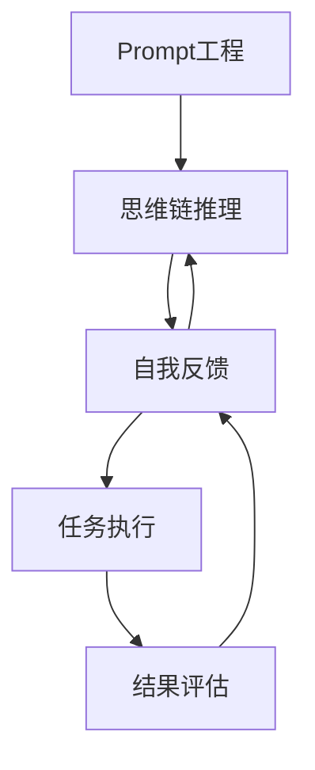

# 【大模型应用开发 动手做AI Agent】AutoGPT实战

## 1. 背景介绍
人工智能技术的飞速发展,尤其是大语言模型(LLM)的出现,为构建智能AI Agent开启了新的可能。AutoGPT作为一个基于GPT-4的自主AI系统,展现了LLM在实际应用开发中的巨大潜力。本文将深入探讨AutoGPT的技术原理、开发实践以及未来发展趋势,为大模型应用开发提供参考和启发。

### 1.1 人工智能的发展历程
#### 1.1.1 早期的人工智能
#### 1.1.2 机器学习的崛起 
#### 1.1.3 深度学习的突破

### 1.2 大语言模型(LLM)概述
#### 1.2.1 LLM的定义与特点
#### 1.2.2 LLM的训练方法
#### 1.2.3 主流LLM模型介绍

### 1.3 AutoGPT的诞生
#### 1.3.1 GPT系列模型的发展
#### 1.3.2 AutoGPT项目的起源
#### 1.3.3 AutoGPT的应用前景

## 2. 核心概念与联系
要理解AutoGPT的工作原理,需要先了解几个核心概念:

### 2.1 Prompt工程
#### 2.1.1 Prompt的定义
#### 2.1.2 Prompt设计的重要性
#### 2.1.3 Prompt工程的基本方法

### 2.2 思维链(Chain of Thought)
#### 2.2.1 思维链的概念
#### 2.2.2 思维链对推理能力的提升
#### 2.2.3 思维链在AutoGPT中的应用

### 2.3 自我反馈(Self-Feedback)
#### 2.3.1 自我反馈的定义
#### 2.3.2 自我反馈对自主学习的意义
#### 2.3.3 AutoGPT中的自我反馈机制

### 2.4 概念之间的关系
下图展示了Prompt工程、思维链、自我反馈在AutoGPT系统中的关系:



## 3. 核心算法原理具体操作步骤
AutoGPT的核心算法包括任务分解、Prompt生成、思维链推理、自我反馈等。

### 3.1 任务分解
#### 3.1.1 将复杂任务拆分为子任务
#### 3.1.2 定义子任务之间的依赖关系
#### 3.1.3 生成任务执行计划

### 3.2 Prompt生成
#### 3.2.1 根据任务类型选择Prompt模板
#### 3.2.2 提取任务关键信息填充Prompt
#### 3.2.3 优化Prompt以提高任务完成质量

### 3.3 思维链推理
#### 3.3.1 将任务Prompt输入LLM
#### 3.3.2 LLM生成任务解决方案
#### 3.3.3 提取推理过程中的关键信息

### 3.4 自我反馈
#### 3.4.1 评估任务执行结果
#### 3.4.2 生成反馈信息并输入LLM
#### 3.4.3 LLM根据反馈优化解决方案

## 4. 数学模型和公式详细讲解举例说明
AutoGPT中用到的一些关键数学模型包括Transformer、注意力机制、Softmax函数等。

### 4.1 Transformer模型
Transformer是一种基于自注意力机制的神经网络模型,在NLP领域取得了巨大成功。其核心是注意力机制(Attention Mechanism):

$$
\text{Attention}(Q,K,V) = \text{softmax}(\frac{QK^T}{\sqrt{d_k}})V
$$

其中,$Q$,$K$,$V$分别表示查询向量、键向量、值向量,$d_k$为向量维度。

### 4.2 Softmax函数
Softmax函数常用于将一组实数转化为概率分布:

$$
\text{softmax}(x_i) = \frac{e^{x_i}}{\sum_{j=1}^{n} e^{x_j}}
$$

其中,$x_i$为第$i$个元素,$n$为向量长度。Softmax保证了输出的概率之和为1。

### 4.3 举例说明
假设我们有一个Prompt向量$P$和一组任务向量$T_1,T_2,\dots,T_n$,要找出与Prompt最相关的任务。可以用注意力机制计算Prompt与每个任务的相关性得分:

$$
s_i = \text{Attention}(P,T_i,T_i)
$$

然后用Softmax将得分转化为概率分布:

$$
p_i = \text{softmax}(s_i)
$$

概率最大的那个任务就是与Prompt最相关的。

## 5. 项目实践：代码实例和详细解释说明
下面我们用Python实现一个简化版的AutoGPT,演示其核心功能。

### 5.1 任务分解
```python
def decompose_task(task):
    # 将任务拆分为子任务列表
    subtasks = [...]
    # 定义子任务依赖关系
    dependencies = {...}
    # 生成任务执行计划
    plan = make_plan(subtasks, dependencies)
    return plan
```

### 5.2 Prompt生成
```python
def generate_prompt(task):
    # 选择合适的Prompt模板
    template = select_template(task)
    # 填充任务信息
    prompt = fill_prompt(template, task)
    # 优化Prompt
    optimized_prompt = optimize(prompt)
    return optimized_prompt
```

### 5.3 思维链推理
```python
def chain_of_thought(prompt, model):
    # 将Prompt输入LLM
    response = model.generate(prompt)
    # 提取推理过程中的关键信息
    key_info = extract_info(response)
    return response, key_info
```

### 5.4 自我反馈
```python
def self_feedback(result, model):
    # 评估任务执行结果
    score = evaluate(result)
    # 生成反馈信息
    feedback = generate_feedback(score)
    # 优化解决方案
    optimized_result = model.generate(feedback)
    return optimized_result
```

### 5.5 主程序
```python
def autogpt(task, model):
    # 任务分解
    plan = decompose_task(task)
    result = []
    for subtask in plan:
        # Prompt生成
        prompt = generate_prompt(subtask)
        # 思维链推理
        subresult, _ = chain_of_thought(prompt, model)
        result.append(subresult)
    # 自我反馈
    final_result = self_feedback(result, model)
    return final_result
```

以上代码展示了AutoGPT的核心流程,实际的系统还要考虑异常处理、并发执行、资源管理等因素。

## 6. 实际应用场景
AutoGPT具有广泛的应用前景,下面列举几个潜在的应用方向:

### 6.1 智能客服
AutoGPT可以作为智能客服系统的核心引擎,根据客户问题自动生成解答,并不断从反馈中学习改进。

### 6.2 数据分析
AutoGPT可以根据数据分析需求,自动拆解任务,调用相应的分析工具和模型,生成专业的分析报告。

### 6.3 编程助手
AutoGPT可以作为编程助手,根据用户需求自动生成代码片段,提供智能化的编程建议和Bug修复方案。

### 6.4 创意生成
AutoGPT可以应用于创意领域,如自动生成文案、故事情节、音乐旋律等,辅助创作者提升效率。

## 7. 工具和资源推荐
对AutoGPT开发感兴趣的读者,可以参考以下工具和资源:

- OpenAI API:提供了强大的LLM接口,是开发AutoGPT的重要基础。
- LangChain:一个基于LLM的应用开发框架,封装了Prompt管理、思维链等功能。
- AutoGPT官方仓库:包含了AutoGPT的源代码和文档,是学习和实践的最佳资料。
- Prompt Engineering Guide:一份详尽的Prompt工程指南,介绍了提示词设计的原则和技巧。

## 8. 总结：未来发展趋势与挑战
AutoGPT代表了LLM应用开发的新方向,为构建更加智能、自主的AI系统提供了可能。未来AutoGPT有望在更多领域得到应用,如科研辅助、金融分析、智能教育等。

但AutoGPT的发展也面临诸多挑战:

- 伦理与安全问题:如何确保AutoGPT生成的内容符合伦理规范,不会产生危害。
- 可解释性问题:AutoGPT的决策过程往往是黑盒,需要提高其可解释性,以增强用户信任。  
- 资源消耗问题:AutoGPT需要消耗大量的算力资源,需要在效率和成本之间寻求平衡。

相信随着技术的进一步发展,AutoGPT会逐渐成熟并在更广泛的场景中发挥价值。让我们拭目以待!

## 9. 附录：常见问题与解答
### Q1: AutoGPT可以应用于哪些领域?
A1: AutoGPT可以应用于智能客服、数据分析、编程助手、创意生成等多个领域,具有广阔的应用前景。

### Q2: 开发AutoGPT需要哪些技术基础?
A2: 开发AutoGPT需要掌握Python编程、机器学习、NLP等技术,并熟悉Prompt工程、思维链等概念。同时还需要了解主流LLM的使用方法。

### Q3: AutoGPT面临的主要挑战有哪些?
A3: AutoGPT面临的主要挑战包括伦理与安全问题、可解释性问题、资源消耗问题等,需要在技术和管理上进行持续探索和改进。

### Q4: 个人如何参与到AutoGPT的开发中?
A4: 个人可以通过学习AutoGPT的源代码,尝试搭建开发环境,在实践中积累经验。也可以参与到社区讨论中,贡献自己的想法和改进方案。

作者：禅与计算机程序设计艺术 / Zen and the Art of Computer Programming