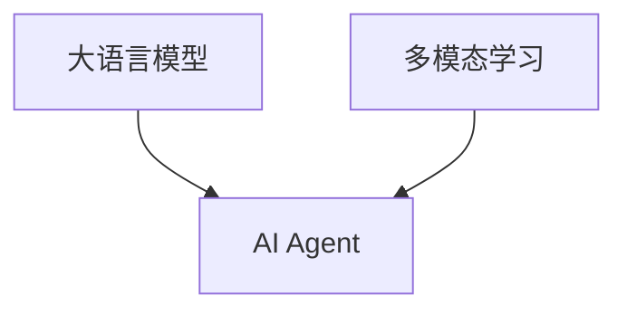

# 【大模型应用开发 动手做AI Agent】结合语言交互能力和多模态能力

## 1. 背景介绍
### 1.1 人工智能的发展历程
#### 1.1.1 人工智能的起源与早期发展
#### 1.1.2 机器学习的兴起
#### 1.1.3 深度学习的突破

### 1.2 大语言模型的崛起  
#### 1.2.1 Transformer 模型的提出
#### 1.2.2 GPT 系列模型的发展
#### 1.2.3 ChatGPT 的问世与影响

### 1.3 多模态AI的兴起
#### 1.3.1 视觉与语言的结合
#### 1.3.2 语音与文本的融合 
#### 1.3.3 多模态AI的应用前景

## 2. 核心概念与联系
### 2.1 大语言模型
#### 2.1.1 语言模型的定义与原理
#### 2.1.2 大语言模型的特点与优势
#### 2.1.3 预训练与微调

### 2.2 多模态学习
#### 2.2.1 多模态数据的表示与融合
#### 2.2.2 跨模态对齐与映射
#### 2.2.3 多模态任务的类型与挑战

### 2.3 AI Agent
#### 2.3.1 Agent的定义与特征
#### 2.3.2 基于大模型的AI Agent
#### 2.3.3 多模态AI Agent的优势



## 3. 核心算法原理具体操作步骤
### 3.1 Transformer 模型
#### 3.1.1 Self-Attention 机制
#### 3.1.2 Multi-Head Attention
#### 3.1.3 位置编码

### 3.2 预训练方法
#### 3.2.1 无监督预训练
#### 3.2.2 自监督学习
#### 3.2.3 对比学习

### 3.3 多模态融合策略 
#### 3.3.1 早期融合
#### 3.3.2 晚期融合
#### 3.3.3 混合融合

## 4. 数学模型和公式详细讲解举例说明
### 4.1 Transformer 的数学表示
#### 4.1.1 Self-Attention 的计算
$$Attention(Q,K,V) = softmax(\frac{QK^T}{\sqrt{d_k}})V$$
其中，$Q$、$K$、$V$ 分别表示查询、键、值矩阵，$d_k$ 为键向量的维度。

#### 4.1.2 Multi-Head Attention 的计算
$$MultiHead(Q,K,V) = Concat(head_1,...,head_h)W^O$$
$$head_i = Attention(QW_i^Q, KW_i^K, VW_i^V)$$
其中，$W_i^Q$、$W_i^K$、$W_i^V$ 为线性变换矩阵，$W^O$ 为输出线性变换矩阵。

#### 4.1.3 位置编码的计算
$PE_{(pos,2i)} = sin(pos/10000^{2i/d_{model}})$
$PE_{(pos,2i+1)} = cos(pos/10000^{2i/d_{model}})$
其中，$pos$ 为位置索引，$i$ 为维度索引，$d_{model}$ 为词嵌入维度。

### 4.2 损失函数
#### 4.2.1 语言模型的交叉熵损失
$L_{LM} = -\sum_{i=1}^{n} log P(w_i|w_{<i})$
其中，$w_i$ 为目标词，$w_{<i}$ 为上下文词。

#### 4.2.2 对比学习的InfoNCE损失
$L_{InfoNCE} = -log \frac{exp(sim(q,k_+)/\tau)}{\sum_{i=0}^{K} exp(sim(q,k_i)/\tau)}$
其中，$q$ 为查询，$k_+$ 为正样本，$k_i$ 为负样本，$\tau$ 为温度超参数。

## 5. 项目实践：代码实例和详细解释说明
### 5.1 使用 Hugging Face 的 Transformers 库进行预训练
```python
from transformers import AutoTokenizer, AutoModelForCausalLM, TrainingArguments, Trainer

# 加载预训练模型和分词器
model_name = "gpt2"
tokenizer = AutoTokenizer.from_pretrained(model_name)
model = AutoModelForCausalLM.from_pretrained(model_name)

# 准备训练数据
train_dataset = ...

# 定义训练参数
training_args = TrainingArguments(
    output_dir="output",
    num_train_epochs=3,
    per_device_train_batch_size=4,
    save_steps=10_000,
    save_total_limit=2,
)

# 创建训练器并开始训练
trainer = Trainer(
    model=model,
    args=training_args,
    train_dataset=train_dataset,
)

trainer.train()
```

以上代码展示了如何使用 Hugging Face 的 Transformers 库对 GPT-2 模型进行预训练。首先加载预训练模型和分词器，然后准备训练数据集。接着定义训练参数，包括输出目录、训练轮数、批大小等。最后创建训练器对象并调用 `train()` 方法开始训练。

### 5.2 使用 PyTorch 实现多模态融合
```python
import torch
import torch.nn as nn

class MultimodalFusion(nn.Module):
    def __init__(self, text_dim, image_dim, hidden_dim):
        super(MultimodalFusion, self).__init__()
        self.text_linear = nn.Linear(text_dim, hidden_dim)
        self.image_linear = nn.Linear(image_dim, hidden_dim)
        self.activation = nn.ReLU()
        self.output_linear = nn.Linear(hidden_dim, hidden_dim)

    def forward(self, text_features, image_features):
        text_hidden = self.activation(self.text_linear(text_features))
        image_hidden = self.activation(self.image_linear(image_features))
        fused_features = text_hidden + image_hidden
        output = self.output_linear(fused_features)
        return output
```

以上代码展示了如何使用 PyTorch 实现一个简单的多模态融合模块。该模块接收文本特征和图像特征作为输入，分别通过线性层进行变换，然后相加得到融合特征。最后通过一个输出线性层得到最终的融合表示。

## 6. 实际应用场景
### 6.1 智能客服
利用大语言模型和多模态技术，可以构建一个智能客服系统。系统能够理解用户的文本和语音输入，并根据上下文生成恰当的回复。同时，系统还可以分析用户上传的图片，提供更精准的服务。

### 6.2 医疗诊断辅助
将医学影像、病历文本、医生语音等多模态数据输入到 AI Agent 中，可以辅助医生进行疾病诊断。Agent 能够分析不同模态的数据，找出关键信息，给出诊断建议，提高诊断效率和准确性。

### 6.3 教育助手
开发一个多模态教育助手，可以与学生进行自然语言交互，解答学习中的问题。同时，助手还能分析学生的笔记、作业等图像数据，给出个性化的学习建议和反馈。

## 7. 工具和资源推荐
### 7.1 开源框架
- Hugging Face Transformers：提供了多种预训练语言模型和下游任务的实现。
- OpenAI GPT-3：强大的语言生成模型，可用于构建对话系统。
- PyTorch、TensorFlow：主流的深度学习框架，支持多模态任务的实现。

### 7.2 数据集
- COCO：大规模图像标注数据集，包含对象检测、语义分割等任务。
- Flickr30k：图像描述数据集，每张图像有5个人工标注的描述。
- CLEVR：基于合成图像的视觉推理数据集，用于研究视觉-语言问答。

### 7.3 预训练模型
- BERT：基于 Transformer 的预训练语言模型，可用于文本分类、问答等任务。
- ViT：将 Transformer 应用于图像分类任务的预训练模型。
- CLIP：跨模态预训练模型，可用于图像-文本检索和分类任务。

## 8. 总结：未来发展趋势与挑战
### 8.1 大模型的持续发展
随着计算能力的提升和数据规模的增长，大语言模型将继续向更大规模、更高性能的方向发展。同时，针对特定领域和任务的预训练模型也将不断涌现，推动 AI Agent 在各个领域的应用。

### 8.2 多模态融合的深入探索
多模态融合技术将向更深层次发展，探索更有效的跨模态对齐和映射方法。同时，如何在 Agent 中实现多模态信息的无缝整合，实现真正的多模态理解和交互，仍然是一个巨大的挑战。

### 8.3 人机交互的自然化
未来的 AI Agent 将更加注重人机交互的自然化和人性化。通过引入情感计算、个性化等技术，Agent 能够更好地理解用户的需求和意图，提供更贴心、更人性化的服务。

## 9. 附录：常见问题与解答
### 9.1 如何选择合适的预训练模型？
根据具体任务和数据特点选择合适的预训练模型。对于文本任务，可以考虑 BERT、GPT 等模型；对于图像任务，可以考虑 ViT、ResNet 等模型；对于多模态任务，可以考虑 CLIP、ViLBERT 等模型。同时，也要权衡模型的大小、性能和计算效率。

### 9.2 多模态融合有哪些常见的挑战？
多模态融合面临的挑战包括：不同模态数据的表示和对齐、跨模态信息的有效融合、模态间的信息交互和传播等。此外，还需要考虑不同模态数据的噪声和缺失、模态间的语义鸿沟等问题。

### 9.3 如何评估 AI Agent 的性能？
评估 AI Agent 的性能需要综合考虑多个方面，包括任务完成的准确性、响应的实时性、生成内容的流畅性和相关性、用户交互的自然程度等。可以采用人工评估和自动评估相结合的方式，设计合适的评估指标和测试集，全面评估 Agent 的性能。

作者：禅与计算机程序设计艺术 / Zen and the Art of Computer Programming