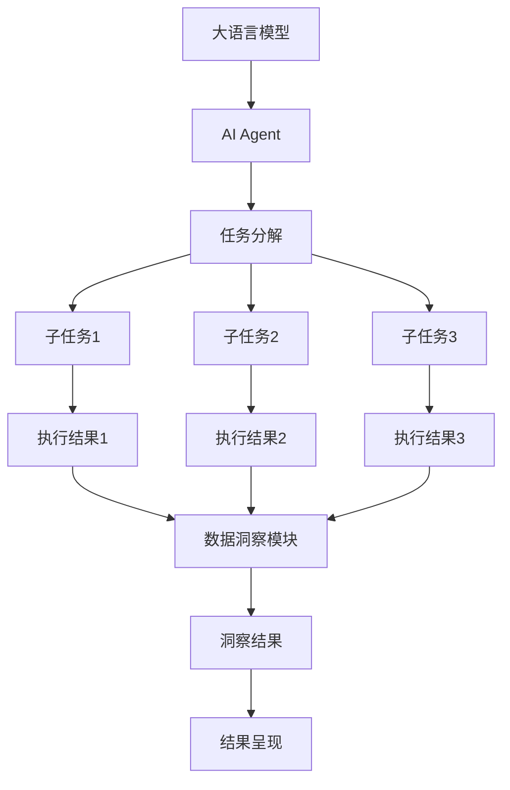

# 【大模型应用开发 动手做AI Agent】自主创建数据洞察

## 1. 背景介绍
### 1.1 人工智能的发展历程
#### 1.1.1 早期人工智能
#### 1.1.2 机器学习时代  
#### 1.1.3 深度学习的崛起
### 1.2 大语言模型的出现
#### 1.2.1 Transformer 架构
#### 1.2.2 GPT 系列模型
#### 1.2.3 InstructGPT 的突破
### 1.3 AI Agent 的概念与应用
#### 1.3.1 AI Agent 的定义
#### 1.3.2 AI Agent 的特点
#### 1.3.3 AI Agent 的应用场景

## 2. 核心概念与联系
### 2.1 大语言模型
#### 2.1.1 大语言模型的定义
#### 2.1.2 大语言模型的训练方法
#### 2.1.3 大语言模型的优势
### 2.2 AI Agent
#### 2.2.1 AI Agent 的组成部分
#### 2.2.2 AI Agent 的工作原理
#### 2.2.3 AI Agent 与大语言模型的关系
### 2.3 数据洞察
#### 2.3.1 数据洞察的定义
#### 2.3.2 数据洞察的重要性
#### 2.3.3 数据洞察与 AI Agent 的结合

## 3. 核心算法原理具体操作步骤
### 3.1 基于大语言模型的 AI Agent 设计
#### 3.1.1 AI Agent 的整体架构
#### 3.1.2 大语言模型的选择与微调
#### 3.1.3 AI Agent 的任务分解与执行流程
### 3.2 数据洞察算法
#### 3.2.1 数据预处理
#### 3.2.2 特征工程
#### 3.2.3 模式发现与异常检测
### 3.3 AI Agent 与数据洞察的集成
#### 3.3.1 数据接口设计
#### 3.3.2 AI Agent 与数据洞察模块的交互
#### 3.3.3 结果呈现与可视化



## 4. 数学模型和公式详细讲解举例说明
### 4.1 Transformer 模型
#### 4.1.1 Self-Attention 机制
$Attention(Q,K,V) = softmax(\frac{QK^T}{\sqrt{d_k}})V$
其中，$Q$、$K$、$V$ 分别表示查询、键、值向量，$d_k$ 为向量维度。
#### 4.1.2 多头注意力
$$MultiHead(Q,K,V) = Concat(head_1,...,head_h)W^O$$
$$head_i = Attention(QW_i^Q, KW_i^K, VW_i^V)$$
其中，$W_i^Q$、$W_i^K$、$W_i^V$ 和 $W^O$ 为可学习的权重矩阵。
#### 4.1.3 位置编码
$PE_{(pos,2i)} = sin(pos/10000^{2i/d_{model}})$
$PE_{(pos,2i+1)} = cos(pos/10000^{2i/d_{model}})$
其中，$pos$ 表示位置，$i$ 为维度索引，$d_{model}$ 为模型维度。
### 4.2 异常检测算法
#### 4.2.1 基于距离的异常检测
$$d(x,y) = \sqrt{\sum_{i=1}^n (x_i-y_i)^2}$$
其中，$x$、$y$ 为数据点，$n$ 为维度。
#### 4.2.2 基于密度的异常检测
$$LOF(p) = \frac{\sum_{o \in N_k(p)}\frac{lrd(o)}{lrd(p)}}{|N_k(p)|}$$
其中，$N_k(p)$ 为点 $p$ 的 $k$ 近邻，$lrd(p)$ 为点 $p$ 的局部可达密度。
#### 4.2.3 孤立森林算法
$$f(x) = 2^{-\frac{E(h(x))}{c(n)}}$$
其中，$E(h(x))$ 为数据点 $x$ 的平均路径长度，$c(n)$ 为平均路径长度的归一化因子。

## 5. 项目实践：代码实例和详细解释说明
### 5.1 大语言模型微调
```python
from transformers import AutoModelForCausalLM, AutoTokenizer

model_name = "gpt2"
model = AutoModelForCausalLM.from_pretrained(model_name)
tokenizer = AutoTokenizer.from_pretrained(model_name)

# 加载微调数据集
train_dataset = ...

# 定义训练参数
training_args = TrainingArguments(
    output_dir="output",
    num_train_epochs=3,
    per_device_train_batch_size=4,
    save_steps=10_000,
    save_total_limit=2,
)

# 开始微调
trainer = Trainer(
    model=model,
    args=training_args,
    train_dataset=train_dataset,
)
trainer.train()
```
在这个例子中，我们使用 Hugging Face 的 Transformers 库加载预训练的 GPT-2 模型，并使用自定义的数据集对模型进行微调。通过设置训练参数和使用 Trainer 类，我们可以方便地对大语言模型进行微调，使其适应特定的任务。

### 5.2 AI Agent 任务执行
```python
class AIAgent:
    def __init__(self, model, tokenizer):
        self.model = model
        self.tokenizer = tokenizer
    
    def execute_task(self, task):
        # 任务分解
        subtasks = self.decompose_task(task)
        
        # 执行子任务
        results = []
        for subtask in subtasks:
            result = self.execute_subtask(subtask)
            results.append(result)
        
        # 整合结果
        final_result = self.integrate_results(results)
        
        return final_result
    
    def decompose_task(self, task):
        # 使用大语言模型分解任务
        prompt = f"请将以下任务分解为多个子任务：{task}"
        response = self.generate_response(prompt)
        subtasks = self.extract_subtasks(response)
        return subtasks
    
    def execute_subtask(self, subtask):
        # 使用大语言模型执行子任务
        prompt = f"请执行以下子任务：{subtask}"
        response = self.generate_response(prompt)
        return response
    
    def integrate_results(self, results):
        # 使用大语言模型整合结果
        prompt = f"请整合以下结果：{results}"
        response = self.generate_response(prompt)
        return response
    
    def generate_response(self, prompt):
        # 使用大语言模型生成响应
        input_ids = self.tokenizer.encode(prompt, return_tensors="pt")
        output = self.model.generate(input_ids, max_length=100)
        response = self.tokenizer.decode(output[0])
        return response
    
    def extract_subtasks(self, response):
        # 从响应中提取子任务
        subtasks = response.split("\n")
        return subtasks
```
在这个例子中，我们定义了一个 AIAgent 类，它使用微调后的大语言模型执行任务。AIAgent 的 execute_task 方法接受一个任务作为输入，并通过任务分解、子任务执行和结果整合的过程生成最终结果。generate_response 方法使用大语言模型生成响应，extract_subtasks 方法从响应中提取子任务。

### 5.3 数据洞察
```python
import numpy as np
from sklearn.ensemble import IsolationForest

class DataInsight:
    def __init__(self, data):
        self.data = data
    
    def detect_anomalies(self):
        # 使用孤立森林算法检测异常
        model = IsolationForest(contamination=0.1)
        model.fit(self.data)
        anomalies = model.predict(self.data)
        return anomalies
    
    def discover_patterns(self):
        # 使用聚类算法发现模式
        from sklearn.cluster import KMeans
        model = KMeans(n_clusters=5)
        model.fit(self.data)
        labels = model.labels_
        return labels
    
    def visualize_results(self, anomalies, labels):
        # 可视化结果
        import matplotlib.pyplot as plt
        plt.scatter(self.data[:,0], self.data[:,1], c=labels)
        plt.scatter(self.data[anomalies==-1,0], self.data[anomalies==-1,1], c='r')
        plt.show()
```
在这个例子中，我们定义了一个 DataInsight 类，它接受数据作为输入，并提供异常检测、模式发现和结果可视化的功能。detect_anomalies 方法使用孤立森林算法检测异常，discover_patterns 方法使用 K-均值聚类算法发现数据中的模式，visualize_results 方法使用 Matplotlib 库可视化结果。

## 6. 实际应用场景
### 6.1 智能客服
AI Agent 可以作为智能客服，通过与用户的自然语言交互，理解用户的问题并提供相应的解答。结合大语言模型的语言理解和生成能力，AI Agent 能够处理各种类型的客户咨询，提供个性化的回复，提高客户满意度。
### 6.2 数据分析助手
AI Agent 可以作为数据分析助手，协助数据分析师进行数据探索和洞察发现。通过与 AI Agent 的交互，数据分析师可以快速获得数据的统计信息、异常检测结果、模式发现等，从而加速数据分析过程，提高分析效率。
### 6.3 智能问答系统
AI Agent 可以应用于智能问答系统，根据用户的问题生成准确、相关的答案。利用大语言模型的知识库和语言生成能力，AI Agent 能够理解问题的上下文，生成自然、连贯的回答，为用户提供高质量的信息服务。

## 7. 工具和资源推荐
### 7.1 大语言模型
- GPT-3 (https://openai.com/blog/gpt-3-apps/)
- BERT (https://github.com/google-research/bert)
- RoBERTa (https://github.com/pytorch/fairseq/tree/master/examples/roberta)
### 7.2 AI Agent 开发框架
- Hugging Face Transformers (https://huggingface.co/transformers/)
- OpenAI API (https://openai.com/api/)
- Rasa (https://rasa.com/)
### 7.3 数据洞察工具
- Pandas (https://pandas.pydata.org/)
- Scikit-learn (https://scikit-learn.org/)
- Matplotlib (https://matplotlib.org/)

## 8. 总结：未来发展趋势与挑战
### 8.1 大语言模型的持续进化
随着计算能力的提升和训练数据的增加，大语言模型将继续发展，具备更强的语言理解和生成能力。未来的大语言模型将能够处理更加复杂的任务，生成更加自然、连贯的文本，为 AI Agent 的应用提供更强大的基础。
### 8.2 AI Agent 的智能化与个性化
AI Agent 将朝着更加智能化和个性化的方向发展。通过持续学习和适应用户的反馈，AI Agent 将能够提供更加准确、个性化的服务。同时，AI Agent 将具备更强的推理和决策能力，能够处理更加复杂的任务和场景。
### 8.3 数据洞察的自动化与实时化
数据洞察将变得更加自动化和实时化。通过与 AI Agent 的结合，数据洞察过程将变得更加智能和高效。AI Agent 将能够实时分析数据，发现异常和模式，并及时提供洞察结果，为决策提供支持。
### 8.4 面临的挑战
- 数据隐私与安全：在使用大语言模型和 AI Agent 处理数据时，需要注意保护用户隐私，确保数据安全。
- 模型的可解释性：大语言模型的决策过程通常是黑盒的，提高模型的可解释性是一个重要挑战。
- 模型的公平性和偏见：需要关注模型可能存在的偏见，确保 AI Agent 的决策公平、无偏。

## 9. 附录：常见问题与解答
### 9.1 如何选择合适的大语言模型？
选择大语言模型时，需要考虑以下因素：
- 模型的性能：选择在目标任务上表现优异的模型。
- 模型的可用性：选择具有良好文档和社区支持的模型。
- 计算资源要求：考虑模型的计算资源需求，选择适合自己的模型。
### 9.2 如何处理 AI Agent 生成的不恰当回