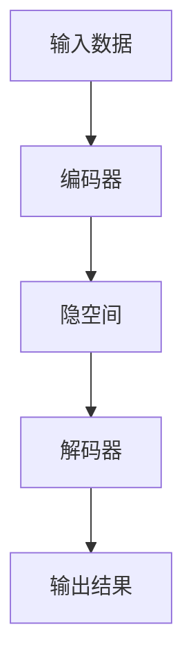

# 一切皆是映射：AI在艺术创作上的新视角

## 1. 背景介绍
### 1.1 人工智能的发展历程
#### 1.1.1 早期人工智能
#### 1.1.2 机器学习的兴起 
#### 1.1.3 深度学习的突破

### 1.2 人工智能在艺术领域的应用
#### 1.2.1 音乐创作
#### 1.2.2 绘画创作
#### 1.2.3 文学创作

### 1.3 人工智能艺术创作的争议
#### 1.3.1 创造力的来源
#### 1.3.2 艺术作品的版权归属
#### 1.3.3 人工智能对艺术家的影响

## 2. 核心概念与联系
### 2.1 映射的定义
映射是数学中的一个重要概念，指从一个集合到另一个集合的对应关系。在人工智能艺术创作中，映射可以理解为将输入数据（如图像、文本等）转化为输出结果（如生成的艺术作品）的过程。

### 2.2 人工智能艺术创作中的映射
#### 2.2.1 图像风格迁移
图像风格迁移是将一张图片的风格应用到另一张图片上，生成一张新的图片。这个过程可以看作是一种映射，将内容图和风格图映射到生成图上。

#### 2.2.2 文本到图像的生成
文本到图像的生成是指根据文本描述生成相应的图像。这个过程可以看作是将文本映射到图像空间上。

#### 2.2.3 音乐生成
音乐生成是指根据一定的规则和模式，自动生成音乐作品。这个过程可以看作是将音乐元素映射到音乐空间上。

### 2.3 映射与创造力的关系
映射是人工智能艺术创作的核心，但并不意味着人工智能具有真正的创造力。人工智能是通过学习大量的数据，找到其中的模式和规律，然后根据这些模式和规律生成新的作品。这个过程更像是一种模仿和重组，而非真正的创造。

## 3. 核心算法原理具体操作步骤
### 3.1 生成对抗网络（GAN）
#### 3.1.1 GAN的基本原理
#### 3.1.2 GAN的训练过程
#### 3.1.3 GAN在艺术创作中的应用

### 3.2 变分自编码器（VAE）
#### 3.2.1 VAE的基本原理  
#### 3.2.2 VAE的训练过程
#### 3.2.3 VAE在艺术创作中的应用

### 3.3 转换网络（Transformer）
#### 3.3.1 Transformer的基本原理
#### 3.3.2 Transformer的训练过程
#### 3.3.3 Transformer在艺术创作中的应用

## 4. 数学模型和公式详细讲解举例说明
### 4.1 GAN的数学模型
GAN由生成器和判别器两部分组成，其目标函数可以表示为：

$$\min_{G} \max_{D} V(D,G) = \mathbb{E}_{x \sim p_{data}(x)}[\log D(x)] + \mathbb{E}_{z \sim p_z(z)}[\log (1-D(G(z)))]$$

其中，$G$ 表示生成器，$D$ 表示判别器，$p_{data}$ 表示真实数据的分布，$p_z$ 表示噪声的分布。

### 4.2 VAE的数学模型
VAE由编码器和解码器两部分组成，其目标函数可以表示为：

$$\mathcal{L}(\theta, \phi) = -\mathbb{E}_{z \sim q_{\phi}(z|x)}[\log p_{\theta}(x|z)] + \mathrm{KL}(q_{\phi}(z|x) || p(z))$$

其中，$\theta$ 表示解码器的参数，$\phi$ 表示编码器的参数，$p(z)$ 表示先验分布，通常为标准正态分布。

### 4.3 Transformer的数学模型
Transformer由编码器和解码器两部分组成，其中的自注意力机制可以表示为：

$$\mathrm{Attention}(Q,K,V) = \mathrm{softmax}(\frac{QK^T}{\sqrt{d_k}})V$$

其中，$Q$、$K$、$V$ 分别表示查询、键、值，$d_k$ 表示键的维度。

## 5. 项目实践：代码实例和详细解释说明
### 5.1 基于GAN的人脸生成
```python
import tensorflow as tf

# 定义生成器
def generator(z):
    # ...
    return x_gen

# 定义判别器 
def discriminator(x):
    # ...
    return d_logits, d_probs

# 定义损失函数
def loss_fn(d_logits_real, d_logits_fake):
    # ...
    return d_loss, g_loss

# 训练模型
def train(dataset, epochs):
    # ...
```

### 5.2 基于VAE的音乐生成
```python
import tensorflow as tf

# 定义编码器
def encoder(x):
    # ...
    return mean, logvar

# 定义解码器
def decoder(z):
    # ...  
    return x_recon

# 定义损失函数
def loss_fn(x, x_recon, mean, logvar):
    # ...
    return loss

# 训练模型
def train(dataset, epochs):
    # ...
```

### 5.3 基于Transformer的文本生成
```python
import tensorflow as tf

# 定义编码器
def encoder(x):
    # ...
    return enc_output

# 定义解码器
def decoder(enc_output, y):
    # ...
    return dec_output

# 定义损失函数
def loss_fn(y, dec_output):
    # ...
    return loss

# 训练模型  
def train(dataset, epochs):
    # ...
```

## 6. 实际应用场景
### 6.1 游戏设计中的AI艺术创作
#### 6.1.1 游戏场景生成
#### 6.1.2 游戏角色设计
#### 6.1.3 游戏音乐生成

### 6.2 影视制作中的AI艺术创作 
#### 6.2.1 电影特效制作
#### 6.2.2 动画角色生成
#### 6.2.3 配乐生成

### 6.3 工业设计中的AI艺术创作
#### 6.3.1 产品外观设计
#### 6.3.2 室内装修设计
#### 6.3.3 服装设计

## 7. 工具和资源推荐
### 7.1 开源框架
#### 7.1.1 TensorFlow
#### 7.1.2 PyTorch
#### 7.1.3 Keras

### 7.2 数据集
#### 7.2.1 ImageNet
#### 7.2.2 COCO
#### 7.2.3 WikiArt

### 7.3 学习资源
#### 7.3.1 《深度学习》（花书）
#### 7.3.2 CS231n课程
#### 7.3.3 GAN实战教程

## 8. 总结：未来发展趋势与挑战
### 8.1 AI艺术创作的发展趋势
#### 8.1.1 多模态融合
#### 8.1.2 交互式创作
#### 8.1.3 个性化定制

### 8.2 AI艺术创作面临的挑战
#### 8.2.1 创造力的本质
#### 8.2.2 版权和伦理问题
#### 8.2.3 艺术品评估标准

### 8.3 AI艺术创作的未来展望
AI艺术创作是一个充满想象力和挑战的领域，它不仅为艺术创作提供了新的可能性，也为人工智能的发展提供了新的思路。未来，AI艺术创作将朝着多模态融合、交互式创作、个性化定制等方向发展，同时也需要在创造力的本质、版权伦理、艺术品评估等方面进行深入探讨。相信通过人工智能与艺术的不断融合，我们能够创造出更加精彩纷呈的艺术世界。

## 9. 附录：常见问题与解答
### 9.1 AI艺术创作是否具有真正的创造力？
AI艺术创作更像是一种模仿和重组，而非真正的创造。但随着技术的不断发展，AI艺术创作的创造力水平也在不断提升。

### 9.2 AI生成的艺术作品是否拥有版权？
目前对于AI生成艺术作品的版权归属还没有明确的法律规定，这是一个有待探讨的问题。

### 9.3 AI艺术创作对传统艺术家有何影响？
AI艺术创作为传统艺术家提供了新的创作工具和思路，但同时也可能对部分艺术家的就业产生影响。艺术家需要不断学习和创新，以适应时代的发展。



作者：禅与计算机程序设计艺术 / Zen and the Art of Computer Programming