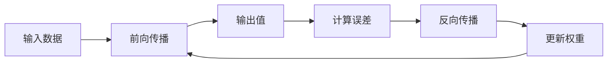

# 一切皆是映射：反向传播算法的数学原理

## 1. 背景介绍

### 1.1 人工神经网络的崛起

人工神经网络(Artificial Neural Networks, ANNs)是一种受生物神经系统启发而设计的计算模型,在机器学习和深度学习领域中发挥着关键作用。随着计算能力的不断提升和大规模数据的出现,神经网络在诸如计算机视觉、自然语言处理、语音识别等领域取得了令人瞩目的成就。

### 1.2 反向传播算法的重要性

在神经网络的训练过程中,反向传播(Back Propagation, BP)算法是最广泛使用的监督学习算法之一。它通过调整网络中的权重和偏置值,使得输出值与期望值之间的误差最小化,从而优化神经网络的性能。反向传播算法的发明,使得训练深层神经网络成为可能,推动了深度学习的快速发展。

## 2. 核心概念与联系

### 2.1 神经网络的基本结构

神经网络由多层神经元组成,每层由多个节点(神经元)构成。输入层接收输入数据,隐藏层对数据进行非线性变换,输出层产生最终的输出结果。每个节点通过加权求和和激活函数进行计算,权重值决定了输入对输出的影响程度。


### 2.2 前向传播和反向传播

在神经网络的训练过程中,首先进行前向传播(Forward Propagation),将输入数据通过网络层层传递,得到最终的输出值。然后,通过比较输出值与期望值之间的误差,反向传播算法计算出每个权重对误差的影响程度,并根据这些梯度信息调整权重和偏置值,使得误差最小化。这个过程反复进行,直到网络收敛或达到预期性能。



## 3. 核心算法原理具体操作步骤

### 3.1 前向传播

在前向传播过程中,输入数据通过网络层层传递,每个节点根据加权求和和激活函数进行计算。具体步骤如下:

1. 初始化网络权重和偏置值(通常使用小的随机值)。
2. 对于每个输入样本:
   a. 在输入层,将输入数据传递给第一个隐藏层。
   b. 对于每个隐藏层:
      i. 计算加权求和: $z = \sum_{i} w_i x_i + b$
      ii. 通过激活函数(如Sigmoid、ReLU等)计算输出: $a = f(z)$
      iii. 将输出传递给下一层。
   c. 在输出层,得到最终的输出值。

### 3.2 反向传播

反向传播算法通过计算误差关于权重的梯度,并根据梯度下降法更新权重和偏置值,从而最小化损失函数。具体步骤如下:

1. 计算输出层的误差: $\delta^L = \nabla_a C \odot f'(z^L)$,其中$C$是损失函数,$ \nabla_a C$是损失函数关于输出激活值的梯度,$f'(z^L)$是输出层激活函数的导数。
2. 对于每个隐藏层$l$,从输出层向输入层反向计算误差:
   $\delta^l = ((W^{l+1})^T \delta^{l+1}) \odot f'(z^l)$
3. 计算每个权重的梯度:
   $\frac{\partial C}{\partial w_{jk}^l} = a_k^{l-1} \delta_j^l$
4. 更新权重和偏置值:
   $w_{jk}^l \leftarrow w_{jk}^l - \eta \frac{\partial C}{\partial w_{jk}^l}$
   $b_j^l \leftarrow b_j^l - \eta \frac{\partial C}{\partial b_j^l}$

其中,$\eta$是学习率,决定了权重更新的步长。

## 4. 数学模型和公式详细讲解举例说明

### 4.1 加权求和

在神经网络中,每个节点的输入是前一层节点输出的加权求和,加上一个偏置项。对于第$l$层的第$j$个节点,其输入$z_j^l$计算如下:

$$z_j^l = \sum_{k} w_{jk}^l a_k^{l-1} + b_j^l$$

其中,$w_{jk}^l$是从第$l-1$层第$k$个节点到第$l$层第$j$个节点的权重,$a_k^{l-1}$是第$l-1$层第$k$个节点的输出,$b_j^l$是第$l$层第$j$个节点的偏置值。

### 4.2 激活函数

激活函数引入非线性,使得神经网络能够拟合复杂的函数。常用的激活函数包括Sigmoid函数、双曲正切函数(Tanh)和整流线性单元(ReLU)等。

1. Sigmoid函数:
   $$\sigma(z) = \frac{1}{1 + e^{-z}}$$
   其导数为:
   $$\sigma'(z) = \sigma(z)(1 - \sigma(z))$$

2. Tanh函数:
   $$\tanh(z) = \frac{e^z - e^{-z}}{e^z + e^{-z}}$$
   其导数为:
   $$\tanh'(z) = 1 - \tanh^2(z)$$

3. ReLU函数:
   $$\text{ReLU}(z) = \max(0, z)$$
   其导数为:
   $$\text{ReLU}'(z) = \begin{cases}
   1, & \text{if } z > 0 \\
   0, & \text{if } z \leq 0
   \end{cases}$$

### 4.3 损失函数

损失函数(Loss Function)用于衡量神经网络输出与期望输出之间的差距。常用的损失函数包括均方误差(Mean Squared Error, MSE)和交叉熵损失(Cross-Entropy Loss)等。

1. 均方误差:
   $$\text{MSE} = \frac{1}{n} \sum_{i=1}^n (y_i - \hat{y}_i)^2$$
   其中,$y_i$是期望输出,$\hat{y}_i$是实际输出,$n$是样本数量。

2. 交叉熵损失(二分类):
   $$\text{CrossEntropy} = -\frac{1}{n} \sum_{i=1}^n \left[ y_i \log(\hat{y}_i) + (1 - y_i) \log(1 - \hat{y}_i) \right]$$
   其中,$y_i$是0或1的标签,$\hat{y}_i$是模型输出的概率值。

### 4.4 梯度下降

梯度下降是一种优化算法,用于最小化损失函数。在反向传播中,我们计算损失函数关于每个权重的梯度,并沿着梯度的反方向更新权重,从而减小损失函数的值。

$$w_{jk}^l \leftarrow w_{jk}^l - \eta \frac{\partial C}{\partial w_{jk}^l}$$

其中,$\eta$是学习率,决定了权重更新的步长。过大的学习率可能导致发散,过小的学习率可能导致收敛速度过慢。

## 5. 项目实践: 代码实例和详细解释说明

以下是使用Python和TensorFlow实现一个简单的前馈神经网络并进行反向传播训练的代码示例:

```python
import tensorflow as tf

# 创建输入和标签占位符
X = tf.placeholder(tf.float32, [None, 784])
Y = tf.placeholder(tf.float32, [None, 10])

# 定义权重和偏置
W1 = tf.Variable(tf.random_normal([784, 256], stddev=0.1))
b1 = tf.Variable(tf.zeros([256]))
W2 = tf.Variable(tf.random_normal([256, 10], stddev=0.1))
b2 = tf.Variable(tf.zeros([10]))

# 前向传播计算
z1 = tf.matmul(X, W1) + b1
a1 = tf.nn.relu(z1)
z2 = tf.matmul(a1, W2) + b2
y_pred = tf.nn.softmax(z2)

# 定义损失函数和优化器
cross_entropy = tf.reduce_mean(-tf.reduce_sum(Y * tf.log(y_pred), reduction_indices=[1]))
train_step = tf.train.GradientDescentOptimizer(0.5).minimize(cross_entropy)

# 初始化变量
init = tf.global_variables_initializer()

# 训练模型
with tf.Session() as sess:
    sess.run(init)
    for i in range(1000):
        batch_xs, batch_ys = mnist.train.next_batch(100)
        sess.run(train_step, feed_dict={X: batch_xs, Y: batch_ys})
        
        # 每100次迭代输出当前损失
        if i % 100 == 0:
            loss = sess.run(cross_entropy, feed_dict={X: mnist.test.images, Y: mnist.test.labels})
            print("Iteration: %d, Loss: %f" % (i, loss))
```

在这个示例中,我们定义了一个包含一个隐藏层的前馈神经网络。首先,我们创建输入和标签的占位符,然后定义权重和偏置变量。接下来,我们进行前向传播计算,得到预测输出。

我们使用交叉熵作为损失函数,并使用梯度下降优化器最小化损失函数。在训练过程中,我们每100次迭代输出当前的损失值。

通过这个示例,你可以更好地理解反向传播算法在实际代码中的实现过程。

## 6. 实际应用场景

反向传播算法在众多领域发挥着重要作用,以下是一些典型的应用场景:

1. **计算机视觉**: 在图像分类、目标检测、语义分割等任务中,卷积神经网络(CNN)通过反向传播算法进行训练,取得了非常出色的性能。

2. **自然语言处理**: 在机器翻译、文本生成、情感分析等任务中,循环神经网络(RNN)和Transformer等模型通过反向传播算法进行训练,实现了令人瞩目的成果。

3. **语音识别**: 在语音识别系统中,神经网络模型通过反向传播算法学习从语音信号中提取特征,从而实现准确的语音转文本功能。

4. **推荐系统**: 在个性化推荐系统中,神经网络模型通过反向传播算法学习用户偏好和物品特征,从而提供精准的推荐结果。

5. **金融领域**: 在股票预测、欺诈检测、风险管理等金融应用中,神经网络模型通过反向传播算法从历史数据中学习模式,为决策提供支持。

总的来说,反向传播算法是深度学习的核心算法之一,在各个领域都有广泛的应用。随着算法和硬件的不断发展,反向传播算法将继续推动人工智能技术的进步。

## 7. 工具和资源推荐

如果你想深入学习和实践反向传播算法,以下是一些推荐的工具和资源:

1. **深度学习框架**:
   - TensorFlow: Google开源的端到端机器学习平台,支持多种语言,提供了强大的反向传播功能。
   - PyTorch: Facebook开源的深度学习框架,具有动态计算图和强大的自动微分功能,使得实现反向传播更加简单。
   - Keras: 高级神经网络API,可以在TensorFlow或Theano之上运行,提供了简洁的接口构建和训练神经网络模型。

2. **在线课程**:
   - 吴恩达的深度学习专项课程(Coursera)
   - 斯坦福大学的深度学习课程(Coursera)
   - MIT的深度学习课程(OpenCourseWare)

3. **书籍**:
   - 《深度学习》(Ian Goodfellow等著)
   - 《神经网络与深度学习》(Michael Nielsen著)
   - 《模式识别与机器学习》(Christopher M. Bishop著)

4. **代码库和示例**:
   - TensorFlow官方模型库
   - PyTorch官方示例
   - Keras官方示例

5. **论文和研究资源**:
   - arXiv.org(人工智能和机器学习领域的预印本服务器)
   - IEEE Xplore数字图书馆
   - ACM数字图书馆

通过利用这些工具和资源,