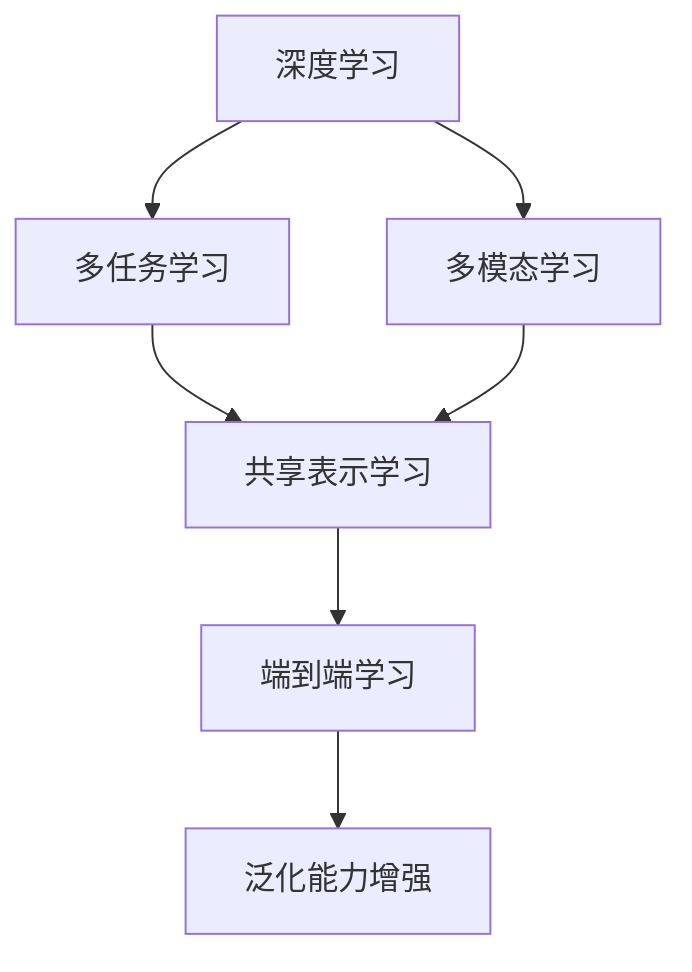

# 一切皆是映射：多任务和多模态学习中的深度学习

## 1. 背景介绍
### 1.1 人工智能的发展历程
#### 1.1.1 早期人工智能
#### 1.1.2 专家系统时代  
#### 1.1.3 机器学习兴起
### 1.2 深度学习的崛起
#### 1.2.1 深度学习的起源
#### 1.2.2 深度学习的发展历程
#### 1.2.3 深度学习的应用领域
### 1.3 多任务和多模态学习的兴起
#### 1.3.1 多任务学习的概念
#### 1.3.2 多模态学习的概念  
#### 1.3.3 多任务和多模态学习的优势

## 2. 核心概念与联系
### 2.1 深度学习
#### 2.1.1 人工神经网络
#### 2.1.2 前馈神经网络
#### 2.1.3 卷积神经网络
#### 2.1.4 循环神经网络
### 2.2 多任务学习
#### 2.2.1 多任务学习的定义
#### 2.2.2 多任务学习的分类
#### 2.2.3 多任务学习的优势
### 2.3 多模态学习 
#### 2.3.1 多模态学习的定义
#### 2.3.2 多模态数据的类型
#### 2.3.3 多模态学习的优势
### 2.4 核心概念之间的联系
#### 2.4.1 深度学习与多任务学习
#### 2.4.2 深度学习与多模态学习
#### 2.4.3 多任务学习与多模态学习

## 3. 核心算法原理具体操作步骤
### 3.1 多任务学习算法
#### 3.1.1 硬参数共享
#### 3.1.2 软参数共享
#### 3.1.3 任务聚类
### 3.2 多模态学习算法
#### 3.2.1 多模态融合
#### 3.2.2 多模态对齐
#### 3.2.3 多模态表示学习
### 3.3 多任务多模态学习算法
#### 3.3.1 多任务多模态联合学习
#### 3.3.2 多任务多模态对抗学习
#### 3.3.3 多任务多模态迁移学习

## 4. 数学模型和公式详细讲解举例说明
### 4.1 多任务学习的数学模型
#### 4.1.1 多任务学习的目标函数
$$ \min_{\Theta} \sum_{t=1}^{T} \lambda_t \mathcal{L}_t(\Theta) + \Omega(\Theta) $$
其中，$\Theta$ 表示模型参数，$\mathcal{L}_t$ 表示第 $t$ 个任务的损失函数，$\lambda_t$ 表示第 $t$ 个任务的权重，$\Omega(\Theta)$ 表示正则化项。
#### 4.1.2 多任务学习的优化算法
### 4.2 多模态学习的数学模型  
#### 4.2.1 多模态融合的数学模型
$$ \mathbf{z} = f(\mathbf{x}_1, \mathbf{x}_2, \cdots, \mathbf{x}_M) $$
其中，$\mathbf{x}_i$ 表示第 $i$ 个模态的特征向量，$f$ 表示融合函数，$\mathbf{z}$ 表示融合后的多模态表示。
#### 4.2.2 多模态对齐的数学模型
### 4.3 多任务多模态学习的数学模型
#### 4.3.1 多任务多模态联合学习的数学模型
$$ \min_{\Theta} \sum_{t=1}^{T} \lambda_t \mathcal{L}_t(\Theta) + \sum_{m=1}^{M} \mu_m \mathcal{R}_m(\Theta) + \Omega(\Theta) $$
其中，$\mathcal{R}_m$ 表示第 $m$ 个模态的重构损失，$\mu_m$ 表示第 $m$ 个模态的权重。
#### 4.3.2 多任务多模态对抗学习的数学模型

## 5. 项目实践：代码实例和详细解释说明
### 5.1 多任务学习项目实践
#### 5.1.1 多任务学习在自然语言处理中的应用
#### 5.1.2 多任务学习在计算机视觉中的应用
### 5.2 多模态学习项目实践
#### 5.2.1 多模态学习在图像描述中的应用
#### 5.2.2 多模态学习在视频理解中的应用
### 5.3 多任务多模态学习项目实践
#### 5.3.1 多任务多模态学习在视觉问答中的应用
#### 5.3.2 多任务多模态学习在情感分析中的应用

## 6. 实际应用场景
### 6.1 多任务学习的应用场景
#### 6.1.1 智能客服
#### 6.1.2 医疗诊断
#### 6.1.3 金融风控
### 6.2 多模态学习的应用场景
#### 6.2.1 智能家居
#### 6.2.2 无人驾驶
#### 6.2.3 智能安防
### 6.3 多任务多模态学习的应用场景 
#### 6.3.1 智能助理
#### 6.3.2 智慧城市
#### 6.3.3 智慧医疗

## 7. 工具和资源推荐
### 7.1 深度学习框架
#### 7.1.1 TensorFlow
#### 7.1.2 PyTorch
#### 7.1.3 Keras
### 7.2 多任务学习工具包
#### 7.2.1 MTL-Keras
#### 7.2.2 MMoE
#### 7.2.3 PLE
### 7.3 多模态学习工具包
#### 7.3.1 MMF
#### 7.3.2 MultiModal-Toolkit
#### 7.3.4 MuMMER
### 7.4 数据集资源
#### 7.4.1 多任务学习数据集
#### 7.4.2 多模态学习数据集
#### 7.4.3 多任务多模态学习数据集

## 8. 总结：未来发展趋势与挑战
### 8.1 多任务学习的未来发展趋势
#### 8.1.1 更大规模的多任务学习
#### 8.1.2 更灵活的多任务学习框架
#### 8.1.3 多任务强化学习
### 8.2 多模态学习的未来发展趋势
#### 8.2.1 更多样化的模态融合
#### 8.2.2 更深层次的跨模态理解
#### 8.2.3 多模态Few-Shot学习
### 8.3 多任务多模态学习面临的挑战
#### 8.3.1 任务和模态的异构性
#### 8.3.2 任务和模态之间的相关性建模
#### 8.3.3 大规模多任务多模态学习的计算效率

## 9. 附录：常见问题与解答
### 9.1 多任务学习常见问题
#### 9.1.1 如何选择合适的任务组合？
#### 9.1.2 如何平衡不同任务的权重？
#### 9.1.3 如何避免负迁移？
### 9.2 多模态学习常见问题  
#### 9.2.1 如何处理不同模态的数据格式？
#### 9.2.2 如何选择合适的模态融合策略？
#### 9.2.3 如何评估多模态学习的性能？
### 9.3 多任务多模态学习常见问题
#### 9.3.1 如何在多任务多模态学习中建模任务和模态之间的相关性？
#### 9.3.2 如何在多任务多模态学习中实现端到端学习？
#### 9.3.3 如何扩展多任务多模态学习到更多的任务和模态？

作者：禅与计算机程序设计艺术 / Zen and the Art of Computer Programming