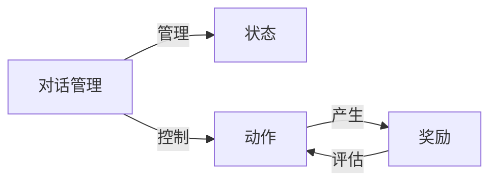
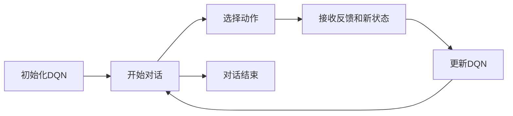

## 1.背景介绍

在人工智能领域，自然对话系统一直是一个重要的研究领域。自然对话系统的目标是让机器能够理解并生成自然语言，与人进行自然、流畅的对话。近年来，深度强化学习的出现，为实现这个目标提供了新的可能性。深度强化学习能够让机器通过与环境的交互，自我学习和改进，从而达到更好的性能。其中，深度Q网络（DQN）是深度强化学习中的一种重要方法，它通过结合深度学习和Q学习，实现了在许多任务上的突破性进展。

然而，将DQN应用于自然对话系统，仍面临许多挑战。首先，自然对话系统的状态空间和动作空间都非常大，这使得DQN的训练变得非常困难。其次，自然对话系统的奖励函数往往难以定义，因为对话的质量往往很难量化。此外，对话的序贯性也给DQN的训练带来了挑战。

本文的目标是探讨如何利用DQN实现自然对话系统，以及面临的挑战和可能的策略。

## 2.核心概念与联系

在深入讨论如何实现DQN的自然对话系统之前，我们首先需要理解一些核心的概念。

- **深度Q网络（DQN）**：DQN是一种结合了深度学习和Q学习的强化学习算法。在DQN中，深度神经网络被用作函数逼近器，用来近似最优的Q函数。

- **对话管理（Dialogue Management）**：对话管理是自然对话系统中的关键组成部分，它负责管理和控制对话的流程。

- **状态（State）**：在对话管理中，状态通常指的是对话的上下文信息，如对话历史、用户的意图等。

- **动作（Action）**：在对话管理中，动作通常指的是系统的回应，如回答问题、提供建议等。

- **奖励（Reward）**：在强化学习中，奖励是用来评估动作好坏的标准。在对话系统中，奖励可能来自用户的反馈，如满意度评分。

这些概念之间的关系可以用以下的Mermaid流程图表示：



## 3.核心算法原理具体操作步骤

下面我们将具体介绍如何使用DQN实现自然对话系统的步骤：

1. **初始化**：首先，我们需要初始化深度Q网络。网络的输入是状态，输出是对应每个可能动作的Q值。

2. **交互**：然后，系统开始与用户进行对话。在每一轮对话中，系统根据当前的状态和DQN，选择一个动作，并接收到用户的反馈和新的状态。

3. **更新**：系统根据用户的反馈（奖励）和新的状态，使用DQN的更新规则来更新网络。

4. **重复**：系统重复上述的交互和更新过程，直到对话结束。

这个过程可以用以下的Mermaid流程图表示：



## 4.数学模型和公式详细讲解举例说明

在DQN中，我们使用深度神经网络来近似最优的Q函数$Q^*(s, a)$，这个函数表示在状态$s$下，采取动作$a$能获得的最大期望回报。我们的目标是找到一个策略$\pi$，使得对于所有的$s$和$a$，都有$Q^*(s, a) = \max_\pi Q^\pi(s, a)$。

DQN的更新规则是基于贝尔曼方程的，贝尔曼方程是一个描述状态值函数如何随时间变化的方程。在DQN中，我们使用以下的更新规则：

$$Q(s, a) \leftarrow Q(s, a) + \alpha [r + \gamma \max_{a'} Q(s', a') - Q(s, a)]$$

其中，$\alpha$是学习率，$r$是奖励，$\gamma$是折扣因子，$s'$和$a'$分别是新的状态和动作。

## 5.项目实践：代码实例和详细解释说明

下面我们将通过一个简单的例子，来演示如何使用DQN实现自然对话系统。在这个例子中，我们将使用Python和PyTorch库。

首先，我们需要定义我们的DQN。这里我们使用一个简单的多层感知器（MLP）作为我们的DQN：

```python
import torch
import torch.nn as nn

class DQN(nn.Module):
    def __init__(self, state_size, action_size):
        super(DQN, self).__init__()
        self.fc1 = nn.Linear(state_size, 64)
        self.fc2 = nn.Linear(64, 64)
        self.fc3 = nn.Linear(64, action_size)

    def forward(self, x):
        x = torch.relu(self.fc1(x))
        x = torch.relu(self.fc2(x))
        return self.fc3(x)
```

然后，我们需要定义我们的对话环境。在这个环境中，我们需要定义状态空间、动作空间和奖励函数：

```python
class DialogueEnvironment:
    def __init__(self):
        self.state_size = 10
        self.action_size = 5

    def reset(self):
        return torch.randn(self.state_size)

    def step(self, action):
        new_state = torch.randn(self.state_size)
        reward = torch.randn(1)
        return new_state, reward
```

接下来，我们需要定义我们的DQN训练过程：

```python
def train_dqn(dqn, env, episodes):
    optimizer = torch.optim.Adam(dqn.parameters())
    for episode in range(episodes):
        state = env.reset()
        for t in range(100):
            action = dqn(state).argmax().item()
            new_state, reward = env.step(action)
            target = reward + dqn(new_state).max().item()
            loss = nn.MSELoss()(dqn(state)[action], target)
            optimizer.zero_grad()
            loss.backward()
            optimizer.step()
            state = new_state
```

最后，我们可以创建我们的DQN和对话环境，然后开始训练：

```python
dqn = DQN(10, 5)
env = DialogueEnvironment()
train_dqn(dqn, env, 1000)
```

## 6.实际应用场景

DQN的自然对话系统可以应用于许多场景，例如客服系统、个人助手、教育软件等。例如，一家电商公司可以使用DQN的自然对话系统来自动回答客户的问题，提供购物建议等。一个个人助手应用可以使用DQN的自然对话系统来理解用户的需求，提供个性化的服务。

## 7.工具和资源推荐

- **Python**：Python是一种流行的编程语言，它有许多用于深度学习和强化学习的库，如PyTorch和TensorFlow。

- **PyTorch**：PyTorch是一个开源的深度学习库，它提供了一种灵活和直观的方式来构建和训练深度神经网络。

- **OpenAI Gym**：OpenAI Gym是一个开源的强化学习环境库，它提供了许多预定义的环境，可以用来测试和比较强化学习算法。

## 8.总结：未来发展趋势与挑战

虽然DQN在自然对话系统中有很大的潜力，但是还面临许多挑战，如状态和动作空间的大规模性，奖励函数的定义等。未来的研究需要进一步探索如何解决这些挑战。

此外，随着深度学习和强化学习的发展，我们可以期待出现更多的新方法和技术，来提高自然对话系统的性能。例如，使用深度生成模型来生成更自然的对话，使用逆强化学习来学习用户的奖励函数等。

## 9.附录：常见问题与解答

**Q：为什么要使用深度Q网络，而不是其他的强化学习算法？**

A：深度Q网络结合了深度学习和Q学习的优点，能够处理高维的状态空间和动作空间，而且能够自动地从原始的输入中学习有用的特征。这使得DQN在许多任务上比其他的强化学习算法表现更好。

**Q：DQN的自然对话系统如何处理未知的词汇或短语？**

A：在处理未知的词汇或短语时，DQN的自然对话系统通常会使用一种称为词嵌入（word embedding）的技术。词嵌入可以将词汇映射到一个高维的向量空间，使得语义相近的词汇在空间中的距离也比较近。通过这种方式，DQN可以处理未知的词汇或短语。

**Q：DQN的自然对话系统如何评估其性能？**

A：评估DQN的自然对话系统的性能通常需要使用一些指标，如对话的成功率、平均回报等。此外，也可以通过与人进行对话，获取用户的满意度评分，来评估系统的性能。

作者：禅与计算机程序设计艺术 / Zen and the Art of Computer Programming