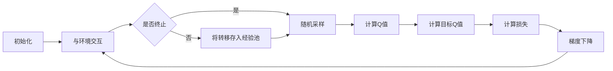

# 一切皆是映射：探索DQN在仿真环境中的应用与挑战

## 1. 背景介绍
### 1.1 强化学习概述
#### 1.1.1 强化学习的定义与特点
#### 1.1.2 强化学习的发展历程
#### 1.1.3 强化学习的应用领域
### 1.2 深度强化学习的兴起
#### 1.2.1 深度学习与强化学习的结合
#### 1.2.2 DQN算法的提出与突破
#### 1.2.3 DQN在游戏领域的成功应用
### 1.3 仿真环境的重要性
#### 1.3.1 仿真环境的定义与特点
#### 1.3.2 仿真环境在强化学习中的作用
#### 1.3.3 常用的仿真环境平台介绍

## 2. 核心概念与联系
### 2.1 马尔可夫决策过程（MDP）
#### 2.1.1 状态、动作、奖励与环境
#### 2.1.2 状态转移概率与奖励函数
#### 2.1.3 最优策略与值函数
### 2.2 Q-Learning算法
#### 2.2.1 Q值的定义与更新
#### 2.2.2 探索与利用的平衡
#### 2.2.3 Q-Learning的收敛性证明
### 2.3 DQN算法
#### 2.3.1 深度神经网络在Q-Learning中的应用
#### 2.3.2 经验回放（Experience Replay）机制
#### 2.3.3 目标网络（Target Network）的引入

## 3. 核心算法原理具体操作步骤
### 3.1 DQN算法流程
#### 3.1.1 初始化阶段
#### 3.1.2 与环境交互阶段
#### 3.1.3 网络更新阶段
### 3.2 神经网络结构设计
#### 3.2.1 输入层设计
#### 3.2.2 隐藏层设计
#### 3.2.3 输出层设计
### 3.3 超参数选择与调优
#### 3.3.1 学习率的选择
#### 3.3.2 折扣因子的选择
#### 3.3.3 探索率的衰减策略

## 4. 数学模型和公式详细讲解举例说明
### 4.1 Q值更新公式
$$Q(s_t,a_t) \leftarrow Q(s_t,a_t)+\alpha[r_{t+1}+\gamma \max_{a}Q(s_{t+1},a)-Q(s_t,a_t)]$$
其中，$s_t$ 表示当前状态，$a_t$ 表示在当前状态下选择的动作，$r_{t+1}$ 表示执行动作后获得的即时奖励，$\alpha$ 表示学习率，$\gamma$ 表示折扣因子。
### 4.2 损失函数
$$L(\theta)=\mathbb{E}_{(s,a,r,s')\sim D}[(r+\gamma \max_{a'}Q(s',a';\theta^-)-Q(s,a;\theta))^2]$$
其中，$\theta$ 表示当前网络的参数，$\theta^-$ 表示目标网络的参数，$D$ 表示经验回放池。
### 4.3 策略选择
$$\pi(a|s)=\arg\max_{a}Q(s,a)$$
即在状态 $s$ 下选择Q值最大的动作作为策略。

## 5. 项目实践：代码实例和详细解释说明
### 5.1 环境搭建
```python
import gym

env = gym.make('CartPole-v0')
```
创建一个CartPole环境，用于训练DQN智能体。
### 5.2 神经网络定义
```python
import torch
import torch.nn as nn

class DQN(nn.Module):
    def __init__(self, state_dim, action_dim):
        super(DQN, self).__init__()
        self.fc1 = nn.Linear(state_dim, 64)
        self.fc2 = nn.Linear(64, 64)
        self.fc3 = nn.Linear(64, action_dim)

    def forward(self, x):
        x = torch.relu(self.fc1(x))
        x = torch.relu(self.fc2(x))
        x = self.fc3(x)
        return x
```
定义DQN网络结构，包括两个隐藏层和一个输出层，激活函数使用ReLU。
### 5.3 训练过程
```python
import random
from collections import deque

BATCH_SIZE = 32
GAMMA = 0.99
EPS_START = 1.0
EPS_END = 0.01
EPS_DECAY = 0.995
TARGET_UPDATE = 10

memory = deque(maxlen=10000)
policy_net = DQN(state_dim, action_dim)
target_net = DQN(state_dim, action_dim)
target_net.load_state_dict(policy_net.state_dict())
optimizer = torch.optim.Adam(policy_net.parameters(), lr=1e-3)

def select_action(state):
    global steps_done
    sample = random.random()
    eps_threshold = EPS_END + (EPS_START - EPS_END) * \
        math.exp(-1. * steps_done / EPS_DECAY)
    steps_done += 1
    if sample > eps_threshold:
        with torch.no_grad():
            return policy_net(state).max(1)[1].view(1, 1)
    else:
        return torch.tensor([[random.randrange(2)]], dtype=torch.long)

for i_episode in range(num_episodes):
    state = env.reset()
    for t in range(max_steps):
        action = select_action(state)
        next_state, reward, done, _ = env.step(action.item())
        memory.append((state, action, next_state, reward))

        if len(memory) >= BATCH_SIZE:
            transitions = random.sample(memory, BATCH_SIZE)
            batch = Transition(*zip(*transitions))

            state_batch = torch.cat(batch.state)
            action_batch = torch.cat(batch.action)
            reward_batch = torch.cat(batch.reward)
            next_state_batch = torch.cat(batch.next_state)

            Q_expected = policy_net(state_batch).gather(1, action_batch)
            Q_targets_next = target_net(next_state_batch).detach().max(1)[0].unsqueeze(1)
            Q_targets = reward_batch + (GAMMA * Q_targets_next)

            loss = F.smooth_l1_loss(Q_expected, Q_targets)
            optimizer.zero_grad()
            loss.backward()
            for param in policy_net.parameters():
                param.grad.data.clamp_(-1, 1)
            optimizer.step()

        state = next_state
        if done:
            break

    if i_episode % TARGET_UPDATE == 0:
        target_net.load_state_dict(policy_net.state_dict())
```
训练过程包括与环境交互、经验存储、从经验池中采样、计算损失和网络更新等步骤。其中使用了ε-贪婪策略来平衡探索和利用，并定期将策略网络的参数复制给目标网络。

## 6. 实际应用场景
### 6.1 自动驾驶
#### 6.1.1 端到端的驾驶策略学习
#### 6.1.2 交通信号灯控制优化
### 6.2 机器人控制
#### 6.2.1 机械臂操作
#### 6.2.2 四足机器人运动控制
### 6.3 推荐系统
#### 6.3.1 在线广告投放
#### 6.3.2 个性化商品推荐

## 7. 工具和资源推荐
### 7.1 OpenAI Gym
#### 7.1.1 安装与使用
#### 7.1.2 经典控制问题环境
#### 7.1.3 Atari游戏环境
### 7.2 PyTorch
#### 7.2.1 安装与配置
#### 7.2.2 基础用法介绍
#### 7.2.3 常用的神经网络层与优化器
### 7.3 其他强化学习库
#### 7.3.1 Stable Baselines
#### 7.3.2 Ray RLlib
#### 7.3.3 TensorFlow Agents

## 8. 总结：未来发展趋势与挑战
### 8.1 DQN算法的改进方向
#### 8.1.1 Double DQN
#### 8.1.2 Dueling DQN
#### 8.1.3 Rainbow
### 8.2 多智能体强化学习
#### 8.2.1 合作与竞争
#### 8.2.2 通信机制
### 8.3 强化学习的可解释性
#### 8.3.1 可解释性的重要性
#### 8.3.2 策略可视化技术
#### 8.3.3 因果推理与强化学习

## 9. 附录：常见问题与解答
### 9.1 如何选择合适的奖励函数？
### 9.2 如何处理连续动作空间？
### 9.3 如何加速训练过程？
### 9.4 如何应对不稳定的训练？
### 9.5 如何实现策略的迁移学习？



DQN算法的核心流程如上图所示。首先对环境进行初始化，然后智能体与环境进行交互，根据ε-贪婪策略选择动作，并将状态转移存入经验池中。当经验池中的数据量达到一定阈值后，从中随机采样一个批次的数据，分别计算当前Q值和目标Q值，并据此计算损失函数。最后通过梯度下降算法对网络参数进行更新，不断提升策略的性能。

DQN算法在仿真环境中已经取得了广泛的成功，但仍然存在一些挑战和改进的方向。例如，如何处理高维、连续的状态和动作空间，如何设计更加稳定、高效的训练算法，以及如何提高强化学习策略的可解释性等。未来，随着深度强化学习技术的不断发展，我们有望在更加复杂的仿真环境和实际应用场景中，见证DQN算法的进一步突破和创新。

作者：禅与计算机程序设计艺术 / Zen and the Art of Computer Programming