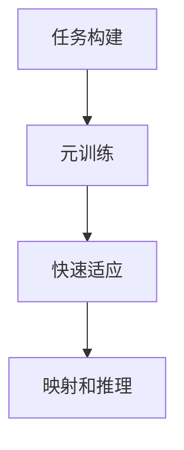

# 一切皆是映射：解码多模态数据的元学习视角

## 1. 背景介绍

在当今的数字时代,数据呈现多种多样的形式和模态,包括文本、图像、视频、音频等。这些异构数据之间存在着内在的关联和映射关系,充分挖掘和利用这些关系对于构建智能系统至关重要。传统的机器学习方法通常专注于单一模态数据,难以有效地捕捉和利用多模态数据之间的丰富信息。因此,需要一种新的范式来处理这些复杂的多模态数据,元学习(Meta-Learning)应运而生。

元学习是一种学习如何更好地学习的方法,它旨在从多个相关任务中获取元知识,并将其应用于新的相关任务。在多模态数据处理中,元学习可以帮助模型捕捉不同模态之间的映射关系,从而更好地理解和利用多模态数据。

## 2. 核心概念与联系

### 2.1 多模态数据

多模态数据是指来自不同源头和形式的异构数据,如文本、图像、视频、音频等。这些数据虽然形式不同,但往往存在着内在的语义关联和映射关系。例如,一张图像和其对应的文本描述之间存在着语义映射关系。

### 2.2 元学习

元学习(Meta-Learning)是一种学习如何更好地学习的范式。它旨在从多个相关任务中获取元知识,并将其应用于新的相关任务。在多模态数据处理中,元学习可以帮助模型捕捉不同模态之间的映射关系,从而更好地理解和利用多模态数据。

### 2.3 映射函数

映射函数是元学习在多模态数据处理中的核心概念。它描述了不同模态数据之间的转换关系,例如将图像映射到文本描述,或将文本映射到音频。通过学习这些映射函数,模型可以更好地捕捉和利用多模态数据之间的丰富信息。


## 3. 核心算法原理具体操作步骤

元学习在多模态数据处理中的核心算法原理可以概括为以下几个步骤:

1. **任务构建**: 首先需要从多模态数据中构建一系列相关的任务,例如图像描述、视频字幕生成等。这些任务将作为元学习的训练集。

2. **元训练**: 在元训练阶段,模型在一系列任务上进行训练,目标是学习任务之间的共性知识,即映射函数。这个过程可以使用各种元学习算法,如模型无关的元学习(Model-Agnostic Meta-Learning, MAML)、元学习器(Meta-Learner)等。

3. **快速适应**: 在快速适应阶段,模型利用从元训练中学习到的映射函数,快速适应新的相关任务。这个过程通常只需少量数据和少量训练步骤即可完成。

4. **映射和推理**: 对于新的多模态数据,模型可以利用学习到的映射函数将不同模态之间进行映射和推理,从而实现多模态数据的理解和利用。



## 4. 数学模型和公式详细讲解举例说明

在元学习中,一个常用的数学模型是模型无关的元学习(MAML)。MAML的核心思想是在一系列任务上进行元训练,使得模型可以快速适应新的相关任务。

### 4.1 MAML 公式

MAML的目标是找到一个初始参数 $\theta$,使得在任何新任务 $\mathcal{T}_i$ 上,通过少量梯度更新步骤就可以获得良好的性能。具体来说,MAML的目标函数可以表示为:

$$\min_{\theta} \sum_{\mathcal{T}_i \sim p(\mathcal{T})} \mathcal{L}_{\mathcal{T}_i}\left(f_{\theta_i'}\right)$$

其中:

- $p(\mathcal{T})$ 是任务分布
- $\mathcal{L}_{\mathcal{T}_i}$ 是任务 $\mathcal{T}_i$ 上的损失函数
- $f_{\theta_i'}$ 是在任务 $\mathcal{T}_i$ 上经过少量梯度更新步骤后的模型,其参数为 $\theta_i'$

MAML通过在一系列任务上优化上述目标函数,找到一个良好的初始参数 $\theta$,使得在新任务上只需少量梯度更新步骤即可获得良好的性能。

### 4.2 MAML在多模态数据处理中的应用

在多模态数据处理中,MAML可以用于学习不同模态之间的映射函数。例如,在图像描述任务中,我们可以将图像作为一种模态,文本描述作为另一种模态。通过在一系列图像描述任务上进行元训练,MAML可以学习到图像到文本的映射函数。

在新的图像描述任务上,MAML只需少量梯度更新步骤就可以快速适应,从而生成准确的文本描述。这种快速适应能力使得MAML在多模态数据处理中表现出色,能够有效地捕捉和利用不同模态之间的映射关系。

## 5. 项目实践:代码实例和详细解释说明

为了更好地理解元学习在多模态数据处理中的应用,我们将通过一个实际项目来进行说明。在这个项目中,我们将使用MAML算法来解决图像描述任务。

### 5.1 数据准备

我们将使用 Flickr30k 数据集,该数据集包含了30,000张图像及其对应的多个文本描述。我们将数据集划分为元训练集、元验证集和元测试集。

```python
# 加载数据集
dataset = Flickr30kDataset(root='data/')

# 划分数据集
meta_train_dataset, meta_val_dataset, meta_test_dataset = split_dataset(dataset)
```

### 5.2 模型定义

我们将定义一个基于MAML算法的图像描述模型。该模型包括一个编码器和一个解码器,分别用于编码图像和生成文本描述。

```python
import torch.nn as nn

class ImageEncoder(nn.Module):
    # 图像编码器定义
    ...

class TextDecoder(nn.Module):
    # 文本解码器定义
    ...

class MAMLModel(nn.Module):
    def __init__(self, encoder, decoder):
        super(MAMLModel, self).__init__()
        self.encoder = encoder
        self.decoder = decoder

    def forward(self, images, texts, is_train=True):
        # 模型前向传播
        ...
```

### 5.3 元训练

在元训练阶段,我们将在一系列图像描述任务上训练模型,以学习图像到文本的映射函数。

```python
def meta_train(model, optimizer, meta_train_dataset, meta_val_dataset, num_epochs):
    for epoch in range(num_epochs):
        # 在元训练集上训练
        train_loss = train_on_batch(model, optimizer, meta_train_dataset)

        # 在元验证集上评估
        val_loss = evaluate_on_batch(model, meta_val_dataset)

        # 记录训练和验证损失
        ...

    return model
```

### 5.4 快速适应和测试

在元测试阶段,我们将使用经过元训练的模型在新的图像描述任务上进行快速适应和测试。

```python
def meta_test(model, meta_test_dataset):
    # 在元测试集上进行快速适应和测试
    test_loss, test_metrics = evaluate_on_batch(model, meta_test_dataset, is_train=False)

    return test_loss, test_metrics
```

### 5.5 结果分析

通过上述步骤,我们可以获得模型在元测试集上的性能指标,如BLEU分数、Rouge分数等。这些指标可以反映模型在新的图像描述任务上的泛化能力。

我们还可以进一步分析模型学习到的映射函数,以了解它是如何捕捉图像和文本之间的语义关联的。

## 6. 实际应用场景

元学习在多模态数据处理中有广泛的应用前景,包括但不限于以下场景:

1. **多媒体内容理解**: 通过元学习,我们可以更好地理解和利用多模态多媒体数据,如图像、视频、音频和文本等。这对于内容推荐、内容检索、内容生成等应用场景都有重要意义。

2. **人机交互**: 在人机交互系统中,元学习可以帮助模型更好地理解和响应用户的多模态输入,如语音、手势、图像等,从而提供更自然、更智能的交互体验。

3. **医疗健康**: 在医疗健康领域,元学习可以用于整合和利用不同模态的医疗数据,如影像数据、电子病历、生理信号等,从而提高疾病诊断和治疗的准确性和效率。

4. **机器人控制**: 在机器人控制领域,元学习可以帮助机器人更好地理解和响应复杂的多模态环境信息,如视觉、触觉、语音等,从而实现更智能、更灵活的控制策略。

5. **智能安防**: 在智能安防领域,元学习可以用于整合和利用多种安防设备采集的多模态数据,如视频、音频、红外等,从而提高安全事件的检测和响应能力。

总的来说,元学习为多模态数据处理带来了新的范式和机遇,有望推动多个领域的智能化发展。

## 7. 工具和资源推荐

在实践元学习在多模态数据处理中的应用时,以下工具和资源可以为您提供帮助:

1. **PyTorch**: 一个流行的深度学习框架,提供了丰富的模型构建和训练功能,适合实现元学习算法。

2. **Learn2Learn**: 一个基于PyTorch的元学习库,包含了多种元学习算法的实现,如MAML、Meta-SGD等。

3. **Keras**: 另一个流行的深度学习框架,具有简洁的API和良好的可扩展性,也可用于实现元学习算法。

4. **TensorFlow**: Google开源的深度学习框架,提供了丰富的工具和资源,也可用于实现元学习算法。

5. **多模态数据集**: 如Flickr30k、MS-COCO、VQA等,这些数据集包含了丰富的多模态数据,可用于训练和评估元学习模型。

6. **论文和教程**: 如"Model-Agnostic Meta-Learning for Fast Adaptation of Deep Networks"、"Meta-Learning: A Survey"等,这些论文和教程可以帮助您深入理解元学习的理论和方法。

7. **在线社区**: 如PyTorch论坛、Keras论坛、TensorFlow社区等,这些社区可以提供技术支持和交流机会。

通过利用这些工具和资源,您可以更高效地开发和部署基于元学习的多模态数据处理应用。

## 8. 总结:未来发展趋势与挑战

元学习为多模态数据处理带来了新的范式和机遇,但同时也面临着一些挑战和未来发展趋势:

1. **可解释性**: 虽然元学习模型可以捕捉多模态数据之间的映射关系,但这些映射函数的内在机制往往难以解释。提高模型的可解释性是一个重要的研究方向。

2. **数据效率**: 元学习通常需要大量的任务和数据进行元训练,这对数据的需求较高。如何提高元学习的数据效率是一个值得关注的问题。

3. **任务构建**: 构建合适的任务集是元学习的关键,但这往往需要人工干预和领域知识。自动化任务构建将有助于元学习在更多领域的应用。

4. **多模态融合**: 虽然元学习可以捕捉多模态数据之间的映射关系,但如何更好地融合和利用这些映射关系仍需进一步研究。

5. **鲁棒性和安全性**: 元学习模型在面对噪声、对抗样本等情况时的鲁棒性和安全性也需要加强。

6. **硬件加速**: 随着元学习模型的复杂度不断增加,硬件加速将成为提高模型训练和推理效率的关键。

7. **新算法和范式**: 虽然现有的元学习算法取得了一定成功,但新的算法和范式的出现将进一步推动