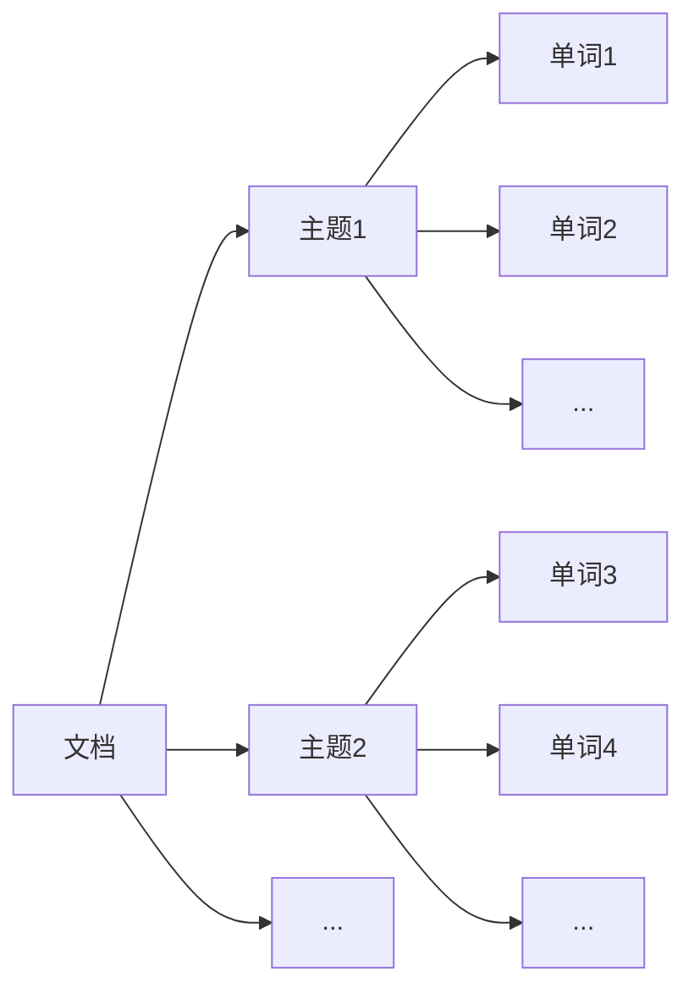

# 主题模型：挖掘文本背后的主题

## 1. 背景介绍
### 1.1 大数据时代的文本挖掘需求
在当今大数据时代,海量的非结构化文本数据正以前所未有的速度增长。如何从这些文本数据中挖掘出有价值的信息和知识,成为自然语言处理和数据挖掘领域的重要研究课题。传统的文本分析方法,如关键词提取、文本分类等,难以应对海量文本数据,也无法深入挖掘文本背后隐藏的语义信息。

### 1.2 主题模型的提出
主题模型(Topic Model)作为一种无监督的文本挖掘技术,为解决上述问题提供了新的思路。它能够从大规模文本语料库中自动发现隐藏的主题结构,揭示文本背后的语义信息,为文本挖掘和信息检索提供新的视角。本文将对主题模型的基本概念、核心算法、应用实践等进行系统介绍,帮助读者深入理解这一重要的文本挖掘技术。

## 2. 核心概念与联系
### 2.1 主题的定义
在主题模型中,主题(Topic)是一组经常在一起出现的单词。一篇文档通常包含多个主题,每个主题以不同的比例构成文档。主题反映了文本的隐藏语义结构。例如,一篇关于体育新闻的文章可能包含"足球"、"篮球"等不同的主题。

### 2.2 文档-主题-单词的关系
主题模型揭示了文档(Document)、主题(Topic)、单词(Word)三者之间的概率生成关系:
- 一篇文档由多个主题以不同比例混合而成  
- 每个主题都是单词的概率分布
- 文档中的每个单词都是从某个主题中抽取

它们的关系可以用下面的 Mermaid 图表示:



### 2.3 生成式模型
主题模型是一种生成式概率模型,它假设文档的生成过程是由主题和单词两个隐变量决定的。通过估计这些隐变量的后验概率分布,就可以得到文档的主题结构。生成式模型有利于理解文本生成的内在机制。

## 3. 核心算法原理具体操作步骤
### 3.1 PLSA
PLSA(Probabilistic Latent Semantic Analysis,概率潜在语义分析)是最早的主题模型之一。它是基于矩阵分解的思想,将文档-单词共现矩阵分解为文档-主题和主题-单词两个概率矩阵的乘积。PLSA 的生成过程如下:
1. 从文档-主题概率分布中采样生成一个主题 
2. 从主题-单词概率分布中采样生成一个单词
3. 重复以上两步,直到生成整个文档

PLSA 通过 EM 算法估计上述两个概率矩阵,得到文档的主题分布和主题的单词分布。

### 3.2 LDA
LDA(Latent Dirichlet Allocation)是当前最流行的主题模型。它是 PLSA 的贝叶斯扩展,引入了主题和单词的先验分布。LDA 的生成过程如下:
1. 从主题的先验分布(如 Dirichlet 分布)中采样生成文档的主题分布
2. 从单词的先验分布(如另一个 Dirichlet 分布)中采样生成每个主题的单词分布 
3. 对于文档中的每个单词:
   - 从文档的主题分布中采样一个主题
   - 从该主题的单词分布中采样生成单词
4. 重复以上过程,直到生成整个语料库

LDA 通过吉布斯采样、变分推断等近似算法来估计上述生成过程中的隐变量。

### 3.3 层次 LDA
层次 LDA 在 LDA 的基础上,引入了主题之间的层次结构。它假设每个主题都有一个父主题,形成一棵主题树。这种层次结构有助于发现主题之间的关系,生成更加准确的主题分布。

## 4. 数学模型和公式详细讲解举例说明
### 4.1 PLSA 的数学模型
记 $D$ 为文档集合,$W$ 为单词集合,$Z$ 为主题集合。PLSA 模型的联合概率为:

$$P(d,w) = \sum_{z \in Z} P(z)P(d|z)P(w|z)$$

其中,$P(z)$ 为主题的先验概率,$P(d|z)$ 为文档在给定主题下的条件概率,$P(w|z)$ 为单词在给定主题下的条件概率。

通过 EM 算法,PLSA 迭代估计以下两个参数:
- $P(z|d) = \frac{P(z)P(d|z)}{\sum_{z' \in Z} P(z')P(d|z')}$
- $P(w|z) = \frac{\sum_{d \in D} n(d,w)P(z|d)}{\sum_{w' \in W} \sum_{d \in D} n(d,w')P(z|d)}$

其中,$n(d,w)$ 为单词 $w$ 在文档 $d$ 中的出现次数。

### 4.2 LDA 的数学模型
LDA 在 PLSA 的基础上,引入了主题和单词的先验分布。记 $\alpha$ 和 $\beta$ 分别为主题和单词的先验 Dirichlet 分布参数,LDA 的生成过程可以表示为:

1. 对于语料库中的每篇文档 $d$:
   - 从 $Dir(\alpha)$ 中采样主题分布 $\theta_d$
   - 对于文档中的每个单词 $w_{dn}$:
     - 从 $\theta_d$ 中采样一个主题 $z_{dn}$
     - 从 $Dir(\beta)$ 中采样单词分布 $\phi_{z_{dn}}$,并从中采样单词 $w_{dn}$
     
LDA 的联合分布为:

$$P(W,Z,\theta,\phi|\alpha,\beta) = \prod_{d=1}^{M} P(\theta_d|\alpha) \prod_{n=1}^{N_d} P(z_{dn}|\theta_d)P(w_{dn}|\phi_{z_{dn}})$$

其中,$M$ 为文档数,$N_d$ 为文档 $d$ 的单词数。

LDA 通过吉布斯采样等近似推断算法,估计后验分布:

$$P(Z|\alpha,\beta) = \frac{P(W,Z|\alpha,\beta)}{\sum_{Z} P(W,Z|\alpha,\beta)}$$

## 5. 项目实践：代码实例和详细解释说明
下面是用 Python 实现 LDA 主题模型的示例代码:

```python
from gensim import corpora, models

# 准备文本语料
texts = [
    ['human', 'interface', 'computer'],
    ['survey', 'user', 'computer', 'system', 'response', 'time'],
    ['eps', 'user', 'interface', 'system'],
    ['system', 'human', 'system', 'eps'],
    ['user', 'response', 'time'],
    ['trees'],
    ['graph', 'trees'],
    ['graph', 'minors', 'trees'],
    ['graph', 'minors', 'survey']
]

# 构建词典
dictionary = corpora.Dictionary(texts)

# 将文本转换为词袋向量
corpus = [dictionary.doc2bow(text) for text in texts]

# 训练 LDA 模型
lda_model = models.LdaMulticore(corpus=corpus, id2word=dictionary, num_topics=3)

# 打印每个主题的前 5 个单词
for idx, topic in lda_model.print_topics(-1):
    print('Topic: {} \nWords: {}'.format(idx, topic))
```

代码说明:
1. 首先准备文本语料,这里使用了一个简单的示例语料。
2. 使用 Gensim 库的 `Dictionary` 类构建词典,将每个单词映射为一个唯一的整数 ID。
3. 将文本语料转换为词袋(Bag-of-Words)向量,即每篇文档为一个稀疏向量,向量的每个元素为单词的 ID 和出现次数。
4. 使用 Gensim 的 `LdaMulticore` 类训练 LDA 模型,设置主题数为 3。这里使用了多核并行训练以加速。
5. 打印每个主题的前 5 个单词及其概率。

运行结果:
```
Topic: 0
Words: 0.056*"user" + 0.053*"system" + 0.045*"eps" + 0.040*"time" + 0.037*"response"

Topic: 1
Words: 0.105*"graph" + 0.088*"minors" + 0.086*"trees" + 0.045*"survey" + 0.023*"system"

Topic: 2
Words: 0.081*"system" + 0.066*"computer" + 0.065*"human" + 0.056*"interface" + 0.041*"survey"
```

可以看到,LDA 成功地从文本语料中发现了 3 个有意义的主题,每个主题由一组相关的单词组成。

## 6. 实际应用场景
主题模型在许多领域都有广泛应用,包括:
- 文本分类与聚类:通过主题分布表示文档,进行分类和聚类任务。
- 信息检索:通过主题匹配实现语义级别的文档检索。
- 推荐系统:利用用户浏览文档的主题分布,实现个性化推荐。
- 舆情分析:从社交媒体文本中挖掘热点话题和情感倾向。
- 文本摘要:通过主题权重自动提取文档的关键句子,生成摘要。

此外,主题模型还被用于历史文献分析、科学文献挖掘、专利分析等领域。

## 7. 工具和资源推荐
- Gensim:Python 的开源主题建模库,支持 LDA、LSA 等多种算法。
- MALLET:Java 的主题建模工具包,提供命令行和 API 接口。
- Stanford Topic Modeling Toolbox:Matlab 的主题建模工具包。
- Tomotopy:Python 的高性能主题建模库,支持大规模并行训练。
- Familia:工业级 Python 主题建模库,由百度开源。

一些主题模型的重要论文:
- Probabilistic Latent Semantic Analysis (PLSA)
- Latent Dirichlet Allocation (LDA) 
- Hierarchical Dirichlet Process (HDP)
- Correlated Topic Model (CTM)
- Dynamic Topic Model (DTM)

## 8. 总结：未来发展趋势与挑战
主题模型经过二十多年的发展,已经成为文本挖掘领域最重要的工具之一。未来主题模型的研究方向包括:
- 融合先验知识,如词汇关系、文档结构等,构建更加准确的主题模型。
- 提高模型的可解释性,使主题更加符合人的直觉理解。
- 扩展到多模态数据,如图文、音频、视频等,实现跨模态的主题分析。
- 改进推断算法,提高模型在大规模语料上的训练和推断效率。
- 结合深度学习,利用神经网络增强主题模型的表达能力。

主题模型也面临一些挑战:
- 主题一致性问题:保证学习到的主题在语义上的一致性和连贯性。
- 主题数选择:如何自动确定合适的主题数。
- 稀疏性问题:如何学习稀疏的主题-单词分布和文档-主题分布。
- 时间动态性:如何刻画主题随时间的演化过程。

相信通过研究者的不断努力,主题模型必将在理论和应用上取得更大的突破,为我们理解和挖掘大规模文本数据提供更加有力的工具。

## 9. 附录：常见问题与解答
1. 主题模型适合处理长文本还是短文本?
   
   主题模型对文档长度没有严格要求,但由于短文本的单词共现信息较少,主题学习的效果可能不如长文本。针对短文本,可以考虑引入外部知识,或将短文本聚合为长文档进行建模。

2. 主题模型是否需要对文本进行预处理?

   是的,主题模型通常需要对文本进行分词、去除停用词、词形还原等预处理步骤。高质量的文本预处理有助于提高主题的质量。

3. 如何评估主题模