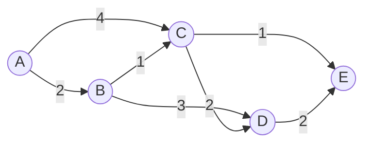

# 交通大数据分析:Pregel构建智能交通系统

## 1. 背景介绍
### 1.1 智能交通系统的重要性
随着城市化进程的加速,交通拥堵、事故频发等问题日益突出,严重影响着人们的出行效率和生活质量。为了缓解这些问题,各国都在积极探索智能交通系统(Intelligent Transportation System, ITS)的建设。智能交通系统利用先进的信息技术、通信技术、传感技术、控制技术和计算机技术,实现人、车、路的有效协同,提高交通系统的安全性、便捷性和高效性。

### 1.2 大数据在智能交通中的应用
在智能交通系统中,海量的交通数据发挥着至关重要的作用。车辆GPS轨迹数据、路侧监控视频、电子警察拍摄照片、ETC数据等,都蕴含着交通状况的重要信息。传统的数据处理方式难以应对如此庞大的数据量,大数据技术的出现为智能交通系统的建设提供了新的思路。通过大数据分析,我们可以实时掌握道路通行状况,预测交通流量,优化交通信号配时,为驾驶员提供最优出行路线等。

### 1.3 Pregel模型简介
Pregel是Google提出的一种大规模图计算模型,特别适用于海量数据的复杂关联分析。Pregel采用"思考像顶点"(Think like a vertex)的思想,将复杂的图计算问题分解为多个顶点上的并行计算任务。顶点之间通过消息传递的方式进行通信,整个计算过程以迭代的方式不断收敛,直至满足终止条件。Pregel模型具有容错性好、易于编程等优点,已在PageRank、最短路径、社交网络分析等领域得到广泛应用。

## 2. 核心概念与联系
### 2.1 交通网络图
交通网络可以抽象为一个加权有向图$G=(V,E)$。其中,顶点集$V$表示路口,边集$E$表示道路,边的权重可以是道路长度、通行时间等属性。将交通网络映射为图结构,为后续的数据分析提供了基础。

### 2.2 Pregel的顶点中心视角
Pregel的核心思想是"思考像顶点",即从单个顶点的视角来设计算法。每个顶点都可以接收来自其他顶点的消息,根据接收到的消息更新自己的状态,并向其他顶点发送消息。例如,在计算最短路径时,每个顶点保存从源点到自己的最短距离,并不断向邻居顶点发送更新后的距离信息。

### 2.3 Pregel的消息传递机制
Pregel通过消息传递的方式实现顶点之间的通信。在每一轮迭代中,活跃的顶点可以给其他顶点发送消息。消息会在下一轮迭代开始时发送给目标顶点。顶点接收到消息后,根据消息内容更新自己的状态。当没有顶点再发送消息时,计算终止。

### 2.4 Pregel的容错机制
Pregel采用Checkpoint的方式实现容错。在计算过程中,会定期对顶点的状态进行持久化存储。如果某个Worker节点发生故障,可以从上一个Checkpoint恢复状态,减少重新计算的开销。同时,Pregel将失效消息和冗余消息通过再次计算的方式得以解决,避免了复杂的消息恢复逻辑。

## 3. 核心算法原理具体操作步骤
下面以计算交通网络中的最短路径为例,介绍Pregel的核心算法原理和操作步骤。

### 3.1 算法原理
最短路径算法的目标是找到从源顶点到图中其他所有顶点的最短路径。Pregel中的最短路径算法基于Bellman-Ford算法,通过逐步松弛边的方式更新最短距离。

### 3.2 顶点状态
每个顶点需要维护以下状态:
- id:顶点的唯一标识
- distance:从源顶点到该顶点的最短距离
- parent:最短路径树中该顶点的父节点

初始时,源顶点的distance为0,其他顶点的distance为正无穷。

### 3.3 消息格式
顶点之间传递的消息格式为(distance),表示发送方到接收方的最短距离。

### 3.4 算法步骤
1. 初始化:将源顶点的distance设为0,其他顶点的distance设为正无穷。
2. 第一轮迭代:源顶点向所有邻居顶点发送(distance+edge.weight)的消息。
3. 后续迭代:每个顶点接收消息,如果收到的distance小于当前distance,则更新自己的distance和parent,并向邻居顶点发送(distance+edge.weight)的消息。
4. 终止条件:当没有顶点再发送消息时,计算终止。此时,每个顶点的distance即为从源顶点到该顶点的最短距离,通过parent可以还原出最短路径。

## 4. 数学模型和公式详细讲解举例说明
### 4.1 最短路径问题的数学定义
给定加权有向图$G=(V,E)$,源顶点$s∈V$,求解从$s$到图中其他所有顶点的最短路径。

定义从$s$到顶点$v$的最短路径距离为:
$$
d(s,v)=
\begin{cases}
0 & v=s \\
min\{d(s,u)+w(u,v)|(u,v)∈E\} & v≠s
\end{cases}
$$

其中,$w(u,v)$表示边$(u,v)$的权重。

### 4.2 Bellman-Ford算法的数学描述
Bellman-Ford算法基于动态规划的思想,通过松弛操作逐步更新最短距离。

定义$d_i(v)$为从$s$到$v$的最多经过$i$条边的最短距离,则有:
$$
d_i(v)=
\begin{cases}
0 & i=0,v=s \\
+∞ & i=0,v≠s \\
min\{d_{i-1}(v),min\{d_{i-1}(u)+w(u,v)|(u,v)∈E\}\} & i>0
\end{cases}
$$

算法过程如下:
1. 初始化:$d_0(s)=0$,$d_0(v)=+∞(v≠s)$
2. 循环$|V|-1$轮,每一轮:
   - 对于每条边$(u,v)∈E$,执行松弛操作:
     $d_i(v)=min\{d_i(v),d_{i-1}(u)+w(u,v)\}$
3. 检测负环:对于每条边$(u,v)∈E$,若$d(v)>d(u)+w(u,v)$,则图中存在负环。

### 4.3 例子说明
考虑如下图所示的加权有向图,求解从顶点A到其他顶点的最短路径。



初始时,A的距离为0,其他顶点的距离为正无穷。

第一轮迭代:
- A到B的距离更新为2
- A到C的距离更新为4

第二轮迭代:  
- B到C的距离更新为3
- B到D的距离更新为5
- C到D的距离更新为6
- C到E的距离更新为5

第三轮迭代:
- C到D的距离更新为5
- D到E的距离更新为7

此时,所有顶点的最短距离都已求出:
- A到B的最短距离为2,最短路径为A->B
- A到C的最短距离为3,最短路径为A->B->C
- A到D的最短距离为5,最短路径为A->B->D
- A到E的最短距离为5,最短路径为A->C->E

## 5. 项目实践:代码实例和详细解释说明
下面给出基于Pregel模型实现最短路径算法的简要代码实例。以下代码使用C++语言和Google的开源Pregel框架编写。

```cpp
#include "pregel/pregel.h"

using namespace std;

//定义消息类型
struct ShortestPathMessage {
  double distance;

  ShortestPathMessage(double d=numeric_limits<double>::max()) : distance(d) {}
};

//定义顶点状态类型
struct ShortestPathVertex {
  double distance;
  int parent;

  ShortestPathVertex(double d=numeric_limits<double>::max(), int p=-1) 
    : distance(d), parent(p) {}
};

//定义Compute函数
class ShortestPathCompute : public Compute<ShortestPathVertex, double, ShortestPathMessage> {
public:
  void Compute(MessageIterator* msgs) {
    //初始化
    if (superstep() == 0) {
      set_value(ShortestPathVertex(
        (get_vertex_id() == 0) ? 0 : numeric_limits<double>::max()
      ));
    }
    
    //更新最短距离
    double mindist = get_value().distance;
    for (; !msgs->Done(); msgs->Next()) {
      const ShortestPathMessage& msg = msgs->Value();
      mindist = min(mindist, msg.distance);
    }
    if (mindist < get_value().distance) {
      *mutable_value() = ShortestPathVertex(mindist, get_vertex_id());
    }
    
    //向邻居顶点发送消息
    if (mindist < get_value().distance) {
      for (int e = 0; e < get_out_edge_num(); ++e) {
        SendMessageTo(get_out_edge_target(e), 
          ShortestPathMessage(mindist + get_out_edge_value(e)));
      }
    }
    
    //投票停止
    VoteToHalt();
  }
};

//主函数
int main(int argc, char** argv) {
  //初始化Pregel
  PregelContext context;
  context.Init(&argc, &argv);
  
  //加载图数据  
  string graph_file = context.GetCfg("graph_file", "");
  GraphLoader loader(graph_file);
  Graph<ShortestPathVertex, double, ShortestPathMessage> graph;
  loader.Load(&graph);
  
  //运行最短路径算法
  Pregel<ShortestPathVertex, double, ShortestPathMessage> pregel;
  pregel.Init(&context);
  pregel.Run(&graph, ShortestPathCompute);
  
  //打印结果
  for (int v = 0; v < graph.vertex_num(); ++v) {
    cout << "Vertex " << v << ": Distance = " 
         << graph.vertex(v).value().distance << endl;
  }
  
  return 0;
}
```

代码说明:
1. 定义了消息类型`ShortestPathMessage`,包含一个`distance`字段,表示源顶点到该顶点的距离。
2. 定义了顶点状态类型`ShortestPathVertex`,包含`distance`和`parent`两个字段,分别表示最短距离和最短路径树中的父节点。
3. 定义了`Compute`函数`ShortestPathCompute`,实现了最短路径算法的核心逻辑。
   - 在第0轮迭代中,将源顶点的`distance`初始化为0,其他顶点初始化为正无穷。
   - 在每轮迭代中,接收消息并更新自己的最短距离,如果距离有所改变,则向邻居顶点发送新的距离消息。
   - 当没有顶点再发送消息时,调用`VoteToHalt()`投票停止计算。
4. 在`main`函数中,初始化Pregel,加载图数据,运行最短路径算法,并打印结果。

以上代码展示了如何使用Pregel模型实现最短路径算法。实际应用中,还需要根据具体需求进行适当的修改和优化。

## 6. 实际应用场景
Pregel在交通大数据分析中有广泛的应用,下面列举几个典型的场景:

### 6.1 路径规划
利用Pregel计算交通网络中任意两点之间的最短路径,可以为驾驶员提供实时的路径规划服务。结合实时路况信息,还可以计算最优出行路线,避开拥堵路段。

### 6.2 交通流量预测
将交通网络抽象为图模型,利用Pregel对历史车流量数据进行分析,可以发现车流量的时空分布规律。再结合实时交通数据,可以预测未来一段时间内的交通流量,为交通管理部门的决策提供支持。

### 6.3 关键节点挖掘
交通网络中的某些关键节点(如枢纽路口、重要道路)对整个网络的通达性有重要影响。利用Pregel计算节点的中心性指标(如介数中