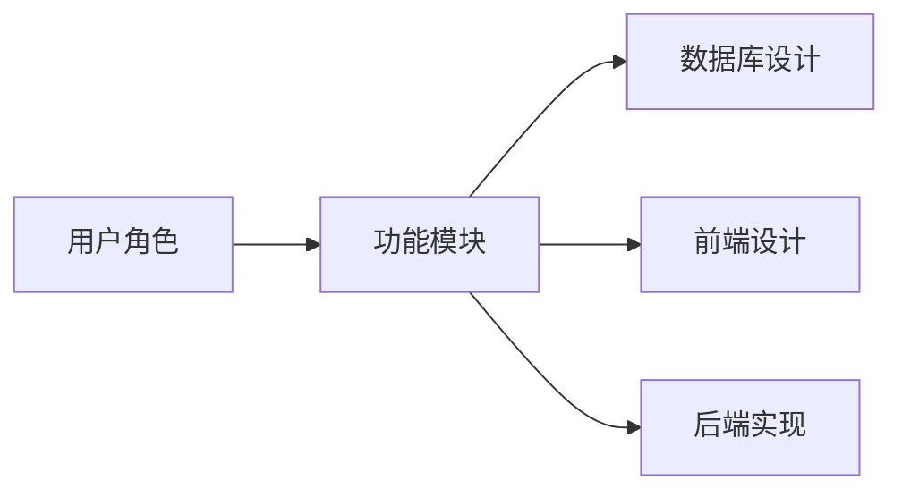

## 1.背景介绍

在信息化社会，互联网已经渗透到我们生活的各个方面，包括求职招聘。人才交流网站作为求职者和招聘者的桥梁，已经成为了人才市场的重要组成部分。本文将详细介绍一个人才交流网站的详细设计和具体代码实现。

## 2.核心概念与联系

设计一个人才交流网站，需要理解和掌握的核心概念包括用户角色、功能模块、数据库设计、前端设计和后端实现等。用户角色主要包括求职者和招聘者，他们在网站上的行为和需求是不同的。功能模块则是根据用户角色的需求来设计的，包括用户注册登录、简历管理、职位搜索、职位发布等。数据库设计是为了存储和管理用户数据和职位信息。前端设计主要是用户界面的设计，后端实现则是实现各种功能和处理用户请求。



## 3.核心算法原理具体操作步骤

在设计人才交流网站时，我们主要采用了MVC（Model-View-Controller）架构模式。MVC架构模式将应用程序分为三个组件：模型（Model）、视图（View）和控制器（Controller）。模型负责管理数据和业务逻辑，视图负责显示用户界面，控制器负责处理用户请求和更新视图。这种模式可以使得各个组件的职责明确，易于维护和扩展。

在数据库设计中，我们采用了关系数据库管理系统（RDBMS），并使用SQL语言进行数据操作。我们设计了用户表、简历表、职位表等，以存储和管理用户数据和职位信息。

在前端设计中，我们采用了HTML、CSS和JavaScript技术，实现了用户界面的设计。我们还使用了Ajax技术，使得用户可以在不刷新页面的情况下进行数据交互。

在后端实现中，我们选择了Java语言和Spring框架。我们使用了Spring MVC框架来实现MVC架构模式，使用Spring Data JPA来进行数据库操作，使用Spring Security来进行安全控制。

## 4.数学模型和公式详细讲解举例说明

在设计人才交流网站时，我们需要对一些功能进行算法设计，例如职位搜索和推荐。我们可以使用TF-IDF算法来实现职位搜索，使用协同过滤算法来实现职位推荐。

TF-IDF算法是一种用于信息检索和文本挖掘的常用加权技术。TF是词频（Term Frequency），IDF是逆文档频率（Inverse Document Frequency）。词频是指一个词在文档中出现的频率，逆文档频率则是指一个词在所有文档中出现的频率的倒数。TF-IDF的主要思想是：如果某个词在一个文档中出现的频率高，且在其他文档中很少出现，则认为此词具有很好的类别区分能力，适合用来分类。TF-IDF的计算公式如下：

$$
TF-IDF = TF * IDF
$$

$$
TF = \frac{某个词在文档中的出现次数}{文档的总词数}
$$

$$
IDF = log(\frac{文档总数}{包含该词的文档数+1})
$$

协同过滤算法是一种常用的推荐算法，主要用于预测用户对物品的评分或者喜好程度。它的主要思想是：如果用户A和用户B在过去对某些物品的评分或者喜好程度相似，那么他们在将来对其他物品的评分或者喜好程度也可能相似。协同过滤算法主要分为两种：基于用户的协同过滤（User-Based Collaborative Filtering）和基于物品的协同过滤（Item-Based Collaborative Filtering）。在这里，我们使用基于用户的协同过滤来实现职位推荐。具体步骤如下：

1. 计算用户之间的相似度。我们可以使用余弦相似度或者皮尔逊相关系数来计算用户之间的相似度。

2. 找到和目标用户最相似的K个用户，这K个用户称为目标用户的邻居。

3. 根据邻居用户对物品的评分或者喜好程度，预测目标用户对物品的评分或者喜好程度。

4. 推荐预测评分或者喜好程度最高的N个物品给目标用户。

## 5.项目实践：代码实例和详细解释说明

在实际项目实践中，我们主要使用Java语言和Spring框架进行开发。以下是一些代码实例和详细解释：

1. 用户注册：用户注册功能是通过UserController类的register方法来实现的。首先，我们通过@RequestParam注解获取表单中的用户名和密码，然后调用UserService的register方法进行注册。在UserService的register方法中，我们首先检查用户名是否已经存在，如果存在，则抛出异常；如果不存在，则创建一个新的User对象，设置其用户名和密码，并保存到数据库中。

```java
@Controller
public class UserController {
    @Autowired
    private UserService userService;

    @RequestMapping(value = "/register", method = RequestMethod.POST)
    public String register(@RequestParam("username") String username, 
                           @RequestParam("password") String password) {
        userService.register(username, password);
        return "redirect:/login";
    }
}

@Service
public class UserService {
    @Autowired
    private UserRepository userRepository;

    public void register(String username, String password) {
        if (userRepository.findByUsername(username) != null) {
            throw new RuntimeException("用户名已存在");
        }
        User user = new User();
        user.setUsername(username);
        user.setPassword(password);
        userRepository.save(user);
    }
}
```

2. 职位搜索：职位搜索功能是通过JobController类的search方法来实现的。首先，我们通过@RequestParam注解获取表单中的关键词，然后调用JobService的search方法进行搜索。在JobService的search方法中，我们使用TF-IDF算法来计算每个职位的得分，然后按得分排序，返回得分最高的职位。

```java
@Controller
public class JobController {
    @Autowired
    private JobService jobService;

    @RequestMapping(value = "/search", method = RequestMethod.GET)
    public String search(@RequestParam("keyword") String keyword, Model model) {
        List<Job> jobs = jobService.search(keyword);
        model.addAttribute("jobs", jobs);
        return "search";
    }
}

@Service
public class JobService {
    @Autowired
    private JobRepository jobRepository;

    public List<Job> search(String keyword) {
        List<Job> allJobs = jobRepository.findAll();
        Map<Job, Double> scores = new HashMap<>();
        for (Job job : allJobs) {
            double score = calculateTfIdf(job.getDescription(), keyword);
            scores.put(job, score);
        }
        List<Job> jobs = scores.entrySet().stream()
            .sorted(Map.Entry.comparingByValue(Comparator.reverseOrder()))
            .map(Map.Entry::getKey)
            .collect(Collectors.toList());
        return jobs;
    }

    private double calculateTfIdf(String document, String term) {
        // 计算TF-IDF得分
    }
}
```

## 6.实际应用场景

人才交流网站可以广泛应用于各种求职招聘场景。求职者可以在网站上搜索职位，查看职位详情，申请职位，管理简历等。招聘者可以在网站上发布职位，查看申请者，管理职位等。通过人才交流网站，求职者和招聘者可以更方便、高效地进行人才交流。

## 7.工具和资源推荐

在设计和实现人才交流网站时，我们使用了以下工具和资源：

1. 开发工具：我们使用Eclipse作为开发工具，使用Git进行版本控制。

2. 开发框架：我们使用Spring框架进行后端开发，使用Thymeleaf进行前端开发。

3. 数据库：我们使用MySQL作为数据库，使用Spring Data JPA进行数据操作。

4. 服务器：我们使用Tomcat作为服务器，使用Nginx进行反向代理和负载均衡。

5. 其他工具：我们使用Maven进行项目管理，使用Junit进行单元测试，使用Log4j进行日志管理。

## 8.总结：未来发展趋势与挑战

随着互联网的发展，人才交流网站的功能将越来越丰富，用户体验将越来越好。但同时，也面临着一些挑战，例如如何提高搜索质量，如何提高推荐质量，如何保护用户隐私，如何防止恶意行为等。这些都需要我们进行深入研究和不断创新。

## 9.附录：常见问题与解答

1. 问题：如何提高搜索质量？

   答：我们可以使用更先进的搜索算法，例如BM25算法，也可以使用搜索引擎，例如Elasticsearch。另外，我们还可以对搜索结果进行人工干预，例如设置热门职位，设置黑名单等。

2. 问题：如何提高推荐质量？

   答：我们可以使用更先进的推荐算法，例如矩阵分解算法，也可以使用深度学习，例如神经网络推荐系统。另外，我们还可以对推荐结果进行人工干预，例如设置热门推荐，设置黑名单等。

3. 问题：如何保护用户隐私？

   答：我们需要遵守相关法律法规，尊重用户隐私，保护用户数据。我们可以使用加密技术来保护用户数据，例如使用HTTPS协议，使用密码哈希等。另外，我们还可以提供隐私设置，让用户自己决定哪些数据可以公开，哪些数据需要保密。

4. 问题：如何防止恶意行为？

   答：我们可以使用一些技术手段来防止恶意行为，例如使用验证码防止恶意注册，使用限流防止恶意请求。另外，我们还可以建立一套举报和处理机制，让用户参与到恶意行为的发现和打击中来。

以上就是关于人才交流网站的详细设计与具体代码实现的全部内容，希望对你有所帮助。

作者：禅与计算机程序设计艺术 / Zen and the Art of Computer Programming