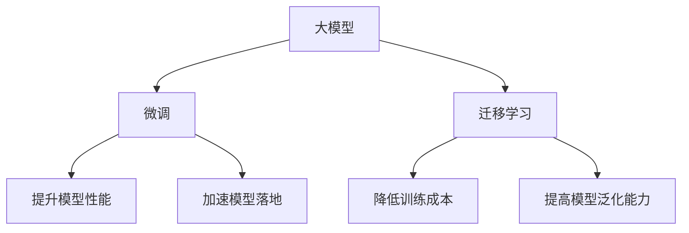

# 从零开始大模型开发与微调：人工智能：思维与实践的融合

## 1.背景介绍
### 1.1 人工智能的发展历程
#### 1.1.1 早期人工智能的探索
#### 1.1.2 机器学习的兴起
#### 1.1.3 深度学习的突破

### 1.2 大模型的出现
#### 1.2.1 大模型的定义与特点  
#### 1.2.2 大模型的发展历程
#### 1.2.3 大模型的应用前景

### 1.3 大模型开发与微调的意义
#### 1.3.1 降低人工智能应用门槛
#### 1.3.2 提升模型性能与泛化能力
#### 1.3.3 加速人工智能技术落地

## 2.核心概念与联系
### 2.1 大模型
#### 2.1.1 大模型的架构
#### 2.1.2 大模型的训练方法
#### 2.1.3 大模型的评估指标

### 2.2 微调
#### 2.2.1 微调的定义与原理
#### 2.2.2 微调的优势与局限性
#### 2.2.3 微调的实现方法

### 2.3 迁移学习
#### 2.3.1 迁移学习的概念
#### 2.3.2 迁移学习与微调的关系
#### 2.3.3 迁移学习在大模型中的应用

### 2.4 核心概念关系图


## 3.核心算法原理具体操作步骤
### 3.1 预训练
#### 3.1.1 无监督预训练
#### 3.1.2 自监督预训练
#### 3.1.3 半监督预训练

### 3.2 微调
#### 3.2.1 特定任务微调
#### 3.2.2 多任务微调
#### 3.2.3 持续学习微调

### 3.3 模型压缩
#### 3.3.1 知识蒸馏
#### 3.3.2 模型剪枝
#### 3.3.3 量化与低精度训练

## 4.数学模型和公式详细讲解举例说明
### 4.1 Transformer架构
#### 4.1.1 自注意力机制
$$
Attention(Q,K,V) = softmax(\frac{QK^T}{\sqrt{d_k}})V
$$
其中，$Q$、$K$、$V$ 分别表示查询、键、值向量，$d_k$ 为键向量的维度。

#### 4.1.2 多头注意力机制
$$
MultiHead(Q,K,V) = Concat(head_1,...,head_h)W^O \\
head_i = Attention(QW_i^Q, KW_i^K, VW_i^V)
$$
其中，$W_i^Q$、$W_i^K$、$W_i^V$ 为第 $i$ 个注意力头的权重矩阵，$W^O$ 为输出层的权重矩阵。

#### 4.1.3 前馈神经网络
$$
FFN(x) = max(0, xW_1 + b_1)W_2 + b_2
$$
其中，$W_1$、$W_2$ 为权重矩阵，$b_1$、$b_2$ 为偏置向量。

### 4.2 微调策略
#### 4.2.1 线性探针
$$
y = Wx + b
$$
其中，$x$ 为预训练模型的输出特征，$W$ 和 $b$ 为可学习的权重矩阵和偏置向量。

#### 4.2.2 全连接层微调
$$
h = \sigma(W_1x + b_1) \\
y = W_2h + b_2
$$
其中，$\sigma$ 为激活函数，$W_1$、$W_2$ 为权重矩阵，$b_1$、$b_2$ 为偏置向量。

#### 4.2.3 端到端微调
$$
y = f_\theta(x)
$$
其中，$f_\theta$ 表示整个预训练模型，$\theta$ 为模型参数。

## 5.项目实践：代码实例和详细解释说明
### 5.1 环境配置
#### 5.1.1 硬件要求
#### 5.1.2 软件依赖
#### 5.1.3 数据准备

### 5.2 模型训练
#### 5.2.1 预训练
```python
# 定义预训练模型
model = PretrainedModel()

# 定义优化器和损失函数
optimizer = AdamW(model.parameters(), lr=1e-4)
criterion = nn.CrossEntropyLoss()

# 训练循环
for epoch in range(num_epochs):
    for batch in dataloader:
        inputs, labels = batch
        outputs = model(inputs)
        loss = criterion(outputs, labels)
        
        optimizer.zero_grad()
        loss.backward()
        optimizer.step()
```

#### 5.2.2 微调
```python
# 加载预训练模型
pretrained_model = PretrainedModel()
pretrained_model.load_state_dict(torch.load('pretrained_weights.pt'))

# 定义微调模型
model = FineTuningModel(pretrained_model)

# 定义优化器和损失函数
optimizer = AdamW(model.parameters(), lr=1e-5)
criterion = nn.CrossEntropyLoss()

# 训练循环
for epoch in range(num_epochs):
    for batch in dataloader:
        inputs, labels = batch
        outputs = model(inputs)
        loss = criterion(outputs, labels)
        
        optimizer.zero_grad()
        loss.backward()
        optimizer.step()
```

### 5.3 模型评估
#### 5.3.1 评估指标
#### 5.3.2 评估结果分析
#### 5.3.3 模型优化策略

## 6.实际应用场景
### 6.1 自然语言处理
#### 6.1.1 文本分类
#### 6.1.2 命名实体识别
#### 6.1.3 机器翻译

### 6.2 计算机视觉
#### 6.2.1 图像分类
#### 6.2.2 目标检测
#### 6.2.3 语义分割

### 6.3 语音识别
#### 6.3.1 语音转文本
#### 6.3.2 说话人识别
#### 6.3.3 情感分析

## 7.工具和资源推荐
### 7.1 开源框架
#### 7.1.1 PyTorch
#### 7.1.2 TensorFlow
#### 7.1.3 Hugging Face Transformers

### 7.2 预训练模型
#### 7.2.1 BERT
#### 7.2.2 GPT系列
#### 7.2.3 ViT

### 7.3 数据集
#### 7.3.1 ImageNet
#### 7.3.2 GLUE
#### 7.3.3 SQuAD

## 8.总结：未来发展趋势与挑战
### 8.1 大模型的发展趋势
#### 8.1.1 模型规模不断增大
#### 8.1.2 多模态融合
#### 8.1.3 模型解释性与可控性

### 8.2 微调技术的发展方向
#### 8.2.1 少样本学习
#### 8.2.2 持续学习
#### 8.2.3 自适应微调

### 8.3 面临的挑战
#### 8.3.1 计算资源瓶颈
#### 8.3.2 数据隐私与安全
#### 8.3.3 模型泛化能力

## 9.附录：常见问题与解答
### 9.1 如何选择合适的预训练模型？
### 9.2 微调过程中出现过拟合怎么办？
### 9.3 如何平衡模型性能与推理速度？

大模型的出现为人工智能的发展带来了新的机遇与挑战。通过预训练和微调技术，我们可以在各种下游任务上取得优异的性能，同时降低了模型开发的门槛。然而，大模型也面临着计算资源、数据隐私等方面的挑战。未来，大模型将向着模型规模不断增大、多模态融合、解释性与可控性等方向发展，而微调技术也将在少样本学习、持续学习、自适应微调等领域取得新的突破。

人工智能的发展需要思维与实践的融合。一方面，我们要从理论上深入理解大模型和微调技术的原理，探索新的算法与架构；另一方面，我们也要将这些技术应用到实际场景中，解决现实世界的问题。只有在思维与实践的不断交互中，人工智能才能真正发挥其潜力，造福人类社会。

作者：禅与计算机程序设计艺术 / Zen and the Art of Computer Programming