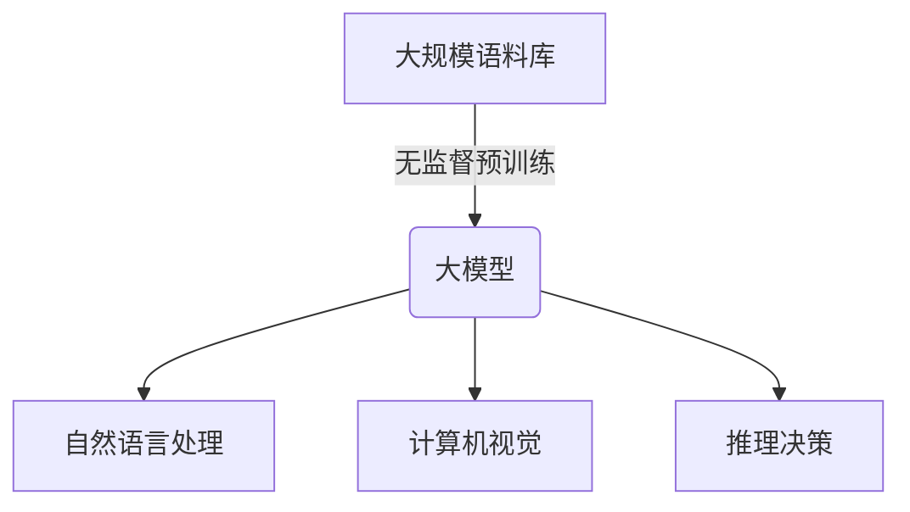
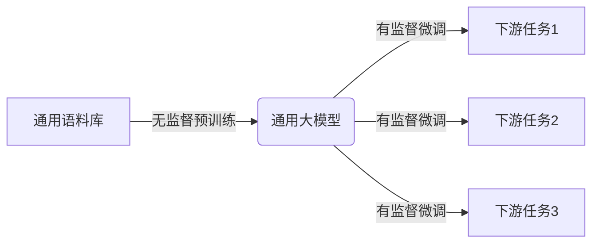
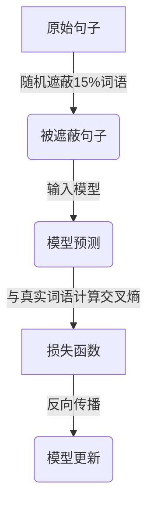

# 从零开始大模型开发与微调：最强的中文大模型—清华大学ChatGLM介绍

## 1.背景介绍

### 1.1 人工智能大模型的崛起

近年来,人工智能领域取得了长足的进步,其中大模型(Large Model)的出现无疑是最具革命性的突破之一。大模型是指具有数十亿甚至上百亿参数的深度神经网络模型,通过在大规模语料库上进行预训练,可以学习到丰富的语义和世界知识,从而在自然语言处理、计算机视觉、推理决策等多个领域展现出超人类的能力。

### 1.2 大模型在工业界的应用

工业界巨头们纷纷投入大模型研发,如OpenAI的GPT-3、谷歌的PaLM、Meta的OPT等,将大模型应用于搜索引擎、智能助理、内容创作等多个场景,取得了卓越的成绩。与此同时,开源社区也在积极推进大模型的民主化进程,如斯坦福大学的Bloom、伯克利的OPT等,为广大开发者提供了可及的大模型资源。

### 1.3 ChatGLM:中文大模型的突破

尽管英文大模型取得了长足进展,但由于语料来源和训练方式的差异,现有大模型在处理中文任务时往往表现不佳。为了突破这一瓶颈,清华大学计算机系推出了ChatGLM,这是第一个具有中文语言理解和生成能力的大规模开源双向对话语言模型。ChatGLM在中文对话、文本生成、阅读理解等任务上展现出了卓越的性能,被誉为"中文世界的GPT-3"。

## 2.核心概念与联系

### 2.1 大模型的核心思想

大模型的核心思想是通过在大规模语料库上进行无监督预训练,使模型自身学习到丰富的语义和世界知识表示。这种自监督学习方式不同于传统的有监督学习,可以避免人工标注数据的巨大成本,同时利用互联网上海量的非结构化数据作为训练资源。



### 2.2 预训练-微调范式

大模型通常采用预训练-微调(Pre-train and Fine-tune)的范式。在预训练阶段,模型在通用语料库上进行自监督学习,获取通用的语义和知识表示能力。在微调阶段,模型在特定的下游任务数据上进行有监督训练,将预训练所学的通用知识迁移到特定任务中。这种范式可以极大提高模型的泛化性能和数据利用效率。



### 2.3 大模型的挑战

尽管大模型展现出了强大的能力,但也面临着诸多挑战:

1. **计算资源消耗巨大**:大模型通常需要数十亿甚至上百亿参数,训练过程需要消耗大量的计算资源和能源。
2. **知识倾向性**:大模型在训练过程中可能会学习到一些不公平或有偏见的知识表示。
3. **缺乏解释能力**:大模型是一个黑盒系统,其内部工作机理并不透明,缺乏可解释性。
4. **安全隐患**:大模型可能会生成有害的内容,如仇恨言论、虚假信息等,存在一定的安全隐患。

## 3.核心算法原理具体操作步骤

### 3.1 自然语言预训练

大模型的预训练过程主要借鉴了自然语言处理领域的两大技术:Masked Language Modeling(MLM)和Next Sentence Prediction(NSP)。

**Masked Language Modeling**

MLM的目标是根据上下文预测被遮蔽的词语。具体操作如下:

1. 从语料库中随机抽取一个句子
2. 随机选择句子中的15%词语,用特殊的[MASK]标记替换
3. 将被遮蔽的句子输入模型,模型输出每个遮蔽位置可能的词语及其概率分布
4. 将模型预测和真实词语的交叉熵作为损失函数,反向传播优化模型参数



**Next Sentence Prediction**

NSP的目标是判断两个句子是否为连续句子。具体操作如下:

1. 从语料库中随机抽取一对句子A和B
2. 以50%概率保留A和B的原有顺序,或交换A和B的顺序
3. 将句子对输入模型,模型输出是连续句子的概率
4. 将模型预测和真实标签的交叉熵作为损失函数,反向传播优化模型参数

通过结合MLM和NSP两种任务,模型可以同时学习到词语级和句子级的语义表示能力。

### 3.2 生成式预训练

除了MLM和NSP,ChatGLM还采用了生成式预训练(Generative Pre-trained Transformer)的思路。具体来说,就是将语料库中的一部分文本作为输入prompt,模型需要生成与之相关的后续文本。这种方式可以进一步增强模型的文本生成能力。


### 3.3 模型微调

经过大规模预训练后,ChatGLM已经获得了通用的语言理解和生成能力。为了将这些能力迁移到特定的下游任务中,需要进行有监督的微调训练。

以文本分类任务为例,具体操作步骤如下:

1. 准备标注好的文本分类数据集,包含输入文本和对应的类别标签
2. 将输入文本拼接一个特殊的[Classification]标记作为prompt输入模型
3. 模型根据prompt生成对应的类别标签
4. 将模型预测和真实标签的交叉熵作为损失函数,反向传播优化模型参数

通过在特定任务数据上进行微调,模型可以将预训练所学的通用知识迁移到该任务中,从而获得更好的性能表现。

## 4.数学模型和公式详细讲解举例说明

### 4.1 Transformer模型

大模型的核心网络架构是Transformer,由Google在2017年提出,用于机器翻译任务。Transformer完全基于注意力机制(Attention Mechanism)构建,摒弃了传统的循环神经网络和卷积神经网络结构,大大提高了并行计算能力。

Transformer的核心思想是将序列中的每个元素与其他元素的关系建模,通过自注意力机制捕获长距离依赖关系。具体来说,给定一个长度为n的序列$X = (x_1, x_2, ..., x_n)$,自注意力机制首先计算每个元素$x_i$与其他元素$x_j$的相似度分数:

$$\text{Attention}(x_i, x_j) = \frac{\exp(f(x_i, x_j))}{\sum_{k=1}^n \exp(f(x_i, x_k))}$$

其中$f$是一个相似度打分函数,通常采用点积或缩放点积:

$$f(x_i, x_j) = \frac{x_i^T x_j}{\sqrt{d}}$$

这里$d$是向量维度,用于缩放点积值的数值范围。

然后,将每个元素$x_i$表示为其与所有其他元素的加权和:

$$\text{Attention}(X)_i = \sum_{j=1}^n \text{Attention}(x_i, x_j) x_j$$

通过多头注意力机制(Multi-Head Attention),模型可以从不同的子空间捕获不同的依赖关系。最终,Transformer使用编码器-解码器架构,将输入序列编码为上下文表示,再由解码器根据上下文生成目标序列。

### 4.2 GPT语言模型

大模型的预训练过程通常采用自回归语言模型(Auto-regressive Language Model),其中最著名的就是GPT(Generative Pre-trained Transformer)。GPT基于Transformer解码器,目标是最大化下一个词的条件概率:

$$P(x_t | x_1, x_2, ..., x_{t-1}) = \text{Softmax}(h_t^T W_e)$$

其中$h_t$是时间步$t$的隐状态向量,由Transformer解码器计算得到;$W_e$是词嵌入矩阵。

为了更好地建模双向上下文,GPT采用了一种被称为"全程学习"(Full Sequence Learning)的策略。具体来说,在训练时,GPT会随机从语料库中抽取一段连续的文本作为输入,并以自回归的方式预测后续的词语。通过最大化整个序列的似然,GPT可以同时利用左右上下文进行建模。

$$\mathcal{L} = -\sum_{t=1}^T \log P(x_t | x_1, x_2, ..., x_{t-1})$$

GPT的这种全程学习方式避免了传统语言模型的曝光偏差问题,可以更好地捕获长距离依赖关系,因此在生成任务上表现出色。

## 5.项目实践:代码实例和详细解释说明

以下是使用Hugging Face的Transformers库对ChatGLM进行微调的Python代码示例:

```python
from transformers import AutoTokenizer, AutoModelForCausalLM, TrainingArguments, Trainer

# 加载预训练模型和tokenizer
tokenizer = AutoTokenizer.from_pretrained("THUDM/chatglm-6b", trust_remote_code=True)
model = AutoModelForCausalLM.from_pretrained("THUDM/chatglm-6b", trust_remote_code=True)

# 准备数据集
train_data = ... # 你的训练数据
eval_data = ... # 你的评估数据

# 定义数据预处理函数
def preprocess_function(examples):
    inputs = [prefix + doc for doc in examples["text"]]
    model_inputs = tokenizer(inputs, max_length=1024, truncation=True)
    return model_inputs

# 创建Trainer对象
training_args = TrainingArguments(
    output_dir="./results",
    evaluation_strategy="epoch",
    learning_rate=2e-5,
    per_device_train_batch_size=4,
    per_device_eval_batch_size=4,
    num_train_epochs=3,
    weight_decay=0.01,
)

trainer = Trainer(
    model=model,
    args=training_args,
    train_dataset=train_data,
    eval_dataset=eval_data,
    tokenizer=tokenizer,
    preprocess_logits_for_metrics=preprocess_logits_for_metrics
)

# 开始训练
trainer.train()

# 在新数据上进行评估
eval_results = trainer.evaluate()
print(f"Evaluation results: {eval_results}")

# 保存微调后的模型
trainer.save_model("./chatglm-finetuned")
```

这段代码首先加载预训练的ChatGLM模型和tokenizer。然后定义了一个`preprocess_function`用于将原始文本转换为模型可接受的输入格式。

接下来,创建一个`Trainer`对象,设置训练超参数,如学习率、批次大小、训练轮数等。`Trainer`会自动处理训练循环、评估、日志记录等工作。

在训练过程中,模型会在训练数据上进行微调,同时在评估数据上监控性能。训练结束后,可以在新数据上评估模型的泛化能力,并保存微调后的模型权重。

需要注意的是,由于ChatGLM的巨大模型体积,训练过程需要消耗大量的计算资源。在实际应用中,你可能需要使用多GPU或TPU等加速硬件,并对代码进行相应的优化。

## 6.实际应用场景

作为一个通用的大模型,ChatGLM可以应用于多个自然语言处理任务,例如:

1. **对话系统**: 充当智能助手,为用