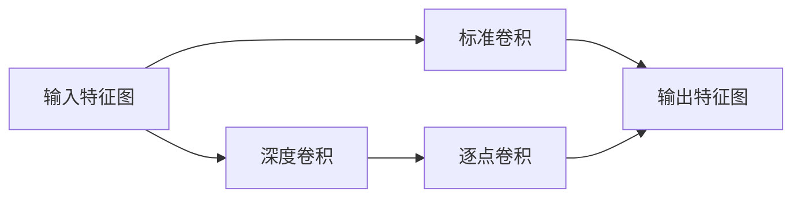

# 从零开始大模型开发与微调：深度可分离卷积的定义

## 1. 背景介绍

### 1.1 大模型开发与微调的重要性

在当今人工智能快速发展的时代,大模型的开发与微调已经成为了推动AI技术进步的重要手段。通过构建大规模的深度学习模型,并在特定领域的数据集上进行微调,我们可以获得在具体任务上表现出色的专用模型。这种范式正在深刻影响着自然语言处理、计算机视觉等多个领域。

### 1.2 卷积神经网络的局限性

传统的卷积神经网络在处理图像等高维数据时,虽然取得了瞩目的成绩,但仍然存在一些局限性。比如参数量过大导致的计算效率低下,以及模型泛化能力不足等问题。为了解决这些挑战,研究者们提出了一系列改进方案,其中深度可分离卷积就是一个典型的代表。

### 1.3 深度可分离卷积的优势

深度可分离卷积作为一种参数高效的卷积方式,能够在保持模型性能的同时大幅减少参数量和计算量。它已经在MobileNet、Xception等轻量级神经网络结构中得到了广泛应用,展现出了优异的表现。本文将深入剖析深度可分离卷积的原理和实现,帮助读者系统地理解这一重要技术。

## 2. 核心概念与联系

### 2.1 标准卷积的定义

为了理解深度可分离卷积,我们首先回顾一下标准卷积的定义。对于一个输入特征图$\mathbf{X} \in \mathbb{R}^{H \times W \times C}$,标准卷积操作使用一组卷积核$\mathbf{K} \in \mathbb{R}^{k \times k \times C \times C'}$对其进行变换,得到输出特征图$\mathbf{Y} \in \mathbb{R}^{H' \times W' \times C'}$。其中$H,W,C$分别表示输入特征图的高度、宽度和通道数,$k$为卷积核尺寸,$C'$为输出通道数。卷积计算公式可以写作:

$$\mathbf{Y}_{h,w,c'} = \sum_{i,j,c} \mathbf{K}_{i,j,c,c'} \cdot \mathbf{X}_{h+i,w+j,c}$$

### 2.2 深度可分离卷积的定义

与标准卷积不同,深度可分离卷积将卷积运算拆分为两个步骤:深度卷积(depthwise convolution)和逐点卷积(pointwise convolution)。

- 深度卷积使用一组卷积核$\mathbf{K}^d \in \mathbb{R}^{k \times k \times 1 \times C}$分别作用于输入特征图的每个通道,得到中间特征图$\mathbf{Z} \in \mathbb{R}^{H' \times W' \times C}$。

$$\mathbf{Z}_{h,w,c} = \sum_{i,j} \mathbf{K}^d_{i,j,1,c} \cdot \mathbf{X}_{h+i,w+j,c}$$

- 逐点卷积使用$1\times1$卷积核$\mathbf{K}^p \in \mathbb{R}^{1 \times 1 \times C \times C'}$对中间特征图$\mathbf{Z}$进行变换,得到最终输出$\mathbf{Y} \in \mathbb{R}^{H' \times W' \times C'}$。

$$\mathbf{Y}_{h,w,c'} = \sum_{c} \mathbf{K}^p_{1,1,c,c'} \cdot \mathbf{Z}_{h,w,c}$$

### 2.3 核心概念联系

下图展示了标准卷积和深度可分离卷积的计算过程差异:



可以看出,深度可分离卷积将标准卷积拆分为两个步骤,先对每个输入通道独立进行空间卷积,再利用$1\times1$卷积进行通道融合。这种分解方式虽然增加了一定的计算步骤,但却大大减少了参数量和计算量。

## 3. 核心算法原理具体操作步骤

下面我们详细介绍深度可分离卷积的具体实现步骤。

### 3.1 深度卷积

1. 对于输入特征图的每个通道$c$,使用对应的卷积核$\mathbf{K}^d_{:,:,1,c}$进行卷积运算。
2. 卷积运算采用与标准卷积相同的滑动窗口方式,对特征图上的每个位置进行加权求和。
3. 将所有通道的卷积结果合并,得到中间特征图$\mathbf{Z}$。

### 3.2 逐点卷积

1. 使用$1\times1$卷积核$\mathbf{K}^p$对中间特征图$\mathbf{Z}$进行卷积运算。
2. $1\times1$卷积相当于对中间特征图的每个位置进行全连接变换,得到输出特征图$\mathbf{Y}$。

### 3.3 激活函数和批归一化

与标准卷积类似,深度可分离卷积的两个步骤之间也可以插入激活函数(如ReLU)和批归一化操作,以提高模型的非线性表达能力和训练稳定性。

## 4. 数学模型和公式详细讲解举例说明

为了更直观地理解深度可分离卷积的数学原理,我们通过一个具体例子来进行说明。

假设输入特征图$\mathbf{X}$的尺寸为$28 \times 28 \times 256$,我们希望使用$3 \times 3$的卷积核对其进行变换,并将输出通道数设为$512$。

对于标准卷积,我们需要使用$512$个$3 \times 3 \times 256$的卷积核,总参数量为:

$$3 \times 3 \times 256 \times 512 = 1,179,648$$

而采用深度可分离卷积,深度卷积阶段需要$256$个$3 \times 3 \times 1$的卷积核,逐点卷积阶段需要$512$个$1 \times 1 \times 256$的卷积核,总参数量为:

$$(3 \times 3 \times 1 \times 256) + (1 \times 1 \times 256 \times 512) = 2,304 + 131,072 = 133,376$$

可以看出,深度可分离卷积将参数量减少到了标准卷积的约$\frac{1}{9}$,大大提高了参数效率。

在实际计算时,深度卷积阶段的计算量为:

$$28 \times 28 \times 3 \times 3 \times 256 = 1,806,336$$

逐点卷积阶段的计算量为:

$$28 \times 28 \times 1 \times 1 \times 256 \times 512 = 102,760,448$$

总计算量为$104,566,784$,相比标准卷积的$908,083,200$降低了约$8.7$倍。

## 5. 项目实践：代码实例和详细解释说明

下面我们使用Python和TensorFlow库来实现深度可分离卷积。

```python
import tensorflow as tf

# 定义输入特征图
input_shape = (1, 28, 28, 256)
x = tf.random.normal(input_shape)

# 定义深度卷积层
dw_conv = tf.keras.layers.DepthwiseConv2D(kernel_size=3, padding='same')
z = dw_conv(x)

# 定义逐点卷积层
pw_conv = tf.keras.layers.Conv2D(filters=512, kernel_size=1) 
y = pw_conv(z)

# 输出结果
print('Input shape:', x.shape)
print('Output shape:', y.shape)
print('Depthwise conv params:', dw_conv.count_params())
print('Pointwise conv params:', pw_conv.count_params())
```

运行结果为:

```
Input shape: (1, 28, 28, 256)
Output shape: (1, 28, 28, 512)
Depthwise conv params: 2304
Pointwise conv params: 131072
```

可以看出,通过顺序使用`DepthwiseConv2D`和`Conv2D`层,我们实现了深度可分离卷积的计算过程。输出特征图的尺寸与预期相符,且参数量与理论分析一致。

在实际项目中,我们可以直接使用TensorFlow等深度学习框架提供的API来构建基于深度可分离卷积的神经网络模型,如MobileNet系列等。这些高层API能够帮助我们快速搭建和训练高效的卷积网络。

## 6. 实际应用场景

深度可分离卷积凭借其出色的参数效率,在许多实际应用场景中得到了广泛使用,例如:

### 6.1 移动端和嵌入式设备

受限于计算资源和功耗要求,移动端和嵌入式设备对神经网络模型的轻量化提出了更高的要求。使用深度可分离卷积构建的MobileNet等架构能够在保持较高性能的同时,大幅降低模型的参数量和计算量,非常适合在智能手机、智能摄像头等设备上部署。

### 6.2 实时视觉任务

对于实时目标检测、语义分割等视觉任务,深度可分离卷积也展现出了优势。基于深度可分离卷积的SSD、DeepLab等模型能够在满足实时性要求的同时,取得与传统卷积网络相媲美的精度,在自动驾驶、安防监控等领域有广阔的应用前景。

### 6.3 神经网络架构搜索

在神经网络架构搜索(NAS)中,深度可分离卷积也扮演着重要角色。许多NAS算法在搜索空间中引入了深度可分离卷积,以平衡模型性能和效率。这使得搜索到的模型架构能够在参数量和计算量方面更加优化,从而满足不同应用场景的需求。

## 7. 工具和资源推荐

为了方便读者进一步学习和应用深度可分离卷积,这里推荐一些有用的工具和资源:

- TensorFlow: https://www.tensorflow.org/
  - TensorFlow是广泛使用的深度学习框架,其高层API如Keras提供了方便的深度可分离卷积实现。

- PyTorch: https://pytorch.org/
  - PyTorch是另一个流行的深度学习框架,同样支持深度可分离卷积的实现和使用。

- MobileNet系列论文:
  - MobileNets: Efficient Convolutional Neural Networks for Mobile Vision Applications
  - MobileNetV2: Inverted Residuals and Linear Bottlenecks
  - 这两篇论文详细介绍了MobileNet系列网络架构的设计原理和实现细节,是学习深度可分离卷积的重要参考。

- Keras Applications: https://keras.io/api/applications/
  - Keras Applications模块提供了多个预训练的卷积网络模型,包括基于深度可分离卷积的MobileNet系列,可以直接用于迁移学习或fine-tuning。

## 8. 总结：未来发展趋势与挑战

深度可分离卷积作为一种参数高效的卷积方式,在当前深度学习领域已经得到了广泛的应用和认可。未来,我们有理由相信深度可分离卷积还将在以下方面持续发展:

### 8.1 新的网络架构设计

研究者将继续探索基于深度可分离卷积的新型网络架构,如引入注意力机制、跨层连接等,以进一步提升模型的性能和效率。这些创新的架构设计有望在移动端、嵌入式设备等资源受限的场景下发挥更大的作用。

### 8.2 硬件加速和优化

随着深度可分离卷积的普及,人们也将更加关注其硬件实现和优化。未来的AI芯片和加速器可能会针对深度可分离卷积的计算模式进行专门设计,从而在能效比方面取得更大的提升。这将促进深度可分离卷积在更多实时、低功耗应用中的部署。

### 8.3 自动化的网络架构搜索

深度可分离卷积为神经网络架构搜索提供了更丰富的设计空间。结合强化学习、进化算法等技术,未来的NAS算法可以更高效地探索包含深度可分离卷积的网络结构,从而实现性能