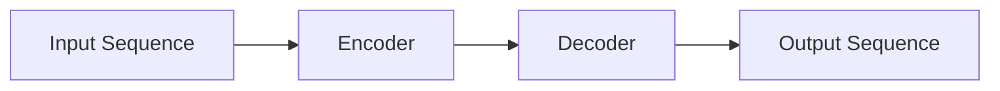

# 从零开始大模型开发与微调：解码器的核心—注意力模型

## 1. 背景介绍
### 1.1 大模型的崛起 
近年来,自然语言处理领域出现了一系列基于 Transformer 架构的大规模预训练语言模型,如 BERT、GPT 系列等。这些大模型在多个 NLP 任务上取得了显著的性能提升,展现出了强大的语言理解和生成能力。

### 1.2 Transformer 架构与注意力机制
Transformer 是一种基于自注意力机制的神经网络架构,最初在机器翻译领域取得突破。其中,注意力机制是 Transformer 的核心组件,可以有效地捕捉输入序列中不同位置之间的依赖关系。

### 1.3 解码器的重要性
在生成式任务中,如机器翻译、文本摘要等,解码器扮演着至关重要的角色。解码器负责根据编码器提取的特征,生成目标序列。而注意力机制则是解码器的关键组成部分,决定了模型的生成质量。

## 2. 核心概念与联系
### 2.1 注意力机制
注意力机制可以看作是一种加权平均的操作,通过计算不同位置之间的相关性,给予不同的权重,从而聚焦于重要的信息。常见的注意力机制有:
- Scaled Dot-Product Attention
- Multi-Head Attention
- Self-Attention

### 2.2 Transformer 架构
Transformer 由编码器和解码器两部分组成,每个部分都由多个相同的层堆叠而成。其中,每一层包含:
- Multi-Head Attention
- Feed Forward Network  

编码器和解码器之间通过注意力机制进行交互。

### 2.3 大模型中的注意力机制
在大模型如 GPT 中,解码器完全依赖于注意力机制来生成目标序列。通过 Self-Attention,模型可以捕捉输入序列内部的长距离依赖关系;通过 Cross-Attention,模型可以根据编码器的输出,动态地调整解码过程中的注意力分布。



## 3. 核心算法原理具体操作步骤
### 3.1 Scaled Dot-Product Attention
1. 将输入序列映射为 Query、Key、Value 三个矩阵
2. 计算 Query 与 Key 的点积,得到注意力分数
3. 对注意力分数进行缩放(除以 $\sqrt{d_k}$)
4. 对缩放后的注意力分数应用 Softmax 函数,得到注意力权重
5. 将注意力权重与 Value 相乘,得到加权求和的结果

$$Attention(Q,K,V) = softmax(\frac{QK^T}{\sqrt{d_k}})V$$

### 3.2 Multi-Head Attention
1. 将 Query、Key、Value 通过线性变换,映射为 h 组不同的表示
2. 对每组表示并行执行 Scaled Dot-Product Attention
3. 将 h 组注意力结果拼接起来
4. 对拼接结果进行线性变换,得到最终的 Multi-Head Attention 输出

$$MultiHead(Q,K,V) = Concat(head_1, ..., head_h)W^O$$

其中,$head_i = Attention(QW_i^Q, KW_i^K, VW_i^V)$

### 3.3 Self-Attention
Self-Attention 是一种特殊的注意力机制,Query、Key、Value 来自同一个输入序列。通过 Self-Attention,模型可以捕捉输入序列内部的依赖关系。

在 Transformer 的编码器和解码器中,都使用了 Self-Attention 来更新序列的表示。

## 4. 数学模型和公式详细讲解举例说明
### 4.1 Scaled Dot-Product Attention
假设我们有一个输入序列 $X = [x_1, x_2, ..., x_n]$,其中 $x_i \in \mathbb{R}^d$。我们首先将输入序列映射为 Query、Key、Value 三个矩阵:

$Q = XW^Q, K = XW^K, V = XW^V$

其中,$W^Q, W^K, W^V \in \mathbb{R}^{d \times d_k}$是可学习的参数矩阵。

然后,我们计算 Query 与 Key 的点积,并进行缩放:

$scores = \frac{QK^T}{\sqrt{d_k}}$

接着,对缩放后的注意力分数应用 Softmax 函数:

$weights = softmax(scores)$

最后,将注意力权重与 Value 相乘,得到加权求和的结果:

$output = weights \cdot V$

### 4.2 Multi-Head Attention
对于 Multi-Head Attention,我们首先将 Query、Key、Value 通过线性变换,映射为 h 组不同的表示:

$Q_i = XW_i^Q, K_i = XW_i^K, V_i = XW_i^V$

其中,$W_i^Q, W_i^K, W_i^V \in \mathbb{R}^{d \times d_k}$是第 i 组注意力头的参数矩阵。

然后,对每组表示并行执行 Scaled Dot-Product Attention:

$head_i = Attention(Q_i, K_i, V_i)$

接着,将 h 组注意力结果拼接起来:

$MultiHead = Concat(head_1, ..., head_h)$

最后,对拼接结果进行线性变换,得到最终的 Multi-Head Attention 输出:

$output = MultiHead \cdot W^O$

其中,$W^O \in \mathbb{R}^{hd_k \times d}$是可学习的参数矩阵。

## 5. 项目实践：代码实例和详细解释说明
下面是一个使用 PyTorch 实现 Scaled Dot-Product Attention 的代码示例:

```python
import torch
import torch.nn as nn

class ScaledDotProductAttention(nn.Module):
    def __init__(self, d_k):
        super().__init__()
        self.d_k = d_k

    def forward(self, Q, K, V):
        scores = torch.matmul(Q, K.transpose(-2, -1)) / (self.d_k ** 0.5)
        weights = torch.softmax(scores, dim=-1)
        output = torch.matmul(weights, V)
        return output
```

这个类继承自 `nn.Module`,实现了 Scaled Dot-Product Attention 的计算过程。在前向传播函数 `forward` 中,我们首先计算 Query 与 Key 的点积,并进行缩放。然后,对缩放后的注意力分数应用 Softmax 函数,得到注意力权重。最后,将注意力权重与 Value 相乘,得到加权求和的结果。

下面是一个使用 PyTorch 实现 Multi-Head Attention 的代码示例:

```python
import torch
import torch.nn as nn

class MultiHeadAttention(nn.Module):
    def __init__(self, d_model, num_heads):
        super().__init__()
        self.d_model = d_model
        self.num_heads = num_heads
        self.d_k = d_model // num_heads

        self.W_Q = nn.Linear(d_model, d_model)
        self.W_K = nn.Linear(d_model, d_model)
        self.W_V = nn.Linear(d_model, d_model)
        self.W_O = nn.Linear(d_model, d_model)

    def forward(self, Q, K, V):
        batch_size = Q.size(0)

        Q = self.W_Q(Q).view(batch_size, -1, self.num_heads, self.d_k).transpose(1, 2)
        K = self.W_K(K).view(batch_size, -1, self.num_heads, self.d_k).transpose(1, 2)
        V = self.W_V(V).view(batch_size, -1, self.num_heads, self.d_k).transpose(1, 2)

        scores = torch.matmul(Q, K.transpose(-2, -1)) / (self.d_k ** 0.5)
        weights = torch.softmax(scores, dim=-1)
        head_outputs = torch.matmul(weights, V)

        outputs = head_outputs.transpose(1, 2).contiguous().view(batch_size, -1, self.d_model)
        outputs = self.W_O(outputs)

        return outputs
```

这个类也继承自 `nn.Module`,实现了 Multi-Head Attention 的计算过程。在初始化函数中,我们定义了 Query、Key、Value 的线性变换矩阵以及最后的输出变换矩阵。

在前向传播函数 `forward` 中,我们首先将输入的 Query、Key、Value 通过线性变换映射为多组不同的表示。然后,对每组表示并行执行 Scaled Dot-Product Attention。接着,将多组注意力结果拼接起来,并进行维度调整。最后,对拼接结果进行线性变换,得到最终的 Multi-Head Attention 输出。

## 6. 实际应用场景
注意力机制和 Transformer 架构在自然语言处理领域有广泛的应用,例如:

- 机器翻译:将源语言序列编码为隐向量,然后通过注意力机制生成目标语言序列。
- 文本摘要:通过注意力机制,从输入文本中提取关键信息,生成简洁的摘要。
- 问答系统:利用注意力机制,根据问题从文本中找到相关的答案片段。
- 情感分析:通过注意力机制,捕捉文本中表达情感的关键词和句子。
- 命名实体识别:利用注意力机制,聚焦于命名实体的上下文信息,提高识别准确率。

除了自然语言处理,注意力机制还在计算机视觉、语音识别等领域得到了广泛应用。

## 7. 工具和资源推荐
- PyTorch:一个流行的深度学习框架,提供了灵活的 Tensor 计算和动态计算图。
- TensorFlow:另一个广泛使用的深度学习框架,提供了丰富的工具和资源。
- Hugging Face Transformers:一个基于 PyTorch 和 TensorFlow 的自然语言处理库,提供了多个预训练的 Transformer 模型和工具。
- Attention is All You Need:Transformer 架构的原始论文,详细介绍了 Transformer 的设计和实现。
- The Illustrated Transformer:一篇通俗易懂的博客文章,生动形象地解释了 Transformer 的工作原理。

## 8. 总结：未来发展趋势与挑战
注意力机制和 Transformer 架构的出现,极大地推动了自然语言处理领域的发展。未来,我们可以期待:

- 更大规模的预训练模型:训练更大规模的模型,捕捉更多的语言知识,提高下游任务的性能。
- 更高效的注意力机制:设计更高效的注意力机制,降低计算复杂度,提高模型的推理速度。
- 多模态融合:将注意力机制应用于多模态数据,如文本-图像、文本-语音等,实现跨模态的信息交互。
- 可解释性研究:深入研究注意力机制的可解释性,了解模型的决策过程,增强模型的可信度。

同时,我们也面临着一些挑战:

- 计算资源需求:训练大规模的 Transformer 模型需要大量的计算资源和时间,对硬件提出了更高的要求。
- 长距离依赖建模:尽管 Transformer 可以捕捉长距离依赖,但对于极长的序列,注意力机制的有效性可能会降低。
- 领域适应:如何将预训练的 Transformer 模型高效地适应特定领域的任务,仍然是一个挑战。
- 鲁棒性和公平性:确保模型在不同场景下的鲁棒性和公平性,避免偏见和错误的放大。

## 9. 附录：常见问题与解答
### Q1:注意力机制与 RNN、CNN 相比有什么优势?
A1:注意力机制可以直接建模序列中任意两个位置之间的依赖关系,而 RNN 和 CNN 只能捕捉局部的依赖关系。此外,注意力机制可以并行计算,提高了训练和推理的效率。

### Q2:Self-Attention 和 Multi-Head Attention 有什么区别?
A2:Self-Attention 是一种特殊的注意力机制,Query、Key、Value 来自同一个输入序列。而 Multi-Head Attention 是将 Self-Attention 扩展为多个头,每个头关注输入序列的不同方面,增强了模型的表达能力。

### Q3:Transformer 中的位置编码有什么作用?
A3:由于 Transformer 不包含循环或卷积结构,无法捕捉序列的位置信息。位置编码通过在输入嵌入中加入位置信息,使得模型能够区分不同位置的词,了解词之