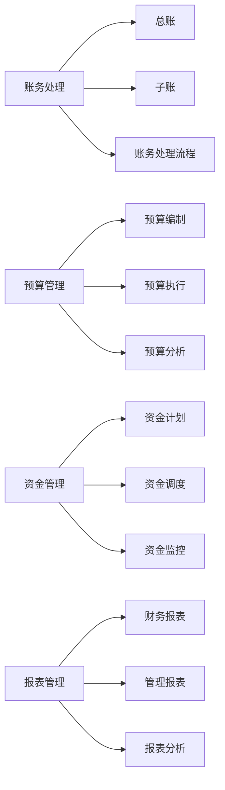

# 企业财务管理系统详细设计与具体代码实现

## 1.背景介绍

在现代企业管理中,财务管理是一个至关重要的环节。一个高效、准确、安全的财务管理系统能够帮助企业更好地掌控财务状况,优化资金配置,提高企业的整体运营效率。本文将从软件架构设计和代码实现的角度,详细阐述如何开发一个功能完善、性能优异的企业财务管理系统。

### 1.1 财务管理系统的重要性
#### 1.1.1 提高财务管理效率
#### 1.1.2 加强财务风险控制  
#### 1.1.3 优化资源配置决策

### 1.2 系统开发的目标
#### 1.2.1 功能完善,满足企业财务管理需求  
#### 1.2.2 性能优异,确保系统高效稳定运行
#### 1.2.3 安全可靠,保障财务数据安全

## 2.核心概念与联系

在企业财务管理系统中,涉及到一些核心概念,理解这些概念之间的联系,是设计好系统的基础。

### 2.1 账务处理
#### 2.1.1 总账
#### 2.1.2 子账
#### 2.1.3 账务处理流程

### 2.2 预算管理
#### 2.2.1 预算编制
#### 2.2.2 预算执行
#### 2.2.3 预算分析

### 2.3 资金管理  
#### 2.3.1 资金计划
#### 2.3.2 资金调度
#### 2.3.3 资金监控

### 2.4 报表管理
#### 2.4.1 财务报表
#### 2.4.2 管理报表 
#### 2.4.3 报表分析

以下是这些核心概念之间联系的 Mermaid 流程图:



## 3.核心算法原理具体操作步骤

财务管理系统涉及到一些核心算法,下面以账务处理为例,详细说明其原理和操作步骤。

### 3.1 复式记账法
#### 3.1.1 复式记账概念
#### 3.1.2 账户设置原则
#### 3.1.3 记账规则

### 3.2 账务处理流程
#### 3.2.1 凭证录入
1. 根据原始凭证填制记账凭证
2. 审核记账凭证
3. 记账凭证入账

#### 3.2.2 账务审核
1. 总账与明细账核对
2. 账实核对
3. 账账核对

#### 3.2.3 结账与结转
1. 月末结账
2. 期末结账
3. 损益结转

## 4.数学模型和公式详细讲解举例说明

在财务管理中,一些财务指标的计算涉及数学模型和公式,下面以常用的财务分析指标为例进行讲解。

### 4.1 偿债能力分析
#### 4.1.1 流动比率
流动比率=流动资产÷流动负债
$$ 流动比率=\frac{流动资产}{流动负债} $$

例如:某公司流动资产为1000万元,流动负债为500万元,则其流动比率为:
$$ 流动比率=\frac{1000}{500}=2 $$

#### 4.1.2 速动比率 
速动比率=(流动资产-存货)÷流动负债
$$ 速动比率=\frac{流动资产-存货}{流动负债} $$

#### 4.1.3 资产负债率
资产负债率=负债总额÷资产总额×100%

$$
资产负债率=\frac{负债总额}{资产总额} \times 100\%
$$

### 4.2 盈利能力分析
#### 4.2.1 销售毛利率
销售毛利率=(销售收入-销售成本)÷销售收入×100%

$$
销售毛利率=\frac{销售收入-销售成本}{销售收入} \times 100\%
$$

#### 4.2.2 销售净利率
销售净利率=净利润÷销售收入×100%
$$
销售净利率=\frac{净利润}{销售收入} \times 100\%
$$

#### 4.2.3 资产收益率
资产收益率=净利润÷平均资产总额×100%

$$
资产收益率=\frac{净利润}{平均资产总额} \times 100\%
$$

## 5.项目实践:代码实例和详细解释说明

下面以一个简单的财务管理系统为例,展示如何使用Python Django框架实现系统的核心功能。

### 5.1 系统架构设计
#### 5.1.1 技术选型
- 后端框架:Python Django 
- 数据库:MySQL
- 前端框架:Vue.js

#### 5.1.2 模块划分
- 账务管理模块
- 预算管理模块  
- 资金管理模块
- 报表管理模块

### 5.2 数据库设计
#### 5.2.1 ER图设计
#### 5.2.2 数据表设计

### 5.3 后端代码实现
#### 5.3.1 账务管理模块
```python
# models.py
from django.db import models

class Voucher(models.Model):
    """记账凭证"""
    voucher_no = models.CharField(max_length=20, unique=True, verbose_name="凭证号")
    voucher_date = models.DateField(verbose_name="凭证日期")
    # ...

class VoucherItem(models.Model): 
    """凭证明细"""
    voucher = models.ForeignKey(Voucher, on_delete=models.CASCADE, verbose_name="所属凭证")
    account = models.ForeignKey(Account, on_delete=models.PROTECT, verbose_name="科目")
    debit = models.DecimalField(max_digits=18, decimal_places=2, default=0, verbose_name="借方金额")
    credit = models.DecimalField(max_digits=18, decimal_places=2, default=0, verbose_name="贷方金额")
    # ...

# views.py  
from django.db.transaction import atomic

@atomic
def create_voucher(request):
    """创建记账凭证"""
    voucher_data = request.data["voucher"]
    items_data = request.data["items"]
    
    voucher = Voucher.objects.create(**voucher_data)
    
    for item_data in items_data:
        item_data["voucher"] = voucher
        VoucherItem.objects.create(**item_data)
        
    return Response({"id": voucher.id}, status=status.HTTP_201_CREATED)
```

这段代码定义了记账凭证(`Voucher`)和凭证明细(`VoucherItem`)两个数据模型,并实现了创建凭证的视图函数。在创建凭证时,使用了数据库事务来保证数据的一致性。

#### 5.3.2 预算管理模块
```python
# models.py
class Budget(models.Model):
    """预算"""
    year = models.IntegerField(verbose_name="预算年度")
    department = models.ForeignKey(Department, on_delete=models.PROTECT, verbose_name="所属部门")
    # ...

class BudgetItem(models.Model):
    """预算明细"""  
    budget = models.ForeignKey(Budget, on_delete=models.CASCADE, verbose_name="所属预算")
    account = models.ForeignKey(Account, on_delete=models.PROTECT, verbose_name="科目")
    amount = models.DecimalField(max_digits=18, decimal_places=2, default=0, verbose_name="预算金额")
    # ...

# views.py
@atomic 
def create_budget(request):
    """创建预算"""
    budget_data = request.data["budget"]
    items_data = request.data["items"]

    budget = Budget.objects.create(**budget_data)

    for item_data in items_data:
        item_data["budget"] = budget
        BudgetItem.objects.create(**item_data)

    return Response({"id": budget.id}, status=status.HTTP_201_CREATED)
```

这段代码定义了预算(`Budget`)和预算明细(`BudgetItem`)两个数据模型,并实现了创建预算的视图函数。同样使用了数据库事务来保证数据一致性。

### 5.4 前端代码实现
#### 5.4.1 账务管理页面
```html
<!-- VoucherList.vue -->
<template>
  <div>
    <el-table :data="vouchers">
      <el-table-column prop="voucher_no" label="凭证号"></el-table-column>
      <el-table-column prop="voucher_date" label="凭证日期"></el-table-column>
      <!-- ... -->
    </el-table>
    
    <el-pagination
      @size-change="handleSizeChange"
      @current-change="handleCurrentChange"
      :current-page="page"
      :page-sizes="[10, 20, 30, 40]"
      :page-size="size"
      layout="total, sizes, prev, pager, next, jumper"
      :total="total">
    </el-pagination>
  </div>
</template>

<script>
export default {
  data() {
    return {
      vouchers: [],
      page: 1,
      size: 10,
      total: 0
    }
  },
  methods: {
    async fetchVouchers() {
      const res = await this.$http.get('/api/vouchers/', {
        params: {page: this.page, size: this.size}
      });
      this.vouchers = res.data.results;
      this.total = res.data.count;
    },
    handleSizeChange(size) {
      this.size = size;
      this.fetchVouchers();
    },
    handleCurrentChange(page) {
      this.page = page;
      this.fetchVouchers();
    }
  },
  created() {
    this.fetchVouchers();
  }
}
</script>
```

这段代码使用Vue.js和Element UI实现了凭证列表页面。通过调用后端接口获取凭证数据并展示在表格中,同时实现了分页功能。

## 6.实际应用场景

财务管理系统在企业的实际应用中有广泛的需求,下面列举几个典型的应用场景。

### 6.1 集团企业财务管控
集团企业通常下设多个子公司,财务管理系统可以帮助总部实现对子公司的财务管控,包括预算管理、资金调拨、财务报表合并等。

### 6.2 成本核算与控制
企业可以利用财务管理系统对各项成本费用进行归集和分配,实现精细化的成本核算,为成本控制提供数据支持。

### 6.3 财务共享服务中心
大型企业可以建立财务共享服务中心,利用财务管理系统实现财务业务的集中处理,提高财务工作效率,降低运营成本。

## 7.工具和资源推荐

### 7.1 开发工具
- PyCharm:Python IDE
- Visual Studio Code:轻量级代码编辑器
- DataGrip:数据库管理工具

### 7.2 学习资源
- Django官方文档:https://docs.djangoproject.com/  
- Vue.js官方文档:https://v3.cn.vuejs.org/
- Element UI官网:https://element.eleme.cn/

### 7.3 开源项目
- odoo:开源ERP系统 https://github.com/odoo/odoo
- django-ledger:Django财务管理系统 https://github.com/arrobalytics/django-ledger

## 8.总结:未来发展趋势与挑战

随着企业数字化转型的深入,财务管理系统也面临新的发展机遇和挑战。

### 8.1 云化与移动化
企业上云是大势所趋,财务管理系统需要适应这一变化,实现系统的云化部署和移动端访问,以满足企业日益增长的移动办公需求。

### 8.2 数据智能化  
人工智能、大数据等新兴技术为财务管理赋能,未来的财务管理系统将更加智能化,通过对财务数据的深度挖掘和分析,为企业财务决策提供有力支持。

### 8.3 业财融合
随着管理会计的兴起,财务管理系统需要与业务系统深度融合,打通业财数据,实现财务与业务的协同管理,为企业创造更大价值。

## 9.附录:常见问题与解答

### 9.1 财务管理系统与ERP系统有何区别?
财务管理系统专注于财务领域的管理,如会计核算、预算控制、资金管理等;而ERP系统涵盖了企业运营的各个方面,如采购、生产、销售、财务、人力等,是一个集成化的管理系统。

### 9.2 中小企业是否需要财务管理系统?
规模较小的企业,也需要财务管理系统来规范财务工作,提高管理效率。但可以选择较为