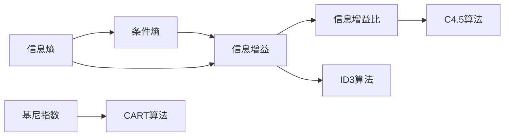

# 决策树 原理与代码实例讲解

## 1.背景介绍

决策树是机器学习和数据挖掘领域中一种经典且应用广泛的分类与回归算法。它通过对数据特征进行递归划分,构建出一个树形结构的预测模型。决策树易于理解和解释,能够同时处理数值型和类别型特征,对缺失值不敏感,且能够实现特征选择。

### 1.1 决策树的起源与发展

决策树算法起源于20世纪60年代,最早由E.B.Hunt等人提出概念模型。1986年,J.Ross Quinlan提出了著名的ID3算法,奠定了决策树的理论基础。此后,Quinlan又提出了改进版的C4.5算法。另一个里程碑式的算法CART由Breiman等人于1984年提出。近年来,随着集成学习的兴起,决策树也成为了Bagging、随机森林、梯度提升树等算法的基本组件。

### 1.2 决策树的优缺点

决策树的主要优点包括:

- 白盒模型,易于理解和解释
- 能够同时处理数值型和类别型特征  
- 对缺失值不敏感
- 具有特征选择功能,可解释性强
- 训练和预测效率较高

决策树的缺点包括:

- 容易过拟合,泛化能力较差
- 对连续型变量处理较弱
- 对不平衡数据集效果不佳
- 不适合处理高维稀疏数据

### 1.3 决策树的应用场景

决策树在诸多领域有着广泛应用,典型场景包括:

- 金融风控:贷款审批、反欺诈、信用评分等
- 医疗诊断:疾病诊断、药物筛选等  
- 营销推荐:用户分群、个性化推荐等
- 工业质检:设备故障诊断、良品率预测等
- 自然语言处理:文本分类、情感分析等

## 2.核心概念与联系

要深入理解决策树算法,需要掌握一些核心概念:

### 2.1 信息熵

信息熵(Entropy)衡量了一个随机变量的不确定性。设离散随机变量X的可能取值为{x1,x2,...,xn},对应概率为{p1,p2,...,pn},则X的信息熵定义为:

$$
H(X)=-\sum_{i=1}^{n}p_i\log p_i
$$

熵越大,随机变量的不确定性越大。

### 2.2 条件熵

条件熵(Conditional Entropy)是在已知随机变量Y的条件下,随机变量X的不确定性。其定义为Y给定条件下X的信息熵的数学期望:

$$
H(X|Y)=\sum_{j=1}^{m}p(y_j)H(X|Y=y_j)
$$

其中{y1,y2,...,ym}为Y的所有可能取值。

### 2.3 信息增益

信息增益(Information Gain)衡量了一个特征对样本集合分类的贡献程度。特征A对训练集D的信息增益g(D,A)定义为集合D的信息熵H(D)与在特征A的条件下D的信息熵H(D|A)之差:

$$
g(D,A)=H(D)-H(D|A) 
$$

信息增益越大,表明特征A对训练集D的分类能力越强。

### 2.4 信息增益比

信息增益比(Gain Ratio)是C4.5算法用来选择最优划分特征的指标,旨在减少信息增益偏向选择取值较多的特征的问题。特征A对训练集D的信息增益比gR(D,A)定义为:

$$
gR(D,A)=\frac{g(D,A)}{H_A(D)}
$$

其中,HA(D)是数据集D关于特征A的值的熵。

### 2.5 基尼指数

基尼指数(Gini Index)也常用于决策树的特征选择,反映了数据集合的不纯度。数据集D的基尼指数定义为:

$$
Gini(D)=1-\sum_{k=1}^{K}p_k^2
$$

其中,pk为数据集D中第k类样本所占的比例。Gini(D)越小,数据集D的纯度越高。

### 2.6 概念之间的联系

下图展示了决策树算法中各个核心概念之间的联系:



## 3.核心算法原理具体操作步骤

决策树的核心是在每个节点找到最优划分特征,使得划分后的子节点更加纯净。不同算法使用不同的指标来选择最优特征。下面以ID3算法为例,详细讲解其具体步骤。

### 3.1 ID3算法

输入:训练集D,特征集A,阈值ε
输出:决策树T

(1) 若D中所有样本属于同一类别C,则T为单节点树,并将类别C作为该节点的类标记,返回T;

(2) 若A为空集,则T为单节点树,并将D中样本数最多的类别作为该节点的类标记,返回T;

(3) 否则,按信息增益选择最优划分特征Ag:
    
    for 每个特征a∈A:
        计算a对D的信息增益g(D,a)
    选择信息增益最大的特征Ag

(4) 如果Ag的信息增益小于阈值ε,则T为单节点树,并将D中样本数最多的类别作为该节点的类标记,返回T;

(5) 否则:
    
    for Ag的每一个可能值ai:
        为T生成一个分支,令Dai表示D在Ag上取值为ai的样本子集;
        if Dai为空:
            将Dai中样本数最多的类作为分支节点的类标记;
        else:
            以DaiAg为新训练集,以AA{Ag}为新特征集,递归调用步骤(1)~(5),得到子树Ti,返回Ti

### 3.2 C4.5算法

C4.5算法是对ID3的改进,主要区别在于:

- 用信息增益比来选择特征,克服了信息增益偏向选择取值较多特征的问题;
- 能够处理连续型特征,在选择划分点时优先考虑使信息增益比最大化的点;
- 能够对不完整数据进行处理,为缺失值赋予权重;
- 采用悲观剪枝避免过拟合。

### 3.3 CART算法

CART(Classification And Regression Tree)既可以用于分类也可以用于回归。其特点是:

- 采用基尼指数选择划分特征;  
- 对连续型变量采用二元切分;
- 由于使用基尼指数,CART对缺失值不敏感;
- 采用代价复杂度剪枝。

## 4.数学模型和公式详细讲解举例说明

为更好地理解决策树算法中的数学原理,下面以一个简单的例子来说明信息增益的计算过程。

假设有如下训练数据集:

| 编号 | 色泽 | 根蒂 | 敲声 | 好瓜 |
|:----:|:----:|:----:|:----:|:----:|
| 1    | 青绿 | 蜷缩 | 浊响 | 是   |
| 2    | 乌黑 | 稍蜷 | 沉闷 | 是   |  
| 3    | 乌黑 | 稍蜷 | 浊响 | 否   |
| 4    | 青绿 | 硬挺 | 清脆 | 否   |
| 5    | 浅白 | 蜷缩 | 浊响 | 是   |
| 6    | 青绿 | 稍蜷 | 沉闷 | 否   |
| 7    | 乌黑 | 稍蜷 | 浊响 | 否   |
| 8    | 乌黑 | 蜷缩 | 浊响 | 否   |
| 9    | 青绿 | 硬挺 | 清脆 | 否   |
| 10   | 浅白 | 硬挺 | 清脆 | 否   |

首先,计算数据集D的信息熵:

$$
H(D)=-(\frac{3}{10}\log_2\frac{3}{10}+\frac{7}{10}\log_2\frac{7}{10})=0.881
$$

然后,分别计算每个特征的信息增益。以"色泽"为例:

$$
H(D|色泽)=\frac{4}{10}H(D_{青绿})+\frac{4}{10}H(D_{乌黑})+\frac{2}{10}H(D_{浅白})
$$

$$
H(D_{青绿})=-(\frac{1}{4}\log_2\frac{1}{4}+\frac{3}{4}\log_2\frac{3}{4})=0.811 \\
H(D_{乌黑})=-(\frac{1}{4}\log_2\frac{1}{4}+\frac{3}{4}\log_2\frac{3}{4})=0.811 \\
H(D_{浅白})=-(\frac{1}{2}\log_2\frac{1}{2}+\frac{1}{2}\log_2\frac{1}{2})=1
$$

代入得:

$$
H(D|色泽)=\frac{4}{10}\times0.811+\frac{4}{10}\times0.811+\frac{2}{10}\times1=0.859
$$

因此,"色泽"的信息增益为:

$$
g(D,色泽)=H(D)-H(D|色泽)=0.881-0.859=0.022
$$

类似地,可以计算出"根蒂"和"敲声"的信息增益分别为0.454和0.419。可见"根蒂"的信息增益最大,因此选择"根蒂"作为根节点的划分特征。

## 5.项目实践：代码实例和详细解释说明

下面使用Python和scikit-learn库来实现一个基于CART算法的决策树分类器。

```python
from sklearn.datasets import load_iris
from sklearn.tree import DecisionTreeClassifier
from sklearn.model_selection import train_test_split
from sklearn.metrics import accuracy_score

# 加载鸢尾花数据集
iris = load_iris()
X = iris.data
y = iris.target

# 划分训练集和测试集
X_train, X_test, y_train, y_test = train_test_split(X, y, test_size=0.3, random_state=42)

# 创建CART决策树分类器
clf = DecisionTreeClassifier(criterion='gini', max_depth=3, random_state=42)

# 训练模型
clf.fit(X_train, y_train)

# 在测试集上预测
y_pred = clf.predict(X_test)

# 计算分类准确率
accuracy = accuracy_score(y_test, y_pred)
print("Accuracy: {:.2f}".format(accuracy))
```

代码解释:

1. 首先从sklearn.datasets中加载经典的鸢尾花数据集,并将特征和标签分别存储在X和y中。

2. 使用train_test_split函数将数据集按7:3的比例划分为训练集和测试集。

3. 创建一个DecisionTreeClassifier对象clf,指定划分特征的评价标准为基尼指数'gini',限制树的最大深度为3。

4. 调用fit方法在训练集上训练决策树模型。

5. 调用predict方法在测试集上进行预测,得到预测标签y_pred。

6. 使用accuracy_score计算分类准确率,并打印输出。

运行结果:
```
Accuracy: 0.98
```

可见,在鸢尾花数据集上,这个简单的CART决策树分类器就达到了98%的准确率。

## 6.实际应用场景

决策树在实际中有非常广泛的应用,下面列举几个典型场景。

### 6.1 金融风控

在金融领域,决策树常用于贷款审批、反欺诈、信用评分等任务。通过收集用户的个人信息、收入情况、信用记录等特征,训练决策树模型,可以快速判断一个新的贷款申请是否通过,或者一笔交易是否可疑。

### 6.2 医疗诊断

医疗诊断是决策树的另一个重要应用场景。根据患者的症状、体征、化验结果等信息,决策树可以辅助医生进行初步诊断,提示可能的疾病种类,从而为后续的进一步检查提供指导。

### 6.3 营销推荐  

在营销领域,决策树可用于用户分群和个性化推荐。通过分析用户的人口统计学