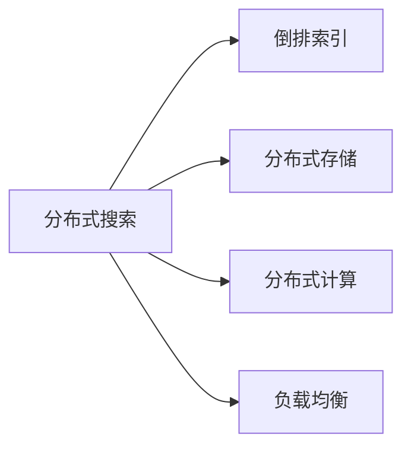

# 分布式搜索 原理与代码实例讲解

## 1.背景介绍

在当今大数据时代,海量的信息数据呈爆炸式增长,如何高效地检索和管理这些数据成为了一个巨大的挑战。传统的集中式搜索方式已经无法满足海量数据的实时搜索需求。分布式搜索技术应运而生,通过将数据分布存储在多个节点上,并行处理搜索请求,大大提高了搜索效率和吞吐量。本文将深入探讨分布式搜索的原理,并给出具体的代码实例。

### 1.1 分布式搜索的必要性
#### 1.1.1 海量数据的挑战
#### 1.1.2 传统搜索方式的局限性 
#### 1.1.3 分布式搜索的优势

### 1.2 分布式搜索的发展历程
#### 1.2.1 早期的分布式搜索系统
#### 1.2.2 现代分布式搜索框架
#### 1.2.3 未来发展趋势

## 2.核心概念与联系

要理解分布式搜索,首先需要了解几个核心概念:

### 2.1 倒排索引
倒排索引是实现分布式搜索的基础。它将文档中的词条映射到包含该词条的文档列表。通过倒排索引,可以快速定位包含查询词的文档。

### 2.2 分布式存储
分布式存储将数据分散存储在多个节点上,通过冗余和复制保证数据的可靠性和可用性。常见的分布式存储系统有HDFS、Ceph等。

### 2.3 分布式计算
分布式计算将大规模计算任务拆分成小任务,分配到多个节点并行执行,最后合并结果。MapReduce就是一种典型的分布式计算框架。

### 2.4 负载均衡
负载均衡将搜索请求分发到多个节点,避免单点过载,提高系统的并发处理能力。常见的负载均衡算法有轮询、最少连接等。

下图展示了这些核心概念之间的联系:



## 3.核心算法原理具体操作步骤

分布式搜索的核心是倒排索引。构建倒排索引的基本步骤如下:

### 3.1 文档解析
将原始文档解析成一系列词条,去除停用词,提取关键信息如标题、作者等。

### 3.2 词条规范化  
对词条进行规范化处理,如大小写转换、词形还原、同义词合并等,将不同形式的同义词映射到同一词条。

### 3.3 建立词典
将词条映射为数字id,建立词条到id的词典,便于后续索引的数字化存储。

### 3.4 计算词频
统计每个词条在每篇文档中出现的频率,作为相关性打分的依据。

### 3.5 构建倒排表
对于每个词条,记录包含该词条的文档id列表,以及对应的词频、位置等信息。

### 3.6 索引压缩
对倒排索引进行压缩,减小存储空间。常见的索引压缩算法有可变字节编码、游程编码等。

## 4.数学模型和公式详细讲解举例说明

在搜索中,需要对文档相关性进行打分排序。TF-IDF是一种常用的文档相关性评估模型:

- TF(Term Frequency):词条在文档中出现的频率。
$$
TF(t,d) = \frac{f_{t,d}}{\sum_{t' \in d} f_{t',d}}
$$
其中$f_{t,d}$表示词条$t$在文档$d$中出现的次数。

- IDF(Inverse Document Frequency):词条的逆文档频率,衡量词条的稀缺程度。
$$
IDF(t) = \log \frac{N}{n_t}
$$
其中$N$为文档总数,$n_t$为包含词条$t$的文档数。

- TF-IDF:综合考虑词频和逆文档频率,体现词条对文档的重要程度。
$$
TFIDF(t,d) = TF(t,d) \times IDF(t)
$$

举例说明,假设有以下两个文档:

```
d1: This is a sample document about distributed search. 
d2: Another document with some search related content.
```

对于查询"distributed search",文档d1的相关性得分为:

$TFIDF(distributed,d1) = \frac{1}{8} \times \log \frac{2}{1} \approx 0.075$ 

$TFIDF(search,d1) = \frac{1}{8} \times \log \frac{2}{2} = 0$

d1的总分为0.075,高于d2的0分,因此d1排在搜索结果前面。

## 5.项目实践：代码实例和详细解释说明

下面给出一个简单的分布式搜索代码实例(基于Python和Elasticsearch):

```python
from elasticsearch import Elasticsearch

# 连接Elasticsearch集群
es = Elasticsearch(['localhost:9200'])

# 索引文档
doc1 = {
    'title': 'Distributed Search Tutorial',
    'content': 'This tutorial covers the basic concepts and algorithms of distributed search.'
}
es.index(index='my-index',id=1,body=doc1)

doc2 = {
    'title': 'Another Article',
    'content': 'Some other content not very relevant to distributed search.'  
}
es.index(index='my-index',id=2,body=doc2)

# refresh使索引生效
es.indices.refresh(index="my-index")

# 搜索文档
res = es.search(index="my-index", body={"query": {"match": {'content':'distributed search'}}})

print("Got %d Hits:" % res['hits']['total']['value'])
for hit in res['hits']['hits']:
    print(hit["_source"])
```

代码解释:

1. 创建Elasticsearch连接,指定集群的节点地址。
2. 用`es.index()`方法索引两篇文档,放入名为"my-index"的索引中。
3. 调用`es.indices.refresh()`使新增的索引生效,可被搜索。
4. 用`es.search()`进行搜索,查询条件为content字段包含"distributed search"。
5. 打印搜索结果数量和内容。

Elasticsearch会自动将文档切分成词条并建立倒排索引,以支持快速全文搜索。索引的文档可以分布在多个分片(shard)上,多个节点协同处理搜索请求,实现了分布式搜索。

## 6.实际应用场景

分布式搜索在许多领域有广泛应用,如:

### 6.1 网页搜索引擎 
Google、Bing等搜索引擎每天处理数以亿计的网页,必须依靠分布式搜索技术才能实现快速响应。

### 6.2 电商平台商品搜索
淘宝、亚马逊等电商网站拥有海量商品,用户搜索商品时,背后是复杂的分布式搜索系统在支撑。

### 6.3 企业内部数据检索
大型企业拥有海量的内部文档数据,需要分布式搜索系统来实现高效检索,如办公OA系统、客户管理CRM系统等。

### 6.4 日志分析平台
分布式日志收集和分析平台如ELK,底层依赖分布式搜索来实现海量日志数据的实时检索和分析。

## 7.工具和资源推荐

要学习和实践分布式搜索,推荐一些常用的开源工具和学习资源:

### 7.1 Elasticsearch 
Elasticsearch是目前最流行的开源分布式搜索和分析引擎,提供了丰富的Java API和RESTful接口,支持各种语言的客户端。

### 7.2 Solr
Solr是另一个著名的开源搜索服务器,基于Lucene搜索库,提供了可扩展的分布式搜索和索引复制功能。

### 7.3 Lucene
Lucene是一个功能强大的开源搜索库,是Elasticsearch和Solr的基础,对理解搜索原理很有帮助。

### 7.4 Information Retrieval
由斯坦福大学开设的信息检索公开课,对搜索引擎和信息检索的原理有深入讲解。

### 7.5 Elasticsearch: The Definitive Guide
Elasticsearch权威指南,系统讲解了Elasticsearch的原理和使用,是学习Elasticsearch的必读书籍。

## 8.总结：未来发展趋势与挑战

分布式搜索技术飞速发展,在可预见的未来还将不断突破:

### 8.1 更智能的搜索
利用知识图谱、深度学习等人工智能技术,搜索引擎将从关键词匹配进化到对查询意图的理解,给出更加智能、个性化的搜索结果。

### 8.2 更高效的索引
随着数据规模不断增长,如何进一步提高索引效率是一大挑战。一些新的索引结构和算法有望突破当前的瓶颈,如Facebook的Unicorn系统。

### 8.3 图搜索
利用图数据库对数据间的复杂关系进行建模和查询,图搜索是大数据时代的新方向,在社交网络、金融风控等领域大有可为。

### 8.4 搜索与机器学习的结合
利用机器学习优化搜索的各个环节,如查询理解、相关性排序等,将是提升搜索质量的重要手段。同时搜索也为机器学习提供了海量的训练数据。

## 9.附录：常见问题与解答

### Q1:什么是全文搜索和关键词搜索的区别?
A1:关键词搜索是在固定的字段如标题中查找关键词,而全文搜索是在整个文档内容中搜索词条,需要倒排索引等技术支持。全文搜索可以处理更加灵活的查询,但是索引成本较高。

### Q2:ES索引的文档数量有限制吗?
A2:理论上一个ES索引可以处理无限数量的文档,只要不超过2^63-1。但是单个节点和集群的处理能力是有限的,当文档数量达到亿级别时,需要仔细规划索引的分片数量和部署结构。

### Q3:ES如何实现跨集群的分布式搜索?
A3:ES支持tribe node(部落节点),可以在一个集群中创建一个tribe node,去连接其他集群,从而实现跨集群的联合查询。另一种方案是通过代理转发来实现。

### Q4:ES写入速度慢的原因有哪些?
A4:ES写入慢一般有以下原因:
- 单个索引的分片数设置过小,造成单个分片的写入压力过大。
- 副本数设置过多,导致写入放大。
- 配置的刷新间隔refresh_interval过短,ES默认是1秒刷新一次,可以调大间隔。
- 磁盘IO成为瓶颈,选用SSD可以改善写入性能。

### Q5:对分布式搜索,目前还有哪些值得研究的问题?
A5:分布式搜索中一些有待进一步研究的问题包括:
- 索引的动态扩容和再平衡
- 更高效的压缩算法
- 增量索引更新
- 查询缓存和预取
- 机器学习在相关性评分中的应用
- 隐私保护和安全搜索

分布式搜索是一个复杂而有魅力的领域,在未来大数据时代,掌握分布式搜索的原理和应用,必将成为每一位工程师的必备技能。让我们一起探索分布式搜索的精彩世界!

作者：禅与计算机程序设计艺术 / Zen and the Art of Computer Programming