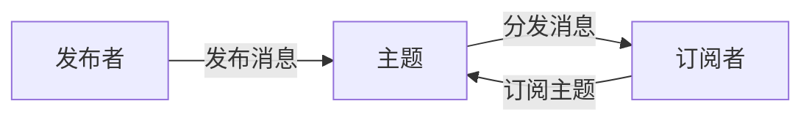

# 发布订阅模式的安全挑战与解决方案

## 1. 背景介绍
### 1.1 发布订阅模式概述
#### 1.1.1 发布订阅模式的定义
#### 1.1.2 发布订阅模式的特点
#### 1.1.3 发布订阅模式的优势
### 1.2 发布订阅模式的应用现状
#### 1.2.1 在分布式系统中的应用
#### 1.2.2 在消息中间件中的应用 
#### 1.2.3 在事件驱动架构中的应用
### 1.3 发布订阅模式面临的安全挑战
#### 1.3.1 数据泄露风险
#### 1.3.2 身份认证与访问控制
#### 1.3.3 数据完整性与一致性问题

## 2. 核心概念与联系
### 2.1 发布者(Publisher)
#### 2.1.1 发布者的角色与职责
#### 2.1.2 发布者的身份认证
#### 2.1.3 发布者的访问控制
### 2.2 订阅者(Subscriber) 
#### 2.2.1 订阅者的角色与职责
#### 2.2.2 订阅者的身份认证
#### 2.2.3 订阅者的访问控制
### 2.3 主题(Topic)与消息(Message)
#### 2.3.1 主题的命名与管理
#### 2.3.2 消息的格式与加密
#### 2.3.3 消息的持久化存储
### 2.4 发布订阅模式的关键流程
#### 2.4.1 主题创建与订阅
#### 2.4.2 消息发布与分发
#### 2.4.3 消息确认与重传



## 3. 核心算法原理具体操作步骤
### 3.1 安全认证算法
#### 3.1.1 基于PKI的身份认证
#### 3.1.2 OAuth 2.0认证流程
#### 3.1.3 基于JWT的无状态认证
### 3.2 访问控制算法 
#### 3.2.1 基于角色的访问控制(RBAC)
#### 3.2.2 基于属性的访问控制(ABAC)
#### 3.2.3 基于策略的访问控制(PBAC)
### 3.3 消息加密算法
#### 3.3.1 对称加密算法(AES)
#### 3.3.2 非对称加密算法(RSA)
#### 3.3.3 混合加密方案
### 3.4 消息签名算法
#### 3.4.1 消息认证码(MAC)
#### 3.4.2 数字签名算法(RSA、ECDSA)
#### 3.4.3 布隆过滤器

## 4. 数学模型和公式详细讲解举例说明
### 4.1 访问控制矩阵模型
访问控制矩阵用于描述主体对客体的访问权限关系，形式化定义为：
$$
A = [a_{ij}]_{n \times m}
$$
其中，$n$表示主体的个数，$m$表示客体的个数，$a_{ij}$表示主体$S_i$对客体$O_j$拥有的权限集合。

举例说明：假设系统中有3个主体：$S_1,S_2,S_3$，以及4个客体：$O_1,O_2,O_3,O_4$。主体对客体的访问控制矩阵如下：

$$
A = 
\begin{bmatrix}
\{r,w,x\} & \{r\} & \{\} & \{r,x\} \\
\{r,x\} & \{r,w\} & \{x\} & \{\} \\ 
\{\} & \{r\} & \{r,w,x\} & \{w\}
\end{bmatrix}
$$

### 4.2 信息熵模型
信息熵用于衡量消息内容的不确定性，定义为：
$$
H(X) = -\sum_{i=1}^{n} p_i \log_2 p_i
$$
其中，$X$是一个离散随机变量，$n$是$X$的可能取值个数，$p_i$是事件$X=x_i$的概率。

举例说明：假设有一条消息，其内容只可能是"A"、"B"、"C"三个字符之一，概率分别是$\frac{1}{2},\frac{1}{4},\frac{1}{4}$，则该消息的信息熵为：

$$
\begin{aligned}
H(X) &= -(\frac{1}{2}\log_2 \frac{1}{2} + \frac{1}{4}\log_2 \frac{1}{4} + \frac{1}{4}\log_2 \frac{1}{4}) \\
&= 1.5 \text{比特}
\end{aligned}
$$

## 5. 项目实践：代码实例和详细解释说明
### 5.1 基于Spring Security的认证与授权
```java
@Configuration
@EnableWebSecurity
public class SecurityConfig extends WebSecurityConfigurerAdapter {

    @Override
    protected void configure(HttpSecurity http) throws Exception {
        http
            .authorizeRequests()
                .antMatchers("/admin/**").hasRole("ADMIN")
                .antMatchers("/user/**").hasRole("USER")
                .anyRequest().authenticated()
                .and()
            .formLogin()
                .loginPage("/login")
                .defaultSuccessUrl("/index")
                .permitAll()
                .and()
            .logout()
                .logoutUrl("/logout")
                .logoutSuccessUrl("/login")
                .permitAll();
    }

    @Override
    protected void configure(AuthenticationManagerBuilder auth) throws Exception {
        auth.inMemoryAuthentication()
            .withUser("admin").password("{noop}admin123").roles("ADMIN")
            .and()
            .withUser("user").password("{noop}user123").roles("USER");
    }
}
```
以上代码使用Spring Security框架实现了基于角色的访问控制。`configure(HttpSecurity http)`方法定义了URL访问规则，例如`/admin/**`路径需要`ADMIN`角色，`/user/**`路径需要`USER`角色。`configure(AuthenticationManagerBuilder auth)`方法在内存中配置了两个用户`admin`和`user`，分别拥有`ADMIN`和`USER`角色。

### 5.2 消息加密与签名
```java
public class MessageEncryption {
    private static final String AES_KEY = "abcdef0123456789";
    
    public static String encrypt(String message) throws Exception {
        SecretKeySpec skeySpec = new SecretKeySpec(AES_KEY.getBytes(), "AES");
        Cipher cipher = Cipher.getInstance("AES/ECB/PKCS5Padding");
        cipher.init(Cipher.ENCRYPT_MODE, skeySpec);
        byte[] encrypted = cipher.doFinal(message.getBytes());
        return Base64.getEncoder().encodeToString(encrypted);
    }
    
    public static String decrypt(String encrypted) throws Exception {
        SecretKeySpec skeySpec = new SecretKeySpec(AES_KEY.getBytes(), "AES");
        Cipher cipher = Cipher.getInstance("AES/ECB/PKCS5Padding");
        cipher.init(Cipher.DECRYPT_MODE, skeySpec);
        byte[] decrypted = cipher.doFinal(Base64.getDecoder().decode(encrypted));
        return new String(decrypted);
    }
    
    public static String sign(String message) throws Exception {
        Mac sha256_HMAC = Mac.getInstance("HmacSHA256");
        SecretKeySpec skeySpec = new SecretKeySpec(AES_KEY.getBytes(), "HmacSHA256");
        sha256_HMAC.init(skeySpec);
        byte[] hash = sha256_HMAC.doFinal(message.getBytes());
        return Base64.getEncoder().encodeToString(hash);
    }
    
    public static boolean verify(String message, String signature) throws Exception {
        String expectedSig = sign(message);
        return expectedSig.equals(signature);
    }
}
```
以上代码演示了如何使用AES算法对消息进行加密解密，以及使用HMAC-SHA256算法对消息进行签名验证。`encrypt`方法使用AES算法和指定的密钥对消息进行加密，`decrypt`方法进行解密。`sign`方法使用HMAC-SHA256算法和相同的密钥对消息生成签名，`verify`方法验证消息的签名是否正确。

## 6. 实际应用场景
### 6.1 金融领域
在金融领域，发布订阅模式常用于实现证券交易系统。交易所作为发布者发布实时行情数据，券商和投资者作为订阅者获取行情信息并据此进行交易。
### 6.2 物联网领域
在物联网场景中，发布订阅模式可用于连接海量的设备。设备作为发布者周期性地上报数据到云平台的特定主题，云平台再将数据推送给订阅该主题的其他服务和应用。
### 6.3 社交媒体领域
社交媒体平台使用发布订阅模式来实现好友动态、资讯推送等功能。用户发布动态相当于往特定主题发布消息，其他订阅该主题的好友就能看到该动态。

## 7. 工具和资源推荐
### 7.1 开源项目
- Kafka: 广泛应用的分布式消息系统，支持发布订阅模式。
- RabbitMQ: 支持多种消息传递模式的开源消息中间件。
- Mosquitto: 轻量级的MQTT消息服务器，常用于物联网领域。
### 7.2 规范与协议
- MQTT: 轻量级的发布订阅式消息传输协议，专为资源受限的环境设计。
- AMQP: 面向消息的中间件标准，支持多种消息传递模式。
- XMPP: 基于XML的通信协议，支持实时消息传递、用户认证等特性。
### 7.3 学习资源
- 《Kafka权威指南》：深入剖析Kafka架构与实现原理的经典著作。
- 《RabbitMQ实战指南》：系统讲解RabbitMQ使用方法与最佳实践。
- MQTT官方文档：MQTT协议的权威参考文档，包含协议规范与使用指南。

## 8. 总结：未来发展趋势与挑战
### 8.1 融合区块链技术
区块链所具有的去中心化、防篡改等特性，可用于解决发布订阅模式在数据共享、访问控制等方面的安全挑战。将消息发布到区块链网络，并通过智能合约控制订阅者的访问权限，能够实现更加安全可信的发布订阅机制。
### 8.2 引入零信任架构
在复杂的系统环境中，发布者和订阅者很难建立充分的信任关系。采用零信任安全模型，对每一次消息发布和订阅请求都进行严格的身份认证和授权验证，最大限度降低因身份假冒、越权访问等原因造成的安全风险。
### 8.3 支持机密计算
利用机密计算技术(如Intel SGX、ARM TrustZone等)，在可信执行环境中进行消息加密、过滤等敏感操作，即使底层系统被攻陷，也难以窃取到明文数据和机密算法。在数据安全性要求极高的场合，机密计算将成为发布订阅模式的重要补充手段。

## 9. 附录：常见问题与解答
### Q1: 如何防止消息被重放攻击？
**A1:** 可以在消息中加入时间戳或序列号等唯一标识，在订阅端验证消息的时效性和唯一性，对于重复的消息予以丢弃。
### Q2: 发布订阅模式如何确保消息的可靠投递？
**A2:** 可以在发布订阅系统中引入消息确认机制(Acknowledgement)，订阅者收到消息后向发布者发送ACK确认，如果发布者未收到ACK则重新发送消息。对于重要消息，还可通过持久化存储、事务机制等方式保证消息的可靠性。
### Q3: 如何避免订阅者任意消费未授权的消息？
**A3:** 发布订阅系统需要对主题和消息设置严格的访问控制规则，对每个订阅请求都要验证订阅者的身份和权限，确保其只能消费被授权的主题和消息。

---
作者：禅与计算机程序设计艺术 / Zen and the Art of Computer Programming