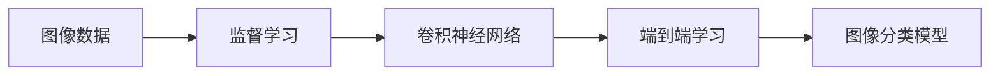

# 基于DeepLearning的图片分类

## 1. 背景介绍

### 1.1 图像分类的重要性

在当今数字化时代,图像数据呈现爆炸式增长。从社交媒体到医疗影像,从自动驾驶到安防监控,图像分类技术在各个领域发挥着至关重要的作用。准确高效地对图像进行分类,不仅可以极大地提升信息检索和数据管理的效率,更是人工智能领域的一个核心课题。

### 1.2 深度学习的兴起

传统的图像分类方法主要依赖于手工设计的特征提取和分类器,但面对海量复杂的真实图像数据,这些方法往往捉襟见肘。近年来,以卷积神经网络(CNN)为代表的深度学习技术在图像识别领域取得了突破性进展。CNN通过端到端的特征学习,能够自动提取图像中的多层次特征,建立起从像素到语义的映射,大幅提升了图像分类的精度。

### 1.3 本文的目标

本文将重点探讨如何利用深度学习技术,尤其是卷积神经网络,来实现高精度的图像分类。我们将从算法原理入手,结合数学模型和代码实践,详细阐述图像分类的整个流程。同时,也会介绍相关的工具和资源,并展望图像分类技术的发展趋势和挑战。

## 2. 核心概念与联系

### 2.1 图像分类的定义

图像分类是指将图像数据划分到预定义的若干类别中的任务。其本质是学习一个决策函数或分类模型,根据图像的视觉内容预测其所属的类别标签。形式化地,图像分类就是寻找一个映射函数:
$$f: X \rightarrow Y$$
其中$X$表示图像空间,$Y$表示类别标签集合。给定一张图像$x \in X$,图像分类模型$f$能够预测其类别标签$y=f(x), y \in Y$。

### 2.2 监督学习范式

目前主流的图像分类方法遵循监督学习范式。即通过人工标注一批图像的真实类别,构建一个带标签的训练集$D={(x_1,y_1),...,(x_N,y_N)}$,然后训练模型去拟合这个数据集,学习标签空间$Y$在图像空间$X$上的条件分布$P(Y|X)$。这种数据驱动的学习范式赋予了模型强大的泛化和预测能力。

### 2.3 卷积神经网络

卷积神经网络(Convolutional Neural Networks, CNN)是一种专门用于处理网格拓扑结构数据的神经网络。图像可以视为一个二维网格,每个像素点与其邻域构成局部连接。CNN通过卷积(convolution)和池化(pooling)操作,逐层提取图像的局部特征,并通过非线性激活函数增强特征的表达能力。卷积层可以学习到图像的边缘、纹理、形状等多层次特征,池化层可以实现特征的降维和平移不变性。CNN的这种层级化的特征提取机制,使其能够有效地对图像进行分类。

### 2.4 端到端的特征学习

传统图像分类流程通常包括特征提取和分类器设计两个独立的步骤,而深度学习则提供了端到端(end-to-end)的解决方案。CNN 可以通过反向传播算法进行端到端的训练,联合优化特征提取器和分类器,从而最小化经验风险。端到端的学习范式简化了系统设计,避免了人工特征选择的主观性,能够充分挖掘数据中蕴含的判别信息。

### 2.5 核心概念之间的联系

下图展示了图像分类任务中几个核心概念之间的联系:



## 3. 核心算法原理具体操作步骤

### 3.1 数据准备

- 收集和标注图像数据,构建训练集、验证集和测试集。
- 进行数据预处理,如图像归一化、数据增强等。

### 3.2 网络构建

- 设计CNN网络结构,如输入层、卷积层、池化层、全连接层等。
- 选择合适的激活函数、损失函数和优化算法。
- 初始化网络参数。

### 3.3 模型训练

- 将训练数据送入网络,前向计算损失函数。
- 通过反向传播算法计算梯度,更新网络参数。
- 重复迭代,直到模型收敛或达到预设的迭代次数。

### 3.4 模型评估

- 在验证集上评估模型性能,如准确率、召回率等指标。
- 进行超参数调优,选择最优模型。
- 在测试集上评估模型的泛化能力。

### 3.5 模型应用

- 使用训练好的模型对新图像进行预测。
- 将模型集成到实际应用系统中。

## 4. 数学模型和公式详细讲解举例说明

### 4.1 卷积操作

卷积是CNN的核心操作之一。二维卷积运算可以表示为:

$$(f*g)(i,j)=\sum_m \sum_n f(m,n)g(i-m,j-n)$$

其中$f$表示输入图像,$g$表示卷积核。卷积操作可以提取图像的局部特征,如边缘、纹理等。

例如,考虑以下3x3的图像和2x2的卷积核:

$$f=\begin{bmatrix} 1 & 2 & 3\\ 4 & 5 & 6\\ 7 & 8 & 9 \end{bmatrix}, g=\begin{bmatrix} 1 & 0\\ 0 & 1\end{bmatrix}$$

对它们进行卷积运算:

$$(f*g)(0,0)=1*1+2*0+4*0+5*1=6$$

$$(f*g)(0,1)=2*1+3*0+5*0+6*1=8$$

$$(f*g)(1,0)=4*1+5*0+7*0+8*1=12$$

$$(f*g)(1,1)=5*1+6*0+8*0+9*1=14$$

得到卷积结果:

$$(f*g)=\begin{bmatrix} 6 & 8\\ 12 & 14\end{bmatrix}$$

### 4.2 池化操作

池化是CNN中常用的下采样操作,可以减小特征图的尺寸,提取主要特征。以最大池化为例,对于输入特征图$X$,池化窗口大小为$k \times k$,池化结果$Y$中每个元素为:

$$y_{i,j}=\max_{0 \leq m,n < k} x_{i \cdot k+m,j \cdot k+n}$$

例如,对于以下4x4的特征图,进行2x2的最大池化:

$$X=\begin{bmatrix} 1 & 2 & 3 & 4\\ 5 & 6 & 7 & 8\\ 9 & 10 & 11 & 12\\ 13 & 14 & 15 & 16\end{bmatrix}$$

$$Y=\begin{bmatrix} 6 & 8\\ 14 & 16\end{bmatrix}$$

### 4.3 损失函数

图像分类属于多分类问题,常用的损失函数是交叉熵损失。设真实标签$y \in \{0,1\}^C$是一个one-hot向量,预测概率$\hat{y}=f(x)$,交叉熵损失定义为:

$$L(y,\hat{y})=-\sum_{i=1}^C y_i \log \hat{y}_i$$

其中$C$是类别数。交叉熵损失可以度量预测分布与真实分布之间的差异,是分类问题中常用的损失函数。

### 4.4 优化算法

CNN通常使用梯度下降法进行优化,即沿着损失函数的负梯度方向更新参数。设$\theta$为网络参数,$\eta$为学习率,则参数更新公式为:

$$\theta^{(t+1)}=\theta^{(t)}-\eta \cdot \nabla_{\theta} L(\theta^{(t)})$$

其中$\nabla_{\theta} L(\theta^{(t)})$是损失函数对参数的梯度。常见的梯度下降变体有随机梯度下降(SGD)、Adam等,可以加速模型的收敛。

## 5. 项目实践:代码实例和详细解释说明

下面以PyTorch为例,演示如何实现一个简单的CNN模型用于图像分类。

```python
import torch
import torch.nn as nn
import torch.optim as optim
from torchvision import datasets, transforms

# 定义超参数
batch_size = 64
num_epochs = 10
learning_rate = 0.001

# 加载MNIST数据集
train_dataset = datasets.MNIST(root='./data', train=True, transform=transforms.ToTensor(), download=True)
test_dataset = datasets.MNIST(root='./data', train=False, transform=transforms.ToTensor())

train_loader = torch.utils.data.DataLoader(dataset=train_dataset, batch_size=batch_size, shuffle=True)
test_loader = torch.utils.data.DataLoader(dataset=test_dataset, batch_size=batch_size, shuffle=False)

# 定义CNN模型
class CNN(nn.Module):
    def __init__(self):
        super(CNN, self).__init__()
        self.conv1 = nn.Conv2d(1, 16, kernel_size=5)
        self.relu1 = nn.ReLU()
        self.pool1 = nn.MaxPool2d(kernel_size=2)
        self.conv2 = nn.Conv2d(16, 32, kernel_size=5)
        self.relu2 = nn.ReLU()
        self.pool2 = nn.MaxPool2d(kernel_size=2)
        self.fc = nn.Linear(32*4*4, 10)

    def forward(self, x):
        x = self.pool1(self.relu1(self.conv1(x)))
        x = self.pool2(self.relu2(self.conv2(x)))
        x = x.view(x.size(0), -1)
        out = self.fc(x)
        return out

model = CNN()

# 定义损失函数和优化器
criterion = nn.CrossEntropyLoss()
optimizer = optim.Adam(model.parameters(), lr=learning_rate)

# 训练模型
total_step = len(train_loader)
for epoch in range(num_epochs):
    for i, (images, labels) in enumerate(train_loader):
        # 前向传播
        outputs = model(images)
        loss = criterion(outputs, labels)

        # 反向传播和优化
        optimizer.zero_grad()
        loss.backward()
        optimizer.step()

        if (i+1) % 100 == 0:
            print('Epoch [{}/{}], Step [{}/{}], Loss: {:.4f}'
                  .format(epoch+1, num_epochs, i+1, total_step, loss.item()))

# 测试模型
model.eval()
with torch.no_grad():
    correct = 0
    total = 0
    for images, labels in test_loader:
        outputs = model(images)
        _, predicted = torch.max(outputs.data, 1)
        total += labels.size(0)
        correct += (predicted == labels).sum().item()

    print('Accuracy of the model on the test images: {} %'.format(100 * correct / total))
```

代码说明:

1. 首先定义了一些超参数,如批量大小、训练轮数、学习率等。
2. 然后加载MNIST手写数字数据集,并对图像进行预处理。
3. 接着定义了一个简单的CNN模型,包含两个卷积层、两个池化层和一个全连接层。
4. 使用交叉熵损失函数和Adam优化器对模型进行训练。
5. 在训练过程中,每100步打印一次当前的损失值。
6. 最后在测试集上评估模型的分类准确率。

通过这个简单的例子,我们演示了如何使用深度学习框架构建和训练一个用于图像分类的CNN模型。实际应用中,我们可以使用更大更深的网络结构,并在更复杂的数据集上进行训练,以获得更好的分类性能。

## 6. 实际应用场景

图像分类技术在许多领域都有广泛的应用,下面列举几个典型场景:

### 6.1 人脸识别

利用图像分类模型对人脸图像进行识别,可以应用于门禁系统、刷脸支付、安防监控等场景。通过训练人脸分类模型,可以高效地对不同人的脸部图像进行区分和认证。

### 6.2 医学影像分析

医学影像如X射线、CT、MRI等蕴含着丰富的诊断信息。使用图像分类技术可以辅助医生进行疾病诊断,如肿瘤检测、眼底病变识别等。这可以