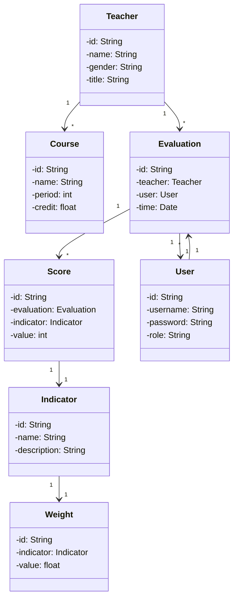
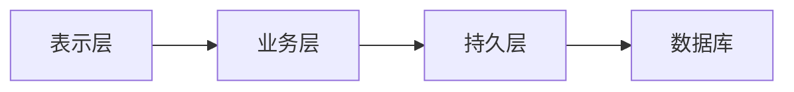

# 基于SSM的教师评价系统

## 1.背景介绍
### 1.1 教师评价系统的意义
在现代教育体系中,教师的教学质量直接影响着学生的学习效果和成长。为了提高教学质量,客观公正地评价教师的教学能力和水平变得尤为重要。传统的教师评价方式,如学生问卷调查、同行评议等,存在主观性强、效率低下等问题。因此,开发一套科学、高效、公正的教师评价系统势在必行。
### 1.2 SSM框架简介
SSM框架是指Spring、Spring MVC和MyBatis三个框架的组合,是目前Java Web开发中最流行的框架之一。Spring是一个轻量级的控制反转(IoC)和面向切面(AOP)的容器框架。Spring MVC是一个MVC Web框架,用于构建灵活、松耦合的Web应用程序。MyBatis是一个支持定制化SQL、存储过程和高级映射的持久层框架。SSM框架具有如下优点:
- 分层设计,结构清晰,易于维护和扩展 
- 支持IoC和AOP,提高代码的可重用性和模块化
- 支持MVC模式,实现了前后端分离,提高开发效率
- 支持ORM映射,简化数据库操作,提高开发效率
### 1.3 教师评价系统的需求分析
教师评价系统的主要目标是客观、公正、高效地评价教师的教学质量和能力,为教师的职称评定、绩效考核等提供依据。系统需要支持以下功能:
1. 多维度的评价指标体系,包括教学态度、教学内容、教学方法、教学效果等
2. 多元化的评价主体,包括学生、同行、领导等
3. 灵活的权重设置,可根据学校实际情况调整各项指标的权重 
4. 自动汇总计算,根据评价结果和权重自动生成综合评分
5. 可视化的结果展示,以图表等形式直观展示评价结果
6. 评价数据管理,支持评价记录的增删改查和导入导出

## 2.核心概念与联系
### 2.1 领域模型
领域模型是对问题域中的概念、实体及其关系的抽象。教师评价系统的核心领域概念如下:
- 教师:被评价的对象,具有工号、姓名、性别、职称等属性 
- 课程:教师所授课程,具有课程号、课程名、学时、学分等属性
- 指标:教师评价的各个维度,具有指标号、指标名、指标描述、权重等属性
- 评价:对教师的多维度评分,具有评价号、评价对象、评价人、评分、评价时间等属性
- 评分:各个指标的得分,具有评分号、所属评价、评分指标、分值等属性
- 权重:各个指标的重要程度,具有权重号、所属指标、权重值等属性
- 用户:系统使用者,具有用户名、密码、角色等属性

以下是领域模型的类图:

### 2.2 架构设计
教师评价系统采用分层架构设计,分为表示层、业务层和持久层三个层次。
- 表示层:负责处理用户交互和页面显示,通过Spring MVC实现,主要包括控制器、视图等
- 业务层:负责处理业务逻辑和数据访问,通过Spring和MyBatis实现,主要包括服务接口、服务实现类等 
- 持久层:负责与数据库交互,通过MyBatis实现,主要包括实体类、Mapper接口等

以下是系统的分层架构图:


## 3.核心算法原理具体操作步骤
### 3.1 教师综合评分算法
教师综合评分是根据各项指标的评分和权重计算得出的,反映了教师的整体教学水平。假设指标数量为n,第i项指标的评分为score_i,权重为weight_i,则教师综合评分的计算公式为:
$$
score=\sum_{i=1}^n score_i \times weight_i
$$

具体的计算步骤如下:
1. 从数据库中查询出指定教师的所有评价记录
2. 对每条评价记录,查询出各项指标的评分
3. 从数据库中查询出各项指标的权重
4. 根据公式计算出教师综合评分
5. 将教师综合评分更新到数据库中

### 3.2 教师评价排名算法
教师评价排名是将所有教师按照综合评分从高到低排序,便于比较教师之间的教学水平。具体的排名算法如下:
1. 从数据库中查询出所有教师的综合评分
2. 对教师综合评分进行降序排序
3. 根据排序结果,为每个教师分配一个排名号
4. 将教师排名号更新到数据库中

## 4.数学模型和公式详细讲解举例说明
### 4.1 指标权重模型
指标权重反映了各项指标在教师评价中的重要程度,需要根据学校的实际情况进行设置。常见的指标权重模型有主观赋权法和客观赋权法两种。
#### 4.1.1 主观赋权法
主观赋权法是根据决策者的主观判断确定指标权重,如专家打分法、层次分析法等。以专家打分法为例,假设有m位专家对n项指标进行打分,第j位专家对第i项指标的打分为$a_{ij}$,则第i项指标的权重$w_i$的计算公式为:
$$
w_i=\frac{\sum_{j=1}^m a_{ij}}{\sum_{i=1}^n \sum_{j=1}^m a_{ij}}
$$

#### 4.1.2 客观赋权法
客观赋权法是根据指标值的变异程度确定指标权重,如熵值法、变异系数法等。以熵值法为例,假设有m个评价对象,第j个评价对象第i项指标的值为$x_{ij}$,则第i项指标的权重$w_i$的计算步骤如下:
1. 对指标值进行归一化处理:
$$
y_{ij}=\frac{x_{ij}}{\sum_{j=1}^m x_{ij}}
$$
2. 计算第i项指标的熵值:
$$
e_i=-k \sum_{j=1}^m y_{ij} \ln y_{ij}
$$
其中,$k=\frac{1}{\ln m}$为归一化系数。
3. 计算第i项指标的差异系数:
$$
d_i=1-e_i
$$  
4. 计算第i项指标的权重:
$$
w_i=\frac{d_i}{\sum_{i=1}^n d_i}
$$

### 4.2 综合评分模型
综合评分模型是将各项指标的评分和权重结合起来,得出一个总体评分。常见的综合评分模型有加权平均法、乘积法等。
#### 4.2.1 加权平均法
加权平均法是将各项指标的评分乘以相应的权重,然后求和得到综合评分。假设第i项指标的评分为$s_i$,权重为$w_i$,则综合评分$S$的计算公式为:
$$
S=\sum_{i=1}^n w_i s_i
$$

#### 4.2.2 乘积法  
乘积法是将各项指标的评分乘以相应的权重,然后求乘积得到综合评分。假设第i项指标的评分为$s_i$,权重为$w_i$,则综合评分$S$的计算公式为:
$$
S=\prod_{i=1}^n s_i^{w_i}
$$

## 5.项目实践：代码实例和详细解释说明
下面以教师综合评分算法为例,给出Java代码实现。
### 5.1 领域类设计
```java
public class Teacher {
    private String id;
    private String name;
    private double score; //综合评分
    //getter和setter方法
}

public class Indicator {
    private String id;
    private String name;
    private double weight; //权重
    //getter和setter方法
}

public class Evaluation {
    private String id;
    private Teacher teacher;
    private List<Score> scores; //评分列表
    //getter和setter方法
}

public class Score {
    private String id;
    private Indicator indicator; 
    private double value; //评分值
    //getter和setter方法
}
```
### 5.2 数据访问层设计
```java
public interface TeacherMapper {
    Teacher selectById(String id);
    void updateScore(Teacher teacher);
}

public interface IndicatorMapper { 
    List<Indicator> selectAll();
    Indicator selectById(String id);
}

public interface EvaluationMapper {
    List<Evaluation> selectByTeacherId(String teacherId);
}

public interface ScoreMapper {
    List<Score> selectByEvaluationId(String evaluationId);  
}
```
### 5.3 业务逻辑层设计
```java
@Service
public class TeacherServiceImpl implements TeacherService {

    @Autowired
    private TeacherMapper teacherMapper;
    
    @Autowired
    private IndicatorMapper indicatorMapper;
    
    @Autowired
    private EvaluationMapper evaluationMapper;
    
    @Autowired
    private ScoreMapper scoreMapper;
    
    @Override
    public double getScore(String teacherId) {
        //1.查询教师评价
        List<Evaluation> evaluations = evaluationMapper.selectByTeacherId(teacherId);
        double totalScore = 0;
        for (Evaluation evaluation : evaluations) {
            double evaluationScore = 0;
            //2.查询评分
            List<Score> scores = scoreMapper.selectByEvaluationId(evaluation.getId());
            for (Score score : scores) {
                //3.查询指标权重  
                Indicator indicator = indicatorMapper.selectById(score.getIndicator().getId());
                evaluationScore += score.getValue() * indicator.getWeight();
            }
            totalScore += evaluationScore;
        }
        double averageScore = totalScore / evaluations.size();
        //4.更新教师综合评分
        Teacher teacher = teacherMapper.selectById(teacherId);
        teacher.setScore(averageScore);
        teacherMapper.updateScore(teacher);
        return averageScore;
    }
}
```
### 5.4 表示层设计
```java
@RestController
@RequestMapping("/teacher")
public class TeacherController {
    
    @Autowired
    private TeacherService teacherService;
    
    @GetMapping("/{id}/score")
    public double getTeacherScore(@PathVariable String id) {
        return teacherService.getScore(id);
    }
}
```

## 6.实际应用场景
教师评价系统可应用于以下场景:
1. 高校教师绩效考核:根据评价结果确定教师的绩效工资、奖金等
2. 高校教师职称评定:将评价结果作为教师职称评审的重要参考
3. 高校教学质量评估:通过评价结果分析教学质量现状,发现问题,改进教学
4. 学生选课参考:学生可查看教师评价结果,作为选课的参考依据
5. 教师教学反思:教师可通过评价结果反思自己的教学,找出不足,提高教学水平

## 7.工具和资源推荐
### 7.1 开发工具
- Eclipse/IDEA:Java IDE,用于编写和调试Java代码
- Maven:项目构建和依赖管理工具
- Git:版本控制工具
- MySQL:关系型数据库,用于存储教师评价数据
### 7.2 主要框架/类库 
- Spring:IoC容器和AOP框架,用于解耦和增强代码
- Spring MVC:MVC框架,用于开发Web应用
- MyBatis:ORM框架,用于简化数据库操作
- Thymeleaf:模板引擎,用于页面渲染
- Echarts:图表库,用于数据可视化展示
- POI:Excel操作库,用于评价数据的导入导出
### 7.3 学习资源