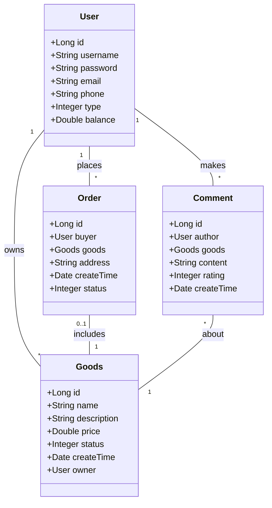

# 基于SSM的校园二手交易系统

## 1. 背景介绍
### 1.1 校园二手交易现状
在当今的大学校园中,二手交易已经成为学生生活中不可或缺的一部分。随着网络技术的发展,越来越多的大学生选择通过网上平台进行二手物品的交易。然而,目前市面上的二手交易平台大多面向社会大众,缺乏专门针对大学生群体的平台。大学校园作为一个相对封闭的环境,学生之间的交易需求更加专一,因此亟需一个专门的校园二手交易平台来满足学生的需求。

### 1.2 项目意义
开发一个基于SSM(Spring+SpringMVC+MyBatis)框架的校园二手交易系统,可以为大学生提供一个安全、便捷、高效的二手交易平台。该系统不仅可以方便学生进行二手物品的买卖,还可以促进校园内的资源循环利用,节约资源,同时也为学生提供了一个锻炼实践能力的机会。

### 1.3 项目目标
本项目旨在开发一个功能完善、界面友好、安全可靠的校园二手交易系统。具体目标如下:
- 为大学生提供一个专门的二手交易平台,满足学生的交易需求。  
- 实现物品发布、浏览、搜索、下单等基本功能,方便学生进行交易。
- 设计简洁美观的用户界面,提供良好的用户体验。
- 保证系统的安全性和稳定性,防止恶意攻击和数据泄露。
- 利用SSM框架实现系统的模块化开发,提高代码的可维护性和可扩展性。

## 2. 核心概念与联系
### 2.1 SSM框架
SSM框架是Java Web开发中常用的一种框架,它由Spring、SpringMVC和MyBatis三个框架组成。
- Spring是一个轻量级的控制反转(IoC)和面向切面(AOP)的容器框架。
- SpringMVC是一个基于Java实现MVC设计模式的请求驱动类型的轻量级Web框架。  
- MyBatis是一个支持定制化SQL、存储过程以及高级映射的持久层框架。

SSM框架的三个组件各司其职,又相互配合,可以大大提高开发效率和系统性能。

### 2.2 MVC设计模式
MVC是Model-View-Controller的缩写,是一种常用的软件设计模式。
- Model(模型):负责管理应用程序的数据和业务逻辑。
- View(视图):负责数据的显示和呈现,是用户与系统交互的界面。
- Controller(控制器):负责接收用户请求,调用模型进行处理,并选择视图来呈现处理结果。

在本项目中,我们将使用SpringMVC框架来实现MVC设计模式,实现系统的分层开发。

### 2.3 领域模型
领域模型是对问题域中的概念类或现实世界中对象的可视化表示。通过领域模型可以清晰地描述系统中的核心概念以及它们之间的关系。

在本项目中,我们可以识别出如下的领域概念:
- 用户:包括买家和卖家,是系统的主要参与者。
- 商品:用户发布的二手物品,包含商品的各种信息。
- 订单:买家下单购买商品后形成的交易记录。
- 评价:交易完成后,买家对卖家的评价。

领域模型图如下:



## 3. 核心算法原理具体操作步骤
### 3.1 用户注册与登录
用户注册时,需要提交用户名、密码、邮箱等信息。系统接收到用户信息后,首先检查用户名是否已存在,如果不存在则将用户信息存入数据库,完成注册。

用户登录时,需要提交用户名和密码。系统接收到登录请求后,根据用户名查询数据库,如果用户存在,则比对密码是否正确,如果正确则登录成功,否则提示密码错误。

### 3.2 商品发布
卖家在发布商品时,需要提交商品的名称、描述、价格、图片等信息。系统接收到发布请求后,将商品信息存入数据库,同时将商品状态设置为"待出售"。

### 3.3 商品搜索
买家在搜索商品时,可以输入关键词进行模糊查询。系统接收到查询请求后,根据关键词在商品表中进行模糊匹配,将符合条件的商品返回给用户。

### 3.4 下单购买
买家在选中心仪的商品后,点击购买按钮进行下单。系统首先检查商品是否已被售出,如果没有则创建一个新的订单,并将商品状态设置为"已售出"。同时,将订单信息发送给卖家。

### 3.5 评价功能
交易完成后,买家可以对卖家进行评价。系统接收到评价请求后,将评价信息存入数据库,并更新卖家的评分。

## 4. 数学模型和公式详细讲解举例说明
在本项目中,我们主要使用了以下几个数学模型和公式:

### 4.1 用户评分计算
我们使用加权平均的方式来计算卖家的综合评分。假设一个卖家收到了$n$个评价,每个评价的评分为$r_i$,则卖家的综合评分$R$可以表示为:

$$
R = \frac{\sum_{i=1}^{n} r_i}{n}
$$

例如,一个卖家收到了3个评价,评分分别为4、5、3,则他的综合评分为:

$$
R = \frac{4+5+3}{3} = 4
$$

### 4.2 商品推荐
我们使用协同过滤算法来实现商品推荐功能。协同过滤算法的基本思想是:找到与目标用户有相似兴趣的其他用户,然后将这些用户喜欢的商品推荐给目标用户。

假设我们有$m$个用户和$n$个商品,我们可以构建一个$m \times n$的用户-商品矩阵$R$,其中$R_{ij}$表示用户$i$对商品$j$的评分。如果用户$i$没有对商品$j$评分,则$R_{ij}=0$。

我们可以使用余弦相似度来衡量两个用户之间的相似度。用户$i$和用户$j$之间的相似度$s_{ij}$可以表示为:

$$
s_{ij} = \frac{\sum_{k=1}^{n} R_{ik} R_{jk}}{\sqrt{\sum_{k=1}^{n} R_{ik}^2} \sqrt{\sum_{k=1}^{n} R_{jk}^2}}
$$

其中分母部分是用户$i$和用户$j$的评分向量的模长。

有了用户之间的相似度,我们可以预测用户$i$对商品$j$的评分$\hat{R}_{ij}$:

$$
\hat{R}_{ij} = \frac{\sum_{k=1}^{m} s_{ik} R_{kj}}{\sum_{k=1}^{m} s_{ik}}
$$

其中$s_{ik}$是用户$i$和用户$k$之间的相似度,$R_{kj}$是用户$k$对商品$j$的实际评分。

## 5. 项目实践:代码实例和详细解释说明
下面我们通过一些代码实例来说明如何使用SSM框架实现校园二手交易系统。

### 5.1 用户注册
在用户注册的控制器中,我们接收前端传来的用户信息,调用业务层的方法进行注册:

```java
@Controller
@RequestMapping("/user")
public class UserController {
    
    @Autowired
    private UserService userService;

    @PostMapping("/register")
    public String register(User user, Model model) {
        if (userService.register(user)) {
            return "redirect:/login";
        } else {
            model.addAttribute("error", "用户名已存在");
            return "register";
        }
    }
}
```

在业务层,我们首先检查用户名是否已存在,如果不存在则将用户信息插入数据库:

```java
@Service
public class UserServiceImpl implements UserService {
    
    @Autowired
    private UserMapper userMapper;

    @Override
    public boolean register(User user) {
        User existUser = userMapper.selectByUsername(user.getUsername());
        if (existUser != null) {
            return false;
        }
        userMapper.insertUser(user);
        return true;
    }
}
```

在持久层,我们使用MyBatis来操作数据库:

```java
@Mapper
public interface UserMapper {
    
    @Select("SELECT * FROM user WHERE username = #{username}")
    User selectByUsername(String username);
    
    @Insert("INSERT INTO user(username, password, email, phone) " +
            "VALUES (#{username}, #{password}, #{email}, #{phone})")
    void insertUser(User user);
}
```

### 5.2 商品发布
在商品发布的控制器中,我们接收前端传来的商品信息,调用业务层的方法进行发布:

```java
@Controller
@RequestMapping("/goods")
public class GoodsController {
    
    @Autowired
    private GoodsService goodsService;

    @PostMapping("/publish")
    public String publish(Goods goods, HttpSession session) {
        User user = (User) session.getAttribute("user");
        goods.setOwner(user);
        goodsService.publish(goods);
        return "redirect:/user/home";
    }
}
```

在业务层,我们将商品信息插入数据库,并将商品状态设置为"待出售":

```java
@Service
public class GoodsServiceImpl implements GoodsService {
    
    @Autowired
    private GoodsMapper goodsMapper;

    @Override
    public void publish(Goods goods) {
        goods.setStatus(0); // 0表示待出售
        goods.setCreateTime(new Date());
        goodsMapper.insertGoods(goods);
    }
}
```

在持久层,我们使用MyBatis来操作数据库:

```java
@Mapper
public interface GoodsMapper {
    
    @Insert("INSERT INTO goods(name, description, price, status, create_time, owner_id) " +
            "VALUES (#{name}, #{description}, #{price}, #{status}, #{createTime}, #{owner.id})")
    void insertGoods(Goods goods);
}
```

### 5.3 下单购买
在下单购买的控制器中,我们接收前端传来的订单信息,调用业务层的方法进行下单:

```java
@Controller
@RequestMapping("/order")
public class OrderController {
    
    @Autowired
    private OrderService orderService;

    @PostMapping("/create")
    public String create(Order order, HttpSession session) {
        User user = (User) session.getAttribute("user");
        order.setBuyer(user);
        orderService.createOrder(order);
        return "redirect:/user/orders";
    }
}
```

在业务层,我们首先检查商品是否已被售出,如果没有则创建订单,并更新商品状态:

```java
@Service
public class OrderServiceImpl implements OrderService {
    
    @Autowired
    private OrderMapper orderMapper;
    @Autowired
    private GoodsMapper goodsMapper;

    @Override
    public void createOrder(Order order) {
        Goods goods = goodsMapper.selectById(order.getGoods().getId());
        if (goods.getStatus() != 0) {
            throw new RuntimeException("商品已被售出");
        }
        
        order.setCreateTime(new Date());
        order.setStatus(0); // 0表示待发货
        orderMapper.insertOrder(order);
        
        goods.setStatus(1); // 1表示已售出
        goodsMapper.updateGoods(goods);
    }
}
```

在持久层,我们使用MyBatis来操作数据库:

```java
@Mapper
public interface OrderMapper {
    
    @Insert("INSERT INTO `order`(buyer_id, goods_id, address, create_time, status) " +
            "VALUES (#{buyer.id}, #{goods.id}, #{address}, #{createTime}, #{status})")
    void insertOrder(Order order);
}

@Mapper
public interface GoodsMapper {
    
    @Select("SELECT * FROM goods WHERE id = #{id}")
    Goods selectById(Long id);
    
    @Update("UPDATE goods SET status = #{status} WHERE id = #{id}")
    void updateGoods(Goods goods);
}
```

## 6. 实际应用场景
校园二手交易系统可以应用于各大高校,