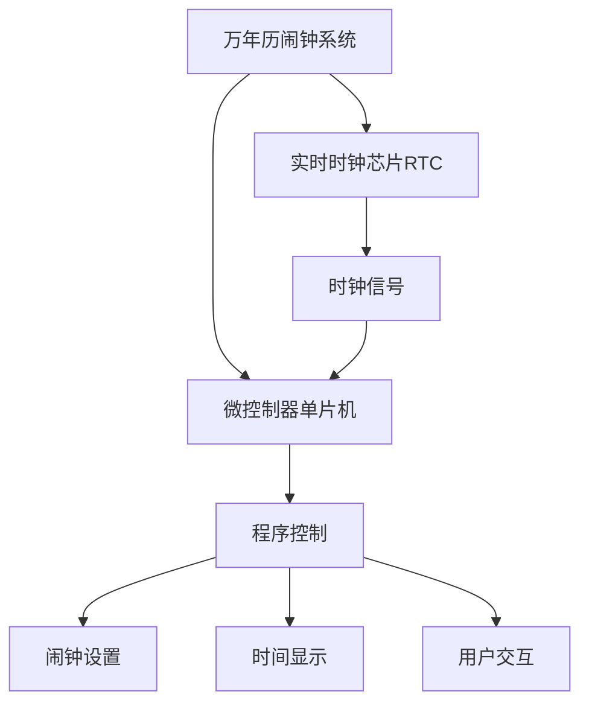

# 基于单片机万年历闹钟的设计与实现

## 1.背景介绍

### 1.1 万年历的概念

万年历是一种能够永久显示当前日期和星期的电子日历系统。它可以自动识别闰年,并根据每个月的天数自动调整日期。无需手动设置,可以永久使用,因此被称为"万年历"。

### 1.2 万年历在嵌入式系统中的应用

万年历功能广泛应用于嵌入式系统中,如电子钟表、计算机主板、工控设备等。它为系统提供了准确的时间和日期信息,是许多应用程序的基础。在嵌入式系统中,万年历通常由实时时钟芯片(RTC)和相应的驱动程序实现。

### 1.3 万年历闹钟的作用

万年历闹钟在万年历的基础上增加了闹钟功能,可以在预设的时间点发出提醒。这种设备结合了时间管理和提醒功能,可以应用于各种场合,如唤醒、会议提醒、定时执行任务等。

## 2.核心概念与联系



万年历闹钟系统的核心组件包括:

1. **实时时钟芯片(RTC)**: 提供准确的时间和日期信息,通常具有备用电池,即使系统断电也能保持运行。
2. **微控制器单片机**: 执行程序,读取RTC时钟信号,控制时间显示、闹钟设置和用户交互。
3. **程序控制逻辑**: 实现万年历计算、闹钟设置、时间显示和用户交互等功能。

## 3.核心算法原理具体操作步骤

### 3.1 万年历算法

万年历算法用于计算给定年月日对应的星期几,是整个系统的核心算法。一种常用的算法是"公式法",具体步骤如下:

1) 将年份转换为从1600年开始的年数Y
2) 将月份M转换为当年的月数(1月为13,12月为14)
3) 计算星期W:W = (Y + Y/4 + C/4 - 2C + 26(M+1)/10 + D - 1) % 7
   其中C = Y/100, D = Y%100
4) W的值对应星期:0为星期日,1为星期一,...,6为星期六

该算法的关键在于公式,需要注意年份、月份的特殊处理。

### 3.2 闹钟设置算法

闹钟设置算法需要根据用户输入,将闹钟时间存储到单片机存储器中。

1) 获取用户输入的闹钟时间(时、分)
2) 将闹钟时间转换为分钟数,存储在指定存储器地址
3) 在主循环中,持续比较当前时间与闹钟时间
4) 如果相等,则触发闹钟中断,执行相应操作(响铃、指示灯等)

该算法需要注意时间的存储格式、中断处理等细节。

## 4.数学模型和公式详细讲解举例说明

在万年历算法中,关键的数学模型是星期计算公式:

$$W = (Y + Y/4 + C/4 - 2C + 26(M+1)/10 + D - 1) \% 7$$

其中:
- Y为年数(从1600年开始计数)
- C = Y/100 (整百年数)
- M为月数(1月记为13,12月记为14)
- D = Y%100 (最后两位年数)

让我们以2023年5月31日为例,计算这一天是星期几:

1) Y = 2023 - 1600 = 423
2) M = 5 + 12 = 17 (5月记为17)
3) C = 423/100 = 4
4) D = 423%100 = 23
5) 代入公式:
   W = (423 + 423/4 + 4/4 - 2*4 + 26*(17+1)/10 + 23 - 1) % 7
     = (423 + 105 + 1 - 8 + 468 + 23 - 1) % 7
     = 1011 % 7
     = 3

因此,2023年5月31日是星期三。

该公式通过年份、月份等因素的组合运算,精确计算出给定日期对应的星期数。虽然看起来复杂,但实际上是一种高效、紧凑的计算方式。

## 5.项目实践:代码实例和详细解释说明

下面是一段基于51单片机的万年历闹钟程序示例代码,使用C语言编写:

```c
#include <reg51.h>

// 定义时钟芯片地址
#define RTC_SEC   0x80  // 秒寄存器
#define RTC_MIN   0x82  // 分钟寄存器
#define RTC_HOUR  0x84  // 小时寄存器
#define RTC_DAY   0x86  // 日期寄存器
#define RTC_MONTH 0x88  // 月份寄存器
#define RTC_YEAR  0x8C  // 年份寄存器

// 定义闹钟存储地址
#define ALARM_HOUR 0x20 // 闹钟小时存储
#define ALARM_MIN  0x21 // 闹钟分钟存储

// 全局变量
unsigned char hour, min, sec, day, month, year;
unsigned char alarm_hour, alarm_min;
bit alarm_flag = 0; // 闹钟标志位

// 读取RTC时钟芯片
void read_rtc() {
    sec = inp(RTC_SEC);
    min = inp(RTC_MIN);
    hour = inp(RTC_HOUR);
    day = inp(RTC_DAY);
    month = inp(RTC_MONTH);
    year = inp(RTC_YEAR);
}

// 设置闹钟时间
void set_alarm(unsigned char h, unsigned char m) {
    alarm_hour = h;
    alarm_min = m;
    outp(ALARM_HOUR, alarm_hour);
    outp(ALARM_MIN, alarm_min);
}

// 闹钟中断服务程序
void alarm_isr() interrupt 3 {
    alarm_flag = 1; // 设置闹钟标志位
    // 执行其他操作,如响铃等
    ...
}

// 主程序
void main() {
    // 初始化
    ...

    while(1) {
        read_rtc(); // 读取RTC时钟
        
        // 检测闹钟时间
        if(hour == alarm_hour && min == alarm_min) {
            alarm_isr(); // 触发闹钟中断
        }

        // 其他操作
        ...
    }
}
```

该程序的主要功能包括:

1. 通过`read_rtc`函数从RTC芯片读取当前时间和日期信息。
2. `set_alarm`函数用于设置闹钟时间,将小时和分钟存储到指定存储器地址。
3. `alarm_isr`是闹钟中断服务程序,当时间匹配时触发,可以在其中执行相应操作(如响铃等)。
4. 在主循环中,持续读取RTC时钟,并检测当前时间是否等于闹钟时间,若相等则触发中断。

该示例代码展示了如何通过单片机控制RTC芯片、设置闹钟时间、处理中断等基本操作。在实际项目中,还需要添加其他功能,如时间显示、用户交互等。

## 6.实际应用场景

万年历闹钟系统可以应用于多种场景,包括:

1. **家用电器**: 作为微波炉、电饭煲、咖啡机等家用电器的时间管理和提醒功能。
2. **个人电子设备**: 集成到手表、闹钟、日历等个人电子设备中,提供时间显示和闹钟功能。
3. **工业控制**: 在工业自动化系统中,用于任务定时执行、设备运行时间管理等。
4. **安防监控**: 结合监控系统,可以设置定时拍照、录像等功能。
5. **物联网设备**: 为物联网终端设备提供时间同步和定时任务执行的功能。

总的来说,无论是家用电器、工业设备还是物联网终端,万年历闹钟系统都可以作为时间管理和提醒的重要组成部分,满足不同场景的需求。

## 7.工具和资源推荐

在开发万年历闹钟系统时,可以使用以下工具和资源:

1. **单片机开发板**: 如Arduino、51单片机开发板等,用于编写和调试程序。
2. **单片机编程软件**: 如Keil、AVR Studio等IDE,提供编辑、编译和调试功能。
3. **RTC芯片手册**: 了解RTC芯片的寄存器映射、时钟信号等细节。
4. **单片机教程和示例代码**: 学习单片机编程基础,参考现有的示例代码。
5. **在线论坛和社区**: 如单片机论坛、Stack Overflow等,可以寻求帮助和分享经验。
6. **开源项目**: 在GitHub等平台上,有许多开源的万年历闹钟项目可供参考。

利用这些工具和资源,可以更高效地开发和调试万年历闹钟系统。

## 8.总结:未来发展趋势与挑战

### 8.1 未来发展趋势

万年历闹钟系统未来的发展趋势包括:

1. **集成化**: 将万年历闹钟功能集成到更多智能设备中,如手机、可穿戴设备等。
2. **云端同步**: 通过云端服务实现多终端时间同步,提高时间准确性。
3. **智能化**: 结合人工智能技术,实现基于用户习惯的智能闹钟设置和提醒。
4. **低功耗设计**: 针对可穿戴和物联网设备,采用更低功耗的硬件和算法设计。
5. **安全性增强**: 提高系统的安全性,防止时间被恶意篡改。

### 8.2 面临的挑战

在发展过程中,万年历闹钟系统也面临一些挑战:

1. **准确性**: 如何保证长期运行的时间准确性,避免时钟漂移。
2. **电源管理**: 对于电池供电设备,如何实现低功耗设计以延长电池寿命。
3. **硬件兼容性**: 不同硬件平台的兼容性问题,需要针对性地优化驱动程序。
4. **用户体验**: 提供简单、直观的用户界面和交互方式。
5. **安全隐患**: 防止时间被恶意篡改,保护系统的完整性和可靠性。

通过持续的技术创新和改进,万年历闹钟系统必将变得更加智能、高效和安全。

## 9.附录:常见问题与解答

1. **为什么需要万年历算法?**

   万年历算法用于根据给定的年月日计算星期几,是实现万年历功能的核心。通过算法,可以自动识别闰年并正确显示日期,无需手动调整。

2. **闹钟时间如何存储?**

   闹钟时间通常存储在单片机的内部存储器中,占用一个或多个地址。每次设置闹钟时,会将时间值写入这些地址。

3. **如何处理闹钟中断?**

   当时间匹配时,会触发闹钟中断。在中断服务程序中,可以执行相应的操作,如响铃、指示灯闪烁等。同时需要设置相应的标志位,以便主程序检测到中断状态。

4. **如何显示时间和日期?**

   时间和日期的显示需要将数字信息转换为对应的字符或段码,然后输出到LCD或LED显示器上。可以编写相应的显示驱动程序实现此功能。

5. **如何实现用户交互?**

   用户交互可以通过按键、旋钮或其他输入设备实现。需要编写相应的输入检测和处理程序,以响应用户的操作,如设置闹钟时间、调整显示模式等。

6. **如何提高时间准确性?**

   时间准确性主要取决于RTC芯片的性能和校准方式。可以采用高精度的RTC芯片,并通过网络时间服务器或原子钟等方式定期校准时钟。

7. **如何降低功耗?**

   降低功耗可以从硬件和软件两个方面着手。硬件上可以选择低功耗的RTC芯片和微控制器,软件上