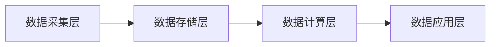

# 基于大数据的城市扬尘数字化监控系统的设计与开发

## 1. 背景介绍
### 1.1 城市扬尘污染的危害
#### 1.1.1 对人体健康的影响
#### 1.1.2 对生态环境的影响
#### 1.1.3 对城市形象的影响

### 1.2 扬尘监控的必要性和紧迫性
#### 1.2.1 国家和地方政策法规的要求
#### 1.2.2 城市可持续发展的内在需求
#### 1.2.3 公众对改善空气质量的迫切期望

### 1.3 大数据技术在扬尘监控中的应用前景
#### 1.3.1 海量数据的采集和存储
#### 1.3.2 数据挖掘和机器学习算法的应用
#### 1.3.3 可视化展示和智能预警

## 2. 核心概念与联系
### 2.1 扬尘的定义和来源
#### 2.1.1 扬尘的物理化学特性
#### 2.1.2 建筑施工扬尘
#### 2.1.3 道路交通扬尘
#### 2.1.4 裸露地面扬尘

### 2.2 扬尘监控的关键指标
#### 2.2.1 PM2.5和PM10浓度
#### 2.2.2 TSP总悬浮颗粒物浓度 
#### 2.2.3 降尘量
#### 2.2.4 风速风向

### 2.3 大数据平台的架构
#### 2.3.1 数据采集层
#### 2.3.2 数据存储层
#### 2.3.3 数据计算层
#### 2.3.4 数据应用层



## 3. 核心算法原理和操作步骤
### 3.1 数据预处理
#### 3.1.1 数据清洗
#### 3.1.2 数据集成
#### 3.1.3 数据变换

### 3.2 特征工程
#### 3.2.1 特征提取
#### 3.2.2 特征选择 
#### 3.2.3 特征降维

### 3.3 机器学习算法
#### 3.3.1 线性回归
#### 3.3.2 逻辑回归
#### 3.3.3 支持向量机
#### 3.3.4 随机森林
#### 3.3.5 神经网络

### 3.4 模型训练和优化
#### 3.4.1 数据集划分
#### 3.4.2 交叉验证
#### 3.4.3 网格搜索
#### 3.4.4 模型评估

## 4. 数学模型和公式详解
### 4.1 扬尘浓度估算模型
大气中的扬尘浓度可以用下面的公式来估算：

$$C = \frac{Q}{V}$$

其中，$C$表示扬尘浓度，单位为$mg/m^3$；$Q$表示单位时间内的扬尘排放量，单位为$mg/s$；$V$表示大气体积，单位为$m^3$。

### 4.2 扬尘排放量计算模型
建筑施工扬尘的排放量与施工面积、施工阶段、施工工艺等因素有关，可以用下面的公式来计算：

$$Q_{建筑} = \sum_{i=1}^n{E_i \times S_i}$$

其中，$Q_{建筑}$表示建筑施工扬尘排放量；$E_i$表示第$i$种施工工艺的扬尘排放因子，单位为$mg/(m^2 \cdot s)$；$S_i$表示第$i$种施工工艺的作业面积，单位为$m^2$。

道路扬尘排放量与车流量、车速、道路特性等因素有关，可以用下面的公式来计算：

$$Q_{道路} = \sum_{j=1}^m{q_j \times L_j}$$ 

其中，$Q_{道路}$表示道路扬尘排放量；$q_j$表示第$j$条道路单位长度扬尘排放强度，单位为$mg/(m \cdot s)$；$L_j$表示第$j$条道路的长度，单位为$m$。

### 4.3 机器学习算法的数学原理
以线性回归为例，假设我们有$n$个样本数据点$(x_1,y_1), (x_2,y_2), \cdots, (x_n,y_n)$，线性回归模型可以表示为：

$$y = w_0 + w_1x_1 + w_2x_2 + \cdots + w_dx_d$$

其中，$y$为目标变量，$x_1, x_2, \cdots, x_d$为$d$个特征变量，$w_0, w_1, \cdots, w_d$为待求的模型参数。我们的目标是找到一组参数使得预测值$\hat{y}$与真实值$y$的差距最小，即最小化损失函数：

$$J(w) = \frac{1}{2n}\sum_{i=1}^n{(y_i - \hat{y}_i)^2}$$

其中，$\hat{y}_i = w_0 + w_1x_{i1} + w_2x_{i2} + \cdots + w_dx_{id}$为第$i$个样本的预测值。我们可以用梯度下降法来求解这个最优化问题：

$$w_j := w_j - \alpha\frac{\partial J(w)}{\partial w_j}$$

其中，$\alpha$为学习率，$\frac{\partial J(w)}{\partial w_j}$为损失函数对$w_j$的偏导数。重复迭代直到收敛，就可以得到最优的模型参数。

## 5. 项目实践：代码实例和详解
下面是一个使用Python实现线性回归的简单示例：

```python
import numpy as np

# 输入数据
X = np.array([[1, 1], [1, 2], [2, 2], [2, 3]])
y = np.dot(X, np.array([1, 2])) + 3

# 初始化模型参数
w = np.zeros(2)
b = 0

# 超参数设置
lr = 0.01
num_iterations = 1000

# 训练模型
for iteration in range(num_iterations):
    # 计算预测值
    y_pred = np.dot(X, w) + b
    
    # 计算损失函数的梯度
    dw = (1/X.shape[0]) * np.dot(X.T, (y_pred - y))  
    db = (1/X.shape[0]) * np.sum(y_pred - y)
    
    # 更新模型参数
    w = w - lr * dw
    b = b - lr * db

# 打印最终的模型参数
print(f"w: {w}, b: {b}")
```

这个例子中，我们首先定义了输入数据`X`和目标变量`y`，然后初始化模型参数`w`和`b`。接着设置学习率`lr`和迭代次数`num_iterations`等超参数。

在训练过程中，我们使用了梯度下降法来更新模型参数。在每次迭代中，首先计算预测值`y_pred`，然后根据损失函数计算梯度`dw`和`db`，最后用梯度下降公式更新参数`w`和`b`。

重复迭代1000次后，我们得到了最优的模型参数，可以用来对新的数据进行预测。

## 6. 实际应用场景
### 6.1 建筑工地扬尘监控
在建筑工地安装视频监控设备和PM传感器，实时采集施工现场的扬尘数据，通过大数据平台进行分析和预警，及时发现和处置扬尘污染问题。

### 6.2 城市道路扬尘监测
在城市主要道路布设扬尘监测设备，与交通流量数据、气象数据等结合分析，评估道路扬尘污染水平，为道路保洁和洒水频次提供决策支持。

### 6.3 裸土覆盖监管
利用卫星遥感影像数据，识别城市建成区内的裸土覆盖区域，评估扬尘污染风险，督促相关部门及时采取绿化、硬化等措施。

### 6.4 环境空气质量预报预警
综合气象、交通、施工等各类数据，构建机器学习模型，对未来一段时间内的区域空气质量进行预测预警，及时启动应急响应措施。

## 7. 工具和资源推荐
### 7.1 数据采集和传输
- 视频监控设备：海康威视、大华等
- PM传感器：Sensirion SPS30、攀藤PMS5003等
- 数据采集网关：树莓派、Arduino等
- MQTT消息队列：mosquitto、EMQ等

### 7.2 大数据存储和计算
- 分布式文件系统：HDFS、Ceph等 
- NoSQL数据库：HBase、MongoDB等
- 大数据处理框架：Hadoop、Spark等
- 流处理框架：Flink、Storm等

### 7.3 数据分析和可视化
- 数据分析库：NumPy、Pandas等  
- 机器学习库：Scikit-learn、TensorFlow等
- 可视化库：Matplotlib、Plotly等
- BI工具：Superset、Redash等

## 8. 总结与展望
### 8.1 扬尘监控系统的价值和意义
- 有效识别扬尘污染源，精准溯源
- 助力PM2.5和PM10达标，改善空气质量
- 保障人民群众身体健康，提升生活品质
- 推动城市高质量发展，彰显生态文明建设成效

### 8.2 未来发展趋势
- 5G和物联网技术的应用，实现更高效的数据采集和传输
- 边缘计算与端侧智能，使设备具备初步分析处理能力
- AI算法的持续演进，不断提升数据分析和预测的精准度
- 区块链技术的引入，确保数据的真实性和不可篡改性

### 8.3 面临的挑战
- 数据孤岛问题，各部门数据共享机制有待完善
- 数据质量参差不齐，数据治理和融合有一定难度
- 算法模型的通用性不足，适应不同场景的能力有限
- 系统建设成本高，运维压力大，亟需降本增效

## 9. 附录：常见问题解答
### Q1: 扬尘监控需要哪些硬件设备？
A1: 扬尘监控需要的主要硬件设备包括视频监控摄像头、PM传感器、数据采集网关、供电和通信设备等。

### Q2: 扬尘监测数据的时间和空间分辨率如何选择？
A2: 扬尘监测数据的时间分辨率一般为分钟级，空间分辨率与监测点位的密度有关，需要在成本和效果之间平衡。

### Q3: 如何评估扬尘监控系统的效果？  
A3: 可以从PM浓度变化趋势、空气质量改善程度、污染来源解析、治理措施落实等方面综合评估扬尘监控系统的效果。

### Q4: 扬尘监控大数据平台应该如何搭建？
A4: 扬尘监控大数据平台的搭建需要考虑数据量级、实时性、并发性等因素，合理选择大数据存储、计算、分析的框架和工具。

### Q5: 如何保障扬尘监控数据的安全性和隐私性？
A5: 扬尘监控涉及的部分数据如施工单位信息属于敏感数据，需要采用数据加密、访问控制、数据脱敏等手段保障数据安全和隐私。

作者：禅与计算机程序设计艺术 / Zen and the Art of Computer Programming