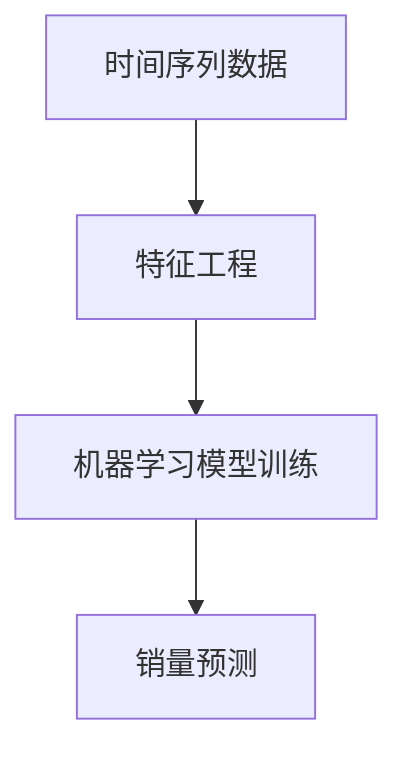

# 基于时间序列的商品销量预测分析

## 1. 背景介绍

### 1.1 时间序列数据及其重要性

在当今数据主导的商业环境中,时间序列数据无处不在。时间序列数据是指按照时间的先后顺序收集的一系列数据点,通常包括销售记录、股票价格、网站流量等。这些数据对于企业来说是无价之宝,因为它们蕴含着宝贵的见解和模式,可以帮助企业做出更明智的决策。

### 1.2 商品销量预测的重要意义

准确预测未来商品销量对于企业的库存管理、生产计划、营销策略等方面都有着重大影响。过度生产会导致资金周转困难,而供应不足则可能失去潜在收益。因此,基于时间序列数据构建精准的销量预测模型,已成为当前企业面临的一项关键挑战。

## 2. 核心概念与联系

### 2.1 时间序列分析

时间序列分析是一种研究随时间变化数据的统计方法。它探索序列中的模式、趋势和周期性,以预测未来的发展趋势。常用的时间序列分析方法包括移动平均、指数平滑、自回归模型(AR)、移动平均模型(MA)、ARIMA模型等。

### 2.2 机器学习在销量预测中的应用

传统的时间序列分析方法往往基于一些假设,如数据的平稳性、线性关系等,在处理复杂的非线性数据时可能效果不佳。而机器学习算法能够自动从数据中学习模式,无需人为设定模型形式,在销量预测等领域展现出巨大潜力。



上图展示了将机器学习应用于销量预测的基本流程。首先对原始时间序列数据进行特征工程,提取有用的特征;然后使用这些特征训练机器学习模型;最后,将训练好的模型应用于新的时间序列数据,对未来销量做出预测。

## 3. 核心算法原理具体操作步骤

机器学习在销量预测中的应用通常分为以下几个步骤:

### 3.1 数据预处理

- 缺失值处理:填充或删除缺失数据
- 异常值处理:移除明显偏离正常模式的数据点
- 数据变换:对数据进行标准化或归一化等变换,使特征在同一量级

### 3.2 特征工程

从原始时间序列数据中提取有意义的特征,是机器学习模型取得良好表现的关键。常用的时间序列特征包括:

- 时间戳特征:年、月、日、小时等
- 滞后特征:过去几个时间步长的观测值
- 滚动统计量:移动平均、移动标准差等
- 日期特征:是否为节假日等

### 3.3 模型选择与训练

根据问题的特点,选择合适的机器学习模型。对于销量预测,常用的模型有:

- 线性模型:线性回归、ARIMA等
- 树模型:随机森林、LightGBM等
- 神经网络:RNN、LSTM等

将特征数据输入模型,使用训练数据进行模型训练,调整模型参数以最小化损失函数。

### 3.4 模型评估与调优

在测试集上评估模型的表现,常用的指标包括均方根误差(RMSE)、平均绝对百分比误差(MAPE)等。如果模型的性能不佳,需要返回前面的步骤,进行特征工程、模型选择、参数调整等,直至获得满意的结果。

## 4. 数学模型和公式详细讲解举例说明

### 4.1 线性回归

线性回归是一种常用的传统时间序列预测模型。它假设因变量(销量)和自变量(时间等特征)之间存在线性关系,公式如下:

$$y = \beta_0 + \beta_1x_1 + \beta_2x_2 + ... + \beta_nx_n + \epsilon$$

其中:
- $y$是因变量(销量)
- $x_1, x_2, ..., x_n$是自变量(时间特征等)
- $\beta_0, \beta_1, ..., \beta_n$是模型参数
- $\epsilon$是随机误差项

通过最小二乘法估计模型参数,使残差平方和最小化。

### 4.2 ARIMA模型

ARIMA(AutoRegressive Integrated Moving Average)模型是一种常用的时间序列分析和预测方法。它由三部分组成:

- AR(AutoRegressive):自回归部分,描述了时间序列与其过去值之间的关系
- I(Integrated):差分部分,通过差分运算使时间序列平稳
- MA(Moving Average):移动平均部分,描述了残差项与过去残差项之间的关系

ARIMA模型的公式为:

$$y_t = c + \phi_1y_{t-1} + \phi_2y_{t-2} + ... + \phi_py_{t-p} + \theta_1\epsilon_{t-1} + \theta_2\epsilon_{t-2} + ... + \theta_q\epsilon_{t-q} + \epsilon_t$$

其中:
- $y_t$是时间$t$时的观测值
- $c$是常数项
- $\phi_1, \phi_2, ..., \phi_p$是自回归系数
- $\theta_1, \theta_2, ..., \theta_q$是移动平均系数
- $\epsilon_t$是时间$t$时的残差项

通过估计上述参数,即可对未来时间序列做出预测。

### 4.3 LSTM神经网络

长短期记忆网络(LSTM)是一种特殊的递归神经网络,擅长处理序列数据。LSTM通过精心设计的门控机制,能够更好地捕捉长期依赖关系,避免梯度消失或爆炸问题。

LSTM单元的核心公式为:

$$\begin{aligned}
f_t &= \sigma(W_f \cdot [h_{t-1}, x_t] + b_f) \\
i_t &= \sigma(W_i \cdot [h_{t-1}, x_t] + b_i) \\
\tilde{C}_t &= \tanh(W_C \cdot [h_{t-1}, x_t] + b_C) \\
C_t &= f_t \odot C_{t-1} + i_t \odot \tilde{C}_t \\
o_t &= \sigma(W_o \cdot [h_{t-1}, x_t] + b_o) \\
h_t &= o_t \odot \tanh(C_t)
\end{aligned}$$

其中:
- $f_t$是遗忘门,控制遗忘上一时刻的状态
- $i_t$是输入门,控制更新当前状态
- $\tilde{C}_t$是候选状态值
- $C_t$是当前状态值
- $o_t$是输出门,控制输出当前状态的程度
- $h_t$是当前时刻的输出

通过堆叠LSTM层,可以构建强大的序列模型,用于销量预测等任务。

## 5. 项目实践:代码实例和详细解释说明

以下是一个使用Python和流行机器学习库如Pandas、Scikit-Learn、TensorFlow等,基于LSTM神经网络进行销量预测的示例代码:

```python
import pandas as pd
from sklearn.preprocessing import MinMaxScaler
import tensorflow as tf
from tensorflow.keras.models import Sequential
from tensorflow.keras.layers import LSTM, Dense

# 加载数据
data = pd.read_csv('sales_data.csv')
data = data.sort_values('date')

# 数据预处理
scaler = MinMaxScaler()
sales = scaler.fit_transform(data['sales'].values.reshape(-1,1))

# 创建时间步长和特征
time_steps = 30 
X, y = [], []
for i in range(len(sales)-time_steps):
    X.append(sales[i:i+time_steps])
    y.append(sales[i+time_steps])
    
X, y = np.array(X), np.array(y)
X = np.reshape(X, (X.shape[0], X.shape[1], 1))

# 划分训练集和测试集
split = int(0.7 * len(X))
X_train, X_test = X[:split], X[split:]
y_train, y_test = y[:split], y[split:]

# 构建LSTM模型
model = Sequential()
model.add(LSTM(64, input_shape=(time_steps, 1)))
model.add(Dense(1))
model.compile(optimizer='adam', loss='mse')

# 训练模型
model.fit(X_train, y_train, epochs=50, batch_size=32, validation_data=(X_test, y_test))

# 预测
y_pred = model.predict(X_test)

# 反标准化
y_test_descaled = scaler.inverse_transform(y_test.reshape(-1, 1))
y_pred_descaled = scaler.inverse_transform(y_pred)

# 评估模型
mse = mean_squared_error(y_test_descaled, y_pred_descaled)
print(f'MSE: {mse}')
```

上述代码首先加载并预处理销量数据,创建时间步长特征。然后构建一个单层LSTM模型,使用训练数据进行模型训练。最后,在测试集上评估模型性能,计算均方误差(MSE)。

需要注意的是,这只是一个简单的示例,实际应用中可能需要进行更复杂的特征工程、模型设计和调参,以获得更好的性能。

## 6. 实际应用场景

基于时间序列的销量预测技术在现实世界中有着广泛的应用,包括但不限于:

### 6.1 零售业

零售商可以利用历史销售数据,预测未来对特定商品的需求量,从而优化库存管理、促销策略等。例如,沃尔玛、亚马逊等大型零售商都在使用机器学习算法进行需求预测。

### 6.2 制造业

制造企业可以根据产品需求预测,合理安排生产计划、原材料采购等,降低成本,提高效率。例如,英特尔公司使用时间序列模型预测芯片需求。

### 6.3 电力行业

电力公司需要预测未来的用电量,以确保足够的电力供应并制定相应的发电计划。准确的用电量预测有助于节约资源、降低成本。

### 6.4 交通运输

交通运输部门可以根据历史数据预测未来的客流量,从而优化运力调度,提高运营效率。例如,滴滴出行使用时间序列模型预测未来的打车需求。

### 6.5 金融行业

银行和金融机构可以利用时间序列模型预测未来的贷款需求、存款水平等,用于风险管理和资产配置决策。

## 7. 工具和资源推荐

以下是一些流行的时间序列分析和预测工具:

### 7.1 Python库

- Pandas: 提供高性能、易于使用的数据结构和数据分析工具
- Statsmodels: 包含许多用于时间序列分析的经典统计模型
- Scikit-Learn: 机器学习库,支持ARIMA等时间序列模型
- TensorFlow/Keras: 深度学习框架,可用于构建LSTM等神经网络模型
- Prophet: Facebook开源的时间序列预测库,专注于具有季节性的业务时间序列数据

### 7.2 R语言包

- forecast: 提供许多时间序列预测方法的实现
- tseries: 时间序列分析和计算
- xts: 扩展的时间序列类和方法

### 7.3 在线资源

- Coursera机器学习时间序列预测课程
- DataCamp时间序列分析教程
- AWS时间序列预测服务
- Google Cloud AI平台时间序列预测

## 8. 总结:未来发展趋势与挑战

时间序列分析和预测是一个活跃的研究领域,未来可能会有以下发展趋势:

### 8.1 深度学习模型

随着计算能力的提高,更复杂的深度神经网络将在时间序列预测中发挥重要作用。例如,注意力机制、生成对抗网络等前沿技术可能会进一步提高预测性能。

### 8.2 多变量时间序列

未来的研究可能会更多关注多变量时间序列,即同时预测多个相关变量。这对于复杂系统的建模至关重要。

### 8.3 在线学习

许多实际应用需要持续获取新数据并更新模型。在线学习算法能够高效地从新数据中学习,而无需重新训练整个模型,将变得越来越重要。

### 8.4 解释性

虽然深度学习模型具有强大的预测能力,但它们通常被视为"黑箱"。增强模型的解释性和可