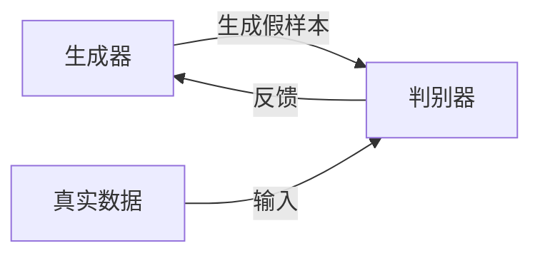
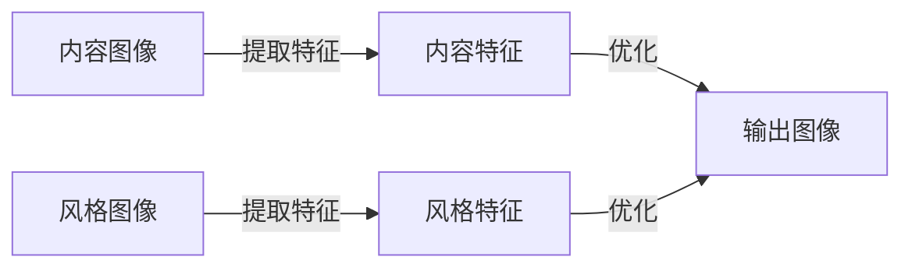

# 基于生成对抗网络的图像风格迁移在广告设计中的应用

## 1. 背景介绍

### 1.1 广告设计的重要性

在当今的商业世界中,广告设计扮演着至关重要的角色。有效的广告不仅能够吸引消费者的注意力,还能够传达品牌理念,树立良好的品牌形象。然而,创作出独特且吸引人的广告设计并非易事,需要设计师具备丰富的创意和专业技能。

### 1.2 图像风格迁移技术概述 

图像风格迁移是一种将一种艺术风格迁移到另一幅图像上的技术。通过这项技术,我们可以将经典艺术作品的风格赋予普通照片,使照片呈现出艺术般的独特效果。近年来,基于深度学习的图像风格迁移技术取得了长足进展,其中基于生成对抗网络(Generative Adversarial Networks, GANs)的方法尤为突出。

### 1.3 在广告设计中应用的意义

将图像风格迁移技术应用于广告设计,可以为传统的广告设计注入新的活力。设计师能够将经典艺术风格赋予产品图像,使广告设计更加生动有趣,从而吸引消费者的注意力。此外,独特的艺术风格还能够增强品牌的识别度和美誉度。

## 2. 核心概念与联系

### 2.1 生成对抗网络(GANs)

生成对抗网络是一种由两个神经网络组成的框架,包括生成器(Generator)和判别器(Discriminator)。生成器的目标是生成逼真的数据样本,而判别器则旨在区分生成的样本和真实数据。两个网络相互对抗,最终达到生成器生成的样本无法被判别器识别的状态。



### 2.2 图像风格迁移

图像风格迁移的目标是将一种艺术风格迁移到另一幅图像上,同时保留内容图像的结构和语义信息。这通常涉及两个步骤:

1. 提取内容图像和风格图像的特征
2. 优化新的输出图像,使其与内容图像的内容特征相似,同时与风格图像的风格特征相似



### 2.3 将GANs应用于图像风格迁移

通过将GANs应用于图像风格迁移,我们可以利用生成器网络生成具有所需风格的图像,而判别器网络则负责评估生成图像的质量和风格一致性。这种方法不仅能够产生高质量的风格化图像,还能够实现实时的风格迁移,从而满足广告设计的需求。

## 3. 核心算法原理具体操作步骤

基于GANs的图像风格迁移算法通常包括以下几个关键步骤:

### 3.1 数据预处理

1. 准备内容图像和风格图像数据集
2. 对图像进行归一化和调整大小等预处理操作

### 3.2 构建生成器和判别器网络

1. 设计生成器网络架构,通常采用编码器-解码器结构
2. 设计判别器网络架构,通常采用卷积神经网络

### 3.3 提取内容和风格特征

1. 使用预训练的卷积神经网络(如VGG)提取内容图像和风格图像的特征
2. 计算内容损失和风格损失

### 3.4 训练生成对抗网络

1. 定义生成器和判别器的损失函数
2. 使用对抗训练策略,交替优化生成器和判别器
3. 生成器优化目标是最小化内容损失、风格损失和对抗损失
4. 判别器优化目标是最大化对抗损失

### 3.5 生成风格化图像

1. 使用训练好的生成器网络
2. 将内容图像输入生成器
3. 生成器输出具有目标风格的图像

## 4. 数学模型和公式详细讲解举例说明

### 4.1 内容损失

内容损失衡量生成图像与内容图像之间的内容差异,通常使用均方误差来计算:

$$L_{content}(G) = \frac{1}{2}\sum_{i,j}(F_{ij}^{l}(G) - P_{ij}^{l})^2$$

其中:
- $G$是生成图像
- $F^l$是第$l$层特征图
- $P^l$是内容图像在第$l$层的特征图

### 4.2 风格损失

风格损失衡量生成图像与风格图像之间的风格差异,通过计算格拉姆矩阵(Gram Matrix)之间的均方误差:

$$L_{style}(G, S) = \sum_{l}\frac{1}{N_l^2M_l^2}\sum_{i,j}(G_{ij}^l - S_{ij}^l)^2$$

其中:
- $G^l$和$S^l$分别是生成图像和风格图像在第$l$层的特征图
- $N_l$和$M_l$是特征图的高度和宽度
- $G_{ij}^l$和$S_{ij}^l$是对应位置的特征值

### 4.3 对抗损失

对抗损失是生成对抗网络的核心,用于衡量生成图像与真实图像的差异:

$$L_{adv}(G, D) = \mathbb{E}_{x \sim p_{data}(x)}[\log D(x)] + \mathbb{E}_{z \sim p_{z}(z)}[\log(1 - D(G(z)))]$$

其中:
- $D$是判别器
- $G$是生成器
- $x$是真实图像
- $z$是随机噪声向量

### 4.4 总体损失函数

生成器的总体损失函数是内容损失、风格损失和对抗损失的加权和:

$$L_{total}(G, D) = \alpha L_{content}(G) + \beta L_{style}(G, S) + \gamma L_{adv}(G, D)$$

其中$\alpha$、$\beta$和$\gamma$是权重系数,用于平衡不同损失项的重要性。

### 4.5 实例说明

假设我们希望将一张产品图像风格化为梵高的著名画作《星夜》的风格。首先,我们需要准备内容图像(产品图像)和风格图像(《星夜》)。然后,我们使用预训练的VGG网络提取两幅图像的特征图。接下来,我们构建生成器和判别器网络,并根据上述公式计算内容损失、风格损失和对抗损失。

在训练过程中,生成器会不断优化,试图生成具有《星夜》风格且保留产品内容的图像,而判别器则试图区分生成图像和真实图像。经过多次迭代,生成器最终能够生成高质量的风格化图像,将产品图像融入了梵高独特的绘画风格。

## 5. 项目实践:代码实例和详细解释说明

为了更好地理解基于GANs的图像风格迁移算法,我们将通过一个实际项目来进行实践。在这个项目中,我们将使用PyTorch框架实现一个简单的图像风格迁移模型。

### 5.1 导入必要的库

```python
import torch
import torch.nn as nn
import torchvision.models as models
import torchvision.transforms as transforms
from PIL import Image
import matplotlib.pyplot as plt
```

### 5.2 定义内容损失和风格损失函数

```python
def content_loss(gen_feat, target_feat):
    loss = torch.mean((gen_feat - target_feat) ** 2)
    return loss

def gram_matrix(tensor):
    _, c, h, w = tensor.size()
    tensor = tensor.view(c, h * w)
    gram = torch.mm(tensor, tensor.t())
    return gram

def style_loss(gen_feat, style_feat):
    gen_gram = gram_matrix(gen_feat)
    style_gram = gram_matrix(style_feat)
    loss = torch.mean((gen_gram - style_gram) ** 2)
    return loss
```

### 5.3 定义风格迁移模型

```python
class StyleTransferModel(nn.Module):
    def __init__(self, content_weight=1, style_weight=1e6):
        super(StyleTransferModel, self).__init__()
        self.vgg = models.vgg19(pretrained=True).features[:36]
        self.content_weight = content_weight
        self.style_weight = style_weight

    def forward(self, input_img, content_img, style_img):
        input_feat = self.vgg(input_img)
        content_feat = self.vgg(content_img)
        style_feat = self.vgg(style_img)

        content_loss = content_loss(input_feat, content_feat)
        style_loss = 0
        for gen_feat, style_feat in zip(input_feat, style_feat):
            style_loss += style_loss(gen_feat, style_feat)

        total_loss = self.content_weight * content_loss + self.style_weight * style_loss
        return total_loss
```

### 5.4 加载图像并进行预处理

```python
content_img = Image.open("content.jpg")
style_img = Image.open("style.jpg")

transform = transforms.Compose([
    transforms.ToTensor(),
    transforms.Normalize(mean=[0.485, 0.456, 0.406], std=[0.229, 0.224, 0.225])
])

content_img = transform(content_img).unsqueeze(0)
style_img = transform(style_img).unsqueeze(0)
```

### 5.5 训练模型并生成风格化图像

```python
model = StyleTransferModel()
optimizer = torch.optim.Adam(model.parameters(), lr=0.001)

for epoch in range(100):
    input_img = content_img.clone().requires_grad_(True)
    total_loss = model(input_img, content_img, style_img)

    optimizer.zero_grad()
    total_loss.backward()
    optimizer.step()

    if epoch % 10 == 0:
        print(f"Epoch {epoch}, Loss: {total_loss.item():.4f}")

stylized_img = input_img.squeeze().permute(1, 2, 0).detach().numpy()
plt.imshow(stylized_img)
plt.show()
```

在上述代码中,我们首先定义了内容损失和风格损失函数。接着,我们定义了风格迁移模型,该模型包含一个预训练的VGG19网络用于提取特征,并计算内容损失和风格损失。

然后,我们加载内容图像和风格图像,并对它们进行预处理。在训练过程中,我们使用Adam优化器优化模型参数,目标是最小化内容损失和风格损失的加权和。

最后,我们可以获得风格化后的图像,并使用matplotlib进行可视化。

通过这个实例,您应该能够更好地理解基于GANs的图像风格迁移算法的实现细节。当然,在实际应用中,您可能需要进行更多的调优和优化,以获得更好的效果。

## 6. 实际应用场景

基于GANs的图像风格迁移技术在广告设计领域具有广泛的应用前景:

### 6.1 产品广告设计

将产品图像与经典艺术作品的风格相结合,可以为产品广告注入新的活力和创意。例如,将一款时尚手袋图像与梵高的《向日葵》风格相融合,能够吸引消费者的注意力,增强品牌形象。

### 6.2 服装广告设计

在服装广告中,我们可以将模特照片与不同的艺术风格相结合,创造出独特的视觉效果。例如,将一张时尚模特照片与印象派画作的风格相融合,能够增强广告的艺术感和时尚感。

### 6.3 旅游广告设计

旅游广告通常需要展示目的地的风景和文化特色。通过将旅游景点照片与当地艺术风格相结合,可以更好地传达目的地的独特魅力。例如,将一张巴黎埃菲尔铁塔的照片与法国印象派画作的风格相融合,能够营造浪漫的法国气息。

### 6.4 品牌形象广告设计

品牌形象广告旨在塑造品牌的独特个性和文化内涵。将品牌标志或产品图像与经典艺术风格相结合,能够增强品牌的艺术气质和文化内涵,从而提升品牌形象。

## 7. 工具和资源推荐

在实现基于GANs的图像风格迁移时,您可能需要使用以下工具和资源:

### 7.1 深度学习框架

- Py