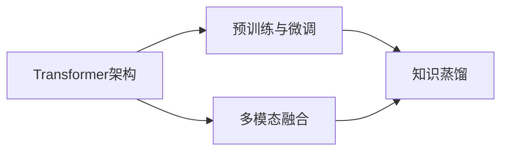

# 多模态大模型：技术原理与实战 自然语言处理的里程碑

## 1. 背景介绍
### 1.1 人工智能的发展历程
#### 1.1.1 早期人工智能
#### 1.1.2 机器学习时代  
#### 1.1.3 深度学习的崛起

### 1.2 自然语言处理的演进
#### 1.2.1 基于规则的方法
#### 1.2.2 统计机器学习方法
#### 1.2.3 深度学习方法

### 1.3 多模态大模型的出现
#### 1.3.1 大模型的概念
#### 1.3.2 多模态的定义
#### 1.3.3 多模态大模型的优势

## 2. 核心概念与联系
### 2.1 Transformer 架构
#### 2.1.1 自注意力机制
#### 2.1.2 位置编码
#### 2.1.3 编码器-解码器结构

### 2.2 预训练与微调
#### 2.2.1 无监督预训练
#### 2.2.2 有监督微调
#### 2.2.3 预训练任务设计

### 2.3 多模态融合
#### 2.3.1 早期融合
#### 2.3.2 晚期融合 
#### 2.3.3 交叉注意力机制

### 2.4 知识蒸馏
#### 2.4.1 教师-学生模型
#### 2.4.2 软目标与硬目标
#### 2.4.3 蒸馏损失函数

## 3. 核心算法原理具体操作步骤
### 3.1 Transformer 的详细过程
#### 3.1.1 输入嵌入
#### 3.1.2 多头自注意力
#### 3.1.3 前馈神经网络
#### 3.1.4 残差连接与层归一化

### 3.2 BERT 预训练
#### 3.2.1 掩码语言模型
#### 3.2.2 下一句预测
#### 3.2.3 预训练数据构建

### 3.3 多模态对齐预训练
#### 3.3.1 图文对齐
#### 3.3.2 视频-文本对齐
#### 3.3.3 语音-文本对齐

### 3.4 对比学习
#### 3.4.1 正负样本构建
#### 3.4.2 对比损失函数
#### 3.4.3 数据增强策略

## 4. 数学模型和公式详细讲解举例说明
### 4.1 注意力机制
#### 4.1.1 点积注意力
$Attention(Q,K,V) = softmax(\frac{QK^T}{\sqrt{d_k}})V$

#### 4.1.2 多头注意力
$$MultiHead(Q,K,V) = Concat(head_1, ..., head_h)W^O$$
$$head_i = Attention(QW_i^Q, KW_i^K, VW_i^V)$$

### 4.2 LayerNorm
$$\mu = \frac{1}{n}\sum_{i=1}^{n}x_i$$
$$\sigma = \sqrt{\frac{1}{n}\sum_{i=1}^{n}(x_i-\mu)^2}$$
$$y_i = \frac{x_i-\mu}{\sqrt{\sigma^2+\epsilon}} * \gamma + \beta$$

### 4.3 对比损失函数
#### 4.3.1 InfoNCE Loss
$$\mathcal{L}_{NCE} = -\mathbb{E}_{(x,y)\sim D}[log\frac{e^{f(x,y)/\tau}}{\sum_{y'\in Y}e^{f(x,y')/\tau}}]$$

#### 4.3.2 Triplet Loss
$$\mathcal{L}_{triplet} = \max(d(x_a,x_p) - d(x_a,x_n) + m, 0)$$

## 5. 项目实践：代码实例和详细解释说明
### 5.1 使用 Hugging Face 实现 BERT
#### 5.1.1 加载预训练模型
#### 5.1.2 自定义数据集
#### 5.1.3 微调与预测

### 5.2 使用 PyTorch 实现 Transformer
#### 5.2.1 定义 Transformer 模块
#### 5.2.2 训练与评估
#### 5.2.3 注意力可视化

### 5.3 使用 TensorFlow 实现多模态融合
#### 5.3.1 图像特征提取
#### 5.3.2 文本特征提取
#### 5.3.3 多模态对齐与融合

## 6. 实际应用场景
### 6.1 智能问答系统
#### 6.1.1 知识库构建
#### 6.1.2 问题理解与检索
#### 6.1.3 答案生成

### 6.2 多模态情感分析
#### 6.2.1 文本情感分析
#### 6.2.2 语音情感分析
#### 6.2.3 面部表情识别

### 6.3 跨模态检索
#### 6.3.1 图文检索
#### 6.3.2 视频-文本检索
#### 6.3.3 语音-文本检索

## 7. 工具和资源推荐
### 7.1 开源框架
#### 7.1.1 Hugging Face Transformers
#### 7.1.2 OpenAI GPT 系列
#### 7.1.3 Google BERT

### 7.2 预训练模型
#### 7.2.1 BERT 
#### 7.2.2 RoBERTa
#### 7.2.3 ViT

### 7.3 数据集
#### 7.3.1 ImageNet
#### 7.3.2 COCO
#### 7.3.3 SQuAD

## 8. 总结：未来发展趋势与挑战
### 8.1 模型效率提升
#### 8.1.1 模型压缩
#### 8.1.2 计算优化
#### 8.1.3 低资源场景适配

### 8.2 零样本/少样本学习
#### 8.2.1 提示学习
#### 8.2.2 元学习
#### 8.2.3 迁移学习

### 8.3 可解释性与鲁棒性
#### 8.3.1 注意力可视化
#### 8.3.2 对抗攻击
#### 8.3.3 数据偏差

## 9. 附录：常见问题与解答
### 9.1 如何选择合适的预训练模型？
### 9.2 多模态融合的最佳实践是什么？ 
### 9.3 如何平衡模型性能与效率？

作者：禅与计算机程序设计艺术 / Zen and the Art of Computer Programming