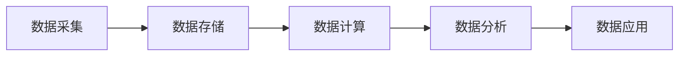
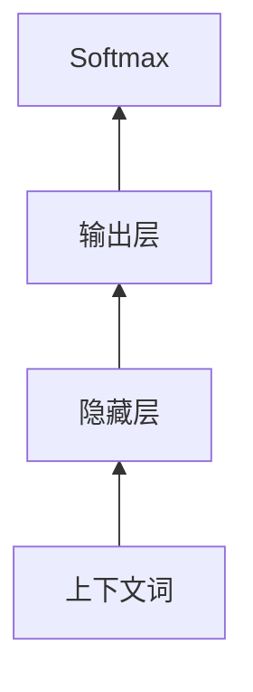

# 大数据架构原理与代码实例讲解

## 1. 背景介绍
### 1.1 大数据时代的到来
近年来,随着互联网、物联网、云计算等技术的快速发展,数据呈现出爆发式增长的趋势。据统计,全球每天产生的数据量已经达到了 ZB 级别。面对如此海量、多样化的数据,传统的数据处理架构已经无法满足大数据时代的需求。因此,构建高效、可扩展、易维护的大数据架构成为了众多企业亟待解决的问题。

### 1.2 大数据架构的重要性
大数据架构是支撑大数据应用的核心,它决定了数据的采集、存储、计算、分析等各个环节的效率和性能。一个优秀的大数据架构不仅能够满足当前业务的需求,还要具备良好的扩展性,以适应未来数据量和业务需求的增长。同时,大数据架构还需要兼顾数据安全、数据质量、数据治理等诸多方面。可以说,大数据架构是大数据应用的根基,其重要性不言而喻。

## 2. 核心概念与联系
### 2.1 大数据的4V特征
大数据具有4V特征:Volume(大量)、Velocity(高速)、Variety(多样)、Value(价值)。
- Volume:数据量巨大,通常在PB、EB甚至ZB级别。
- Velocity:数据产生和处理的速度极快,往往需要实时处理。  
- Variety:数据类型多样化,包括结构化数据、半结构化数据和非结构化数据。
- Value:大数据蕴含着巨大的商业价值,需要从海量数据中挖掘有价值的信息。

### 2.2 大数据处理流程
大数据处理主要包括数据采集、数据存储、数据计算、数据分析等环节,每个环节都有相应的技术架构。



### 2.3 大数据架构的演进
大数据架构经历了从集中式到分布式再到云原生的演进过程。
- 集中式架构:以关系型数据库为核心,适合处理结构化数据,但扩展性较差。
- 分布式架构:以Hadoop、Spark等为代表,采用分布式存储和计算,适合处理海量数据。
- 云原生架构:基于Kubernetes等云平台,实现了存储和计算资源的弹性伸缩和按需使用。

## 3. 核心算法原理具体操作步骤
### 3.1 MapReduce
MapReduce是Hadoop的核心,用于大规模数据的并行计算。其基本原理如下:
1. 数据被切分为多个Split,每个Split由一个Map任务处理。
2. Map任务对数据进行处理,生成一系列键值对<key,value>。
3. 对Map任务的输出按key进行分区,将相同key的键值对发送到同一个Reduce任务。
4. Reduce任务对收到的键值对进行归并、排序、处理,输出最终结果。

### 3.2 PageRank
PageRank是Google用于网页排名的经典算法,其基本思想是通过网页间的链接关系来评估网页的重要性。PageRank值通过多轮迭代计算得到,计算公式如下:

$$PR(p_i)=\frac{1-d}{N}+d\sum_{p_j\in M(p_i)}\frac{PR(p_j)}{L(p_j)}$$

其中,$PR(p_i)$表示网页$p_i$的PageRank值,$N$为网页总数,$M(p_i)$为指向$p_i$的网页集合,$L(p_j)$为网页$p_j$的出链数,$d$为阻尼系数,通常取0.85。

PageRank算法的具体步骤如下:
1. 初始化每个网页的PageRank值为$\frac{1}{N}$。
2. 对每个网页,根据公式计算其新的PageRank值。
3. 重复步骤2,直到PageRank值收敛。

### 3.3 协同过滤
协同过滤是常用的推荐算法,通过分析用户或物品之间的相似性,给用户做个性化推荐。其中,基于用户的协同过滤(UserCF)和基于物品的协同过滤(ItemCF)最为常见。

以ItemCF为例,其基本原理如下:
1. 计算物品之间的相似度。可以用余弦相似度等方法度量。
2. 对每个用户,找出他喜欢的物品。
3. 对每个物品,找出与之最相似的K个物品。
4. 对每个用户,计算其没有打分的物品的预测评分,评分最高的物品作为推荐结果。

物品$i$和物品$j$的相似度$sim(i,j)$的计算公式如下:

$$sim(i,j)=\frac{|N(i)\cap N(j)|}{\sqrt{|N(i)||N(j)|}}$$

其中,$N(i)$表示对物品$i$有过行为的用户集合。

## 4. 数学模型和公式详细讲解举例说明
### 4.1 TF-IDF
TF-IDF(Term Frequency-Inverse Document Frequency)是一种常用于文本挖掘和信息检索的加权技术。它通过词频(TF)和逆文档频率(IDF)来评估一个词对文档的重要程度。

- 词频TF(t,d)表示词t在文档d中出现的频率。通常使用词t在文档d中出现的次数n(t,d)除以文档d中的总词数进行归一化:

$$TF(t,d)=\frac{n(t,d)}{\sum_{k}n(k,d)}$$

- 逆文档频率IDF(t,D)表示词t在整个文档集合D中的区分度。计算公式为:

$$IDF(t,D)=\log \frac{|D|}{|\{d\in D:t\in d\}|}$$

其中,|D|表示文档集合D中的文档总数,分母表示包含词t的文档数。

最终,词t在文档d中的TF-IDF权重为:

$$TFIDF(t,d,D)=TF(t,d)\cdot IDF(t,D)$$

TF-IDF的一个应用是关键词提取。计算每个词的TF-IDF值,取Top-K的词作为文档的关键词。例如,对于一篇介绍机器学习的文章,可能提取出"神经网络"、"深度学习"、"卷积"等关键词。

### 4.2 Word2Vec
Word2Vec是一种常用的词向量化方法。它能够学习到词语的低维实值向量表示,并且使得语义相似的词语具有相近的向量表示。Word2Vec包含两个经典模型:CBOW和Skip-Gram。

以CBOW为例,它的目标是根据中心词w的上下文词$\{w_{t-2},w_{t-1},w_{t+1},w_{t+2}\}$来预测w。模型结构如下图所示:



模型的损失函数为:

$$L=-\log p(w|Context(w))=-\log \frac{e^{y_w}}{\sum_{i\in V}e^{y_i}}$$

其中,$y_w$表示词w的输出层向量,$V$为词表。通过最小化损失函数,可以学习到词向量。

Word2Vec的一个应用是词语聚类。将每个词映射为其词向量,然后用K-Means等聚类算法进行聚类,可以发现一些语义相关的词簇。例如,"足球"、"篮球"、"网球"等词可能被聚为一类,代表了体育运动。

## 5. 项目实践:代码实例和详细解释说明
下面以Spark的WordCount程序为例,展示大数据处理的代码实践。WordCount是一个经典的MapReduce程序,用于统计文本文件中每个单词出现的次数。

```scala
val conf = new SparkConf().setAppName("WordCount")
val sc = new SparkContext(conf)

val textFile = sc.textFile("hdfs://input/file.txt")
val counts = textFile.flatMap(line => line.split(" "))
                 .map(word => (word, 1))
                 .reduceByKey(_ + _)
counts.saveAsTextFile("hdfs://output/")
```

代码解释:
1. 创建SparkConf对象,设置应用名称为"WordCount"。
2. 创建SparkContext对象,它是Spark程序的入口。
3. 读取HDFS上的文本文件,得到一个RDD[String]。
4. 对每一行文本进行切分,得到单词数组,然后进行扁平化操作,得到一个RDD[String],代表了所有单词构成的集合。
5. 对每个单词映射为(单词,1)的键值对,代表着这个单词出现了1次。
6. 对具有相同单词的键值对进行聚合,累加其出现次数,得到每个单词的出现次数。
7. 将结果保存到HDFS。

可以看到,使用Spark编写大数据处理程序非常简洁高效。Spark提供了RDD(弹性分布式数据集)抽象,并且支持丰富的算子如map、reduce、filter等,使得开发者可以用函数式编程的风格方便地操作大规模数据集。同时,Spark也提供了SQL、Streaming、MLlib等高层次API,进一步提升了开发效率。

## 6. 实际应用场景
大数据架构在各行各业得到了广泛应用,下面列举几个典型场景:

### 6.1 电商推荐系统
电商网站通过收集用户的浏览、购买、评论等行为日志,利用协同过滤、隐语义模型等算法,给用户做个性化商品推荐,提升用户体验和购买转化率。如阿里的推荐系统每天要处理上千亿的用户行为,工业级的推荐系统离不开大数据架构的支撑。

### 6.2 金融风控
金融机构通过收集用户的各类数据,包括用户属性、交易记录、行为轨迹等,建立用户画像和风险模型,对贷款、信用卡申请等业务进行风险评估,防范欺诈风险。大数据风控已经成为互联网金融的标配,如蚂蚁金服的风控系统每天要处理百亿级的交易,其背后是强大的大数据架构。

### 6.3 智慧城市
城市管理部门通过在城市的各个角落布置各类传感器,实时采集交通流量、环境指标、能耗数据等,经过大数据分析,为交通疏导、环境治理、节能减排等提供决策支持。如上海的城市大脑项目,通过大数据架构的支撑,让城市管理更加智能化。

### 6.4 工业互联网
工业设备通过内置各类传感器,实时采集设备的运行数据,上传至工业互联网平台。平台利用大数据、机器学习技术,对设备数据进行建模分析,用于设备健康诊断、预测性维护、工艺优化等。如GE的Predix平台,通过大数据架构赋能工业领域。

## 7. 工具和资源推荐
下面推荐一些常用的大数据工具和学习资源:

### 7.1 大数据工具
- Hadoop:大数据的事实标准,包含HDFS、MapReduce、YARN等组件。
- Spark:大规模数据处理的统一分析引擎,支持批处理、流处理、SQL、机器学习等。
- Flink:基于流的大数据处理引擎,在流处理领域有优势。
- Kafka:分布式的流数据平台,常用于数据采集、缓存。
- HBase:分布式NoSQL数据库,适合存储超大规模数据。

### 7.2 学习资源
- 《Hadoop权威指南》:系统讲解Hadoop生态,适合入门。
- 《Spark大数据处理:技术、应用与性能优化》:全面介绍Spark原理和实践,适合进阶。
- Coursera上的《大数据专项课程》:涵盖大数据处理、大数据分析、大数据应用等方面,权威性强。
- 极客时间上的《大数据实战45讲》:深入浅出,理论实践结合,适合快速上手。

## 8. 总结:未来发展趋势与挑战
### 8.1 发展趋势
- 云原生大数据平台将成为主流。借助Kubernetes等云平台,实现存储和计算资源的弹性伸缩、按需使用。
- 