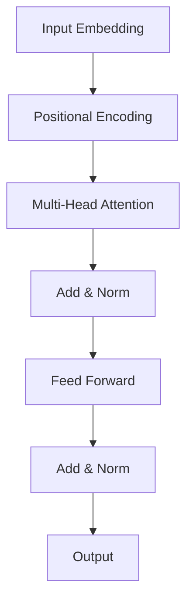

# 大规模语言模型从理论到实践 Transformer结构

## 1.背景介绍
### 1.1 自然语言处理的发展历程
#### 1.1.1 早期的基于规则的方法
#### 1.1.2 基于统计的机器学习方法
#### 1.1.3 深度学习的崛起
### 1.2 大规模语言模型的兴起
#### 1.2.1 语言模型的定义与作用
#### 1.2.2 大规模预训练语言模型的优势
#### 1.2.3 Transformer结构的革命性突破

## 2.核心概念与联系
### 2.1 Transformer的整体架构
#### 2.1.1 Encoder-Decoder结构
#### 2.1.2 Self-Attention机制
#### 2.1.3 前馈神经网络
### 2.2 Self-Attention的详细解析
#### 2.2.1 Query、Key、Value的计算
#### 2.2.2 Scaled Dot-Product Attention
#### 2.2.3 Multi-Head Attention
### 2.3 位置编码
#### 2.3.1 位置编码的必要性
#### 2.3.2 正弦和余弦位置编码
#### 2.3.3 可学习的位置编码



## 3.核心算法原理具体操作步骤
### 3.1 输入嵌入与位置编码
#### 3.1.1 将输入序列转化为嵌入向量
#### 3.1.2 加入位置编码信息
### 3.2 Self-Attention计算过程
#### 3.2.1 计算Query、Key、Value矩阵
#### 3.2.2 执行Scaled Dot-Product Attention
#### 3.2.3 拼接Multi-Head Attention结果
### 3.3 前馈神经网络
#### 3.3.1 两层全连接层
#### 3.3.2 ReLU激活函数
### 3.4 残差连接与Layer Normalization
#### 3.4.1 残差连接的作用
#### 3.4.2 Layer Normalization的归一化效果

## 4.数学模型和公式详细讲解举例说明
### 4.1 Self-Attention的数学表示
#### 4.1.1 Query、Key、Value的线性变换
$Q = XW^Q, K = XW^K, V = XW^V$
其中，$X$为输入序列的嵌入表示，$W^Q, W^K, W^V$为可学习的权重矩阵。
#### 4.1.2 Scaled Dot-Product Attention
$$Attention(Q,K,V) = softmax(\frac{QK^T}{\sqrt{d_k}})V$$
其中，$d_k$为Key向量的维度，用于缩放点积结果。
#### 4.1.3 Multi-Head Attention
$$MultiHead(Q,K,V) = Concat(head_1, ..., head_h)W^O$$
$$head_i = Attention(QW_i^Q, KW_i^K, VW_i^V)$$
其中，$W_i^Q, W_i^K, W_i^V, W^O$为可学习的权重矩阵。
### 4.2 前馈神经网络的数学表示
$$FFN(x) = max(0, xW_1 + b_1)W_2 + b_2$$
其中，$W_1, b_1, W_2, b_2$为可学习的权重矩阵和偏置向量。
### 4.3 残差连接与Layer Normalization
#### 4.3.1 残差连接
$$x + Sublayer(x)$$
其中，$Sublayer(x)$表示Self-Attention或前馈神经网络的输出。
#### 4.3.2 Layer Normalization
$$LayerNorm(x) = \frac{x-\mu}{\sqrt{\sigma^2+\epsilon}} \odot \gamma + \beta$$
其中，$\mu, \sigma^2$分别为$x$的均值和方差，$\epsilon$为平滑项，$\gamma, \beta$为可学习的缩放和偏移参数。

## 5.项目实践：代码实例和详细解释说明
下面是一个使用PyTorch实现Transformer Encoder的简化版代码示例：

```python
import torch
import torch.nn as nn

class TransformerEncoder(nn.Module):
    def __init__(self, d_model, nhead, dim_feedforward, num_layers):
        super(TransformerEncoder, self).__init__()
        encoder_layer = nn.TransformerEncoderLayer(d_model, nhead, dim_feedforward)
        self.transformer_encoder = nn.TransformerEncoder(encoder_layer, num_layers)
        
    def forward(self, src):
        output = self.transformer_encoder(src)
        return output
```

其中，主要参数含义如下：
- `d_model`：嵌入维度，即每个词向量的大小。
- `nhead`：Multi-Head Attention中头的数量。
- `dim_feedforward`：前馈神经网络中隐藏层的维度。
- `num_layers`：Transformer Encoder的层数。

在`forward`函数中，输入`src`经过Transformer Encoder的处理后得到最终的输出表示。

PyTorch已经提供了封装好的`nn.TransformerEncoderLayer`和`nn.TransformerEncoder`类，可以方便地构建Transformer Encoder模型。

使用示例：

```python
d_model = 512
nhead = 8
dim_feedforward = 2048
num_layers = 6

model = TransformerEncoder(d_model, nhead, dim_feedforward, num_layers)

src = torch.randn(10, 32, 512)  # 假设输入序列长度为10，batch size为32
output = model(src)
print(output.shape)  # 输出维度为(10, 32, 512)
```

以上代码展示了如何使用PyTorch构建一个Transformer Encoder模型，并对输入序列进行处理得到输出表示。

## 6.实际应用场景
### 6.1 机器翻译
#### 6.1.1 Transformer在神经机器翻译中的应用
#### 6.1.2 优于传统的RNN和CNN方法
### 6.2 文本摘要
#### 6.2.1 使用Transformer生成摘要
#### 6.2.2 自注意力机制捕捉长距离依赖
### 6.3 情感分析
#### 6.3.1 基于Transformer的情感分类
#### 6.3.2 自注意力机制提取情感特征
### 6.4 问答系统
#### 6.4.1 Transformer在阅读理解中的应用
#### 6.4.2 自注意力机制建模问题和段落之间的交互

## 7.工具和资源推荐
### 7.1 开源框架
#### 7.1.1 PyTorch
#### 7.1.2 TensorFlow
#### 7.1.3 Hugging Face Transformers库
### 7.2 预训练模型
#### 7.2.1 BERT
#### 7.2.2 GPT系列
#### 7.2.3 XLNet
### 7.3 数据集
#### 7.3.1 WMT机器翻译数据集
#### 7.3.2 SQuAD问答数据集
#### 7.3.3 IMDB情感分析数据集

## 8.总结：未来发展趋势与挑战
### 8.1 Transformer的优势与局限性
#### 8.1.1 自注意力机制的强大表达能力
#### 8.1.2 并行计算效率高
#### 8.1.3 长序列处理的挑战
### 8.2 大规模预训练模型的发展方向
#### 8.2.1 模型规模的不断扩大
#### 8.2.2 多任务学习与迁移学习
#### 8.2.3 知识增强与融合
### 8.3 未来研究热点与挑战
#### 8.3.1 模型压缩与加速
#### 8.3.2 可解释性与可控性
#### 8.3.3 多模态融合与交互

## 9.附录：常见问题与解答
### 9.1 Transformer相比RNN和CNN的优势是什么？
Transformer通过自注意力机制能够更好地捕捉长距离依赖关系，并且可以实现高效的并行计算，训练速度更快。
### 9.2 Self-Attention的计算复杂度如何？
Self-Attention的计算复杂度为$O(n^2 \cdot d)$，其中$n$为序列长度，$d$为嵌入维度。当序列长度较大时，计算开销会较高。
### 9.3 如何处理Transformer中的位置信息？
Transformer使用位置编码（Positional Encoding）来引入位置信息，通常使用正弦和余弦函数或可学习的位置嵌入。
### 9.4 Transformer能否处理变长序列？
Transformer可以处理变长序列，但是由于位置编码的限制，通常需要设定一个最大序列长度。对于超出最大长度的序列，需要进行截断或分段处理。
### 9.5 Transformer的并行化训练有哪些加速方法？
可以使用数据并行、模型并行等方式加速Transformer的训练。此外，还可以使用混合精度训练、梯度累积等技巧来提高训练效率。

作者：禅与计算机程序设计艺术 / Zen and the Art of Computer Programming