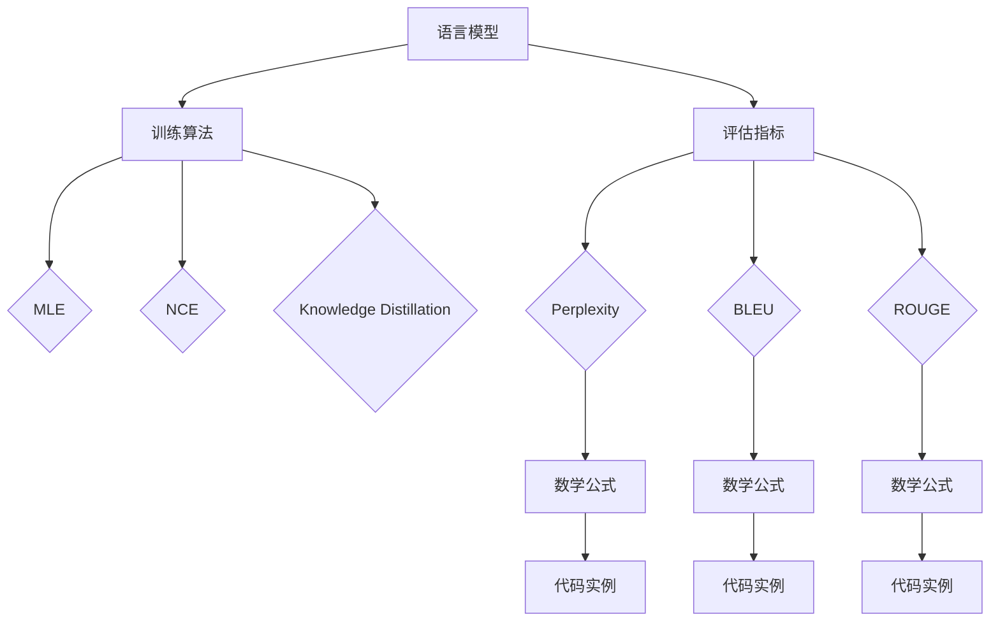

# 大规模语言模型从理论到实践 评估指标

## 1. 背景介绍
### 1.1 大规模语言模型概述
#### 1.1.1 语言模型的定义与发展历程
#### 1.1.2 大规模语言模型的特点与优势
#### 1.1.3 大规模语言模型的应用领域

### 1.2 评估指标的重要性
#### 1.2.1 评估指标在模型开发中的作用
#### 1.2.2 评估指标对模型性能优化的指导意义
#### 1.2.3 评估指标在模型应用中的价值

## 2. 核心概念与联系
### 2.1 语言模型的核心概念
#### 2.1.1 语言模型的定义与数学表示
#### 2.1.2 语言模型的类型与特点
#### 2.1.3 语言模型的训练与推理过程

### 2.2 评估指标的核心概念
#### 2.2.1 评估指标的定义与分类
#### 2.2.2 常用评估指标的介绍与比较
#### 2.2.3 评估指标与模型性能的关系

### 2.3 语言模型与评估指标的联系
#### 2.3.1 评估指标在语言模型训练中的应用
#### 2.3.2 评估指标对语言模型性能的反映
#### 2.3.3 评估指标与语言模型应用场景的匹配

## 3. 核心算法原理具体操作步骤
### 3.1 语言模型的训练算法
#### 3.1.1 最大似然估计(MLE)
#### 3.1.2 噪声对比估计(NCE)
#### 3.1.3 知识蒸馏(Knowledge Distillation)

### 3.2 评估指标的计算算法
#### 3.2.1 困惑度(Perplexity)的计算
#### 3.2.2 BLEU得分的计算
#### 3.2.3 ROUGE得分的计算

### 3.3 算法优化与改进
#### 3.3.1 模型架构的优化
#### 3.3.2 训练策略的改进
#### 3.3.3 评估指标的选择与组合

## 4. 数学模型和公式详细讲解举例说明
### 4.1 语言模型的数学表示
#### 4.1.1 n-gram语言模型
#### 4.1.2 神经网络语言模型
#### 4.1.3 Transformer语言模型

### 4.2 评估指标的数学公式
#### 4.2.1 困惑度(Perplexity)的数学公式
$$ PPL(W) = \sqrt[n]{\prod_{i=1}^{n} \frac{1}{P(w_i|w_1,\dots,w_{i-1})}} $$
#### 4.2.2 BLEU得分的数学公式
$$ BLEU = BP \cdot exp(\sum_{n=1}^{N} w_n \log p_n) $$
#### 4.2.3 ROUGE得分的数学公式
$$ ROUGE-N = \frac{\sum_{S\in\{Reference\}} \sum_{gram_n \in S} Count_{match}(gram_n)}{\sum_{S\in\{Reference\}} \sum_{gram_n \in S} Count(gram_n)} $$

### 4.3 数学模型与公式的解释说明
#### 4.3.1 数学模型的假设与约束条件
#### 4.3.2 数学公式中各项的含义与作用
#### 4.3.3 数学模型与公式的局限性与改进方向

## 5. 项目实践：代码实例和详细解释说明
### 5.1 语言模型的训练实例
#### 5.1.1 数据预处理与特征提取
#### 5.1.2 模型构建与训练过程
#### 5.1.3 模型评估与结果分析

### 5.2 评估指标的计算实例
#### 5.2.1 困惑度(Perplexity)的计算实例
```python
def perplexity(model, data):
    log_probs = []
    for sentence in data:
        log_prob = model.score(sentence)
        log_probs.append(log_prob)
    ppl = np.exp(-np.mean(log_probs))
    return ppl
```
#### 5.2.2 BLEU得分的计算实例
```python
from nltk.translate.bleu_score import sentence_bleu

reference = [['this', 'is', 'a', 'test'], ['this', 'is' 'test']]
candidate = ['this', 'is', 'a', 'test']
score = sentence_bleu(reference, candidate)
print(score)
```
#### 5.2.3 ROUGE得分的计算实例
```python
from rouge import Rouge 

rouge = Rouge()
reference = "This is a test sentence."
candidate = "This is a test."
scores = rouge.get_scores(candidate, reference)
print(scores)
```

### 5.3 代码实例的解释说明
#### 5.3.1 代码实现的核心思路与关键步骤
#### 5.3.2 代码中的参数设置与调优过程
#### 5.3.3 代码实现的局限性与改进方向

## 6. 实际应用场景
### 6.1 机器翻译
#### 6.1.1 机器翻译中的语言模型应用
#### 6.1.2 机器翻译质量评估中的评估指标应用
#### 6.1.3 机器翻译系统的优化与改进

### 6.2 文本摘要
#### 6.2.1 文本摘要中的语言模型应用 
#### 6.2.2 文本摘要质量评估中的评估指标应用
#### 6.2.3 文本摘要系统的优化与改进

### 6.3 对话系统
#### 6.3.1 对话系统中的语言模型应用
#### 6.3.2 对话系统质量评估中的评估指标应用
#### 6.3.3 对话系统的优化与改进

## 7. 工具和资源推荐
### 7.1 语言模型训练工具
#### 7.1.1 Tensorflow/Keras
#### 7.1.2 PyTorch
#### 7.1.3 Hugging Face Transformers

### 7.2 评估指标计算工具
#### 7.2.1 NLTK
#### 7.2.2 Rouge
#### 7.2.3 SacreBLEU

### 7.3 数据集与预训练模型资源
#### 7.3.1 WikiText
#### 7.3.2 Penn Treebank
#### 7.3.3 GLUE Benchmark

## 8. 总结：未来发展趋势与挑战
### 8.1 大规模语言模型的发展趋势
#### 8.1.1 模型规模的持续扩大
#### 8.1.2 知识增强与多模态融合
#### 8.1.3 模型的可解释性与可控性

### 8.2 评估指标的发展趋势
#### 8.2.1 更加全面与细粒度的评估
#### 8.2.2 人工评估与自动评估的结合
#### 8.2.3 评估指标的可解释性与可操作性

### 8.3 未来挑战与展望
#### 8.3.1 模型的泛化能力与鲁棒性
#### 8.3.2 评估指标的公平性与无偏性
#### 8.3.3 语言模型与评估指标的标准化

## 9. 附录：常见问题与解答
### 9.1 如何选择合适的语言模型？
### 9.2 如何选择合适的评估指标？
### 9.3 如何平衡模型性能与计算效率？
### 9.4 如何处理训练数据的稀疏性问题？
### 9.5 如何解释模型的预测结果？



大规模语言模型是自然语言处理领域的重要研究方向,其目标是通过海量文本数据的训练,学习语言的内在规律和表示,从而能够生成流畅自然的文本,完成机器翻译、文本摘要、对话系统等任务。然而,语言模型的性能评估一直是一个挑战,需要综合考虑模型的准确性、流畅性、相关性等多个维度。本文将从理论到实践的角度,全面探讨大规模语言模型的评估指标。

在理论方面,我们首先介绍了语言模型的核心概念,包括其定义、数学表示、类型与特点等,然后重点阐述了各类评估指标的原理和计算方法,如困惑度(Perplexity)、BLEU、ROUGE等。我们通过数学公式和代码实例,详细说明了这些指标的计算过程和实现细节。此外,我们还讨论了语言模型与评估指标之间的内在联系,分析了评估指标在语言模型训练和应用中的作用。

在实践方面,我们结合机器翻译、文本摘要、对话系统等具体任务,展示了语言模型和评估指标的实际应用。通过实例分析,我们阐明了如何利用评估指标来指导模型的优化与改进,提高其在实际任务中的表现。同时,我们还总结了一些常用的语言模型训练工具和评估指标计算工具,并推荐了一些常用的数据集和预训练模型资源,方便读者进一步探索和实践。

展望未来,大规模语言模型的发展趋势包括模型规模的持续扩大、知识增强与多模态融合、模型的可解释性与可控性等,而评估指标的发展方向则是更加全面细粒度的评估、人工评估与自动评估的结合、评估指标的可解释性与可操作性等。同时,我们也需要关注语言模型和评估指标在泛化能力、鲁棒性、公平性等方面存在的挑战和局限。

总的来说,大规模语言模型的评估指标是一个复杂而重要的课题,需要从理论到实践进行系统而深入的研究。本文对相关概念、算法、实践进行了全面的梳理和分析,可为相关研究者和实践者提供参考和指导。未来,随着语言模型的不断发展和评估指标的持续完善,我们有望构建出更加智能、高效、可靠的自然语言处理系统,推动人工智能在更广泛领域的应用。

作者：禅与计算机程序设计艺术 / Zen and the Art of Computer Programming