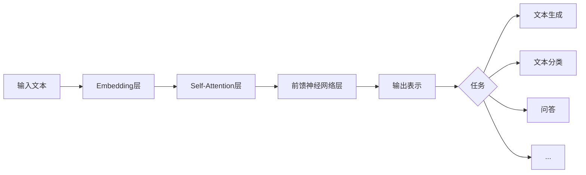

# 大语言模型(Large Language Models) - 原理与代码实例讲解

## 1. 背景介绍

### 1.1 大语言模型的定义与发展历程

大语言模型(Large Language Models,LLMs)是一类基于深度学习和神经网络,在海量文本数据上训练得到的语言模型。它们能够学习和理解自然语言,并能够完成各种自然语言处理任务,如文本生成、对话、问答、摘要、翻译等。近年来,随着计算能力的提升和训练数据的增长,大语言模型取得了长足的进步,代表模型包括GPT系列、BERT、T5、Switch Transformer等。

### 1.2 大语言模型的意义与应用前景

大语言模型具有广泛的应用前景。一方面,它们能够显著提升各类自然语言处理任务的性能,推动人工智能在语言理解和交互领域的进步。另一方面,大语言模型所蕴含的语言知识和常识,有望应用于智能对话、知识图谱构建、决策支持等领域,为人类认知和生产活动赋能。同时,大语言模型也为探索人工通用智能(AGI)提供了新的思路。

## 2. 核心概念与联系

### 2.1 语言模型与自回归

语言模型是对语言概率分布的建模,旨在学习单词序列的概率。给定前面的单词,语言模型能够预测下一个最可能出现的单词。形式化地,语言模型计算条件概率P(w|context),其中w为目标单词,context为前面的单词序列。自回归语言模型将前面生成的单词作为输入,预测下一个单词,从而逐词生成文本。

### 2.2 Transformer与注意力机制

Transformer是大语言模型的核心架构,其特点是采用自注意力(Self-Attention)机制来建模单词之间的依赖关系。不同于RNN等顺序模型,Transformer能够并行计算,捕捉长距离依赖,大大提升了训练效率和语言建模能力。在Transformer中,每个单词的表示都由其他所有单词加权求和得到,权重系数反映了单词之间的相关性。

### 2.3 预训练与微调

大语言模型通常采用两阶段学习范式:预训练和微调。预训练阶段在大规模无标注语料上进行自监督学习,模型学习通用的语言知识和表征。微调阶段在特定任务的标注数据上进行有监督学习,模型适应具体任务。预训练使得模型能够学习语言的基本规律,微调使其适应下游任务。这种范式使得大语言模型具备良好的迁移能力和少样本学习能力。

### 2.4 Mermaid流程图

下图展示了大语言模型处理文本的流程:



## 3. 核心算法原理具体操作步骤

### 3.1 Transformer的计算过程

Transformer的核心是自注意力机制和前馈神经网络,具体计算过程如下:

1. 将输入单词转换为嵌入向量
2. 计算自注意力权重矩阵,公式为:
$$Attention(Q,K,V) = softmax(\frac{QK^T}{\sqrt{d_k}})V$$
其中Q、K、V分别为查询、键、值向量,$d_k$为嵌入维度
3. 将自注意力结果送入前馈神经网络,公式为:
$$FFN(x) = max(0, xW_1 + b_1)W_2 + b_2$$
4. 通过残差连接和层归一化,得到最终的单词表示

Transformer通过堆叠多个自注意力层和前馈层,构建深度模型。

### 3.2 自回归文本生成算法

基于Transformer的自回归文本生成过程如下:

1. 将输入文本编码为单词序列 $X=(x_1,\cdots,x_T)$
2. 对于 $t=T+1,\cdots,T+L$:
   1. 将 $x_t$ 嵌入为向量
   2. 通过Transformer计算 $x_t$ 的表示 $h_t$
   3. 将 $h_t$ 送入全连接层和softmax层,得到下一个单词的概率分布 $P(x_{t+1}|x_1,\cdots,x_t)$
   4. 根据 $P(x_{t+1}|x_1,\cdots,x_t)$ 采样或选择概率最大的单词作为 $x_{t+1}$
3. 输出生成的文本 $(x_{T+1},\cdots,x_{T+L})$

其中 $L$ 为生成长度。通过逐词采样,模型能够生成连贯、相关的文本。

### 3.3 预训练目标与损失函数

大语言模型的预训练通常采用自监督学习,即根据输入文本本身构建监督信号。常见的预训练目标包括:

- 语言模型:最小化负对数似然损失 $-\sum_{t=1}^T \log P(x_t|x_{<t})$
- 去噪自编码:随机遮掩一部分单词,最小化重构损失 $-\sum_{t=1}^T m_t \log P(x_t|x_{\backslash m})$
- 对比学习:最大化正例(相邻句子)的相似度,最小化负例(随机句子)的相似度

其中 $x_{<t}$ 表示 $x_t$ 之前的单词,$x_{\backslash m}$ 表示被遮掩单词 $m$ 之外的单词。通过这些目标,模型能够学习到语言的统计规律和语义信息。

## 4. 数学模型和公式详细讲解举例说明

### 4.1 Transformer的数学模型

Transformer的核心是自注意力机制,其数学模型可表示为:

$$Attention(Q,K,V) = softmax(\frac{QK^T}{\sqrt{d_k}})V$$

其中 $Q \in \mathbb{R}^{n \times d_k}, K \in \mathbb{R}^{n \times d_k}, V \in \mathbb{R}^{n \times d_v}$ 分别为查询、键、值矩阵,$n$ 为序列长度,$d_k,d_v$ 为嵌入维度。$QK^T$ 计算查询和键的相似度,除以 $\sqrt{d_k}$ 缩放,经过softmax归一化后得到注意力权重,用于加权值矩阵 $V$。直观地,自注意力机制可以看作一种软寻址(soft addressing)操作,通过查询向量与键向量的相似度,在值向量上进行加权求和。

举例说明,假设有句子"The cat sat on the mat"。经过嵌入层,每个单词得到一个 $d_k$ 维向量,拼接成矩阵 $X \in \mathbb{R}^{6 \times d_k}$。自注意力将 $X$ 同时作为 $Q、K、V$,计算:

$$Attention(X,X,X) = softmax(\frac{XX^T}{\sqrt{d_k}})X$$

得到的结果矩阵仍为 $\mathbb{R}^{6 \times d_k}$,但每个单词的表示已融合了其他单词的信息。例如"cat"的表示不仅包含自身信息,还会聚焦于语义相关的"sat"、"mat"等单词。

### 4.2 自回归语言模型的数学描述

自回归语言模型的目标是建模文本序列 $X=(x_1,\cdots,x_T)$ 的概率分布:

$$P(X) = \prod_{t=1}^T P(x_t|x_{<t})$$

其中 $x_{<t}$ 表示 $x_t$ 之前的所有单词。模型通过最大化对数似然函数来学习:

$$\mathcal{L}(\theta) = \sum_{t=1}^T \log P(x_t|x_{<t};\theta)$$

$\theta$ 为模型参数。在Transformer中,可以通过自注意力层和前馈层递归计算单词的条件概率:

$$h_t = Transformer(x_{<t}) \\
P(x_t|x_{<t}) = softmax(h_tW+b)$$

其中 $h_t$ 为 $x_t$ 的隐表示,$W,b$ 为输出层参数。模型通过不断预测下一个单词,优化对数似然函数,学习语言的统计规律。

举例说明,给定句子"The cat sat on the"。语言模型逐词计算条件概率:

$$P(cat|The) = 0.2 \\
P(sat|The,cat) = 0.4 \\
P(on|The,cat,sat) = 0.6 \\
P(the|The,cat,sat,on) = 0.8$$

从而得到整个句子的概率:

$$P(The,cat,sat,on,the) = 0.2 \times 0.4 \times 0.6 \times 0.8 = 0.0384$$

模型通过最大化该概率(等价于最小化负对数),学习单词的顺序和依赖关系。

## 5. 项目实践:代码实例和详细解释说明

下面给出基于PyTorch实现Transformer自注意力层的代码示例:

```python
import torch
import torch.nn as nn

class SelfAttention(nn.Module):
    def __init__(self, embed_dim, num_heads):
        super().__init__()
        self.embed_dim = embed_dim
        self.num_heads = num_heads
        self.head_dim = embed_dim // num_heads
        
        self.query = nn.Linear(embed_dim, embed_dim)
        self.key = nn.Linear(embed_dim, embed_dim)
        self.value = nn.Linear(embed_dim, embed_dim)
        self.out = nn.Linear(embed_dim, embed_dim)
    
    def forward(self, x):
        batch_size, seq_len, embed_dim = x.size()
        q = self.query(x).view(batch_size, seq_len, self.num_heads, self.head_dim).transpose(1, 2)
        k = self.key(x).view(batch_size, seq_len, self.num_heads, self.head_dim).transpose(1, 2)
        v = self.value(x).view(batch_size, seq_len, self.num_heads, self.head_dim).transpose(1, 2)
        
        attn_scores = torch.matmul(q, k.transpose(-2, -1)) / (self.head_dim ** 0.5)
        attn_probs = nn.Softmax(dim=-1)(attn_scores)
        attn_output = torch.matmul(attn_probs, v)
        
        attn_output = attn_output.transpose(1, 2).contiguous().view(batch_size, seq_len, embed_dim)
        out = self.out(attn_output)
        return out
```

代码解释:

1. 定义SelfAttention类,初始化嵌入维度embed_dim和注意力头数num_heads
2. 定义查询、键、值的线性变换层query、key、value,以及输出层out
3. 前向传播时,将输入x通过线性层得到q、k、v,并调整形状为(batch_size, num_heads, seq_len, head_dim)
4. 计算注意力分数attn_scores,即查询向量q与键向量k的点积,除以 $\sqrt{head\_dim}$ 缩放
5. 对attn_scores应用softmax归一化,得到注意力概率分布attn_probs
6. 将attn_probs与值向量v相乘,得到注意力输出attn_output
7. 调整attn_output的形状,通过输出层out得到最终的自注意力结果

以上代码实现了Transformer中的单个自注意力层。通过堆叠多个自注意力层和前馈层,再加上位置编码、残差连接和层归一化等技术,就可以构建完整的Transformer模型。

## 6. 实际应用场景

大语言模型在许多实际场景中得到应用,例如:

### 6.1 智能对话系统

大语言模型可以作为对话系统的核心组件,根据用户的输入生成自然、连贯的回复。例如微软的小冰、OpenAI的ChatGPT等,都是基于大语言模型构建的对话系统,能够与人进行开放域的交谈,提供个性化的服务。

### 6.2 文本摘要生成

大语言模型能够自动生成文本摘要,帮助用户快速了解文章要点。例如谷歌的PEGASUS、Facebook的BART等模型,在新闻摘要、论文摘要等任务上取得了很好的效果,大大节省了人工摘要的时间成本。

### 6.3 机器翻译

将大语言模型应用于机器翻译,可以显著提升翻译质量。例如谷歌的