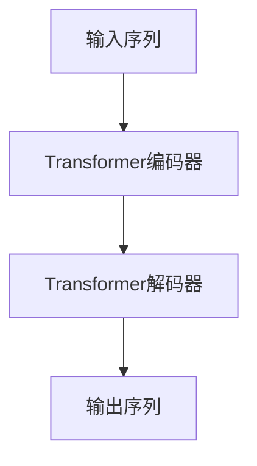

# 大语言模型原理与工程实践：组成模块选型

## 1. 背景介绍

随着人工智能技术的不断发展,大型语言模型(Large Language Model,LLM)已经成为自然语言处理领域的核心技术之一。LLM能够通过学习海量文本数据,捕捉语言的复杂模式和语义关系,从而实现高质量的自然语言理解和生成能力。

LLM在诸多领域展现出了卓越的性能,例如机器翻译、文本摘要、问答系统、内容创作等,正逐步改变着人类与机器之间的交互方式。然而,构建一个高质量的LLM系统并非易事,需要对模型的组成模块、训练策略、优化方法等进行精心设计和选型。本文将重点探讨LLM的核心组成模块,分析各模块的作用和选型考量,为读者提供实践指导。

## 2. 核心概念与联系

### 2.1 语言模型概述

语言模型(Language Model,LM)是自然语言处理领域的基础技术,旨在学习并模拟人类语言的概率分布。形式化地,语言模型可以表示为:

$$P(w_1, w_2, \ldots, w_n) = \prod_{i=1}^{n}P(w_i|w_1, \ldots, w_{i-1})$$

其中$w_i$表示第$i$个词,目标是估计给定历史词序列$w_1, \ldots, w_{i-1}$时,第$i$个词$w_i$出现的概率。

传统的语言模型通常基于n-gram统计或神经网络等技术,但存在局限性,难以捕捉长距离依赖关系。大型语言模型则采用Transformer等注意力机制,能够更好地建模长序列,提高语言理解和生成能力。

### 2.2 Transformer编码器-解码器架构

Transformer是LLM的核心架构,由编码器(Encoder)和解码器(Decoder)两部分组成。编码器将输入序列(如文本)映射为隐藏表示,解码器则基于编码器的输出和历史生成词生成下一个词,直至输出完整序列。



编码器和解码器内部均采用多头注意力机制和前馈神经网络,通过自注意力捕捉输入序列内部依赖,交叉注意力融合编码器输出,实现高效的序列建模。

## 3. 核心算法原理具体操作步骤  

### 3.1 自注意力机制

自注意力机制是Transformer的核心,允许模型直接捕捉输入序列中任意两个位置之间的依赖关系,有效解决了长期依赖问题。

具体操作步骤如下:

1. 线性投影:将输入序列$X$分别投影到查询(Query)、键(Key)和值(Value)空间,得到$Q$、$K$和$V$。
2. 注意力计算:对每个查询$q$,根据其与所有键$K$的相似性,计算注意力权重$\alpha$。
3. 加权求和:将注意力权重$\alpha$与值$V$加权求和,得到该位置的注意力表示$z$。

$$\begin{aligned}
Q &= XW_Q \\
K &= XW_K \\
V &= XW_V \\
\alpha_{ij} &= \text{softmax}\left(\frac{q_iK_j^T}{\sqrt{d_k}}\right) \\
z_i &= \sum_j \alpha_{ij}v_j
\end{aligned}$$

其中,$d_k$为缩放因子,用于防止点积过大导致梯度饱和。多头注意力则是将多个注意力头的输出拼接。

### 3.2 前馈神经网络

除了注意力子层,Transformer的每个编码器/解码器层还包含前馈神经网络,对序列进行进一步的非线性变换:

$$\text{FFN}(x) = \max(0, xW_1 + b_1)W_2 + b_2$$

前馈网络通常包含两个线性变换和一个ReLU激活函数,可以学习任意连续函数,增强模型的表达能力。

### 3.3 位置编码

由于自注意力机制没有显式编码位置信息,Transformer引入位置编码,为序列的每个位置添加一个位置向量,使模型能够区分不同位置。

常用的位置编码方式是正弦/余弦函数编码:

$$\begin{aligned}
\text{PE}_{(pos, 2i)} &= \sin\left(pos/10000^{2i/d_\text{model}}\right) \\
\text{PE}_{(pos, 2i+1)} &= \cos\left(pos/10000^{2i/d_\text{model}}\right)
\end{aligned}$$

其中$pos$为位置索引,$i$为维度索引,$d_\text{model}$为模型维度。这种编码方式允许模型自动推理相对位置和绝对位置信息。

## 4. 数学模型和公式详细讲解举例说明

### 4.1 掩码语言模型(Masked Language Model)

掩码语言模型是一种自监督学习方法,通过在输入序列中随机掩码部分词,并训练模型预测被掩码的词,来学习上下文语义表示。

设输入序列为$X=(x_1, x_2, \ldots, x_n)$,其中$x_k$为被掩码的词,目标是最大化被掩码词的条件概率:

$$\max_\theta \mathbb{E}_{X \sim \mathcal{D}}\left[\sum_{x_k \in \mathcal{M}(X)} \log P_\theta(x_k|X \setminus x_k)\right]$$

其中,$\mathcal{D}$为语料库分布,$\mathcal{M}(X)$为输入序列$X$中被掩码的词集合,$\theta$为模型参数。

通过掩码语言模型预训练,LLM可以从大量无监督数据中学习丰富的语言知识,为下游任务提供强大的初始化,提高泛化能力。

### 4.2 序列到序列建模(Sequence-to-Sequence Modeling)

许多自然语言处理任务可以被建模为序列到序列的转换问题,如机器翻译、文本摘要等。在这种情况下,LLM需要学习从源序列到目标序列的条件概率分布:

$$P(Y|X) = \prod_{t=1}^{|Y|} P(y_t|y_{<t}, X)$$

其中,$X=(x_1, x_2, \ldots, x_n)$为源序列,$Y=(y_1, y_2, \ldots, y_m)$为目标序列。模型的目标是最大化目标序列的条件对数似然:

$$\max_\theta \mathbb{E}_{(X, Y) \sim \mathcal{D}}\left[\sum_{t=1}^{|Y|} \log P_\theta(y_t|y_{<t}, X)\right]$$

在训练过程中,编码器首先将源序列$X$编码为隐藏表示,解码器则自回归地生成目标序列$Y$,并根据参数$\theta$最大化目标序列的条件概率。

### 4.3 生成式对抗网络(Generative Adversarial Network)

生成式对抗网络(GAN)是一种通过对抗训练提高生成质量的框架,近年来也被应用于LLM的训练。GAN包含一个生成器(Generator)和一个判别器(Discriminator),两者相互对抗,生成器试图生成逼真的样本以欺骗判别器,而判别器则努力区分真实样本和生成样本。

在文本生成任务中,生成器$G$试图生成逼真的文本序列,而判别器$D$则判断序列是真实样本还是生成样本。生成器和判别器的对抗损失函数可表示为:

$$\begin{aligned}
\min_G \max_D V(D, G) &= \mathbb{E}_{x \sim p_\text{data}(x)}[\log D(x)] \\
&+ \mathbb{E}_{z \sim p_z(z)}[\log(1 - D(G(z)))]
\end{aligned}$$

其中,$p_\text{data}(x)$为真实数据分布,$p_z(z)$为噪声先验分布。通过对抗训练,生成器可以学习捕捉真实数据的分布,从而提高生成质量。

## 5. 项目实践:代码实例和详细解释说明

以下是一个使用PyTorch实现的简化Transformer模型示例,用于机器翻译任务。

```python
import torch
import torch.nn as nn

class TransformerEncoder(nn.Module):
    def __init__(self, embed_dim, num_heads, ff_dim, dropout=0.1):
        super().__init__()
        self.attention = nn.MultiheadAttention(embed_dim, num_heads, dropout=dropout)
        self.ffn = nn.Sequential(
            nn.Linear(embed_dim, ff_dim),
            nn.ReLU(),
            nn.Dropout(dropout),
            nn.Linear(ff_dim, embed_dim),
            nn.Dropout(dropout)
        )
        self.norm1 = nn.LayerNorm(embed_dim)
        self.norm2 = nn.LayerNorm(embed_dim)

    def forward(self, x, src_mask=None):
        attn_out = self.attention(x, x, x, src_mask)[0]
        x = x + self.norm1(attn_out)
        ffn_out = self.ffn(x)
        x = x + self.norm2(ffn_out)
        return x

class TransformerDecoder(nn.Module):
    def __init__(self, embed_dim, num_heads, ff_dim, dropout=0.1):
        super().__init__()
        self.attention1 = nn.MultiheadAttention(embed_dim, num_heads, dropout=dropout)
        self.attention2 = nn.MultiheadAttention(embed_dim, num_heads, dropout=dropout)
        self.ffn = nn.Sequential(
            nn.Linear(embed_dim, ff_dim),
            nn.ReLU(),
            nn.Dropout(dropout),
            nn.Linear(ff_dim, embed_dim),
            nn.Dropout(dropout)
        )
        self.norm1 = nn.LayerNorm(embed_dim)
        self.norm2 = nn.LayerNorm(embed_dim)
        self.norm3 = nn.LayerNorm(embed_dim)

    def forward(self, x, mem, src_mask=None, tgt_mask=None):
        attn1_out = self.attention1(x, x, x, tgt_mask)[0]
        x = x + self.norm1(attn1_out)
        attn2_out = self.attention2(x, mem, mem, src_mask)[0]
        x = x + self.norm2(attn2_out)
        ffn_out = self.ffn(x)
        x = x + self.norm3(ffn_out)
        return x

class Transformer(nn.Module):
    def __init__(self, src_vocab_size, tgt_vocab_size, embed_dim, num_heads, ff_dim, num_layers, dropout=0.1):
        super().__init__()
        self.src_embed = nn.Embedding(src_vocab_size, embed_dim)
        self.tgt_embed = nn.Embedding(tgt_vocab_size, embed_dim)
        self.pos_encoder = PositionalEncoding(embed_dim, dropout)
        self.encoder = nn.ModuleList([TransformerEncoder(embed_dim, num_heads, ff_dim, dropout) for _ in range(num_layers)])
        self.decoder = nn.ModuleList([TransformerDecoder(embed_dim, num_heads, ff_dim, dropout) for _ in range(num_layers)])
        self.out = nn.Linear(embed_dim, tgt_vocab_size)

    def forward(self, src, tgt, src_mask=None, tgt_mask=None):
        src_embed = self.pos_encoder(self.src_embed(src))
        tgt_embed = self.pos_encoder(self.tgt_embed(tgt))
        mem = src_embed
        for layer in self.encoder:
            mem = layer(mem, src_mask)
        for layer in self.decoder:
            tgt_embed = layer(tgt_embed, mem, src_mask, tgt_mask)
        out = self.out(tgt_embed)
        return out
```

上述代码实现了一个基本的Transformer模型,包括编码器(TransformerEncoder)、解码器(TransformerDecoder)和整体模型(Transformer)。

- `TransformerEncoder`包含多头自注意力层和前馈神经网络层,对输入序列进行编码。
- `TransformerDecoder`包含两个多头注意力层(自注意力和交叉注意力)和一个前馈神经网络层,对目标序列进行解码,同时利用编码器的输出作为记忆。
- `Transformer`将编码器和解码器组合,并添加位置编码、embedding层和输出层。

在使用时,需要先初始化模型,然后将源序列和目标序列输入模型进行训练或推理。注意,需要根据实际任务构造适当的掩码矩阵,以确保自注意力机制不会利用未来信息。

## 6. 实际应用场景

大型语言模型在诸多领域展现出了卓越的性能,以下是一些典型的应用场景