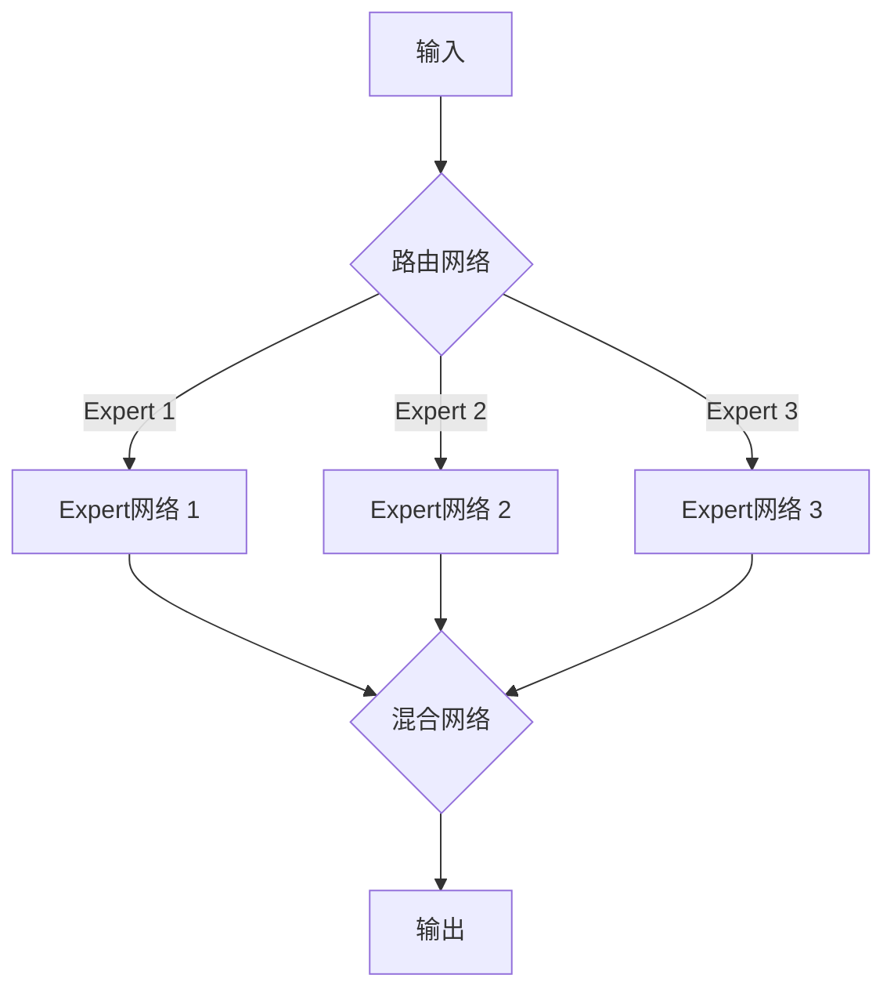

# 大语言模型原理基础与前沿 为什么采用稀疏专家模型

## 1. 背景介绍
### 1.1 大语言模型的发展历程
#### 1.1.1 早期的语言模型
#### 1.1.2 基于神经网络的语言模型
#### 1.1.3 Transformer时代的大语言模型
### 1.2 大语言模型面临的挑战
#### 1.2.1 模型参数量的增长
#### 1.2.2 计算资源的限制
#### 1.2.3 训练效率的瓶颈
### 1.3 稀疏专家模型的出现
#### 1.3.1 稀疏专家模型的概念
#### 1.3.2 稀疏专家模型的优势
#### 1.3.3 稀疏专家模型的研究现状

## 2. 核心概念与联系
### 2.1 大语言模型
#### 2.1.1 定义与原理
#### 2.1.2 主要架构
#### 2.1.3 应用场景
### 2.2 稀疏专家模型 
#### 2.2.1 定义与原理
#### 2.2.2 主要架构
#### 2.2.3 应用场景
### 2.3 大语言模型与稀疏专家模型的联系
#### 2.3.1 稀疏专家模型在大语言模型中的应用
#### 2.3.2 稀疏专家模型对大语言模型的改进
#### 2.3.3 二者结合的优势

## 3. 核心算法原理具体操作步骤
### 3.1 Mixture-of-Experts (MoE)
#### 3.1.1 MoE的基本原理
#### 3.1.2 MoE的具体实现步骤
#### 3.1.3 MoE在大语言模型中的应用
### 3.2 Switch Transformer
#### 3.2.1 Switch Transformer的基本原理  
#### 3.2.2 Switch Transformer的具体实现步骤
#### 3.2.3 Switch Transformer在大语言模型中的应用
### 3.3 其他稀疏专家模型算法
#### 3.3.1 BASE Layers
#### 3.3.2 Hash Layers
#### 3.3.3 Sparse Mixers

## 4. 数学模型和公式详细讲解举例说明
### 4.1 Mixture-of-Experts (MoE)的数学模型
#### 4.1.1 Gate网络
#### 4.1.2 Expert网络
#### 4.1.3 MoE前向传播公式推导
### 4.2 Switch Transformer的数学模型  
#### 4.2.1 路由机制
#### 4.2.2 负载均衡损失
#### 4.2.3 Switch Transformer前向传播公式推导
### 4.3 其他稀疏专家模型的数学原理
#### 4.3.1 BASE Layers的数学原理
#### 4.3.2 Hash Layers的数学原理
#### 4.3.3 Sparse Mixers的数学原理

## 5. 项目实践：代码实例和详细解释说明
### 5.1 使用Pytorch实现MoE层
#### 5.1.1 MoE层的代码实现
#### 5.1.2 MoE层的训练过程
#### 5.1.3 MoE层的推理过程
### 5.2 使用Tensorflow实现Switch Transformer 
#### 5.2.1 Switch Transformer的代码实现
#### 5.2.2 Switch Transformer的训练过程
#### 5.2.3 Switch Transformer的推理过程
### 5.3 稀疏专家模型在实际项目中的应用
#### 5.3.1 语言模型项目
#### 5.3.2 机器翻译项目 
#### 5.3.3 对话系统项目

## 6. 实际应用场景
### 6.1 稀疏专家模型在自然语言处理中的应用
#### 6.1.1 文本分类
#### 6.1.2 命名实体识别
#### 6.1.3 情感分析
### 6.2 稀疏专家模型在语音识别中的应用
#### 6.2.1 语音转文本
#### 6.2.2 说话人识别
#### 6.2.3 语音合成
### 6.3 稀疏专家模型在其他领域的应用
#### 6.3.1 计算机视觉
#### 6.3.2 推荐系统
#### 6.3.3 强化学习

## 7. 工具和资源推荐
### 7.1 开源框架
#### 7.1.1 Fairseq
#### 7.1.2 Tensor2Tensor
#### 7.1.3 DeepSpeed
### 7.2 预训练模型
#### 7.2.1 GPT-3
#### 7.2.2 Switch Transformer
#### 7.2.3 GLaM
### 7.3 学习资源
#### 7.3.1 论文
#### 7.3.2 博客
#### 7.3.3 视频课程

## 8. 总结：未来发展趋势与挑战
### 8.1 稀疏专家模型的优势总结
#### 8.1.1 提高模型容量
#### 8.1.2 加速训练和推理
#### 8.1.3 节省计算资源
### 8.2 稀疏专家模型面临的挑战
#### 8.2.1 路由机制的优化
#### 8.2.2 专家之间的通信开销
#### 8.2.3 模型的可解释性
### 8.3 未来的研究方向
#### 8.3.1 动态专家选择
#### 8.3.2 专家知识的迁移学习
#### 8.3.3 稀疏专家模型的通用性探索

## 9. 附录：常见问题与解答
### 9.1 稀疏专家模型与传统语言模型的区别？
### 9.2 稀疏专家模型的主要优势是什么？
### 9.3 如何选择合适的稀疏专家模型？
### 9.4 稀疏专家模型的训练有哪些技巧？
### 9.5 稀疏专家模型在实际应用中需要注意哪些问题？



大语言模型（Large Language Model，LLM）是自然语言处理领域的重要里程碑，它们在机器翻译、对话系统、文本摘要等任务上取得了显著的性能提升。然而，随着模型规模的不断增长，传统的密集模型架构面临着计算效率和资源消耗的瓶颈。为了突破这一限制，研究者们提出了稀疏专家模型（Sparse Expert Model）的概念，通过引入专家路由机制和稀疏连接，实现了模型容量的大幅提升，同时显著降低了计算开销。

稀疏专家模型的核心思想是将模型划分为多个专家（Expert），每个专家负责处理不同的子任务或领域。在前向传播过程中，输入数据首先经过一个路由网络（Router Network），根据输入的特征决定将其分配给哪些专家处理。选中的专家对输入进行计算，并将结果传递给一个混合网络（Mixer Network）进行整合，最终得到模型的输出。通过这种分而治之的方式，稀疏专家模型能够在保持模型性能的同时，大大减少计算量和参数数量。

Mixture-of-Experts（MoE）是稀疏专家模型的经典架构之一。在MoE中，路由网络通常采用一个门控机制（Gating Mechanism）来决定每个专家的权重。门控网络接收输入特征，并输出一个概率分布，表示将输入分配给各个专家的概率。然后，根据这个概率分布，输入被传递给选中的专家进行处理。每个专家的输出结果再通过加权求和的方式进行混合，得到最终的输出。MoE的数学公式可以表示为：

$$
y = \sum_{i=1}^{N} G(x)_i * E_i(x)
$$

其中，$y$表示模型的输出，$x$表示输入，$N$是专家的数量，$G(x)_i$表示第$i$个专家的门控概率，$E_i(x)$表示第$i$个专家的输出。

Switch Transformer是另一种流行的稀疏专家模型架构。与MoE不同，Switch Transformer引入了一个离散的路由机制，每个输入只会被分配给一个专家处理。这种"硬性"的专家选择方式可以进一步减少计算开销，提高模型的效率。同时，为了防止个别专家被过度使用而其他专家闲置，Switch Transformer还设计了一个负载均衡损失（Load Balancing Loss）来鼓励专家之间的平衡利用。Switch Transformer的前向传播过程可以用以下公式表示：

$$
y = \sum_{i=1}^{N} \mathbb{1}_{i=\arg\max_j G(x)_j} * E_i(x)
$$

其中，$\mathbb{1}$是指示函数，当条件满足时取值为1，否则为0。$\arg\max_j G(x)_j$表示选择门控概率最大的专家索引。

为了更直观地理解稀疏专家模型的工作原理，我们可以用一个简单的代码实例来演示MoE层的实现：

```python
import torch
import torch.nn as nn

class MoE(nn.Module):
    def __init__(self, input_size, num_experts, hidden_size):
        super(MoE, self).__init__()
        self.gate = nn.Linear(input_size, num_experts)
        self.experts = nn.ModuleList([nn.Linear(input_size, hidden_size) for _ in range(num_experts)])
        
    def forward(self, x):
        gate_outputs = self.gate(x)
        gate_probs = torch.softmax(gate_outputs, dim=-1)
        
        expert_outputs = torch.stack([expert(x) for expert in self.experts], dim=1)
        
        output = torch.einsum('be,beh->bh', gate_probs, expert_outputs)
        return output
```

在这个示例中，我们定义了一个`MoE`类，它继承自`nn.Module`。构造函数接收输入大小、专家数量和隐藏层大小作为参数。在`forward`方法中，我们首先通过门控网络计算每个专家的权重，然后将输入传递给所有专家，并将它们的输出按照权重进行加权求和，得到最终的输出。

稀疏专家模型在自然语言处理的诸多任务中得到了广泛应用。例如，在文本分类任务中，不同的专家可以负责处理不同主题或情感倾向的文本；在机器翻译任务中，专家可以针对不同的语言对进行专门优化；在对话系统中，专家可以基于用户意图或对话上下文进行专业化处理。通过引入稀疏专家机制，这些任务的性能都得到了显著提升。

除了自然语言处理，稀疏专家模型还在语音识别、计算机视觉、推荐系统等领域展现出了巨大的潜力。随着研究的不断深入，稀疏专家模型有望成为未来大规模机器学习系统的重要组成部分。然而，稀疏专家模型的发展仍然面临着一些挑战，例如如何设计更高效的路由机制、如何平衡专家之间的负载、如何提高模型的可解释性等。这些问题的解决将推动稀疏专家模型走向更广阔的应用前景。

总之，稀疏专家模型为大语言模型的发展提供了一种全新的思路。通过引入专家路由和稀疏连接，它突破了传统密集模型的性能瓶颈，实现了模型容量的大幅提升和计算效率的显著改善。展望未来，稀疏专家模型有望在更多领域发挥重要作用，推动人工智能技术的进一步发展。

作者：禅与计算机程序设计艺术 / Zen and the Art of Computer Programming