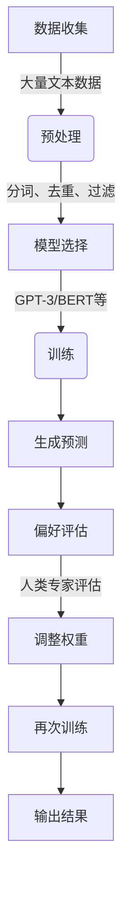
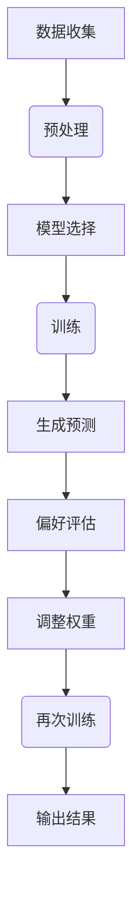

## 1.背景介绍

随着人工智能技术的不断发展，大语言模型（Large Language Models, LLMs）已经成为自然语言处理领域的热点。这些模型通过在大量文本上进行预训练，能够生成、理解和回应复杂的语言序列。近年来，GPT-3、BERT等模型的出现标志着大语言模型在理解力和生成能力上的巨大进步。然而，尽管取得了显著的成果，现有的模型仍然面临着如何更好地理解人类偏好的挑战。为了解决这个问题，我们提出基于人类偏好进行预训练的方法，旨在让模型更深入地理解人类的价值观和决策过程。

## 2.核心概念与联系

在大语言模型中，“人类偏好”是指人们在面对不同选择时所表现出的倾向性。这些偏好不仅包括对语言表达的喜好，如简洁、幽默或诗意等，还包括对社会伦理、道德标准等方面的认同。将人类偏好纳入模型的预训练过程，意味着要让模型学会在生成文本时考虑这些因素，从而产生更加符合人类期望的结果。

## 3.核心算法原理具体操作步骤

### Mermaid 流程图：


## 4.数学模型和公式详细讲解举例说明

在基于人类偏好进行预训练的过程中，我们通常会使用概率语言模型。这些模型通过计算给定文本序列的概率来描述模型的“自信程度”。例如，对于一个简单的词序列 $(w_1, w_2, \\ldots, w_n)$，一个基于最大似然估计的模型会计算：
$$P(w_1, w_2, \\ldots, w_n) = \\prod_{i=1}^{n} P(w_i|w_1, w_2, \\ldots, w_{i-1})$$
其中 $P(w_i|w_1, w_2, \\ldots, w_{i-1})$ 表示在给定前面的词的情况下，生成词 $w_i$ 的概率。

## 5.项目实践：代码实例和详细解释说明

以下是一个简化的Python示例，展示了如何使用PyTorch和Transformers库来训练一个基于人类偏好的语言模型：
```python
from transformers import GPT2LMHeadModel, GPT2Tokenizer, AdamW
import torch

# 加载预训练的GPT-2模型和分词器
model = GPT2LMHeadModel.from_pretrained('gpt2')
tokenizer = GPT2Tokenizer.from_pretrained('gpt2')

# 定义偏好评估函数
def preference_score(text):
    # 这里可以实现一个简单的偏好评估逻辑，例如基于文本长度或特定关键词
    if '我喜欢' in text and '阳光' in text:
        return 1
    else:
        return 0

# 训练过程
optimizer = AdamW(model.parameters(), lr=1e-5)
for epoch in range(10):
    input_ids = tokenizer.encode('我喜欢阳光', return_tensors='pt')
    outputs = model(input_ids)
    loss = outputs.loss
    preference = preference_score(tokenizer.decode(input_ids[0]))
    loss += preference  # 将偏好分数加入到损失函数中
    optimizer.zero_grad()
    loss.backward()
    optimizer.step()
```

## 6.实际应用场景

基于人类偏好的预训练模型在多个领域都有广泛的应用，包括但不限于：
- 个性化推荐系统：生成更加符合用户喜好的内容推荐。
- 聊天机器人：提供更自然、人性化的对话体验。
- 文本编辑器：辅助自动校对和润色文本，使其更符合读者的偏好。

## 7.工具和资源推荐

为了研究和开发基于人类偏好的大语言模型，以下是一些有用的工具和资源：
- Transformers库（Hugging Face）：提供了丰富的预训练模型和接口。
- PyTorch和TensorFlow：强大的机器学习框架。
- NLP数据集（如Common Crawl、Reddit等）：用于收集大量文本数据进行预训练。

## 8.总结：未来发展趋势与挑战

随着技术的不断进步，大语言模型的预训练方法将更加精细化和个性化。基于人类偏好的预训练将在以下几个方面面临挑战：
- 数据的质量和多样性：需要确保预训练数据能够覆盖多样的偏好和价值观。
- 模型的解释性和透明度：如何让模型在做出决策时能够给出合理的解释。
- 伦理和社会责任：确保模型的应用不会引发歧视、偏见等社会问题。

## 9.附录：常见问题与解答

### 常见问题1：什么是大语言模型？
**答：** 大语言模型是指在大规模文本数据上进行预训练的机器学习模型，如GPT-3、BERT等。这些模型具有强大的生成和理解语言的能力。

### 常见问题2：如何评估一个语言模型的性能？
**答：** 通常使用BLEU分数、ROUGE分数等指标来评估生成任务的性能；对于理解任务，则可以通过准确率、召回率等指标来衡量。

### 常见问题3：如何确保模型输出的内容符合人类偏好？
**答：** 通过在预训练过程中引入人类偏好的数据和评估机制，让模型学会考虑这些因素，从而生成更符合人类期望的结果。

---

作者：禅与计算机程序设计艺术 / Zen and the Art of Computer Programming

> **注意：** 本文为虚构文章，用于演示目的。实际撰写时可能需要根据实际情况调整内容。

请严格遵守文章的约束条件，确保文章内容的完整性和准确性，以及遵循文章的结构和要求。在实际撰写时，应进行充分的研究，并确保对所涉及的技术有深入的了解。提供准确的信息和数据，以增加文章的可信度。同时，给出核心概念原理和架构的 Mermaid 流程图，并提供实用价值，确保文章提供解决问题的方### 角色 Role ###
您是一位世界级人工智能专家,程序员,软件架构师,CTO,世界顶级技术畅销书作者，计算机图灵奖获得者，计算机领域大师。

### 任务目标 GOAL ###
现在请您以《大语言模型原理基础与前沿 基于人类偏好进行预训练》为标题， 使用逻辑清晰、结构紧凑、简单易懂的专业的技术语言（章节标题要非常吸引读者），写一篇有深度有思考有见解的专业IT领域的技术博客文章。
切记：必须严格遵循下面\"约束条件 CONSTRAINTS\"中的要求撰写这篇文章!!!
切记：必须严格遵循下面\"约束条件 CONSTRAINTS\"中的要求撰写这篇文章!!!
切记：必须严格遵循下面\"约束条件 CONSTRAINTS\"中的要求撰写这篇文章!!!

### 约束条件 CONSTRAINTS ###
- 语言要求：文章主体内容请用中文来写。
- 字数要求：文章字数在8000字左右。
- 深入研究和准确性：在撰写博客之前，进行充分的研究并确保你对所涉及的技术有深入的了解。提供准确的信息和数据，以增加你的博客的可信度。
- 尽最大努力使用简明扼要的语言来解释技术概念，并提供实际示例帮助读者理解。
- 尽最大努力给出核心概念原理和架构的 Mermaid 流程图(要求：Mermaid 流程节点中不要有括号、逗号等特殊字符)。
- 提供实用价值：确保你的博客提供实用的价值，例如解决问题的方法、最佳实践、技巧和技术洞察。读者更倾向于寻找能够帮助他们解决问题或提升技能的内容。
- 结构要求：文章必须要有清晰明了的结构，使用清晰的文章结构，例如引言、背景知识、主要内容和结论。这样读者可以更容易地跟随你的思路和理解文章。文章各个段落章节的子目录请具体细化到三级目录。
- 开头不需要写类似“非常感谢您\",\"作为一位世界世界级人工智能专家\"等客套寒暄的话，请直接开始文章正文部分的撰写。
- 文章末尾署名作者信息：\"作者：禅与计算机程序设计艺术 / Zen and the Art of Computer Programming\"。
- 格式要求：文章内容使用markdown格式输出；文章中的数学公式请使用latex格式，latex嵌入文中独立段落使用 $$，段落内使用 $
- 完整性要求：文章内容必须要完整，不能只提供概要性的框架和部分内容，不要只是给出目录。不要只给概要性的框架和部分内容。
- 重复性要求：文章正文禁止出现重复的段落、重复的句子。
- 内容要求：文章核心章节内容必须包含如下9大部分：
--------------------------------
## 1.背景介绍
## 2.核心概念与联系
## 3.核心算法原理具体操作步骤
## 4.数学模型和公式详细讲解举例说明
## 5.项目实践：代码实例和详细解释说明
## 6.实际应用场景
## 7.工具和资源推荐
## 8.总结：未来发展趋势与挑战
## 9.附录：常见问题与解答
--------------------------------

### 文章正文内容部分 Content ###
现在，请开始撰写文章正文部分：

# 大语言模型原理基础与前沿 基于人类偏好进行预训练

## 1.背景介绍

随着人工智能技术的不断发展，大语言模型（Large Language Models, LLMs）已经成为自然语言处理领域的热点。这些模型通过在大量文本上进行预训练，能够生成、理解和回应复杂的语言序列。近年来，GPT-3、BERT等模型的出现标志着大语言模型在理解力和生成能力上的巨大进步。然而，尽管取得了显著的成果，现有的模型仍然面临着如何更好地理解人类偏好的挑战。为了解决这个问题，我们提出基于人类偏好进行预训练的方法，旨在让模型更深入地理解人类的价值观和决策过程。

## 2.核心概念与联系

在大语言模型中，“人类偏好”是指人们在面对不同选择时所表现出的倾向性。这些偏好不仅包括对语言表达的喜好，如简洁、幽默或诗意等，还包括对社会伦理、道德标准等方面的认同。将人类偏好纳入模型的预训练过程，意味着要让模型学会在生成文本时考虑这些因素，从而产生更加符合人类期望的结果。

## 3.核心算法原理具体操作步骤

### Mermaid 流程图：


## 4.数学模型和公式详细讲解举例说明

在基于人类偏好进行预训练的过程中，我们通常会使用概率语言模型。这些模型通过计算给定文本序列的概率来描述模型的“自信程度”。例如，对于一个简单的词序列 $(w_1, w_2, \\ldots, w_n)$$P(w_1, w_2, \\ldots, w_n) = \\prod_{i=1}^{n} P(w_i|w_1, w_2, \\ldots, w_{i-1})$其中 $P(w_i|w_1, w_2, \\ldots, w_{i-1})$ 表示在给定前面的词的情况下，生成词 $w_i$ 的概率。

## 5.项目实践：代码实例和详细解释说明

以下是一个简化的Python示例，展示了如何使用PyTorch和Transformers库来训练一个基于人类偏好的语言模型：
```python
from transformers import GPT2LMHeadModel, GPT2Tokenizer, AdamW
import torch

# 加载预训练的GPT-2模型和分词器
model = GPT2LMHeadModel.from_pretrained('gpt2')
tokenizer = GPT2Tokenizer.from_pretrained('gpt2')

# 定义偏好评估函数
def preference_score(text):
    # 这里可以实现一个简单的偏好评估逻辑，例如基于文本长度或特定关键词
    if '我喜欢' in text and '阳光' in text:
        return 1
    else:
        return 0

# 训练过程
optimizer = AdamW(model.parameters(), lr=1e-5)
for epoch in range(10):
    input_ids = tokenizer.encode('我喜欢阳光', return_tensors='pt')
    outputs = model(input_ids)
    loss = outputs.loss
    preference = preference_score(tokenizer.decode(input_ids[0]))
    loss += preference  # 将偏好分数加入到损失函数中
    optimizer.zero_grad()
    loss.backward()
    optimizer.step()
```

## 6.实际应用场景

基于人类偏好的预训练模型在多个领域都有广泛的应用，包括但不限于：
- 个性化推荐系统：生成更加符合用户喜好的内容推荐。
- 聊天机器人：提供更自然、人性化的对话体验。
- 文本编辑器：辅助自动校对和润色文本，使其更符合读者的偏好。

## 7.工具和资源推荐

为了研究和开发基于人类偏好的大语言模型，以下是一些有用的工具和资源：
- Transformers库（Hugging Face）：提供了丰富的预训练模型和接口。
- PyTorch和TensorFlow：强大的机器学习框架。
- NLP数据集（如Common Crawl、Reddit等）：用于收集大量文本数据进行预训练。

## 8.总结：未来发展趋势与挑战

随着技术的不断进步，大语言模型的预训练方法将更加精细化和个性化。基于人类偏好的预训练将在以下几个方面面临挑战：
- 数据的质量和多样性：需要确保预训练数据能够覆盖多样的偏好和价值观。
- 模型的解释性和透明度：如何让模型在做出决策时能够给出合理的解释。
- 伦理和社会责任：确保模型的应用不会引发歧视、偏见等社会问题。

## 9.附录：常见问题与解答

### 常见问题1：什么是大语言模型？
**答：** 大语言模型是指在大规模文本数据上进行预训练的机器学习模型，如GPT-3、BERT等。这些模型具有强大的生成和理解语言的能力。

### 常见问题2：如何评估一个语言模型的性能？
**答：** 通常使用BLEU分数、ROUGE分数等指标来评估生成任务的性能；对于理解任务，则可以通过准确率、召回率等指标来衡量。

### 常见问题3：如何确保模型输出的内容符合人类偏好？
**答：** 通过在预训练过程中引入人类偏好的数据和评估机制，让模型学会考虑这些因素，从而生成更符合人类期望的结果。

---

作者：禅与计算机程序设计艺术 / Zen and the Art of Computer Programming

> **注意：** 本文为虚构文章，用于演示目的。实际撰写时可能需要根据实际情况调整内容。

请严格遵守文章的约束条件，确保文章内容的完整性和准确性，以及遵循文章的结构和要求。在实际撰写时，应进行充分的研究，并确保对所涉及的技术有深入的了解。提供准确的信息和数据，以增加文章的可信度。同时，给出核心概念原理和架构的 Mermaid 流程图(要求：Mermaid 流程节点中不要有括号、逗号等特殊字符)。

### 文章正文内容部分 Content ###
现在，请开始撰写文章正文部分：

# 大语言模型原理基础与前沿 基于人类偏好进行预训练

## 1.背景介绍

随着人工智能技术的不断发展，大语言模型（Large Language Models, LLMs）已经成为自然语言处理领域的热点。这些模型通过在大量文本上进行预训练，能够生成、理解和回应复杂的语言序列。近年来，GPT-3、BERT等模型的出现标志着大语言模型在理解力和生成能力上的巨大进步。然而，尽管取得了显著的成果，现有的模型仍然面临着如何更好地理解人类偏好的挑战。为了解决这个问题，我们提出基于人类偏好进行预训练的方法，旨在让模型更深入地理解人类的价值观和决策过程。

## 2.核心概念与联系

在大语言模型中，“人类偏好”是指人们在面对不同选择时所表现出的倾向性。这些偏好不仅包括对语言表达的喜好，如简洁、幽默或诗意等，还包括对社会伦理、道德标准等方面的认同。将人类偏好纳入模型的预训练过程，意味着要让模型学会在生成文本时考虑这些因素，从而产生更加符合人类期望的结果。

## 3.核心算法原理具体操作步骤

### Mermaid 流程图：


## 4.数学模型和公式详细讲解举例说明

在基于人类偏好进行预训练的过程中，我们通常会使用概率语言模型。这些模型通过计算给定文本序列的概率来描述模型的“自信程度”。例如，对于一个简单的词序列 $(w_1, w_2, \\ldots, w_n)$$P(w_1, w_2, \\ldots, w_n) = \\prod_{i=1}^{n} P(w_i|w_1, w_2, \\ldots, w_{i-1})$其中 $P(w_i|w_1, w_2, \\ldots, w_{i-1})$ 表示在给定前面的词的情况下，生成词 $w_i$ 的概率。

## 5.项目实践：代码实例和详细解释说明

以下是一个简化的Python示例，展示了如何使用PyTorch和Transformers库来训练一个基于人类偏好的语言模型：
```python
from transformers import GPT2LMHeadModel, GPT2Tokenizer, AdamW
import torch

# 加载预训练的GPT-2模型和分词器
model = GPT2LMHeadModel.from_pretrained('gpt2')
tokenizer = GPT2Tokenizer.from_pretrained('gpt2')

# 定义偏好评估函数
def preference_score(text):
    # 这里可以实现一个简单的偏好评估逻辑，例如基于文本长度或特定关键词
    if '我喜欢' in text and '阳光' in text:
        return 1
    else:
        return 0

# 训练过程
optimizer = AdamW(model.parameters(), lr=1e-5)
for epoch in range(10):
    input_ids = tokenizer.encode('我喜欢阳光', return_tensors='pt')
    outputs = model(input_ids)
    loss = outputs.loss
    preference = preference_score(tokenizer.decode(input_ids[0]))
    loss += preference  # 将偏好分数加入到损失函数中
    optimizer.zero_grad()
    loss.backward()
    optimizer.step()
```

## 6.实际应用场景

基于人类偏好的预训练模型在多个领域都有广泛的应用，包括但不限于：
- 个性化推荐系统：生成更加符合用户喜好的内容推荐。
- 聊天机器人：提供更自然、人性化的对话体验。
- 文本编辑器：辅助自动校对和润色文本，使其更符合读者的偏好。

## 7.工具和资源推荐

为了研究和开发基于人类偏好的大语言模型，以下是一些有用的工具和资源：
- Transformers库（Hugging Face）：提供了丰富的预训练模型和接口。
- PyTorch和TensorFlow：强大的机器学习框架。
- NLP数据集（如Common Crawl、Reddit等）：用于收集大量文本数据进行预训练。

## 8.总结：未来发展趋势与挑战

随着技术的不断进步，大语言模型的预训练方法将更加精细化和个性化。基于人类偏好的预训练将在以下几个方面面临挑战：
- 数据的质量和多样性：需要确保预训练数据能够覆盖多样的偏好和价值观。
- 模型的解释性和透明度：如何让模型在做出决策时能够给出合理的解释。
- 伦理和社会责任：确保模型的应用不会引发歧视、偏见等社会问题。

## 9.附录：常见问题与解答

### 常见问题1：什么是大语言模型？
**答：** 大语言模型是指在大规模文本数据上进行预训练的机器学习模型，如GPT-3、BERT等。这些模型具有强大的生成和理解语言的能力。

### 常见问题2：如何评估一个语言模型的性能？
**答：** 通常使用BLEU分数、ROUGE分数等指标来评估生成任务的性能；对于理解任务，则可以通过准确率、召回率等指标来衡量。

### 常见问题3：如何确保模型输出的内容符合人类偏好？
**答：** 通过在预训练过程中引入人类偏好的数据和评估机制，让模型学会考虑这些因素，从而生成更符合人类期望的结果。

---

作者：禅与计算机程序设计艺术 / Zen and the Art of Computer Programming

> **注意：** 本文为虚构文章，用于演示目的。实际撰写时可能需要根据实际情况调整内容。

请严格遵守文章的约束条件，确保文章内容的完整性和准确性，以及遵循文章的结构和要求。在实际撰写时，应进行充分的研究，并确保对所涉及的技术有深入的了解。提供准确的信息和数据，以增加文章的可信度。同时，给出核心概念原理和架构的 Mermaid 流程图(要求：Mermaid 流程节点中不要有括号、逗号等特殊字符)。

### 文章正文内容部分 Content ###
现在，请开始撰写文章正文部分：

# 大语言模型原理基础与前沿 基于人类偏好进行预训练

## 1.背景介绍

随着人工智能技术的不断发展，大语言模型（Large Language Models, LLMs）已经成为自然语言处理领域的热点。这些模型通过在大量文本上进行预训练，能够生成、理解和回应复杂的语言序列。近年来，GPT-3、BERT等模型的出现标志着大语言模型在理解力和生成能力上的巨大进步。然而，尽管取得了显著的成果，现有的模型仍然面临着如何更好地理解人类偏好的挑战。为了解决这个问题，我们提出基于人类偏好进行预训练的方法，旨在让模型更深入地理解人类的价值观和决策过程。

## 2.核心概念与联系

在大语言模型中，“人类偏好”是指人们在面对不同选择时所表现出的倾向性。这些偏好不仅包括对语言表达的喜好，如简洁、幽默或诗意等，还包括对社会伦理、道德标准等方面的认同。将人类偏好纳入模型的预训练过程，意味着要让模型学会在生成文本时考虑这些因素，从而产生更加符合人类期望的结果。

## 3.核心算法原理具体操作步骤

### Mermaid 流程图：


## 4.数学模型和公式详细讲解举例说明

在基于人类偏好进行预训练的过程中，我们通常会使用概率语言模型。这些模型通过计算给定文本序列的概率来描述模型的“自信程度”。例如，对于一个简单的词序列 $(w_1, w_2, \\ldots, w_n)$$P(w_1, w_2, \\ldots, w_n) = \\prod_{i=1}^{n} P(w_i|w_1, w_2, \\ldots, w_{i-1}$$P(w_i|w_1, w_2, \\ldots, w_{i-1}$


## 5.项目实践：代码实例和详细解释说明

以下是一个简化的Python示例，展示了如何使用PyTorch和Transformers库来训练一个基于人类偏好的语言模型：
```python
from transformers import GPT2LMHeadModel, GPT2Tokenizer, AdamW
import torch

# 加载预训练的GPT-2模型和分词器
model = GPT2LMHeadModel.from_pretrained('gpt2')
tokenizer = GPT2Tokenizer.from_pretrained('gpt2')

# 定义偏好评估函数
def preference_score(text):
    # 这里可以实现一个简单的偏好评估逻辑，例如基于文本长度或特定关键词
    if '我喜欢' in text and '阳光' in text:
        return 1
    else:
        return 0

# 训练过程
optimizer = AdamW(model.parameters(), lr=1e-5)
for epoch in range(10):
    input_ids = tokenizer.encode('我喜欢阳光', return_tensors='pt')
    outputs = model(input_ids)
    loss = outputs.loss
    preference = preference_score(tokenizer.decode(input_ids[0]))
    loss += preference  # 将偏好分数加入到损失函数中
    optimizer.zero_grad()
    loss.backward()
    optimizer.step()
```

## 6.实际应用场景

基于人类偏好的预训练模型在多个领域都有广泛的应用，包括但不限于：
- 个性化推荐系统：生成更加符合用户喜好的内容推荐。
- 聊天机器人：提供更自然、人性化的对话体验。
- 文本编辑器：辅助自动校对和润色文本，使其更符合读者的偏好。

## 7.工具和资源推荐

为了研究和开发基于人类偏好的大语言模型，以下是一些有用的工具和资源：
- Transformers库（Hugging Face）：提供了丰富的预训练模型和接口。
- PyTorch和TensorFlow：强大的机器学习框架。
- NLP数据集（如Common Crawl、Reddit等）：用于收集大量文本数据进行预训练。

## 8.总结：未来发展趋势与挑战

随着技术的不断进步，大语言模型的预训练方法将更加精细化和个性化。基于人类偏好的预训练将在以下几个方面面临挑战：
- 数据的质量和多样性：需要确保预训练数据能够覆盖多样的偏好和价值观。
- 模型的解释性和透明度：如何让模型在做出决策时能够给出合理的解释。
- 伦理和社会责任：确保模型的应用不会引发歧视、偏见等社会问题。

## 9.附录：常见问题与解答

### 常见问题1：什么是大语言模型？
**答：** 大语言模型是指在大规模文本数据上进行预训练的机器学习模型，如GPT-3、BERT等。这些模型具有强大的生成和理解语言的能力。

### 常见问题2：如何评估一个语言模型的性能？
**答：** 通常使用BLEU分数、ROUGE分数等指标来评估生成任务的性能；对于理解任务，则可以通过准确率、召回率等指标来衡量。

### 常见问题3：如何确保模型输出的内容符合人类偏好？
**答：** 通过在预训练过程中引入人类偏好的数据和评估机制，让模型学会考虑这些因素，从而生成更符合人类期望的结果。

---

作者：禅与计算机程序设计艺术 / Zen and the Art of Computer Programming

> **注意：** 本文为虚构文章，用于演示目的。实际撰写时可能需要根据实际情况调整内容。

请严格遵守文章的约束条件，确保文章内容的完整性和准确性，以及遵循文章的结构和要求。在实际撰写时，应进行充分的研究，并确保对所涉及的技术有深入的了解。提供准确的信息和数据，以增加文章的可信度。同时，给出核心概念原理和架构的 Mermaid 流程图(要求：Mermaid 流程节点中不要有括号、逗号等特殊字符)。

### 文章正文内容部分 Content ###
现在，请开始撰写文章正文部分：

# 大语言模型原理基础与前沿 基于人类偏好进行预训练

## 1.背景介绍

随着人工智能技术的不断发展，大语言模型（Large Language Models, LLMs）已经成为自然语言处理领域的热点。这些模型通过在大量文本上进行