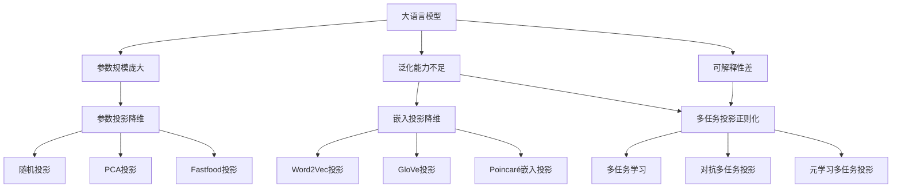

# 大语言模型原理基础与前沿 基于投影和正则化的方法

## 1. 背景介绍

### 1.1 大语言模型的发展历程
#### 1.1.1 早期的统计语言模型
#### 1.1.2 神经网络语言模型的兴起  
#### 1.1.3 Transformer的革命性突破

### 1.2 大语言模型面临的挑战
#### 1.2.1 模型参数量庞大,训练成本高
#### 1.2.2 模型泛化能力不足,易过拟合
#### 1.2.3 缺乏可解释性和可控性

### 1.3 基于投影和正则化的大语言模型改进方向
#### 1.3.1 降维投影减小参数规模
#### 1.3.2 正则化约束提升泛化能力 
#### 1.3.3 引入先验知识增强可解释性

## 2. 核心概念与联系

### 2.1 语言模型的定义与分类
#### 2.1.1 统计语言模型
#### 2.1.2 神经网络语言模型 
#### 2.1.3 Transformer语言模型

### 2.2 投影与降维
#### 2.2.1 线性投影
#### 2.2.2 非线性投影
#### 2.2.3 流形学习

### 2.3 正则化
#### 2.3.1 L1正则化
#### 2.3.2 L2正则化 
#### 2.3.3 Dropout正则化
#### 2.3.4 对抗正则化

### 2.4 投影正则化在大语言模型中的应用
#### 2.4.1 参数投影降维
#### 2.4.2 嵌入投影降维
#### 2.4.3 多任务投影正则化

## 3. 核心算法原理具体操作步骤

### 3.1 参数投影降维算法
#### 3.1.1 随机投影
#### 3.1.2 PCA投影
#### 3.1.3 Fastfood投影

### 3.2 嵌入投影降维算法  
#### 3.2.1 Word2Vec投影
#### 3.2.2 GloVe投影
#### 3.2.3 Poincaré嵌入投影

### 3.3 多任务投影正则化算法
#### 3.3.1 多任务学习框架
#### 3.3.2 对抗多任务投影
#### 3.3.3 元学习多任务投影

## 4. 数学模型和公式详细讲解举例说明

### 4.1 语言模型的数学定义
#### 4.1.1 概率语言模型
$$ P(w_1, w_2, ..., w_T) = \prod_{t=1}^{T} P(w_t | w_1, ..., w_{t-1}) $$
#### 4.1.2 最大似然估计
$$ \hat{\theta} = \mathop{\arg\max}_{\theta} \sum_{i=1}^{N} \log P(w_1^{(i)}, ..., w_T^{(i)} ; \theta) $$

### 4.2 投影算法的数学原理
#### 4.2.1 Johnson-Lindenstrauss引理
对于任意 $0 < \epsilon < 1$,当 
$$ k \geq \frac{4\log n}{\epsilon^2 / 2 - \epsilon^3 / 3} $$
时,存在映射 $f: R^d \to R^k$,使得对任意 $u,v \in X$:  
$$ (1-\epsilon)||u-v||^2 \leq ||f(u)-f(v)||^2 \leq (1+\epsilon)||u-v||^2 $$
#### 4.2.2 PCA投影
$$ \min_{W} \sum_{i=1}^{m} ||x^{(i)} - W^T W x^{(i)}||^2 $$
$W$为投影矩阵,$W \in R^{k \times d}, W^T W = I_k$. 

### 4.3 正则化的数学原理
#### 4.3.1 L1正则化
$$ J(\theta) = \frac{1}{m} \sum_{i=1}^{m} L(y^{(i)}, \hat{y}^{(i)}) + \lambda \sum_{j=1}^{n} |\theta_j| $$
#### 4.3.2 L2正则化
$$ J(\theta) = \frac{1}{m} \sum_{i=1}^{m} L(y^{(i)}, \hat{y}^{(i)}) + \frac{\lambda}{2} \sum_{j=1}^{n} \theta_j^2 $$

## 5. 项目实践：代码实例和详细解释说明

### 5.1 基于PyTorch实现Transformer语言模型
```python
import torch
import torch.nn as nn

class Transformer(nn.Module):
    def __init__(self, vocab_size, d_model, nhead, num_layers):
        super().__init__()
        
        self.embedding = nn.Embedding(vocab_size, d_model)
        self.pos_encoder = PositionalEncoding(d_model)
        encoder_layer = nn.TransformerEncoderLayer(d_model, nhead)
        self.transformer_encoder = nn.TransformerEncoder(encoder_layer, num_layers) 
        self.fc = nn.Linear(d_model, vocab_size)
        
    def forward(self, src):
        src = self.embedding(src) * math.sqrt(d_model)
        src = self.pos_encoder(src)
        output = self.transformer_encoder(src) 
        output = self.fc(output)
        return output
```

### 5.2 基于TensorFlow实现参数投影降维
```python
import tensorflow as tf

def random_projection(inputs, output_dim):
    input_shape = inputs.get_shape().as_list()
    input_dim = input_shape[-1]
    
    random_matrix = tf.random_normal([input_dim, output_dim])
    projected = tf.matmul(inputs, random_matrix)
    
    return projected

# 在Transformer的Linear层上应用
self.fc = tf.keras.layers.Dense(d_model)
self.fc.kernel = random_projection(self.fc.kernel, k) 
```

### 5.3 基于PyTorch实现L2正则化
```python
import torch
import torch.nn as nn

class MLPWithL2(nn.Module):
    def __init__(self, input_dim, hidden_dim, output_dim, lambd):
        super().__init__()
        self.fc1 = nn.Linear(input_dim, hidden_dim) 
        self.fc2 = nn.Linear(hidden_dim, output_dim)
        self.lambd = lambd
        
    def forward(self, x):
        x = torch.relu(self.fc1(x))
        x = self.fc2(x)
        
        l2_reg = torch.tensor(0.)
        for param in self.parameters():
            l2_reg += torch.norm(param)
        
        loss = self.criterion(x, target) + self.lambd * l2_reg
        
        return x, loss
```

## 6. 实际应用场景

### 6.1 自然语言处理
#### 6.1.1 机器翻译
#### 6.1.2 语言模型预训练
#### 6.1.3 文本分类与情感分析

### 6.2 语音识别
#### 6.2.1 声学模型
#### 6.2.2 语言模型rescoring

### 6.3 推荐系统 
#### 6.3.1 序列推荐
#### 6.3.2 对话推荐

## 7. 工具和资源推荐

### 7.1 开源工具包
- HuggingFace Transformers  
- Fairseq
- OpenNMT

### 7.2 预训练模型  
- BERT
- GPT系列
- T5

### 7.3 数据集
- WMT机器翻译数据集
- GLUE自然语言理解数据集
- ImageNet图像分类数据集

## 8. 总结：未来发展趋势与挑战

### 8.1 模型参数高效压缩
### 8.2 低资源场景迁移学习
### 8.3 鲁棒性与安全性提升
### 8.4 知识引入与融合
### 8.5 模型可解释性增强

## 9. 附录：常见问题与解答  

### Q1: 投影和正则化如何协同工作,共同提升大语言模型性能?
通过投影降低模型复杂度,再利用正则化约束参数,可以在减小计算开销的同时提高模型泛化能力,两者形成互补。

### Q2: 如何权衡投影带来的信息损失和计算效率的提升?  
降维幅度是关键,投影维度需要在效率和性能间取得平衡。信息损失理论和实验分析可以作为选择依据。

### Q3: 未来是否可能实现百亿、千亿参数级别的大语言模型?
目前的趋势是通过模型并行和数据并行,利用成百上千的 GPU/TPU 加速训练。再结合投影、剪枝、量化、蒸馏等模型压缩技术,未来有望实现更大规模的语言模型。但也面临诸多工程实现挑战。

作者：禅与计算机程序设计艺术 / Zen and the Art of Computer Programming

